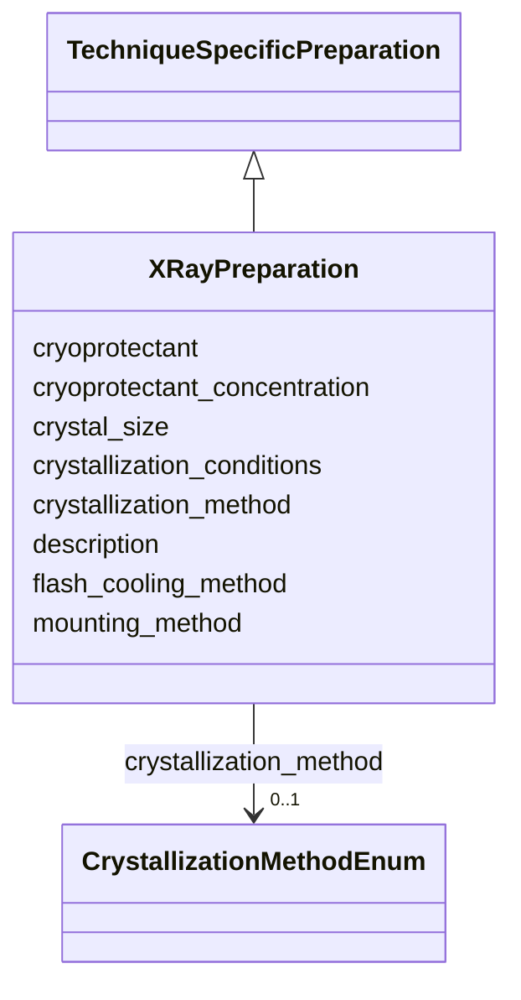

# Class: XRayPreparation 


_X-ray crystallography specific preparation_


URI: [lambdaber:XRayPreparation](https://w3id.org/lambda-ber-schema/XRayPreparation)





## Inheritance
* [AttributeGroup](AttributeGroup.md)
    * [TechniqueSpecificPreparation](TechniqueSpecificPreparation.md)
        * **XRayPreparation**


## Slots

| Name | Cardinality and Range | Description | Inheritance |
| ---  | --- | --- | --- |
| [crystallization_method](crystallization_method.md) | 0..1 <br/> [CrystallizationMethodEnum](CrystallizationMethodEnum.md) | Method used for crystallization | direct |
| [crystallization_conditions](crystallization_conditions.md) | 0..1 <br/> [String](String.md) | Detailed crystallization conditions | direct |
| [crystal_size](crystal_size.md) | 0..1 <br/> [String](String.md) | Crystal dimensions in micrometers | direct |
| [cryoprotectant](cryoprotectant.md) | 0..1 <br/> [String](String.md) | Cryoprotectant used | direct |
| [cryoprotectant_concentration](cryoprotectant_concentration.md) | 0..1 <br/> [Float](Float.md) | Cryoprotectant concentration percentage | direct |
| [mounting_method](mounting_method.md) | 0..1 <br/> [String](String.md) | Crystal mounting method | direct |
| [flash_cooling_method](flash_cooling_method.md) | 0..1 <br/> [String](String.md) | Flash cooling protocol | direct |
| [description](description.md) | 0..1 <br/> [String](String.md) |  | [AttributeGroup](AttributeGroup.md) |


## Identifier and Mapping Information


### Schema Source


* from schema: https://w3id.org/lambda-ber-schema/


## Mappings

| Mapping Type | Mapped Value |
| ---  | ---  |
| self | lambdaber:XRayPreparation |
| native | lambdaber:XRayPreparation |


## LinkML Source

<!-- TODO: investigate https://stackoverflow.com/questions/37606292/how-to-create-tabbed-code-blocks-in-mkdocs-or-sphinx -->

### Direct

<details>
```yaml
name: XRayPreparation
description: X-ray crystallography specific preparation
from_schema: https://w3id.org/lambda-ber-schema/
is_a: TechniqueSpecificPreparation
attributes:
  crystallization_method:
    name: crystallization_method
    description: Method used for crystallization
    from_schema: https://w3id.org/lambda-ber-schema/
    rank: 1000
    domain_of:
    - XRayPreparation
    range: CrystallizationMethodEnum
  crystallization_conditions:
    name: crystallization_conditions
    description: Detailed crystallization conditions
    from_schema: https://w3id.org/lambda-ber-schema/
    rank: 1000
    domain_of:
    - XRayPreparation
  crystal_size:
    name: crystal_size
    description: Crystal dimensions in micrometers
    from_schema: https://w3id.org/lambda-ber-schema/
    rank: 1000
    domain_of:
    - XRayPreparation
  cryoprotectant:
    name: cryoprotectant
    description: Cryoprotectant used
    from_schema: https://w3id.org/lambda-ber-schema/
    rank: 1000
    domain_of:
    - XRayPreparation
    range: string
  cryoprotectant_concentration:
    name: cryoprotectant_concentration
    description: Cryoprotectant concentration percentage
    from_schema: https://w3id.org/lambda-ber-schema/
    rank: 1000
    domain_of:
    - XRayPreparation
    range: float
  mounting_method:
    name: mounting_method
    description: Crystal mounting method
    from_schema: https://w3id.org/lambda-ber-schema/
    rank: 1000
    domain_of:
    - XRayPreparation
  flash_cooling_method:
    name: flash_cooling_method
    description: Flash cooling protocol
    from_schema: https://w3id.org/lambda-ber-schema/
    rank: 1000
    domain_of:
    - XRayPreparation

```
</details>

### Induced

<details>
```yaml
name: XRayPreparation
description: X-ray crystallography specific preparation
from_schema: https://w3id.org/lambda-ber-schema/
is_a: TechniqueSpecificPreparation
attributes:
  crystallization_method:
    name: crystallization_method
    description: Method used for crystallization
    from_schema: https://w3id.org/lambda-ber-schema/
    rank: 1000
    alias: crystallization_method
    owner: XRayPreparation
    domain_of:
    - XRayPreparation
    range: CrystallizationMethodEnum
  crystallization_conditions:
    name: crystallization_conditions
    description: Detailed crystallization conditions
    from_schema: https://w3id.org/lambda-ber-schema/
    rank: 1000
    alias: crystallization_conditions
    owner: XRayPreparation
    domain_of:
    - XRayPreparation
    range: string
  crystal_size:
    name: crystal_size
    description: Crystal dimensions in micrometers
    from_schema: https://w3id.org/lambda-ber-schema/
    rank: 1000
    alias: crystal_size
    owner: XRayPreparation
    domain_of:
    - XRayPreparation
    range: string
  cryoprotectant:
    name: cryoprotectant
    description: Cryoprotectant used
    from_schema: https://w3id.org/lambda-ber-schema/
    rank: 1000
    alias: cryoprotectant
    owner: XRayPreparation
    domain_of:
    - XRayPreparation
    range: string
  cryoprotectant_concentration:
    name: cryoprotectant_concentration
    description: Cryoprotectant concentration percentage
    from_schema: https://w3id.org/lambda-ber-schema/
    rank: 1000
    alias: cryoprotectant_concentration
    owner: XRayPreparation
    domain_of:
    - XRayPreparation
    range: float
  mounting_method:
    name: mounting_method
    description: Crystal mounting method
    from_schema: https://w3id.org/lambda-ber-schema/
    rank: 1000
    alias: mounting_method
    owner: XRayPreparation
    domain_of:
    - XRayPreparation
    range: string
  flash_cooling_method:
    name: flash_cooling_method
    description: Flash cooling protocol
    from_schema: https://w3id.org/lambda-ber-schema/
    rank: 1000
    alias: flash_cooling_method
    owner: XRayPreparation
    domain_of:
    - XRayPreparation
    range: string
  description:
    name: description
    from_schema: https://w3id.org/lambda-ber-schema/
    alias: description
    owner: XRayPreparation
    domain_of:
    - NamedThing
    - AttributeGroup
    range: string

```
</details>