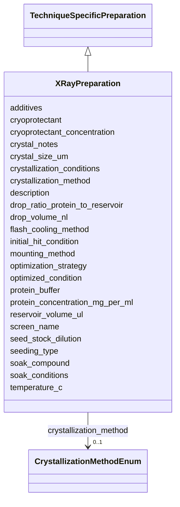

# Class: XRayPreparation 


_X-ray crystallography specific preparation_


URI: [lambdaber:XRayPreparation](https://w3id.org/lambda-ber-schema/XRayPreparation)





## Inheritance
* [AttributeGroup](AttributeGroup.md)
    * [TechniqueSpecificPreparation](TechniqueSpecificPreparation.md)
        * **XRayPreparation**


## Slots

| Name | Cardinality and Range | Description | Inheritance |
| ---  | --- | --- | --- |
| [protein_concentration_mg_per_ml](protein_concentration_mg_per_ml.md) | 0..1 <br/> [Float](Float.md) | Protein concentration for crystallization in mg/mL | direct |
| [protein_buffer](protein_buffer.md) | 0..1 <br/> [String](String.md) | Buffer composition for protein solution | direct |
| [additives](additives.md) | 0..1 <br/> [String](String.md) | Additives mixed with protein before crystallization | direct |
| [crystallization_method](crystallization_method.md) | 0..1 <br/> [CrystallizationMethodEnum](CrystallizationMethodEnum.md) | Method used for crystallization | direct |
| [screen_name](screen_name.md) | 0..1 <br/> [String](String.md) | Name of crystallization screen used | direct |
| [temperature_c](temperature_c.md) | 0..1 <br/> [Float](Float.md) | Crystallization temperature in Celsius | direct |
| [drop_ratio_protein_to_reservoir](drop_ratio_protein_to_reservoir.md) | 0..1 <br/> [String](String.md) | Ratio of protein to reservoir solution in drop (e | direct |
| [drop_volume_nl](drop_volume_nl.md) | 0..1 <br/> [Float](Float.md) | Total drop volume in nanoliters | direct |
| [reservoir_volume_ul](reservoir_volume_ul.md) | 0..1 <br/> [Float](Float.md) | Reservoir volume in microliters | direct |
| [seeding_type](seeding_type.md) | 0..1 <br/> [String](String.md) | Type of seeding used (micro, macro, streak) | direct |
| [seed_stock_dilution](seed_stock_dilution.md) | 0..1 <br/> [String](String.md) | Dilution factor for seed stock | direct |
| [initial_hit_condition](initial_hit_condition.md) | 0..1 <br/> [String](String.md) | Description of initial crystallization hit condition | direct |
| [optimization_strategy](optimization_strategy.md) | 0..1 <br/> [String](String.md) | Strategy used to optimize crystals | direct |
| [optimized_condition](optimized_condition.md) | 0..1 <br/> [String](String.md) | Final optimized crystallization condition | direct |
| [crystallization_conditions](crystallization_conditions.md) | 0..1 <br/> [String](String.md) | Detailed crystallization conditions | direct |
| [crystal_size_um](crystal_size_um.md) | 0..1 <br/> [String](String.md) | Crystal dimensions in micrometers | direct |
| [cryoprotectant](cryoprotectant.md) | 0..1 <br/> [String](String.md) | Cryoprotectant used | direct |
| [cryoprotectant_concentration](cryoprotectant_concentration.md) | 0..1 <br/> [Float](Float.md) | Cryoprotectant concentration percentage | direct |
| [soak_compound](soak_compound.md) | 0..1 <br/> [String](String.md) | Compound used for soaking (ligand, heavy atom) | direct |
| [soak_conditions](soak_conditions.md) | 0..1 <br/> [String](String.md) | Conditions for crystal soaking | direct |
| [mounting_method](mounting_method.md) | 0..1 <br/> [String](String.md) | Crystal mounting method | direct |
| [flash_cooling_method](flash_cooling_method.md) | 0..1 <br/> [String](String.md) | Flash cooling protocol | direct |
| [crystal_notes](crystal_notes.md) | 0..1 <br/> [String](String.md) | Additional notes about crystal quality and handling | direct |
| [description](description.md) | 0..1 <br/> [String](String.md) |  | [AttributeGroup](AttributeGroup.md) |


## Identifier and Mapping Information


### Schema Source


* from schema: https://w3id.org/lambda-ber-schema/


## Mappings

| Mapping Type | Mapped Value |
| ---  | ---  |
| self | lambdaber:XRayPreparation |
| native | lambdaber:XRayPreparation |


## LinkML Source

<!-- TODO: investigate https://stackoverflow.com/questions/37606292/how-to-create-tabbed-code-blocks-in-mkdocs-or-sphinx -->

### Direct

<details>
```yaml
name: XRayPreparation
description: X-ray crystallography specific preparation
from_schema: https://w3id.org/lambda-ber-schema/
is_a: TechniqueSpecificPreparation
attributes:
  protein_concentration_mg_per_ml:
    name: protein_concentration_mg_per_ml
    description: Protein concentration for crystallization in mg/mL
    from_schema: https://w3id.org/lambda-ber-schema/
    rank: 1000
    domain_of:
    - XRayPreparation
    range: float
  protein_buffer:
    name: protein_buffer
    description: Buffer composition for protein solution
    from_schema: https://w3id.org/lambda-ber-schema/
    rank: 1000
    domain_of:
    - XRayPreparation
  additives:
    name: additives
    description: Additives mixed with protein before crystallization
    from_schema: https://w3id.org/lambda-ber-schema/
    domain_of:
    - BufferComposition
    - XRayPreparation
  crystallization_method:
    name: crystallization_method
    description: Method used for crystallization
    from_schema: https://w3id.org/lambda-ber-schema/
    rank: 1000
    domain_of:
    - XRayPreparation
    range: CrystallizationMethodEnum
  screen_name:
    name: screen_name
    description: Name of crystallization screen used
    from_schema: https://w3id.org/lambda-ber-schema/
    rank: 1000
    domain_of:
    - XRayPreparation
  temperature_c:
    name: temperature_c
    description: Crystallization temperature in Celsius
    from_schema: https://w3id.org/lambda-ber-schema/
    rank: 1000
    domain_of:
    - XRayPreparation
    range: float
  drop_ratio_protein_to_reservoir:
    name: drop_ratio_protein_to_reservoir
    description: Ratio of protein to reservoir solution in drop (e.g., 1:1, 2:1)
    from_schema: https://w3id.org/lambda-ber-schema/
    rank: 1000
    domain_of:
    - XRayPreparation
  drop_volume_nl:
    name: drop_volume_nl
    description: Total drop volume in nanoliters
    from_schema: https://w3id.org/lambda-ber-schema/
    rank: 1000
    domain_of:
    - XRayPreparation
    range: float
  reservoir_volume_ul:
    name: reservoir_volume_ul
    description: Reservoir volume in microliters
    from_schema: https://w3id.org/lambda-ber-schema/
    rank: 1000
    domain_of:
    - XRayPreparation
    range: float
  seeding_type:
    name: seeding_type
    description: Type of seeding used (micro, macro, streak)
    from_schema: https://w3id.org/lambda-ber-schema/
    rank: 1000
    domain_of:
    - XRayPreparation
  seed_stock_dilution:
    name: seed_stock_dilution
    description: Dilution factor for seed stock
    from_schema: https://w3id.org/lambda-ber-schema/
    rank: 1000
    domain_of:
    - XRayPreparation
  initial_hit_condition:
    name: initial_hit_condition
    description: Description of initial crystallization hit condition
    from_schema: https://w3id.org/lambda-ber-schema/
    rank: 1000
    domain_of:
    - XRayPreparation
  optimization_strategy:
    name: optimization_strategy
    description: Strategy used to optimize crystals
    from_schema: https://w3id.org/lambda-ber-schema/
    rank: 1000
    domain_of:
    - XRayPreparation
  optimized_condition:
    name: optimized_condition
    description: Final optimized crystallization condition
    from_schema: https://w3id.org/lambda-ber-schema/
    rank: 1000
    domain_of:
    - XRayPreparation
  crystallization_conditions:
    name: crystallization_conditions
    description: Detailed crystallization conditions
    from_schema: https://w3id.org/lambda-ber-schema/
    rank: 1000
    domain_of:
    - XRayPreparation
  crystal_size_um:
    name: crystal_size_um
    description: Crystal dimensions in micrometers
    from_schema: https://w3id.org/lambda-ber-schema/
    rank: 1000
    domain_of:
    - XRayPreparation
  cryoprotectant:
    name: cryoprotectant
    description: Cryoprotectant used
    from_schema: https://w3id.org/lambda-ber-schema/
    rank: 1000
    domain_of:
    - XRayPreparation
    range: string
  cryoprotectant_concentration:
    name: cryoprotectant_concentration
    description: Cryoprotectant concentration percentage
    from_schema: https://w3id.org/lambda-ber-schema/
    rank: 1000
    domain_of:
    - XRayPreparation
    range: float
  soak_compound:
    name: soak_compound
    description: Compound used for soaking (ligand, heavy atom)
    from_schema: https://w3id.org/lambda-ber-schema/
    rank: 1000
    domain_of:
    - XRayPreparation
  soak_conditions:
    name: soak_conditions
    description: Conditions for crystal soaking
    from_schema: https://w3id.org/lambda-ber-schema/
    rank: 1000
    domain_of:
    - XRayPreparation
  mounting_method:
    name: mounting_method
    description: Crystal mounting method
    from_schema: https://w3id.org/lambda-ber-schema/
    rank: 1000
    domain_of:
    - XRayPreparation
  flash_cooling_method:
    name: flash_cooling_method
    description: Flash cooling protocol
    from_schema: https://w3id.org/lambda-ber-schema/
    rank: 1000
    domain_of:
    - XRayPreparation
  crystal_notes:
    name: crystal_notes
    description: Additional notes about crystal quality and handling
    from_schema: https://w3id.org/lambda-ber-schema/
    rank: 1000
    domain_of:
    - XRayPreparation

```
</details>

### Induced

<details>
```yaml
name: XRayPreparation
description: X-ray crystallography specific preparation
from_schema: https://w3id.org/lambda-ber-schema/
is_a: TechniqueSpecificPreparation
attributes:
  protein_concentration_mg_per_ml:
    name: protein_concentration_mg_per_ml
    description: Protein concentration for crystallization in mg/mL
    from_schema: https://w3id.org/lambda-ber-schema/
    rank: 1000
    alias: protein_concentration_mg_per_ml
    owner: XRayPreparation
    domain_of:
    - XRayPreparation
    range: float
  protein_buffer:
    name: protein_buffer
    description: Buffer composition for protein solution
    from_schema: https://w3id.org/lambda-ber-schema/
    rank: 1000
    alias: protein_buffer
    owner: XRayPreparation
    domain_of:
    - XRayPreparation
    range: string
  additives:
    name: additives
    description: Additives mixed with protein before crystallization
    from_schema: https://w3id.org/lambda-ber-schema/
    alias: additives
    owner: XRayPreparation
    domain_of:
    - BufferComposition
    - XRayPreparation
    range: string
  crystallization_method:
    name: crystallization_method
    description: Method used for crystallization
    from_schema: https://w3id.org/lambda-ber-schema/
    rank: 1000
    alias: crystallization_method
    owner: XRayPreparation
    domain_of:
    - XRayPreparation
    range: CrystallizationMethodEnum
  screen_name:
    name: screen_name
    description: Name of crystallization screen used
    from_schema: https://w3id.org/lambda-ber-schema/
    rank: 1000
    alias: screen_name
    owner: XRayPreparation
    domain_of:
    - XRayPreparation
    range: string
  temperature_c:
    name: temperature_c
    description: Crystallization temperature in Celsius
    from_schema: https://w3id.org/lambda-ber-schema/
    rank: 1000
    alias: temperature_c
    owner: XRayPreparation
    domain_of:
    - XRayPreparation
    range: float
  drop_ratio_protein_to_reservoir:
    name: drop_ratio_protein_to_reservoir
    description: Ratio of protein to reservoir solution in drop (e.g., 1:1, 2:1)
    from_schema: https://w3id.org/lambda-ber-schema/
    rank: 1000
    alias: drop_ratio_protein_to_reservoir
    owner: XRayPreparation
    domain_of:
    - XRayPreparation
    range: string
  drop_volume_nl:
    name: drop_volume_nl
    description: Total drop volume in nanoliters
    from_schema: https://w3id.org/lambda-ber-schema/
    rank: 1000
    alias: drop_volume_nl
    owner: XRayPreparation
    domain_of:
    - XRayPreparation
    range: float
  reservoir_volume_ul:
    name: reservoir_volume_ul
    description: Reservoir volume in microliters
    from_schema: https://w3id.org/lambda-ber-schema/
    rank: 1000
    alias: reservoir_volume_ul
    owner: XRayPreparation
    domain_of:
    - XRayPreparation
    range: float
  seeding_type:
    name: seeding_type
    description: Type of seeding used (micro, macro, streak)
    from_schema: https://w3id.org/lambda-ber-schema/
    rank: 1000
    alias: seeding_type
    owner: XRayPreparation
    domain_of:
    - XRayPreparation
    range: string
  seed_stock_dilution:
    name: seed_stock_dilution
    description: Dilution factor for seed stock
    from_schema: https://w3id.org/lambda-ber-schema/
    rank: 1000
    alias: seed_stock_dilution
    owner: XRayPreparation
    domain_of:
    - XRayPreparation
    range: string
  initial_hit_condition:
    name: initial_hit_condition
    description: Description of initial crystallization hit condition
    from_schema: https://w3id.org/lambda-ber-schema/
    rank: 1000
    alias: initial_hit_condition
    owner: XRayPreparation
    domain_of:
    - XRayPreparation
    range: string
  optimization_strategy:
    name: optimization_strategy
    description: Strategy used to optimize crystals
    from_schema: https://w3id.org/lambda-ber-schema/
    rank: 1000
    alias: optimization_strategy
    owner: XRayPreparation
    domain_of:
    - XRayPreparation
    range: string
  optimized_condition:
    name: optimized_condition
    description: Final optimized crystallization condition
    from_schema: https://w3id.org/lambda-ber-schema/
    rank: 1000
    alias: optimized_condition
    owner: XRayPreparation
    domain_of:
    - XRayPreparation
    range: string
  crystallization_conditions:
    name: crystallization_conditions
    description: Detailed crystallization conditions
    from_schema: https://w3id.org/lambda-ber-schema/
    rank: 1000
    alias: crystallization_conditions
    owner: XRayPreparation
    domain_of:
    - XRayPreparation
    range: string
  crystal_size_um:
    name: crystal_size_um
    description: Crystal dimensions in micrometers
    from_schema: https://w3id.org/lambda-ber-schema/
    rank: 1000
    alias: crystal_size_um
    owner: XRayPreparation
    domain_of:
    - XRayPreparation
    range: string
  cryoprotectant:
    name: cryoprotectant
    description: Cryoprotectant used
    from_schema: https://w3id.org/lambda-ber-schema/
    rank: 1000
    alias: cryoprotectant
    owner: XRayPreparation
    domain_of:
    - XRayPreparation
    range: string
  cryoprotectant_concentration:
    name: cryoprotectant_concentration
    description: Cryoprotectant concentration percentage
    from_schema: https://w3id.org/lambda-ber-schema/
    rank: 1000
    alias: cryoprotectant_concentration
    owner: XRayPreparation
    domain_of:
    - XRayPreparation
    range: float
  soak_compound:
    name: soak_compound
    description: Compound used for soaking (ligand, heavy atom)
    from_schema: https://w3id.org/lambda-ber-schema/
    rank: 1000
    alias: soak_compound
    owner: XRayPreparation
    domain_of:
    - XRayPreparation
    range: string
  soak_conditions:
    name: soak_conditions
    description: Conditions for crystal soaking
    from_schema: https://w3id.org/lambda-ber-schema/
    rank: 1000
    alias: soak_conditions
    owner: XRayPreparation
    domain_of:
    - XRayPreparation
    range: string
  mounting_method:
    name: mounting_method
    description: Crystal mounting method
    from_schema: https://w3id.org/lambda-ber-schema/
    rank: 1000
    alias: mounting_method
    owner: XRayPreparation
    domain_of:
    - XRayPreparation
    range: string
  flash_cooling_method:
    name: flash_cooling_method
    description: Flash cooling protocol
    from_schema: https://w3id.org/lambda-ber-schema/
    rank: 1000
    alias: flash_cooling_method
    owner: XRayPreparation
    domain_of:
    - XRayPreparation
    range: string
  crystal_notes:
    name: crystal_notes
    description: Additional notes about crystal quality and handling
    from_schema: https://w3id.org/lambda-ber-schema/
    rank: 1000
    alias: crystal_notes
    owner: XRayPreparation
    domain_of:
    - XRayPreparation
    range: string
  description:
    name: description
    from_schema: https://w3id.org/lambda-ber-schema/
    alias: description
    owner: XRayPreparation
    domain_of:
    - NamedThing
    - AttributeGroup
    range: string

```
</details>