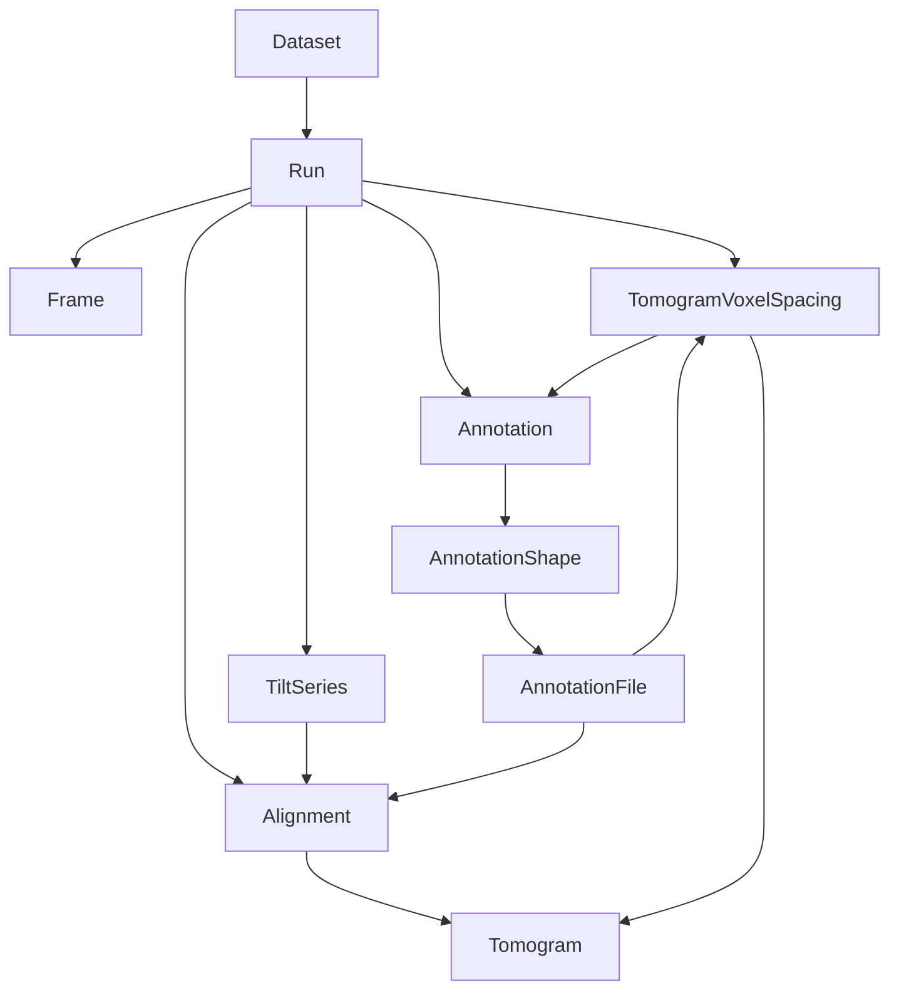
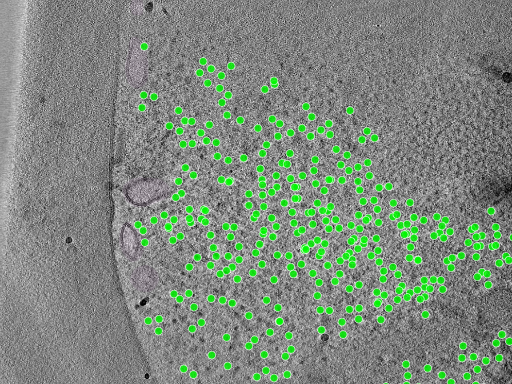

# CZ cryoET Data Portal schema: research and LAMBDA alignment

LAMBDA focuses on structural biology: connecting proteins and complexes to samples, experiments, and the workflows used to determine their structures. Cryo-electron tomography (cryoET) adds three-dimensional cellular context, imaging structures such as ribosomes, membranes, mitochondria, microtubules, and RubisCO complexes within frozen specimens. Linking LAMBDA's molecular and experimental records to cryoET images and spatial annotations could connect what a structure is with where it occurs and how it is organized in a cell. The [yeast](https://cryoetdataportal.czscience.com/datasets/10000) and [algal](https://cryoetdataportal.czscience.com/datasets/10301) examples below illustrate this opportunity.

Research date: 2026-09-15. Scope: the Chan Zuckerberg cryoET Data Portal metadata and API schemas, compared with this repository's current schema. This is a design assessment, not an implemented crosswalk. Selected public metadata and small assets were inspected as described below.

## Findings

For the separate CZII-funded interchange effort, see [TomoBabel / CETS](tomobabel-cets.md), which covers coordinate systems, processing-tool converters, spatial annotations, and their relationship to LAMBDA and the portal.

The portal is a useful reference for extending LAMBDA's cryoET support. Both projects use LinkML. LAMBDA already represents acquisition parameters, instruments, preparation, workflows, movies, and 3D images. The biggest opportunities are explicit tilt-series identity, alignment and coordinate-system provenance, and spatial annotation entities.

The portal's source has several distinct schema layers; “the CZI schema” does not identify a single interchangeable serialization. The backend snapshot inspected was `a991047558b09decf1a3f323adc6b24a8e8eef54`. The local schema baseline was `cdb7221a57c7439cf371847fd6a2989d7cb71678`.

## Authoritative sources and versions

| Source | Purpose |
| --- | --- |
| [Core metadata v2.0.0](https://github.com/chanzuckerberg/cryoet-data-portal-backend/blob/a991047558b09decf1a3f323adc6b24a8e8eef54/schema/core/v2.0.0/metadata.yaml) | LinkML classes for biological context, acquisition, reconstruction, annotations, and alignment |
| [Common definitions v2.0.0](https://github.com/chanzuckerberg/cryoet-data-portal-backend/blob/a991047558b09decf1a3f323adc6b24a8e8eef54/schema/core/v2.0.0/common.yaml) | Shared fields, units, constraints, identifier patterns, and enumerations |
| [Metadata files v2.0.0](https://github.com/chanzuckerberg/cryoet-data-portal-backend/blob/a991047558b09decf1a3f323adc6b24a8e8eef54/schema/metadata_files/v2.0.0/metadata_files.yaml) | JSON sidecar structures, paths, and per-section/per-movie metadata |
| [API schema](https://github.com/chanzuckerberg/cryoet-data-portal-backend/blob/a991047558b09decf1a3f323adc6b24a8e8eef54/apiv2/schema/schema.yaml) | Relational query model; its YAML declares version 1.1.0 despite living under `apiv2` |
| [Schema README](https://github.com/chanzuckerberg/cryoet-data-portal-backend/blob/a991047558b09decf1a3f323adc6b24a8e8eef54/schema/README.md) | Object-store directory layout and generation workflow |
| [Portal data organization](https://chanzuckerberg.github.io/cryoet-data-portal/stable/cryoet_data_portal_docsite_data.html) | User-facing meanings of datasets, runs, depositions, and annotations |

The repository also contains core v1.1.0 and ingestion-configuration v1.0.0. Keep schema-layer versions, API generation, and client package versions distinct. Pinned source links above support reproducible inspection; this review does not establish which commit the public service currently deploys.

## Main entities and relationships

A portal **Dataset** groups data acquired from one sample type under common preparation conditions. A **Run** groups data for one physical imaging location, typically one tilt series, although mosaics can involve more. A **Deposition** records data submitted together and can include contributions to existing data. Consequently, deposition should not be treated as a strict parent folder enclosing every dataset. These are portal concepts, not exact equivalents of LAMBDA's Dataset container or a facility acquisition session. [Data organization](https://chanzuckerberg.github.io/cryoet-data-portal/stable/cryoet_data_portal_docsite_data.html)

The following is a simplified relationship view of the [API source](https://github.com/chanzuckerberg/cryoet-data-portal-backend/blob/a991047558b09decf1a3f323adc6b24a8e8eef54/apiv2/schema/schema.yaml). Arrows indicate references/grouping, not exhaustive cardinality constraints.



Supporting records include gain files, frame-acquisition files, per-section acquisition and alignment parameters, identified objects, authors, funding, and annotation-method links. `Frame` relates to movie-stack metadata; do not assume it denotes one detector exposure within a movie. The file schema explicitly describes `PerFrameMetadata` as per-movie-stack metadata. [API](https://github.com/chanzuckerberg/cryoet-data-portal-backend/blob/a991047558b09decf1a3f323adc6b24a8e8eef54/apiv2/schema/schema.yaml), [metadata files](https://github.com/chanzuckerberg/cryoet-data-portal-backend/blob/a991047558b09decf1a3f323adc6b24a8e8eef54/schema/metadata_files/v2.0.0/metadata_files.yaml)

### Acquisition, reconstruction, and coordinates

- **TiltSeries**: microscope and camera configuration; accelerating voltage; pixel spacing; tilt axis, range, step, and scheme; total exposure dose (`total_flux`); binning; acquisition/alignment software; quality; and alignment status.
- **Per-section parameters**: raw tilt angle, defocus components, astigmatic angle, phase shift, and section index.
- **Alignment**: alignment type/method, reconstruction-volume dimensions and offsets, rotations, a 4×4 affine transformation, and portal-standard status. Per-section alignment includes projection offsets and an in-plane rotation matrix.
- **Tomogram**: voxel spacing, dimensions, offsets, reconstruction and processing methods/software, CTF correction, fiducial alignment status, authorship, dates, and transformation metadata.

These concepts are defined in the [core schema](https://github.com/chanzuckerberg/cryoet-data-portal-backend/blob/a991047558b09decf1a3f323adc6b24a8e8eef54/schema/core/v2.0.0/metadata.yaml) and [common fields](https://github.com/chanzuckerberg/cryoet-data-portal-backend/blob/a991047558b09decf1a3f323adc6b24a8e8eef54/schema/core/v2.0.0/common.yaml). Preserve their relationship graph: equal voxel spacing alone does not establish that two volumes or annotation files share coordinates.

### Annotations

The schema separates the annotation's scientific meaning and provenance from its geometric representation and stored files. It records object identity/state, method, software, authors, object count, confidence, and ground-truth status. API records separate `Annotation`, `AnnotationShape`, and `AnnotationFile`; annotation files reference alignment and voxel-spacing records. A forced one-annotation-to-one-tomogram conversion could therefore lose applicability information. [Core](https://github.com/chanzuckerberg/cryoet-data-portal-backend/blob/a991047558b09decf1a3f323adc6b24a8e8eef54/schema/core/v2.0.0/metadata.yaml), [API](https://github.com/chanzuckerberg/cryoet-data-portal-backend/blob/a991047558b09decf1a3f323adc6b24a8e8eef54/apiv2/schema/schema.yaml)

Current shape enum values are `SegmentationMask`, `OrientedPoint`, `Point`, `InstanceSegmentation`, `InstanceSegmentationMask`, `Mesh`, `GlobalCaption`, and `AnnotationCaption`. Method types include `manual`, `automated`, `hybrid`, and `simulated`. Source formats vary by shape, including MRC/Zarr masks, STAR and other point formats, and mesh formats such as OBJ/STL/VTK/GLB. Do not interpret all source formats as uniform portal download formats. [Common definitions](https://github.com/chanzuckerberg/cryoet-data-portal-backend/blob/a991047558b09decf1a3f323adc6b24a8e8eef54/schema/core/v2.0.0/common.yaml)

Object identifiers can use GO, UniProtKB, UBERON, CHEBI, CDPO, CL, or PDB. This is broader than a protein entity: membranes, cellular structures, chemicals, and artifacts can be targets. CDPO supplies terms for support materials, contamination, fiducials, and image artifacts. [Identifier definitions](https://github.com/chanzuckerberg/cryoet-data-portal-backend/blob/a991047558b09decf1a3f323adc6b24a8e8eef54/schema/core/v2.0.0/common.yaml), [CDPO documentation](https://chanzuckerberg.github.io/cryoet-data-portal/stable/cdpo.html)

## Real YAML examples and associated image data

### What is available in YAML?

**Yes: the backend publishes real dataset ingestion configurations in YAML.** These combine descriptive metadata with instructions for finding and converting source images and annotations. They are different from the LinkML schema definitions and from the published JSON metadata sidecars.

| Example | What it demonstrates | Browse the images |
| --- | --- | --- |
| [10000.yaml](https://github.com/chanzuckerberg/cryoet-data-portal-backend/blob/a991047558b09decf1a3f323adc6b24a8e8eef54/ingestion_tools/dataset_configs/10000.yaml) | S. pombe cryo-FIB lamellae imaged with defocus; ribosome and fatty-acid-synthase points plus GO-labeled organelle/membrane masks | [DS-10000](https://cryoetdataportal.czscience.com/datasets/10000) |
| [10001.yaml](https://github.com/chanzuckerberg/cryoet-data-portal-backend/blob/a991047558b09decf1a3f323adc6b24a8e8eef54/ingestion_tools/dataset_configs/10001.yaml) | Related S. pombe data acquired with a Volta phase plate; useful comparison of acquisition conditions | [DS-10001](https://cryoetdataportal.czscience.com/datasets/10001) |
| [10301.yaml](https://github.com/chanzuckerberg/cryoet-data-portal-backend/blob/a991047558b09decf1a3f323adc6b24a8e8eef54/ingestion_tools/dataset_configs/10301.yaml) | Chlamydomonas reinhardtii lamellae; oriented points for ATP synthase, ribosomes, nucleosomes, RubisCO, and microtubules | [DS-10301](https://cryoetdataportal.czscience.com/datasets/10301) |
| [template.yaml](https://github.com/chanzuckerberg/cryoet-data-portal-backend/blob/a991047558b09decf1a3f323adc6b24a8e8eef54/ingestion_tools/dataset_configs/template.yaml) | Starting point for authoring ingestion configuration | Configuration template, not a biological dataset |

For instance, the following **abridged excerpt** preserves the structure and values of the ribosome entry in `10000.yaml`. Authors, dates, method details, and other required context are omitted here; use the linked full configuration for ingestion.

```yaml
annotations:
- metadata:
    annotation_ingest_id: cytosolic-ribosome-1
    annotation_object:
      id: GO:0022626
      name: cytosolic ribosome
    annotation_software: pyTOM + Keras
    ground_truth_status: true
    method_type: hybrid
    version: 1.0
  sources:
  - Point:
      columns: xyz
      file_format: csv
      glob_string: particle_lists/{run_name}_cyto_ribosomes.csv
      is_visualization_default: true
```

The same configuration uses `SemanticSegmentationMask` source entries with `file_format: mrc` and a `mask_label` to extract individual classes from a labeled volume. For example, mitochondrion (`GO:0005739`) uses label 2 and microtubule (`GO:0005874`) uses label 4. These are **source-volume labels**, not GO numeric identifiers or universal label values. Ingestion can publish an extracted object mask with shape `SegmentationMask`. The source CSV/glob paths are ingestion inputs, not public download URLs. [Full configuration](https://github.com/chanzuckerberg/cryoet-data-portal-backend/blob/a991047558b09decf1a3f323adc6b24a8e8eef54/ingestion_tools/dataset_configs/10000.yaml)

### A concrete run: yeast TS_026, with images and annotations

Start at [run RN-241 / TS_026](https://cryoetdataportal.czscience.com/runs/241) in DS-10000. The inspected reconstruction is 960 × 928 × 1000 voxels, with metadata voxel spacing 13.48 Å, reconstructed by IMOD using weighted back projection (WBP). Its ribosome annotation reports **838 objects**; the public NDJSON file contains exactly 838 point records. The membrane annotation provides segmentation volumes. Both annotation sidecars reference the same alignment metadata as the tomogram. [Tomogram metadata](https://files.cryoetdataportal.cziscience.com/10000/TS_026/Reconstructions/VoxelSpacing13.480/Tomograms/100/tomogram_metadata.json), [ribosome metadata](https://files.cryoetdataportal.cziscience.com/10000/TS_026/Reconstructions/VoxelSpacing13.480/Annotations/101/cytosolic_ribosome-1.0.json), [membrane metadata](https://files.cryoetdataportal.cziscience.com/10000/TS_026/Reconstructions/VoxelSpacing13.480/Annotations/114/membrane-1.0.json)



*Unmodified portal preview for TS_026, credited to the dataset contributors. This is a representative 2D preview with selected overlays; use the linked volumes for quantitative analysis.* [Original preview](https://files.cryoetdataportal.cziscience.com/10000/TS_026/Reconstructions/VoxelSpacing13.480/Images/100/key-photo-snapshot.png)

| Asset | Public data | Local readable metadata |
| --- | --- | --- |
| Dataset | [JSON](https://files.cryoetdataportal.cziscience.com/10000/dataset_metadata.json) | [dataset.yaml](czi-cryoet-examples/dataset.yaml) |
| Reconstruction | [MRC, 1.78 GB](https://files.cryoetdataportal.cziscience.com/10000/TS_026/Reconstructions/VoxelSpacing13.480/Tomograms/100/TS_026.mrc); [OME-Zarr metadata](https://files.cryoetdataportal.cziscience.com/10000/TS_026/Reconstructions/VoxelSpacing13.480/Tomograms/100/TS_026.zarr/.zattrs) | [tomogram.yaml](czi-cryoet-examples/tomogram.yaml) |
| Ribosome points | [NDJSON, 56.9 kB](https://files.cryoetdataportal.cziscience.com/10000/TS_026/Reconstructions/VoxelSpacing13.480/Annotations/101/cytosolic_ribosome-1.0_point.ndjson) | [ribosome.yaml](czi-cryoet-examples/ribosome.yaml) |
| Membrane mask | [MRC, 891 MB](https://files.cryoetdataportal.cziscience.com/10000/TS_026/Reconstructions/VoxelSpacing13.480/Annotations/114/membrane-1.0_segmentationmask.mrc); [OME-Zarr metadata](https://files.cryoetdataportal.cziscience.com/10000/TS_026/Reconstructions/VoxelSpacing13.480/Annotations/114/membrane-1.0_segmentationmask.zarr/.zattrs) | [membrane.yaml](czi-cryoet-examples/membrane.yaml) |
| Alignment | [JSON](https://files.cryoetdataportal.cziscience.com/10000/TS_026/Alignments/100/alignment_metadata.json) | [alignment.yaml](czi-cryoet-examples/alignment.yaml) |

Sizes above are decimal and rounded. **The local YAML files are complete JSON-to-YAML reserializations made for this report**, not native upstream YAML examples. Field values are unchanged, including author attribution and dates. [Provenance and checksums](czi-cryoet-examples/provenance.yaml) identify the exact retrieved payloads. The complete [point file](czi-cryoet-examples/ribosome-points.ndjson) is also included locally.

This is a reduced YAML view of the published ribosome sidecar, showing how biological identity connects to a geometry file and an alignment:

```yaml
annotation_object:
  id: GO:0022626
  name: cytosolic ribosome
method_type: hybrid
ground_truth_status: true
object_count: 838
files:
- format: ndjson
  path: 10000/TS_026/Reconstructions/VoxelSpacing13.480/Annotations/101/cytosolic_ribosome-1.0_point.ndjson
  shape: Point
  is_visualization_default: true
alignment_metadata_path: 10000/TS_026/Alignments/100/alignment_metadata.json
```

The first geometry record is:

```json
{"type": "point", "location": {"x": 517.0, "y": 261.0, "z": 469.0}}
```

Thus the GO identifier is carried once in the annotation metadata, and the separate file supplies its spatial instances. The coordinate record itself does not include units or a GO identifier; interpret it with its parent metadata and coordinate convention. OME-Zarr explicitly stores array axes as `z, y, x`, whereas the point record names `x, y, z` individually.

A useful real-data wrinkle: the tomogram JSON and membrane OME-Zarr metadata report **13.48 Å**, while the tomogram's OME-Zarr scale reports **13.481 Å**. Preserve that source precision and establish a conversion/tolerance policy before asserting exact coordinate equivalence. The MRC headers and finest Zarr shape agree on 960 × 928 × 1000 voxels. [Tomogram Zarr metadata](https://files.cryoetdataportal.cziscience.com/10000/TS_026/Reconstructions/VoxelSpacing13.480/Tomograms/100/TS_026.zarr/.zattrs), [array shape](https://files.cryoetdataportal.cziscience.com/10000/TS_026/Reconstructions/VoxelSpacing13.480/Tomograms/100/TS_026.zarr/0/.zarray), [membrane Zarr metadata](https://files.cryoetdataportal.cziscience.com/10000/TS_026/Reconstructions/VoxelSpacing13.480/Annotations/114/membrane-1.0_segmentationmask.zarr/.zattrs)

### GO cellular-component terms: actual usage

Yes—these are actual **GO Cellular Component** identifiers used to name the imaged objects, including molecular complexes as well as cellular compartments. Their GO aspect was checked using the [QuickGO ontology service](https://www.ebi.ac.uk/QuickGO/services/ontology/go/terms/GO:0022626,GO:0016020,GO:0005739,GO:0005874,GO:0048492,GO:0045259).

| GO term | Object | Example source representation |
| --- | --- | --- |
| [GO:0022626](https://www.ebi.ac.uk/QuickGO/term/GO:0022626) | Cytosolic ribosome | Yeast points; algal oriented points |
| [GO:0016020](https://www.ebi.ac.uk/QuickGO/term/GO:0016020) | Membrane | Yeast segmentation masks |
| [GO:0005739](https://www.ebi.ac.uk/QuickGO/term/GO:0005739) | Mitochondrion | Yeast segmentation source label 2 |
| [GO:0005874](https://www.ebi.ac.uk/QuickGO/term/GO:0005874) | Microtubule | Yeast masks; algal oriented points |
| [GO:0048492](https://www.ebi.ac.uk/QuickGO/term/GO:0048492) | Ribulose bisphosphate carboxylase complex (RubisCO) | Algal oriented points |
| [GO:0045259](https://www.ebi.ac.uk/QuickGO/term/GO:0045259) | Proton-transporting ATP synthase complex | Algal oriented points, labeled “F1-F0 complex” by the contributor |

Representation evidence: [yeast configuration](https://github.com/chanzuckerberg/cryoet-data-portal-backend/blob/a991047558b09decf1a3f323adc6b24a8e8eef54/ingestion_tools/dataset_configs/10000.yaml) and [algal configuration](https://github.com/chanzuckerberg/cryoet-data-portal-backend/blob/a991047558b09decf1a3f323adc6b24a8e8eef54/ingestion_tools/dataset_configs/10301.yaml). Dataset-wide configuration does not mean every target occurs in every run.

Three distinct meanings should remain separate in a LAMBDA integration:

- **Sample context:** a dataset's `cell_component` describes the sampled cellular component. In the inspected DS-10000 sidecar it is `not_reported`, even though individual annotations have precise GO identifiers.
- **Spatial object identity:** `annotation_object.id: GO:0022626` classifies the structures whose locations are in the annotation file. It does not identify the particular protein sequences comprising each ribosome.
- **Protein functional/localization annotation:** a GO assertion about a Protein is a different relationship. A ribosome point alone does not establish the identity, function, or localization of every constituent protein.

This suggests a useful synergy: connect GO-classified image objects to explicitly supported molecular entities and experimental provenance, while keeping the spatial observation and the biological assertion separately traceable. The algal RubisCO example is particularly relevant to connecting molecular structure with organization in photosynthetic cells.

## Proposed mapping to lambda-ber-schema

These are design recommendations inferred from comparison with `src/lambda_ber_schema/schema/lambda_ber_schema.yaml`, not upstream equivalence assertions.

| Portal concept | Existing LAMBDA coverage | Mapping assessment |
| --- | --- | --- |
| Dataset | Study, Sample, SamplePreparation | Split grouping from specimen and preparation metadata; do not equate it with LAMBDA's Dataset serialization container. |
| Run | ExperimentRun | Similar but potentially different granularity. Preserve each imaging location; decide whether it is an experiment or an acquisition child of a session. |
| Microscope/camera | CryoEMInstrument, ExperimentInstrumentAssociation | Reuse instrument records and preserve per-acquisition settings. |
| TiltSeries | ExperimentRun tilt fields, DataFile | Acquisition values are substantially covered; a separately identified tilt-series entity is missing. |
| Frame and gain/acquisition files | Movie, DataFile | Partial fit; explicit tilt-series membership, tilt order, and gain-reference relationships need design. |
| Tomogram | Image3D, WorkflowRun, DataFile | Dimensions, voxel size, and reconstruction method exist; alignment identity and reconstruction variants need stronger representation. |
| Alignment and per-section parameters | WorkflowRun, Movie/Micrograph fields | Partial numerical overlap, but no dedicated alignment/coordinate model. |
| Annotation/Shape/File | DataFile | File storage alone cannot express object identity, geometry, applicability, and annotation provenance. |
| Deposition | Study and generic metadata | No dedicated deposition entity; retain independent submission provenance. |

The existing `ExperimentRun` already has `tilting_scheme`, `tilt_angle_min`, `tilt_angle_max`, `tilt_angle_increment`, `tilt_axis_angle`, `number_of_tilt_images`, `dose_per_tilt`, and `total_dose`. `Image3D` already has `dimensions_z`, `voxel_size`, and `reconstruction_method`, plus inherited image dimensions. Avoid duplicating these without defining ownership and synchronization.

## Conversion pitfalls

1. **Units:** portal accelerating voltage is in volts; pixel/voxel spacing uses angstroms; total flux is electrons per square angstrom. Convert explicitly into LAMBDA `QuantityValue` values and units. Portal precision/recall are percentages on 0–100. [Common definitions](https://github.com/chanzuckerberg/cryoet-data-portal-backend/blob/a991047558b09decf1a3f323adc6b24a8e8eef54/schema/core/v2.0.0/common.yaml)
2. **Tilt range:** file metadata uses a structured min/max range, while the API has a scalar total-range field. A scalar range cannot recover asymmetric endpoints. Prefer sidecars or actual angle lists when needed. [Core](https://github.com/chanzuckerberg/cryoet-data-portal-backend/blob/a991047558b09decf1a3f323adc6b24a8e8eef54/schema/core/v2.0.0/metadata.yaml), [API](https://github.com/chanzuckerberg/cryoet-data-portal-backend/blob/a991047558b09decf1a3f323adc6b24a8e8eef54/apiv2/schema/schema.yaml)
3. **Identity:** portal UniProt identifiers use `UniProtKB:`; this repository requires `uniprot:` for Protein identifiers. Normalize deliberately, retain source identifiers, and only create Protein records for protein targets. [Identifier patterns](https://github.com/chanzuckerberg/cryoet-data-portal-backend/blob/a991047558b09decf1a3f323adc6b24a8e8eef54/schema/core/v2.0.0/common.yaml)
4. **Dates:** portal date fields need explicit serialization into LAMBDA's intentionally string-based date fields. [Core](https://github.com/chanzuckerberg/cryoet-data-portal-backend/blob/a991047558b09decf1a3f323adc6b24a8e8eef54/schema/core/v2.0.0/metadata.yaml)
5. **Storage:** the portal has MRC files and multiscale OME-Zarr directories. LAMBDA's current `FileFormatEnum` includes MRC but lacks Zarr/OME-Zarr. Directory-backed array assets need an explicit representation, not an assumed single-file checksum. [Storage layout](https://github.com/chanzuckerberg/cryoet-data-portal-backend/blob/a991047558b09decf1a3f323adc6b24a8e8eef54/schema/README.md)
6. **Source consistency:** common shape enums include captions, while the inspected `AnnotationFileMetadata.format.any_of` does not list the caption-format enum. Verify generated validators and actual payloads before promising all shapes round-trip through every layer. [Common](https://github.com/chanzuckerberg/cryoet-data-portal-backend/blob/a991047558b09decf1a3f323adc6b24a8e8eef54/schema/core/v2.0.0/common.yaml), [metadata files](https://github.com/chanzuckerberg/cryoet-data-portal-backend/blob/a991047558b09decf1a3f323adc6b24a8e8eef54/schema/metadata_files/v2.0.0/metadata_files.yaml)

## Recommended next steps

1. Define a small cryoET profile reusing existing instruments, preparation, acquisition quantities, workflows, and files.
2. Add explicit tilt-series and alignment/coordinate records, then spatial annotation records with object identifiers, shapes, provenance, and file applicability.
3. Keep new entity collections flat in Dataset; use association tables for M:N relationships, consistent with this repository's design.
4. Add OME-Zarr support and explicit units/identifier conversion rules.
5. Validate a crosswalk against one real run with multiple reconstruction variants and annotations, checking transforms, spacing, dose units, and source provenance. Pin both upstream schema and client versions.

No schema changes or adapter implementation were made as part of this research. Verification covered public JSON metadata, lossless YAML reserialization, all 838 ribosome point records, the preview image, OME-Zarr metadata, and 1,024-byte HTTP range reads of the image/mask MRC headers. Full volumes were not downloaded, and no full upstream-schema or image-overlay validation was performed.
