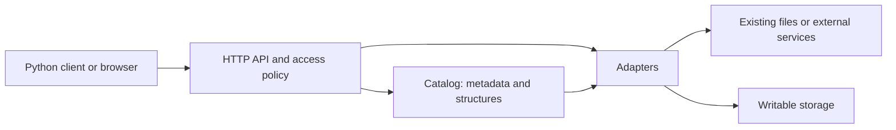

# Tiled: NSLS-II origins and relevance to LAMBDA and BRIDGE

**Tiled is the scientific data service developed in the Bluesky ecosystem.** It provides searchable metadata and structured access to scientific arrays and tables, including remote slicing and format conversion. It can expose existing holdings or accept new data. Here, **Bluesky means scientific experiment acquisition and orchestration**, not the social network; **Tiled is a separate project from TileDB**. [Tiled introduction][intro], [upstream repository][upstream], [scientific Bluesky][bluesky]

**Research and source access date: 2026-09-18.** This page distinguishes documented capabilities, reported facility use, a directly inspected public demo, and proposed integrations. The latest upstream release found was [v0.2.18][release] (2026-09-02), commit `80067124eca70e2c0040705a78fbb74f276fe68b`; source inspection used that release. The rolling documentation may describe newer behavior: upstream `main` resolved to [`394ea1114242d48882dd3136144b067bba21294f`][main-snapshot] (2026-09-17). No facility performance, institutional authentication, or LAMBDA conformance test was performed for this page.

## BNL origins, collaboration, and verified use

Brookhaven National Laboratory's article dated **2021-11-24**, also presented in its January 2022 NSLS-II newsletter, credits the National Synchrotron Light Source II's Data Science and Systems Integration program with developing and rolling out Tiled. It names both NSLS-II and Advanced Light Source (ALS, Berkeley Lab) developers and acknowledges other collaborators. Thus, BNL/NSLS-II is a well-supported origin and deployment site; describing Tiled as exclusively BNL-owned or BNL-only would obscure its collaborative development. Upstream describes multi-institutional governance under the Bluesky project. [BNL announcement][bnl], [upstream][upstream], [governance][governance]

| Evidence | What it establishes | Boundary |
| --- | --- | --- |
| BNL announcement, 2021-11-24 | BNL reported rollout to all NSLS-II experimental stations and early use in analysis pipelines. | Historical reported coverage, not a current endpoint inventory or service guarantee. [Source][bnl] |
| NSLS-II public AMX demo, inspected 2026-09-18 | An unauthenticated metadata GET succeeded for run `5ea3248f-44c6-4f07-bf23-fc640842ce90`. It is a container labeled `BlueskyRun` version `3.0`, with `start`, `stop`, and `lambda` metadata. | Demonstrates publicly served metadata, not validated LAMBDA Dataset conformance or production BRIDGE federation. [Metadata API][amx-api], [browser view][amx-ui] |
| ALS Computing, undated page accessed 2026-09-18 | The imaging/segmentation workflow explicitly reads and writes image and mask data through Tiled. | Evidence for this workflow; it does not establish that every ALS beamline uses Tiled. [Source][als] |
| Bluesky Tiled Plugins search tutorial, accessed 2026-09-18 | Documents the NSLS-II public demo and a BMM catalog example. | A reproducible tutorial description, not an independent availability test of every listed catalog. [Source][plugin-search] |

The AMX demo's `lambda` dictionary includes fields such as `technique`, `instrument`, `protein_name`, and `experiment_id`. Its inspected spec list contains `BlueskyRun`, without a LAMBDA spec. Treat this as a concrete starting point for a crosswalk: the label `lambda` alone establishes neither validation nor equivalence to this repository's current relational model. No personal metadata values from the demo are reproduced here. [Public metadata][amx-api]

## Relationship to acquisition and catalogs

These components have distinct responsibilities:

| Component | Responsibility |
| --- | --- |
| **Bluesky acquisition** | Executes experiment plans and collects data and metadata. Tiled can also serve data acquired without Bluesky. [Bluesky][bluesky], [Tiled][intro] |
| **Bluesky event-model** | Defines acquisition documents and their relationships: run start/stop, descriptors, events/pages, and external data references. These acquisition semantics need preservation during conversion. [Source][event-model] |
| **Bluesky Tiled Plugins** | Supplies a writer callback, specialized clients and queries, and document export/replay. This is an implemented integration with Bluesky. [Plugin documentation][plugins] |
| **Databroker** | Current documentation recommends Tiled plus the plugins for new users. Databroker retains legacy MongoDB storage adaptation and a compatible client API for existing code. [Deprecation notice][databroker] |
| **Tiled catalog** | Organizes searchable metadata, data structures, and asset locations; dispatches data access to adapters. It need not ingest every byte into a new store. [Catalog design][catalog], [registration][register] |

The documented plugin layout groups streams under a run container carrying Start/Stop metadata. Scalar event measurements become tables; detector-written external arrays are registered through resource references. Stream containers use a `composite` spec to describe aligned data, while descriptor metadata supplies data-key and configuration information. `StreamResource`/`StreamDatum` and legacy `Resource`/`Datum` must be distinguished. The writer requires an SQL catalog and SQL-backed tabular storage. [Run layout][plugin-layout]

Consequently, a catalog can describe an acquisition run without being the acquisition engine. Likewise, Tiled's SQL metadata catalog is not automatically a cross-facility SQL query service. A federated discovery layer would need explicit harvesting, identifier resolution, refresh behavior, and access-policy coordination; those are proposed integration responsibilities below.

## Architecture and scientific data access

This depicts the usual catalog-backed deployment. Custom adapters and small in-memory deployments need not use the standard catalog. The Python client translates familiar lookup and slicing operations into HTTP requests. The server uses FastAPI/Starlette and exposes OpenAPI documentation. Adapters provide structure-specific reads; serializers negotiate the response format independently of the stored format. [Architecture][architecture]

The standard catalog uses SQLite or PostgreSQL. Its nodes represent logical entries, while data sources describe formats and adapter parameters, structures describe shape/type or table organization, and assets identify physical locations. One logical dataset can span multiple files; one file can contain multiple logical datasets. The catalog can answer metadata searches without opening each data file. Metadata revisions are recorded, but are not by themselves immutable snapshots of underlying data bytes. [Architecture][architecture], [catalog model][catalog]

### Arrays, tables, and search

Tiled supports N-dimensional arrays, tables, hierarchical containers, and specialized structures including sparse and awkward arrays. Array descriptions include shape, dtype, and chunking; table access supports columns and partitions. These distinctions matter for diffraction images, tomograms, spectra, motor readings, and reduced measurements. Python clients integrate with NumPy, pandas, and Dask; an HTTP interface also permits other clients. [Structures][structures], [introduction][intro], [HTTP API][http-api]

A client can request a region of an image or selected table columns instead of downloading the entire logical dataset. **Small responses do not guarantee small storage reads:** adapter implementation, compression, chunk layout, and source format determine the actual I/O. Measure both returned bytes and backend reads before making performance claims. [Array adapter protocol][adapter-protocols], [HTTP API][http-api]

Metadata queries include equality and comparisons, key presence, membership, full text, specs, and structure-family filters. Supported queries depend on the adapter. This is discovery over metadata, not arbitrary computation over every pixel or automatic ontology reasoning. Searching across facilities still requires agreed identifiers, field names, vocabularies, and units. [Query reference][queries]

### Adapters and storage

The inspected release includes adapters for HDF5, TIFF, Zarr, CSV, Parquet, SQL tables, and in-memory structures, among others. Custom adapters can expose additional systems. **External registration** records an existing asset and its structure without copying it; **writable storage** lets Tiled manage newly written data. Neither implies a universal converter for all scientific formats or preservation of every format-specific semantic. [Adapters at v0.2.18][adapters], [registration][register]

Storage support is version- and adapter-dependent. Release v0.2.18 includes file, SQL, and object-storage classes, including S3-related configuration; its object-URI handling still explicitly limits supported schemes to HTTP(S). Older catalog prose describes S3 as future work. Verify the exact adapter, object-store endpoint, URI convention, and release together rather than claiming universal S3 compatibility. [Pinned storage implementation][storage], [catalog documentation][catalog]

For a sustained service, use a persistent catalog and deliberate registration. The directory-serving shortcut is documented mainly for small deployments/demos: startup rescans and observation of partially written files can be problematic. [Registration guidance][register]

### Access control

Tiled supports single-user API-key operation, public access, and multi-user authentication through configurable providers, including OpenID Connect. Authentication establishes identity; access policies determine allowed actions and which entries appear in listings/search. The documented tag-based policy maps users/groups to roles or scopes, with distinct permissions for metadata reads, data reads, and writes. [Security][security], [access control][access]

A facility integration must map its groups, embargoes, and service identities into these policies. Review direct asset access as well as array/table endpoints: `expose_raw_assets` controls access to backing assets, which may contain more than a selected view. Neither a public metadata record nor a login in another service establishes permission to obtain all associated bytes. Cross-system policy equivalence remains a pilot requirement. [Service configuration][configuration]

## LAMBDA, LinkML, and provenance

LAMBDA supplies structural-biology meaning: biological entities, physical samples, preparations, instruments, experiments, processing workflows, and explicit associations. Tiled supplies access to data and attached metadata. The current schema already permits `ExperimentRun.daq_system: bluesky`; this records acquisition software, rather than implementing an importer. The inspected loader directory has no dedicated Tiled/Bluesky loader, and the [Bluesky integration TODO](../todos/bluesky.md) remains proposed work. [LAMBDA schema][lambda-schema], [loaders][lambda-loaders]

The following is a **proposed crosswalk**, not an existing conversion contract:

| Source concept | Proposed LAMBDA representation | Preserve or resolve explicitly |
| --- | --- | --- |
| Acquisition run | `ExperimentRun` | Retain run UID and original Start/Stop documents. A scan number alone is insufficient global identity; do not create one experiment per detector Event by default. |
| Sample and instrument metadata | `Sample`, `Instrument`, `ExperimentSampleAssociation`, `ExperimentInstrumentAssociation` | Resolve identities against facility records; do not infer biological identity from a Tiled path. |
| Protein, strand, or ligand identity | `Protein`, `NucleicAcid`, `SmallMolecule`, with sample associations/components | Use supported CURIEs and per-sample detail, rather than copying an unqualified protein-name string into an identifier. |
| Array/table node and backing files | `DataFile` for actual serialized assets; `Image` subclasses where appropriate | Maintain a separate mapping of node URI, run/data-key identity, asset URI, and array selection. They are not necessarily one-to-one. |
| Processing and derived products | `WorkflowRun`, `WorkflowExperimentAssociation`, `WorkflowInputAssociation`, `WorkflowOutputAssociation` | Record software/version, parameters, inputs, outputs, and measured file checksums. |

This follows the [current flat collections and association tables][lambda-schema]. Preserve measurement units through `QuantityValue`, upstream time semantics, stream distinctions, and unmapped source metadata. `DataFile.storage_uri` is a locator, not necessarily an individual downloadable image: existing archive loaders can associate multiple file records with a bundle. A Tiled node URL is similarly not a content checksum or an immutable scientific identifier. [Schema][lambda-schema], [SSRL loader][ssrl-loader]

### LinkML validation is an integration step

Tiled metadata is user-defined, nested JSON-compatible content; large arrays belong in data nodes. Optional named/versioned **specs** declare conventions that clients can recognize. They are not automatically a domain validation guarantee. [Metadata and specs][metadata]

A proposed local LAMBDA spec could invoke a validator using LinkML-generated JSON Schema, with additional reference, unit, and domain checks. In v0.2.18, server validation iterates the supplied specs: `reject_undeclared_specs` rejects unknown spec names, but does not require a node to carry a particular spec. An ingestion contract must require the selected LAMBDA profile and prevent bypass through omitted/removed specs or alternate update paths. This is a conclusion from source inspection, not an executed test in this review. [Validation implementation][validation]

The release also documents an **experimental entity/link graph** with GraphQL, typed entities, predicate-labeled links, and CURIE expansion. It can express PROV-like or RO-Crate-like relationships, but provides neither ontology reasoning nor automatic LAMBDA/RO-Crate validation. A mapping to LAMBDA associations would be separate work. Validate an exported crate against the [LAMBDA Core RO-Crate profile](../profiles/lambda-core-rocrate-profile-v0.3.3.md); namespace reuse alone does not establish conformance. [Pinned graph description][graphs]

## Potential role in BRIDGE

**Recommendation, not a claim of adopted BRIDGE architecture:** evaluate Tiled as an optional scientific data-access service alongside shared metadata and analytical tables. A discovery result could link a normalized LAMBDA experiment and its biological context to a facility Tiled node; a client could then retrieve a selected image region or spectrum with the user's permitted access. Derived measurements could return as versioned tables with workflow provenance.

This division could support both interactive exploration and reproducible analysis without requiring every archive or lakehouse query to pass through Tiled. The integration still needs an authoritative metadata source, stable identifiers, a refresh strategy, and a versioned manifest connecting discovery records to actual assets. A common API does not by itself supply distributed joins, archive staging, common permissions, or dataset snapshot consistency. No production BRIDGE connector or cross-facility policy equivalence is established by the public evidence reviewed here.

The repository's [data lakehouse strategy](lambda-ber-schema-data-lakehouse-strategy.md) provides related design context. Its integration ideas should be evaluated against current schemas and operational requirements, rather than treated as deployment evidence.

## Bounded integration recommendation

Run a **five-working-day feasibility pilot** owned jointly by one service engineer and one schema/data steward. Use an isolated local service with pinned versions, synthetic data first, and at most one approved public source afterward. Start with one acquisition run, one sample/instrument pair, three small images, one scalar measurement table, and one derived result. This is proposed next work; the documentation task does not implement the pilot.

1. **Define the contract.** Map source UIDs to LAMBDA IDs and Tiled nodes; retain source documents; specify required metadata, units, schema/spec versions, and unmapped fields. Keep array bytes outside metadata.
2. **Exercise both access modes.** Register an existing HDF5 or TIFF asset read-only and store a derived array/table through writable storage. Demonstrate metadata selection, an exact image slice, and column projection; compare with direct file access.
3. **Enforce meaning and permissions.** Validate the LAMBDA Dataset and any exported RO-Crate separately. Test broken references, invalid units, missing identity, missing/removed specs, and metadata replacement. Use two synthetic principals to test forbidden discovery, metadata, data, and raw-asset access.
4. **Record reproducibility and costs.** Check file hashes, selected values, and workflow links after restart; document metadata-refresh behavior when a source changes. Measure cold/warm latency and storage/network bytes with representative chunking. A tiny example demonstrates correctness, not facility-scale performance.

Deliver a mapping, pinned runnable example, validation/permission results, and a short comparison with direct access. Proceed only if partial access provides useful measured value and a service owner can support catalog/storage recovery and upgrades. Stop or narrow the scope if identifiers cannot be stabilized, source permissions cannot be preserved, or the data layout prevents useful partial reads. Acquisition changes, bulk migration, production federation, and experimental graph adoption are outside this first pilot.

## Open questions

- Which NSLS-II holdings and endpoints are intended for sustained LAMBDA access, beyond the inspected public demo? Who owns the service and its access terms?
- Which LAMBDA version/profile should replace or interpret the AMX demo's current `lambda` block, and which fields are authoritative at the facility?
- How should run UIDs, sample identities, archive members, Tiled nodes, and immutable asset versions resolve across systems?
- Which adapters/formats and online storage support the desired image slices? Which holdings require staging before access?
- Can authorization remain consistent across discovery records, Tiled metadata, data slices, and direct asset downloads?
- What BRIDGE discovery/analysis interface actually needs this service, who maintains the mapping and refresh jobs, and what performance criterion justifies operating it?

All external references on this page were accessed on **2026-09-18**. Dated institutional reports describe their stated period; rolling documentation is interpreted with the pinned release boundaries above. Public claims are supported by public sources; private working notes are not cited as deployment evidence.

[intro]: https://blueskyproject.io/tiled/getting-started/what-is-tiled.html
[upstream]: https://github.com/bluesky/tiled
[release]: https://github.com/bluesky/tiled/releases/tag/v0.2.18
[main-snapshot]: https://github.com/bluesky/tiled/tree/394ea1114242d48882dd3136144b067bba21294f
[bnl]: https://www.bnl.gov/nsls2/newsletter/news.php?a=119260
[governance]: https://github.com/bluesky/governance
[als]: https://als.lbl.gov/computing-site/areas/
[amx-api]: https://tiled-demo.nsls2.bnl.gov/api/v1/metadata/amx/5ea3248f-44c6-4f07-bf23-fc640842ce90
[amx-ui]: https://tiled-demo.nsls2.bnl.gov/ui/browse/amx/5ea3248f-44c6-4f07-bf23-fc640842ce90/
[bluesky]: https://github.com/bluesky/bluesky
[event-model]: https://github.com/bluesky/event-model
[plugins]: https://blueskyproject.io/bluesky-tiled-plugins/
[plugin-layout]: https://blueskyproject.io/bluesky-tiled-plugins/explanations/layout.html
[plugin-search]: https://blueskyproject.io/bluesky-tiled-plugins/tutorials/search.html
[databroker]: https://blueskyproject.io/databroker/
[architecture]: https://blueskyproject.io/tiled/explanations/architecture.html
[catalog]: https://blueskyproject.io/tiled/explanations/catalog.html
[structures]: https://blueskyproject.io/tiled/explanations/structures.html
[http-api]: https://blueskyproject.io/tiled/reference/http-api-overview.html
[queries]: https://blueskyproject.io/tiled/reference/queries.html
[metadata]: https://blueskyproject.io/tiled/explanations/metadata.html
[register]: https://blueskyproject.io/tiled/user-guide/register.html
[security]: https://blueskyproject.io/tiled/explanations/security.html
[access]: https://blueskyproject.io/tiled/explanations/access-control.html
[configuration]: https://blueskyproject.io/tiled/reference/service-configuration.html
[adapters]: https://github.com/bluesky/tiled/tree/80067124eca70e2c0040705a78fbb74f276fe68b/tiled/adapters
[adapter-protocols]: https://github.com/bluesky/tiled/blob/80067124eca70e2c0040705a78fbb74f276fe68b/tiled/adapters/protocols.py
[storage]: https://github.com/bluesky/tiled/blob/80067124eca70e2c0040705a78fbb74f276fe68b/tiled/storage.py
[validation]: https://github.com/bluesky/tiled/blob/80067124eca70e2c0040705a78fbb74f276fe68b/tiled/server/router.py#L2758-L2798
[graphs]: https://github.com/bluesky/tiled/blob/80067124eca70e2c0040705a78fbb74f276fe68b/docs/source/explanations/graphs.md
[lambda-schema]: https://github.com/lambda-ber/lambda-ber-schema/blob/543ae40bc1fbe5ec87b92ea4c860b0332500e166/src/lambda_ber_schema/schema/lambda_ber_schema.yaml
[lambda-loaders]: https://github.com/lambda-ber/lambda-ber-schema/tree/543ae40bc1fbe5ec87b92ea4c860b0332500e166/src/lambda_ber_schema/loaders
[ssrl-loader]: https://github.com/lambda-ber/lambda-ber-schema/blob/543ae40bc1fbe5ec87b92ea4c860b0332500e166/src/lambda_ber_schema/loaders/ssrl_mx.py
