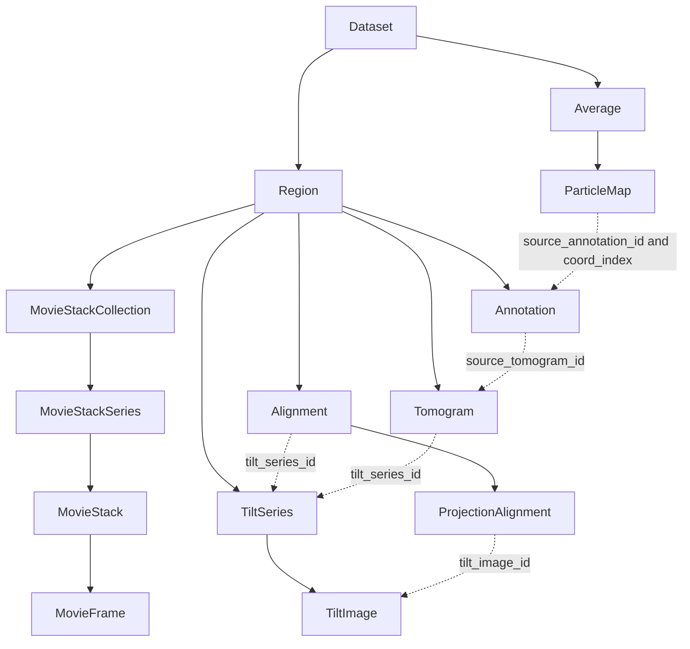

# TomoBabel / CETS: cryoET geometry and LAMBDA integration

LAMBDA focuses on structural biology: linking proteins and complexes to specimens, experiments, and structure-determination workflows. Cryo-electron tomography (cryoET) places structures such as ribosomes, membranes, microtubules, and RubisCO complexes in their three-dimensional cellular surroundings. TomoBabel's Cryo Electron Tomography Standard (CETS) offers a way to exchange the images' coordinate systems, alignments, and spatial annotations. Connecting these to LAMBDA could help relate molecular identity to location and organization within a cell. The [portal examples](czi-cryoet.md#real-yaml-examples-and-associated-image-data) illustrate these imaging targets.

**Research snapshot: 2026-09-17.** This page incorporates a repository investigation and executable example checks. Core CETS refers to commit `0c8c4e3c7a2885f29caba551ffcaacde45c00101`; experimental converter features are identified separately. Proposed LAMBDA mappings below are design recommendations. [Source manifest and example provenance](tomobabel-cets-examples/provenance.yaml)

## What is TomoBabel?

**TomoBabel is the organization; CETS is the standard under development.** The project describes itself as funded by the Chan Zuckerberg Imaging Institute (CZII), with participants from CZII, CCP-EM, CSIC, and EMBL-EBI. Its repositories live under [TomoBabel](https://github.com/TomoBabel), outside the Chan Zuckerberg GitHub organization. [Project statement][organization]

CETS builds on the earlier `cryo-et-standards/cryoet-geometry` work: merged [PR #14](https://github.com/TomoBabel/cets-data-models/pull/14) explicitly imports its LinkML definitions with adjustments. The schema still uses `CETMD` names and `https://w3id.org/cetmd/` namespaces. [Root schema][entities]

### How it relates to the portal and LAMBDA

| Project | Principal role | Useful contribution to an integration |
| --- | --- | --- |
| **TomoBabel / CETS** | Interchange between cryoET processing tools and archives | Tilt images, coordinate frames, transforms, alignments, annotation geometry, and particle-map references |
| **CZ cryoET Data Portal** | Data publication and discovery | Public volumes and annotations, biological object labels, deposition context, annotation methods and authorship |
| **LAMBDA** | Structural biology experiments and their biological context | Proteins, samples, preparation, instruments, workflows, file provenance, and ontology annotations |

These roles follow from the [CETS schema][entities], [portal schema][portal-schema], and [LAMBDA schema][lambda]. The dedicated [portal converter][portal-converter] exports portal runs into CETS and creates draft portal-ingestion staging files in the reverse direction. It does not establish that the portal has replaced its API or published metadata schema with CETS. See the separate [CZ cryoET Data Portal background page](czi-cryoet.md).

## Versions: distinguish core from converter profiles

The inspected Python package declares version **0.1.0** and **Pre-Alpha** status; its eight LinkML modules declare **0.0.1**. Package and schema versions therefore need separate tracking. [Package metadata][pyproject], [schema modules][schema-directory]

| Baseline | State at inspection | Why it matters |
| --- | --- | --- |
| Core `main`, `0c8c4e3` | Snapshot used for this page's core descriptions and synthetic example | Projection alignments allow at most two affine/translation steps |
| [PR #34](https://github.com/TomoBabel/cets-data-models/pull/34), `b415e95` | Open, unmerged proposal for canonical coordinates and sampling metadata | Portal, AreTomo3, and Warp/M converters pin this revision; it allows three projection steps |
| [Rigid converter profile][rigid] | Document identifies itself as `cets-rigid/0.2` | Adds conventions beyond the core; some converter READMEs still refer to `0.1` |
| [Non-rigid work][nonrigid] | Separate repository depending on a non-rigid schema branch | Deformation interchange is separate from the inspected core |

The [portal dependency declaration][portal-project] makes its PR-branch dependency explicit. An integration should record the schema commit, converter commit, profile, and companion-file version. Merely recording “CETS 0.1” would leave the coordinate contract ambiguous.

## Main entities and relationships

CETS uses a nested document. A **Dataset** contains **Regions** and **Averages**. A Region groups raw and processed products from one specimen region. An Average groups particle maps. LAMBDA's Dataset instead contains flat entity collections and association tables, so the shared class names do not establish equivalent meanings. [CETS entities][entities], [LAMBDA][lambda]



Solid arrows show containment; dashed arrows show selected references. This diagram does not assert required cardinalities or automatic reference validation. [Entities][entities], [image entities][image-entities], [alignment][alignment], [annotations][annotations]

Three details affect a crosswalk:

- **Movie and stack terminology:** a `MovieFrame` is an individual movie image. A `TiltImage` can reference its source movie and has a zero-based stack `section`.
- **Reconstruction provenance:** core `Alignment` has no identifier, and `Tomogram` has no explicit alignment reference. A shared tilt-series identifier does not identify which alignment produced a volume.
- **Particle provenance:** `ParticleMap` can reference a Region, an Annotation, and a zero-based `coord_index`. Those references are optional. Reordering picked coordinates can invalidate the index-based link.

Sources: [image entities][image-entities], [alignment][alignment].

## Coordinates, transformations, and image files

Each coordinate system has a name and named axes, with units and an axis type of `space` or `array`. Transformations identify their input and output systems by name. Supported forms are identity, axis mapping, translation, scale, affine, and an ordered sequence. This can describe how array indices relate to physical positions. [Coordinate systems][coordinates], [transformations][transforms]

Core `Affine` is constrained to a **3 × 3 matrix**. It cannot directly accept the portal's 4 × 4 homogeneous transform. A profile must specify how to interpret the matrix and represent translation, axis order, origin, handedness, and operation order. Accepting the correct matrix shape alone does not establish geometric equivalence. [Transforms][transforms], [Python models][models], [portal alignment background](czi-cryoet.md#acquisition-reconstruction-and-coordinates)

The rigid profile makes a more specific choice, converting array indices to centered physical coordinates with per-axis values:

```text
p_physical = (p_array - floor(N / 2)) * spacing
```

It then defines rotation and projection conventions. This is a **profile convention**, not a default imposed on every core CETS document. The synthetic example below deliberately uses a simpler corner origin. [Rigid profile][rigid]

Image records describe dimensions, coordinates, and paths; voxel arrays remain in external files. Tilt series and tomograms can reference even/odd products and record CTF correction. Core records do not provide a complete file-checksum or OME-Zarr multiscale model. LAMBDA's `DataFile` can supply file provenance, while a converter must preserve storage-specific axes and sampling metadata. [Image definitions][images], [image entities][image-entities], [LAMBDA][lambda]

## Annotations: geometry and biological meaning

CETS defines annotation types for 2D/3D points, vectors and rotations, segmentation masks and probability maps, meshes, geometric primitives, splines, and fitted density maps. A 3D point set uses `origin3D`; oriented representations can carry rotation matrices. Some representations remain sparse: the inspected `TriMesh` has no explicit vertices/faces payload. A type name alone is therefore insufficient to establish a complete exchange format. [Annotation schema][annotations]

**Core CETS has no dedicated GO or UniProt classification fields**, nor a full annotation method, authorship, evidence, or confidence model. Its Python models reject unknown fields, so adding `ontology_id` directly to core JSON is not a compatible extension. The portal converter preserves biological metadata and provenance in companion files. [Annotations][annotations], [models][models], [portal converter][portal-converter]

LAMBDA already has `ImageFeature.terms` containing `OntologyTerm` values, alongside protein-level GO and UniProt support. A useful extension would link these semantic assertions to explicitly identified CETS geometries and image frames. Keep three identities distinct:

1. **Object class:** for example, GO's cytosolic ribosome or membrane.
2. **Observed occurrence:** a particular picked point or segmented region in an image.
3. **Molecular identity:** a supported protein or complex assignment, potentially involving UniProt accessions.

An annotation record's `id` identifies the record; it should not be repurposed as the GO class. A ribosome pick also does not establish every constituent protein's identity. These are integration recommendations based on [LAMBDA's semantic types][lambda] and the [portal's actual GO annotations](czi-cryoet.md#go-cellular-component-terms-actual-usage).

## YAML examples and actual image data

**Yes, YAML is available, but the different kinds serve different purposes.** CETS itself is defined in [LinkML YAML][schema-directory]. The EMPIAR converter supplies a [YAML input configuration][empiar-config] and a [CETS JSON output example][empiar-example]. For readability, this page includes selected real metadata reserialized as YAML, plus an authored, validated CETS teaching example. [Example README](tomobabel-cets-examples/README.md)

### 1. Minimal CETS document with a point annotation

Download [minimal-cets.yaml](tomobabel-cets-examples/minimal-cets.yaml). It contains a tilt series, tomogram, named voxel and physical frames, a point set, and a particle map linked to the first point. The document validates against the inspected core Python model and survives JSON serialization and reloading. Its file paths are illustrative.

The following is just the annotation excerpt; the full file supplies the referenced image and frame definitions:

```yaml
annotations:
  - id: picks_1
    name: Example particle picks; no biological identification asserted
    annotation_type: point_set_3D
    source_tomogram_id: tomo_1
    coordinate_systems:
      - name: physical_xyz
        axes:
          - {name: x, axis_type: space, axis_unit: angstrom}
          - {name: y, axis_type: space, axis_unit: angstrom}
          - {name: z, axis_type: space, axis_unit: angstrom}
    origin3D:
      - [40.0, 80.0, 24.0]
```

With the example's 4 Å sampling and corner origin, this point corresponds to voxel coordinates `[10, 20, 6]`. The particle map references `picks_1` with `coord_index: 0`. No biological class is asserted.

### 2. EMPIAR-12104: real CETS metadata and a tomogram

The upstream [EMPIAR-12104 example][empiar-example] includes region `Control_TS_006`, a 50-image tilt series, and a tomogram. Our [YAML excerpt](tomobabel-cets-examples/empiar-12104-tomogram.excerpt.yaml) preserves the tomogram's values: dimensions **1022 × 1440 × 500**, voxel-to-physical scale **13.699999809265137 Å** on each axis, and a [public MRC volume](https://ftp.ebi.ac.uk/empiar/world_availability/12104/data/Control/tomograms/TS_006_aretomo.mrc).

This is a historical example: its full original JSON fails current-core validation because 50 tilt images lack now-required IDs. The excerpt omits the referenced tilt series and is not a self-contained exchange document. It contains no biological annotations. These limitations distinguish a useful real-world illustration from a current conformance fixture. [Upstream JSON][empiar-example], [current image definitions][image-entities]

### 3. Portal run TS_105_5: images and a GO membrane annotation

The portal converter includes a [recorded input fixture][portal-example] for dataset **10445**, run **17687 / TS_105_5**. Our [YAML excerpt](tomobabel-cets-examples/portal-10445.excerpt.yaml) includes a denoised **630 × 630 × 184** reconstruction at **10.012 Å**, links to its MRC/OME-Zarr data, and an automated membrane annotation labeled **GO:0016020**. This fixture is **portal converter input**, not CETS output.

The selected annotation metadata is under `VoxelSpacing4.990`, while that reconstruction is at `VoxelSpacing10.012`. They cannot be overlaid by assuming identical array coordinates; the applicable alignment and grid conversion must be established. For an already-inspected image/annotation pair, including a preview, ribosome points, and a membrane mask, see [yeast TS_026](czi-cryoet.md#a-concrete-run-yeast-ts_026-with-images-and-annotations).

The linked volumes remain external; the local examples contain small metadata files. Their [provenance manifest](tomobabel-cets-examples/provenance.yaml) records source commits, source-payload checksums, and the transformations used to create each excerpt.

## Converter ecosystem

The investigation inspected implementations in the following repositories. This inventory describes implemented scope; converter suites and reconstruction equivalence were not tested.

| Converter | Observed scope and boundary |
| --- | --- |
| [RELION][relion] | Project readers and reverse STAR writers; no claim of arbitrary lossless round trips |
| [IMOD][imod] | Alignment and CTF exchange in both directions; tomogram import |
| [Scipion][scipion] | Tilt series, CTF, tomograms, coordinates, and subtomograms |
| [EMPIAR][empiar-config] / [mmCIF][mmcif] | Archive import examples and CETS-to-mmCIF export |
| [AreTomo3][aretomo] / [Warp/M][warpm] | Rigid alignment exchange using the PR #34 model; varying local deformation requires refusal or explicit loss |
| [CZ cryoET Data Portal][portal-converter] | Run export and reverse ingestion staging; companions preserve information outside core CETS |

For the portal exporter, alignment and grid compatibility affect whether annotations can be included. Reverse conversion produces a draft for ingestion, not an automatic submission. Preserve converter options, skipped products, and losses as part of workflow provenance. [Converter implementation][portal-converter]

## Practical integration with LAMBDA

The following is a proposed crosswalk, not an implemented adapter:

| CETS concept | Existing LAMBDA support | Integration work |
| --- | --- | --- |
| Region and TiltSeries | ExperimentRun, Sample, experiment/sample associations | Preserve imaging-location and series identity without assuming one run equals one series |
| Tomogram and movie products | Image3D, Movie, DataFile | Connect image identity and file provenance to CETS geometry |
| Coordinate systems and alignments | No equivalent general transform graph | Strong candidate for selective model reuse; specify frame conventions and reconstruction/alignment links |
| Spatial annotation | ImageFeature, OntologyTerm | Link semantic assertions to identified geometries, source images, methods, and evidence |
| ParticleMap references | Workflow and file provenance | Retain source annotation and coordinate index, and validate index stability |
| Nested Dataset | Flat Dataset collections and association tables | Build an explicit crosswalk instead of equating identically named classes |

Assessment sources: [CETS entities][entities], [image entities][image-entities], [LAMBDA schema][lambda]. Numeric fields also need semantic review: CETS `accumulated_dose` is pre-exposure, defocus U/V are in Å, and per-axis sampling may be anisotropic. They cannot automatically become an image's delivered dose, a single defocus value, or a scalar voxel size.

A useful first step is an **external-artifact adapter**: register CETS documents, original metadata, companion files, and image products as LAMBDA `DataFile` records associated with a conversion `WorkflowRun`. Retain source IDs, exact model/converter versions, checksums, and a mapping to LAMBDA entities. This provides traceability while coordinate and annotation extensions are evaluated.

Validation must go beyond loading the document. The investigation found that core models accept dangling image references, inconsistent point/vector counts, negative widths, and underspecified scale vectors. An adapter should check reference resolution, array dimensions, coordinate counts, and known coordinate conversions. The validated synthetic example demonstrates model acceptance; it does not certify every converter or a reconstructed volume's scientific correctness. [Core models][models]

[organization]: https://github.com/TomoBabel/.github/blob/3d2ec3aa0747aa1944e41a613adc4567d79d0e00/profile/README.md
[entities]: https://github.com/TomoBabel/cets-data-models/blob/0c8c4e3c7a2885f29caba551ffcaacde45c00101/schema/linkml/entities.yaml
[schema-directory]: https://github.com/TomoBabel/cets-data-models/tree/0c8c4e3c7a2885f29caba551ffcaacde45c00101/schema/linkml
[pyproject]: https://github.com/TomoBabel/cets-data-models/blob/0c8c4e3c7a2885f29caba551ffcaacde45c00101/pyproject.toml
[image-entities]: https://github.com/TomoBabel/cets-data-models/blob/0c8c4e3c7a2885f29caba551ffcaacde45c00101/schema/linkml/image_entities.yaml
[images]: https://github.com/TomoBabel/cets-data-models/blob/0c8c4e3c7a2885f29caba551ffcaacde45c00101/schema/linkml/image.yaml
[alignment]: https://github.com/TomoBabel/cets-data-models/blob/0c8c4e3c7a2885f29caba551ffcaacde45c00101/schema/linkml/alignment.yaml
[coordinates]: https://github.com/TomoBabel/cets-data-models/blob/0c8c4e3c7a2885f29caba551ffcaacde45c00101/schema/linkml/coordinate_systems.yaml
[transforms]: https://github.com/TomoBabel/cets-data-models/blob/0c8c4e3c7a2885f29caba551ffcaacde45c00101/schema/linkml/coordinate_transforms.yaml
[annotations]: https://github.com/TomoBabel/cets-data-models/blob/0c8c4e3c7a2885f29caba551ffcaacde45c00101/schema/linkml/annotation.yaml
[models]: https://github.com/TomoBabel/cets-data-models/blob/0c8c4e3c7a2885f29caba551ffcaacde45c00101/src/cets_data_model/models/models.py
[lambda]: https://github.com/lambda-ber/lambda-ber-schema/blob/11a36719a79af486d5352b72e1f669bfc41c9575/src/lambda_ber_schema/schema/lambda_ber_schema.yaml
[portal-schema]: https://github.com/chanzuckerberg/cryoet-data-portal-backend/blob/a991047558b09decf1a3f323adc6b24a8e8eef54/schema/core/v2.0.0/metadata.yaml
[portal-converter]: https://github.com/TomoBabel/cets-cryoet-data-portal/tree/1162528d8f96f5616d88fb759472dffcc440165b
[portal-project]: https://github.com/TomoBabel/cets-cryoet-data-portal/blob/1162528d8f96f5616d88fb759472dffcc440165b/pyproject.toml
[portal-example]: https://github.com/TomoBabel/cets-cryoet-data-portal/blob/1162528d8f96f5616d88fb759472dffcc440165b/tests/data/10445_TS_105_5.json
[rigid]: https://github.com/uermel/cryoet-alignment/blob/2eebafb7ebb641b07befa8eba20958a0870c6768/docs/cets.md
[nonrigid]: https://github.com/TomoBabel/cets-nonrigid/tree/4bf128e9f79fa6f17006b192504377612748429a
[empiar-config]: https://github.com/TomoBabel/cets-empiar/blob/0c3413a529b10f90c195314a858d74c7ea429b52/definition_files/empiar/empiar_12104.yaml
[empiar-example]: https://github.com/TomoBabel/cets-empiar/blob/0c3413a529b10f90c195314a858d74c7ea429b52/examples/CETS_objects/EMPIAR-12104.json
[relion]: https://github.com/TomoBabel/cets-relion/tree/e7d0ded6dda54035d915d2bb3639a630bd006522
[imod]: https://github.com/TomoBabel/cets-imod/tree/1f05fe0aa6c5b2bc764cf24d8682c36998b37b6d
[scipion]: https://github.com/TomoBabel/cets-scipion/tree/8e06d33a1b9bb41b422455b1c9a24446277c140c
[mmcif]: https://github.com/TomoBabel/cets-mmcif/tree/c99c0c339f9e518be1452f16f0c6f5e6c310b133
[aretomo]: https://github.com/TomoBabel/cets-aretomo3/tree/ca22266475036f97a481918e81a48bbea979ed6b
[warpm]: https://github.com/TomoBabel/cets-warpm/tree/84e739049bd7c7988b7bc20d43afb168ae95cc9e
