# Class: AttributeGroup 


_A grouping of related data attributes that form a logical unit_


* __NOTE__: this is an abstract class and should not be instantiated directly


URI: [lambda:AttributeGroup](http://w3id.org/lambda/AttributeGroup)

```mermaid
 classDiagram
    class AttributeGroup
    click AttributeGroup href "../AttributeGroup/"
      AttributeGroup <|-- SANSDetector
        click SANSDetector href "../SANSDetector/"
      AttributeGroup <|-- SANSSource
        click SANSSource href "../SANSSource/"
      AttributeGroup <|-- SANSConfiguration
        click SANSConfiguration href "../SANSConfiguration/"
      AttributeGroup <|-- ImageFeature
        click ImageFeature href "../ImageFeature/"
      AttributeGroup <|-- MolecularComposition
        click MolecularComposition href "../MolecularComposition/"
      AttributeGroup <|-- BufferComposition
        click BufferComposition href "../BufferComposition/"
      AttributeGroup <|-- StorageConditions
        click StorageConditions href "../StorageConditions/"
      AttributeGroup <|-- TechniqueSpecificPreparation
        click TechniqueSpecificPreparation href "../TechniqueSpecificPreparation/"
      AttributeGroup <|-- CrystallizationConditions
        click CrystallizationConditions href "../CrystallizationConditions/"
      AttributeGroup <|-- ExperimentalConditions
        click ExperimentalConditions href "../ExperimentalConditions/"
      AttributeGroup <|-- DataCollectionStrategy
        click DataCollectionStrategy href "../DataCollectionStrategy/"
      AttributeGroup <|-- BeamCenterPixels
        click BeamCenterPixels href "../BeamCenterPixels/"
      AttributeGroup <|-- QualityMetrics
        click QualityMetrics href "../QualityMetrics/"
      AttributeGroup <|-- ComputeResources
        click ComputeResources href "../ComputeResources/"
      AttributeGroup <|-- MotionCorrectionParameters
        click MotionCorrectionParameters href "../MotionCorrectionParameters/"
      AttributeGroup <|-- CTFEstimationParameters
        click CTFEstimationParameters href "../CTFEstimationParameters/"
      AttributeGroup <|-- ParticlePickingParameters
        click ParticlePickingParameters href "../ParticlePickingParameters/"
      AttributeGroup <|-- RefinementParameters
        click RefinementParameters href "../RefinementParameters/"
      AttributeGroup <|-- FSCCurve
        click FSCCurve href "../FSCCurve/"
      AttributeGroup <|-- LigandInteraction
        click LigandInteraction href "../LigandInteraction/"
      AttributeGroup <|-- BiophysicalProperty
        click BiophysicalProperty href "../BiophysicalProperty/"
      AttributeGroup <|-- ConformationalState
        click ConformationalState href "../ConformationalState/"
      AttributeGroup <|-- DatabaseCrossReference
        click DatabaseCrossReference href "../DatabaseCrossReference/"
      
      AttributeGroup : description
        
      
```





## Inheritance
* **AttributeGroup**
    * [SANSDetector](SANSDetector.md)
    * [SANSSource](SANSSource.md)
    * [SANSConfiguration](SANSConfiguration.md)
    * [ImageFeature](ImageFeature.md)
    * [MolecularComposition](MolecularComposition.md)
    * [BufferComposition](BufferComposition.md)
    * [StorageConditions](StorageConditions.md)
    * [TechniqueSpecificPreparation](TechniqueSpecificPreparation.md)
    * [CrystallizationConditions](CrystallizationConditions.md)
    * [ExperimentalConditions](ExperimentalConditions.md)
    * [DataCollectionStrategy](DataCollectionStrategy.md)
    * [BeamCenterPixels](BeamCenterPixels.md)
    * [QualityMetrics](QualityMetrics.md)
    * [ComputeResources](ComputeResources.md)
    * [MotionCorrectionParameters](MotionCorrectionParameters.md)
    * [CTFEstimationParameters](CTFEstimationParameters.md)
    * [ParticlePickingParameters](ParticlePickingParameters.md)
    * [RefinementParameters](RefinementParameters.md)
    * [FSCCurve](FSCCurve.md)
    * [LigandInteraction](LigandInteraction.md)
    * [BiophysicalProperty](BiophysicalProperty.md)
    * [ConformationalState](ConformationalState.md)
    * [DatabaseCrossReference](DatabaseCrossReference.md)


## Slots

| Name | Cardinality and Range | Description | Inheritance |
| ---  | --- | --- | --- |
| [description](description.md) | 0..1 <br/> [String](String.md) |  | direct |


## Identifier and Mapping Information


### Schema Source


* from schema: http://w3id.org/lambda/


## Mappings

| Mapping Type | Mapped Value |
| ---  | ---  |
| self | lambda:AttributeGroup |
| native | lambda:AttributeGroup |


## LinkML Source

<!-- TODO: investigate https://stackoverflow.com/questions/37606292/how-to-create-tabbed-code-blocks-in-mkdocs-or-sphinx -->

### Direct

<details>
```yaml
name: AttributeGroup
description: A grouping of related data attributes that form a logical unit
from_schema: http://w3id.org/lambda/
abstract: true
attributes:
  description:
    name: description
    from_schema: http://w3id.org/lambda/
    domain_of:
    - NamedThing
    - AttributeGroup
    range: string

```
</details>

### Induced

<details>
```yaml
name: AttributeGroup
description: A grouping of related data attributes that form a logical unit
from_schema: http://w3id.org/lambda/
abstract: true
attributes:
  description:
    name: description
    from_schema: http://w3id.org/lambda/
    alias: description
    owner: AttributeGroup
    domain_of:
    - NamedThing
    - AttributeGroup
    range: string

```
</details>