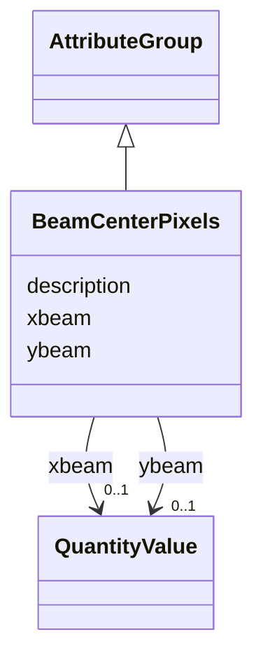

# Class: BeamCenterPixels 


_Combined beam center coordinates in detector pixel units_


URI: [lambda:BeamCenterPixels](http://w3id.org/lambda/BeamCenterPixels)





## Inheritance
* [AttributeGroup](AttributeGroup.md)
    * **BeamCenterPixels**


## Slots

| Name | Cardinality and Range | Description | Inheritance |
| ---  | --- | --- | --- |
| [xbeam](xbeam.md) | 0..1 <br/> [QuantityValue](QuantityValue.md) | Beam center X coordinate in pixels | direct |
| [ybeam](ybeam.md) | 0..1 <br/> [QuantityValue](QuantityValue.md) | Beam center Y coordinate in pixels | direct |
| [description](description.md) | 0..1 <br/> [String](String.md) |  | [AttributeGroup](AttributeGroup.md) |


## Usages

| used by | used in | type | used |
| ---  | --- | --- | --- |
| [ExperimentRun](ExperimentRun.md) | [beam_center_pixels](beam_center_pixels.md) | range | [BeamCenterPixels](BeamCenterPixels.md) |
| [DataCollectionStrategy](DataCollectionStrategy.md) | [beam_center_pixels](beam_center_pixels.md) | range | [BeamCenterPixels](BeamCenterPixels.md) |


## Identifier and Mapping Information


### Schema Source


* from schema: http://w3id.org/lambda/


## Mappings

| Mapping Type | Mapped Value |
| ---  | ---  |
| self | lambda:BeamCenterPixels |
| native | lambda:BeamCenterPixels |


## LinkML Source

<!-- TODO: investigate https://stackoverflow.com/questions/37606292/how-to-create-tabbed-code-blocks-in-mkdocs-or-sphinx -->

### Direct

<details>
```yaml
name: BeamCenterPixels
description: Combined beam center coordinates in detector pixel units
from_schema: http://w3id.org/lambda/
is_a: AttributeGroup
attributes:
  xbeam:
    name: xbeam
    description: Beam center X coordinate in pixels
    from_schema: http://w3id.org/lambda/
    aliases:
    - x
    - beam_center_x_px
    exact_mappings:
    - nsls2:Beam_xy_x
    - imgCIF:_diffrn_detector.beam_center_x
    - mmCIF:_diffrn_detector.beam_center_x
    - ispyb:DataCollection.xBeam
    rank: 1000
    domain_of:
    - BeamCenterPixels
    range: QuantityValue
    inlined: true
  ybeam:
    name: ybeam
    description: Beam center Y coordinate in pixels
    from_schema: http://w3id.org/lambda/
    aliases:
    - y
    - beam_center_y_px
    exact_mappings:
    - nsls2:Beam_xy_y
    - imgCIF:_diffrn_detector.beam_center_y
    - mmCIF:_diffrn_detector.beam_center_y
    - ispyb:DataCollection.yBeam
    rank: 1000
    domain_of:
    - BeamCenterPixels
    range: QuantityValue
    inlined: true

```
</details>

### Induced

<details>
```yaml
name: BeamCenterPixels
description: Combined beam center coordinates in detector pixel units
from_schema: http://w3id.org/lambda/
is_a: AttributeGroup
attributes:
  xbeam:
    name: xbeam
    description: Beam center X coordinate in pixels
    from_schema: http://w3id.org/lambda/
    aliases:
    - x
    - beam_center_x_px
    exact_mappings:
    - nsls2:Beam_xy_x
    - imgCIF:_diffrn_detector.beam_center_x
    - mmCIF:_diffrn_detector.beam_center_x
    - ispyb:DataCollection.xBeam
    rank: 1000
    alias: xbeam
    owner: BeamCenterPixels
    domain_of:
    - BeamCenterPixels
    range: QuantityValue
    inlined: true
  ybeam:
    name: ybeam
    description: Beam center Y coordinate in pixels
    from_schema: http://w3id.org/lambda/
    aliases:
    - y
    - beam_center_y_px
    exact_mappings:
    - nsls2:Beam_xy_y
    - imgCIF:_diffrn_detector.beam_center_y
    - mmCIF:_diffrn_detector.beam_center_y
    - ispyb:DataCollection.yBeam
    rank: 1000
    alias: ybeam
    owner: BeamCenterPixels
    domain_of:
    - BeamCenterPixels
    range: QuantityValue
    inlined: true
  description:
    name: description
    from_schema: http://w3id.org/lambda/
    alias: description
    owner: BeamCenterPixels
    domain_of:
    - NamedThing
    - AttributeGroup
    range: string

```
</details>