# Class: CryoEMPreparation 


_Cryo-EM specific sample preparation_


URI: [lambdaber:CryoEMPreparation](https://w3id.org/lambda-ber-schema/CryoEMPreparation)

```mermaid
 classDiagram
    class CryoEMPreparation
    click CryoEMPreparation href "../CryoEMPreparation/"
      TechniqueSpecificPreparation <|-- CryoEMPreparation
        click TechniqueSpecificPreparation href "../TechniqueSpecificPreparation/"
      
      CryoEMPreparation : blot_force
        
          
    
        
        
        CryoEMPreparation --> "0..1" QuantityValue : blot_force
        click QuantityValue href "../QuantityValue/"
    

        
      CryoEMPreparation : blot_number
        
          
    
        
        
        CryoEMPreparation --> "0..1" QuantityValue : blot_number
        click QuantityValue href "../QuantityValue/"
    

        
      CryoEMPreparation : blot_time
        
          
    
        
        
        CryoEMPreparation --> "0..1" QuantityValue : blot_time
        click QuantityValue href "../QuantityValue/"
    

        
      CryoEMPreparation : blotter_height
        
          
    
        
        
        CryoEMPreparation --> "0..1" QuantityValue : blotter_height
        click QuantityValue href "../QuantityValue/"
    

        
      CryoEMPreparation : blotter_setting
        
          
    
        
        
        CryoEMPreparation --> "0..1" QuantityValue : blotter_setting
        click QuantityValue href "../QuantityValue/"
    

        
      CryoEMPreparation : chamber_temperature
        
          
    
        
        
        CryoEMPreparation --> "0..1" QuantityValue : chamber_temperature
        click QuantityValue href "../QuantityValue/"
    

        
      CryoEMPreparation : description
        
      CryoEMPreparation : ethane_temperature
        
          
    
        
        
        CryoEMPreparation --> "0..1" QuantityValue : ethane_temperature
        click QuantityValue href "../QuantityValue/"
    

        
      CryoEMPreparation : glow_discharge_applied
        
      CryoEMPreparation : glow_discharge_atmosphere
        
      CryoEMPreparation : glow_discharge_current
        
          
    
        
        
        CryoEMPreparation --> "0..1" QuantityValue : glow_discharge_current
        click QuantityValue href "../QuantityValue/"
    

        
      CryoEMPreparation : glow_discharge_pressure
        
          
    
        
        
        CryoEMPreparation --> "0..1" QuantityValue : glow_discharge_pressure
        click QuantityValue href "../QuantityValue/"
    

        
      CryoEMPreparation : glow_discharge_time
        
          
    
        
        
        CryoEMPreparation --> "0..1" QuantityValue : glow_discharge_time
        click QuantityValue href "../QuantityValue/"
    

        
      CryoEMPreparation : grid_material
        
          
    
        
        
        CryoEMPreparation --> "0..1" GridMaterialEnum : grid_material
        click GridMaterialEnum href "../GridMaterialEnum/"
    

        
      CryoEMPreparation : grid_type
        
          
    
        
        
        CryoEMPreparation --> "0..1" GridTypeEnum : grid_type
        click GridTypeEnum href "../GridTypeEnum/"
    

        
      CryoEMPreparation : hole_size
        
          
    
        
        
        CryoEMPreparation --> "0..1" QuantityValue : hole_size
        click QuantityValue href "../QuantityValue/"
    

        
      CryoEMPreparation : humidity_percentage
        
          
    
        
        
        CryoEMPreparation --> "0..1" QuantityValue : humidity_percentage
        click QuantityValue href "../QuantityValue/"
    

        
      CryoEMPreparation : plasma_treatment
        
      CryoEMPreparation : sample_applied_volume
        
          
    
        
        
        CryoEMPreparation --> "0..1" QuantityValue : sample_applied_volume
        click QuantityValue href "../QuantityValue/"
    

        
      CryoEMPreparation : support_film
        
      CryoEMPreparation : vitrification_instrument
        
      CryoEMPreparation : vitrification_method
        
          
    
        
        
        CryoEMPreparation --> "0..1" VitrificationMethodEnum : vitrification_method
        click VitrificationMethodEnum href "../VitrificationMethodEnum/"
    

        
      CryoEMPreparation : wait_time
        
          
    
        
        
        CryoEMPreparation --> "0..1" QuantityValue : wait_time
        click QuantityValue href "../QuantityValue/"
    

        
      
```





## Inheritance
* [AttributeGroup](AttributeGroup.md)
    * [TechniqueSpecificPreparation](TechniqueSpecificPreparation.md)
        * **CryoEMPreparation**


## Slots

| Name | Cardinality and Range | Description | Inheritance |
| ---  | --- | --- | --- |
| [grid_type](grid_type.md) | 0..1 <br/> [GridTypeEnum](GridTypeEnum.md) | Type of EM grid used | direct |
| [support_film](support_film.md) | 0..1 <br/> [String](String.md) | Support film type | direct |
| [hole_size](hole_size.md) | 0..1 <br/> [QuantityValue](QuantityValue.md) | Hole size, typically specified in micrometers (range: 0 | direct |
| [vitrification_method](vitrification_method.md) | 0..1 <br/> [VitrificationMethodEnum](VitrificationMethodEnum.md) | Method used for vitrification | direct |
| [blot_time](blot_time.md) | 0..1 <br/> [QuantityValue](QuantityValue.md) | Blotting time, typically specified in seconds (range: 0 | direct |
| [blot_force](blot_force.md) | 0..1 <br/> [QuantityValue](QuantityValue.md) | Blotting force setting | direct |
| [humidity_percentage](humidity_percentage.md) | 0..1 <br/> [QuantityValue](QuantityValue.md) | Chamber humidity during vitrification (range: 0-100), typically specified as ... | direct |
| [chamber_temperature](chamber_temperature.md) | 0..1 <br/> [QuantityValue](QuantityValue.md) | Chamber temperature, typically specified in degrees Celsius | direct |
| [grid_material](grid_material.md) | 0..1 <br/> [GridMaterialEnum](GridMaterialEnum.md) | Grid material | direct |
| [glow_discharge_applied](glow_discharge_applied.md) | 0..1 <br/> [Boolean](Boolean.md) | Whether glow discharge treatment was applied | direct |
| [glow_discharge_time](glow_discharge_time.md) | 0..1 <br/> [QuantityValue](QuantityValue.md) | Glow discharge time, typically specified in seconds | direct |
| [glow_discharge_current](glow_discharge_current.md) | 0..1 <br/> [QuantityValue](QuantityValue.md) | Glow discharge current, typically specified in milliamperes | direct |
| [glow_discharge_atmosphere](glow_discharge_atmosphere.md) | 0..1 <br/> [String](String.md) | Glow discharge atmosphere (air, amylamine) | direct |
| [glow_discharge_pressure](glow_discharge_pressure.md) | 0..1 <br/> [QuantityValue](QuantityValue.md) | Glow discharge pressure, typically specified in millibars | direct |
| [vitrification_instrument](vitrification_instrument.md) | 0..1 <br/> [String](String.md) | Vitrification instrument used (e | direct |
| [blot_number](blot_number.md) | 0..1 <br/> [QuantityValue](QuantityValue.md) | Number of blots applied | direct |
| [wait_time](wait_time.md) | 0..1 <br/> [QuantityValue](QuantityValue.md) | Wait time before blotting, typically specified in seconds | direct |
| [blotter_height](blotter_height.md) | 0..1 <br/> [QuantityValue](QuantityValue.md) | Blotter height setting | direct |
| [blotter_setting](blotter_setting.md) | 0..1 <br/> [QuantityValue](QuantityValue.md) | Blotter setting value | direct |
| [sample_applied_volume](sample_applied_volume.md) | 0..1 <br/> [QuantityValue](QuantityValue.md) | Volume of sample applied, typically specified in microliters | direct |
| [ethane_temperature](ethane_temperature.md) | 0..1 <br/> [QuantityValue](QuantityValue.md) | Ethane temperature, typically specified in degrees Celsius | direct |
| [plasma_treatment](plasma_treatment.md) | 0..1 <br/> [String](String.md) | Plasma treatment details | direct |
| [description](description.md) | 0..1 <br/> [String](String.md) |  | [AttributeGroup](AttributeGroup.md) |


## Identifier and Mapping Information


### Schema Source


* from schema: https://w3id.org/lambda-ber-schema/


## Mappings

| Mapping Type | Mapped Value |
| ---  | ---  |
| self | lambdaber:CryoEMPreparation |
| native | lambdaber:CryoEMPreparation |


## LinkML Source

<!-- TODO: investigate https://stackoverflow.com/questions/37606292/how-to-create-tabbed-code-blocks-in-mkdocs-or-sphinx -->

### Direct

<details>
```yaml
name: CryoEMPreparation
description: Cryo-EM specific sample preparation
from_schema: https://w3id.org/lambda-ber-schema/
is_a: TechniqueSpecificPreparation
attributes:
  grid_type:
    name: grid_type
    description: Type of EM grid used
    from_schema: https://w3id.org/lambda-ber-schema/
    rank: 1000
    domain_of:
    - CryoEMPreparation
    range: GridTypeEnum
  support_film:
    name: support_film
    description: Support film type
    from_schema: https://w3id.org/lambda-ber-schema/
    rank: 1000
    domain_of:
    - CryoEMPreparation
    range: string
  hole_size:
    name: hole_size
    description: 'Hole size, typically specified in micrometers (range: 0.5-5.0).
      Data providers may specify alternative units by including the unit in the QuantityValue.'
    from_schema: https://w3id.org/lambda-ber-schema/
    rank: 1000
    domain_of:
    - CryoEMPreparation
    range: QuantityValue
    inlined: true
  vitrification_method:
    name: vitrification_method
    description: Method used for vitrification
    from_schema: https://w3id.org/lambda-ber-schema/
    rank: 1000
    domain_of:
    - CryoEMPreparation
    range: VitrificationMethodEnum
  blot_time:
    name: blot_time
    description: 'Blotting time, typically specified in seconds (range: 0.5-10.0).
      Data providers may specify alternative units by including the unit in the QuantityValue.'
    from_schema: https://w3id.org/lambda-ber-schema/
    rank: 1000
    domain_of:
    - CryoEMPreparation
    range: QuantityValue
    inlined: true
  blot_force:
    name: blot_force
    description: Blotting force setting
    from_schema: https://w3id.org/lambda-ber-schema/
    rank: 1000
    domain_of:
    - CryoEMPreparation
    range: QuantityValue
    inlined: true
  humidity_percentage:
    name: humidity_percentage
    description: 'Chamber humidity during vitrification (range: 0-100), typically
      specified as a percentage. Data providers may specify as decimal fraction by
      including the unit in the QuantityValue.'
    from_schema: https://w3id.org/lambda-ber-schema/
    rank: 1000
    domain_of:
    - CryoEMPreparation
    range: QuantityValue
    inlined: true
  chamber_temperature:
    name: chamber_temperature
    description: Chamber temperature, typically specified in degrees Celsius. Data
      providers may specify alternative units by including the unit in the QuantityValue.
    from_schema: https://w3id.org/lambda-ber-schema/
    rank: 1000
    domain_of:
    - CryoEMPreparation
    range: QuantityValue
    inlined: true
  grid_material:
    name: grid_material
    description: Grid material
    from_schema: https://w3id.org/lambda-ber-schema/
    rank: 1000
    domain_of:
    - CryoEMPreparation
    range: GridMaterialEnum
  glow_discharge_applied:
    name: glow_discharge_applied
    description: Whether glow discharge treatment was applied
    from_schema: https://w3id.org/lambda-ber-schema/
    rank: 1000
    domain_of:
    - CryoEMPreparation
    range: boolean
  glow_discharge_time:
    name: glow_discharge_time
    description: Glow discharge time, typically specified in seconds. Data providers
      may specify alternative units by including the unit in the QuantityValue.
    from_schema: https://w3id.org/lambda-ber-schema/
    rank: 1000
    domain_of:
    - CryoEMPreparation
    range: QuantityValue
    inlined: true
  glow_discharge_current:
    name: glow_discharge_current
    description: Glow discharge current, typically specified in milliamperes. Data
      providers may specify alternative units by including the unit in the QuantityValue.
    from_schema: https://w3id.org/lambda-ber-schema/
    rank: 1000
    domain_of:
    - CryoEMPreparation
    range: QuantityValue
    inlined: true
  glow_discharge_atmosphere:
    name: glow_discharge_atmosphere
    description: Glow discharge atmosphere (air, amylamine)
    from_schema: https://w3id.org/lambda-ber-schema/
    rank: 1000
    domain_of:
    - CryoEMPreparation
    range: string
  glow_discharge_pressure:
    name: glow_discharge_pressure
    description: Glow discharge pressure, typically specified in millibars. Data providers
      may specify alternative units by including the unit in the QuantityValue.
    from_schema: https://w3id.org/lambda-ber-schema/
    rank: 1000
    domain_of:
    - CryoEMPreparation
    range: QuantityValue
    inlined: true
  vitrification_instrument:
    name: vitrification_instrument
    description: Vitrification instrument used (e.g., Vitrobot)
    from_schema: https://w3id.org/lambda-ber-schema/
    rank: 1000
    domain_of:
    - CryoEMPreparation
    range: string
  blot_number:
    name: blot_number
    description: Number of blots applied
    from_schema: https://w3id.org/lambda-ber-schema/
    rank: 1000
    domain_of:
    - CryoEMPreparation
    range: QuantityValue
    inlined: true
  wait_time:
    name: wait_time
    description: Wait time before blotting, typically specified in seconds. Data providers
      may specify alternative units by including the unit in the QuantityValue.
    from_schema: https://w3id.org/lambda-ber-schema/
    rank: 1000
    domain_of:
    - CryoEMPreparation
    range: QuantityValue
    inlined: true
  blotter_height:
    name: blotter_height
    description: Blotter height setting. Data providers may include unit information
      in the QuantityValue if needed.
    from_schema: https://w3id.org/lambda-ber-schema/
    rank: 1000
    domain_of:
    - CryoEMPreparation
    range: QuantityValue
    inlined: true
  blotter_setting:
    name: blotter_setting
    description: Blotter setting value. Data providers may include unit information
      in the QuantityValue if needed.
    from_schema: https://w3id.org/lambda-ber-schema/
    rank: 1000
    domain_of:
    - CryoEMPreparation
    range: QuantityValue
    inlined: true
  sample_applied_volume:
    name: sample_applied_volume
    description: Volume of sample applied, typically specified in microliters. Data
      providers may specify alternative units by including the unit in the QuantityValue.
    from_schema: https://w3id.org/lambda-ber-schema/
    rank: 1000
    domain_of:
    - CryoEMPreparation
    range: QuantityValue
    inlined: true
  ethane_temperature:
    name: ethane_temperature
    description: Ethane temperature, typically specified in degrees Celsius. Data
      providers may specify alternative units by including the unit in the QuantityValue.
    from_schema: https://w3id.org/lambda-ber-schema/
    rank: 1000
    domain_of:
    - CryoEMPreparation
    range: QuantityValue
    inlined: true
  plasma_treatment:
    name: plasma_treatment
    description: Plasma treatment details
    from_schema: https://w3id.org/lambda-ber-schema/
    rank: 1000
    domain_of:
    - CryoEMPreparation

```
</details>

### Induced

<details>
```yaml
name: CryoEMPreparation
description: Cryo-EM specific sample preparation
from_schema: https://w3id.org/lambda-ber-schema/
is_a: TechniqueSpecificPreparation
attributes:
  grid_type:
    name: grid_type
    description: Type of EM grid used
    from_schema: https://w3id.org/lambda-ber-schema/
    rank: 1000
    alias: grid_type
    owner: CryoEMPreparation
    domain_of:
    - CryoEMPreparation
    range: GridTypeEnum
  support_film:
    name: support_film
    description: Support film type
    from_schema: https://w3id.org/lambda-ber-schema/
    rank: 1000
    alias: support_film
    owner: CryoEMPreparation
    domain_of:
    - CryoEMPreparation
    range: string
  hole_size:
    name: hole_size
    description: 'Hole size, typically specified in micrometers (range: 0.5-5.0).
      Data providers may specify alternative units by including the unit in the QuantityValue.'
    from_schema: https://w3id.org/lambda-ber-schema/
    rank: 1000
    alias: hole_size
    owner: CryoEMPreparation
    domain_of:
    - CryoEMPreparation
    range: QuantityValue
    inlined: true
  vitrification_method:
    name: vitrification_method
    description: Method used for vitrification
    from_schema: https://w3id.org/lambda-ber-schema/
    rank: 1000
    alias: vitrification_method
    owner: CryoEMPreparation
    domain_of:
    - CryoEMPreparation
    range: VitrificationMethodEnum
  blot_time:
    name: blot_time
    description: 'Blotting time, typically specified in seconds (range: 0.5-10.0).
      Data providers may specify alternative units by including the unit in the QuantityValue.'
    from_schema: https://w3id.org/lambda-ber-schema/
    rank: 1000
    alias: blot_time
    owner: CryoEMPreparation
    domain_of:
    - CryoEMPreparation
    range: QuantityValue
    inlined: true
  blot_force:
    name: blot_force
    description: Blotting force setting
    from_schema: https://w3id.org/lambda-ber-schema/
    rank: 1000
    alias: blot_force
    owner: CryoEMPreparation
    domain_of:
    - CryoEMPreparation
    range: QuantityValue
    inlined: true
  humidity_percentage:
    name: humidity_percentage
    description: 'Chamber humidity during vitrification (range: 0-100), typically
      specified as a percentage. Data providers may specify as decimal fraction by
      including the unit in the QuantityValue.'
    from_schema: https://w3id.org/lambda-ber-schema/
    rank: 1000
    alias: humidity_percentage
    owner: CryoEMPreparation
    domain_of:
    - CryoEMPreparation
    range: QuantityValue
    inlined: true
  chamber_temperature:
    name: chamber_temperature
    description: Chamber temperature, typically specified in degrees Celsius. Data
      providers may specify alternative units by including the unit in the QuantityValue.
    from_schema: https://w3id.org/lambda-ber-schema/
    rank: 1000
    alias: chamber_temperature
    owner: CryoEMPreparation
    domain_of:
    - CryoEMPreparation
    range: QuantityValue
    inlined: true
  grid_material:
    name: grid_material
    description: Grid material
    from_schema: https://w3id.org/lambda-ber-schema/
    rank: 1000
    alias: grid_material
    owner: CryoEMPreparation
    domain_of:
    - CryoEMPreparation
    range: GridMaterialEnum
  glow_discharge_applied:
    name: glow_discharge_applied
    description: Whether glow discharge treatment was applied
    from_schema: https://w3id.org/lambda-ber-schema/
    rank: 1000
    alias: glow_discharge_applied
    owner: CryoEMPreparation
    domain_of:
    - CryoEMPreparation
    range: boolean
  glow_discharge_time:
    name: glow_discharge_time
    description: Glow discharge time, typically specified in seconds. Data providers
      may specify alternative units by including the unit in the QuantityValue.
    from_schema: https://w3id.org/lambda-ber-schema/
    rank: 1000
    alias: glow_discharge_time
    owner: CryoEMPreparation
    domain_of:
    - CryoEMPreparation
    range: QuantityValue
    inlined: true
  glow_discharge_current:
    name: glow_discharge_current
    description: Glow discharge current, typically specified in milliamperes. Data
      providers may specify alternative units by including the unit in the QuantityValue.
    from_schema: https://w3id.org/lambda-ber-schema/
    rank: 1000
    alias: glow_discharge_current
    owner: CryoEMPreparation
    domain_of:
    - CryoEMPreparation
    range: QuantityValue
    inlined: true
  glow_discharge_atmosphere:
    name: glow_discharge_atmosphere
    description: Glow discharge atmosphere (air, amylamine)
    from_schema: https://w3id.org/lambda-ber-schema/
    rank: 1000
    alias: glow_discharge_atmosphere
    owner: CryoEMPreparation
    domain_of:
    - CryoEMPreparation
    range: string
  glow_discharge_pressure:
    name: glow_discharge_pressure
    description: Glow discharge pressure, typically specified in millibars. Data providers
      may specify alternative units by including the unit in the QuantityValue.
    from_schema: https://w3id.org/lambda-ber-schema/
    rank: 1000
    alias: glow_discharge_pressure
    owner: CryoEMPreparation
    domain_of:
    - CryoEMPreparation
    range: QuantityValue
    inlined: true
  vitrification_instrument:
    name: vitrification_instrument
    description: Vitrification instrument used (e.g., Vitrobot)
    from_schema: https://w3id.org/lambda-ber-schema/
    rank: 1000
    alias: vitrification_instrument
    owner: CryoEMPreparation
    domain_of:
    - CryoEMPreparation
    range: string
  blot_number:
    name: blot_number
    description: Number of blots applied
    from_schema: https://w3id.org/lambda-ber-schema/
    rank: 1000
    alias: blot_number
    owner: CryoEMPreparation
    domain_of:
    - CryoEMPreparation
    range: QuantityValue
    inlined: true
  wait_time:
    name: wait_time
    description: Wait time before blotting, typically specified in seconds. Data providers
      may specify alternative units by including the unit in the QuantityValue.
    from_schema: https://w3id.org/lambda-ber-schema/
    rank: 1000
    alias: wait_time
    owner: CryoEMPreparation
    domain_of:
    - CryoEMPreparation
    range: QuantityValue
    inlined: true
  blotter_height:
    name: blotter_height
    description: Blotter height setting. Data providers may include unit information
      in the QuantityValue if needed.
    from_schema: https://w3id.org/lambda-ber-schema/
    rank: 1000
    alias: blotter_height
    owner: CryoEMPreparation
    domain_of:
    - CryoEMPreparation
    range: QuantityValue
    inlined: true
  blotter_setting:
    name: blotter_setting
    description: Blotter setting value. Data providers may include unit information
      in the QuantityValue if needed.
    from_schema: https://w3id.org/lambda-ber-schema/
    rank: 1000
    alias: blotter_setting
    owner: CryoEMPreparation
    domain_of:
    - CryoEMPreparation
    range: QuantityValue
    inlined: true
  sample_applied_volume:
    name: sample_applied_volume
    description: Volume of sample applied, typically specified in microliters. Data
      providers may specify alternative units by including the unit in the QuantityValue.
    from_schema: https://w3id.org/lambda-ber-schema/
    rank: 1000
    alias: sample_applied_volume
    owner: CryoEMPreparation
    domain_of:
    - CryoEMPreparation
    range: QuantityValue
    inlined: true
  ethane_temperature:
    name: ethane_temperature
    description: Ethane temperature, typically specified in degrees Celsius. Data
      providers may specify alternative units by including the unit in the QuantityValue.
    from_schema: https://w3id.org/lambda-ber-schema/
    rank: 1000
    alias: ethane_temperature
    owner: CryoEMPreparation
    domain_of:
    - CryoEMPreparation
    range: QuantityValue
    inlined: true
  plasma_treatment:
    name: plasma_treatment
    description: Plasma treatment details
    from_schema: https://w3id.org/lambda-ber-schema/
    rank: 1000
    alias: plasma_treatment
    owner: CryoEMPreparation
    domain_of:
    - CryoEMPreparation
    range: string
  description:
    name: description
    from_schema: https://w3id.org/lambda-ber-schema/
    alias: description
    owner: CryoEMPreparation
    domain_of:
    - NamedThing
    - AttributeGroup
    range: string

```
</details>