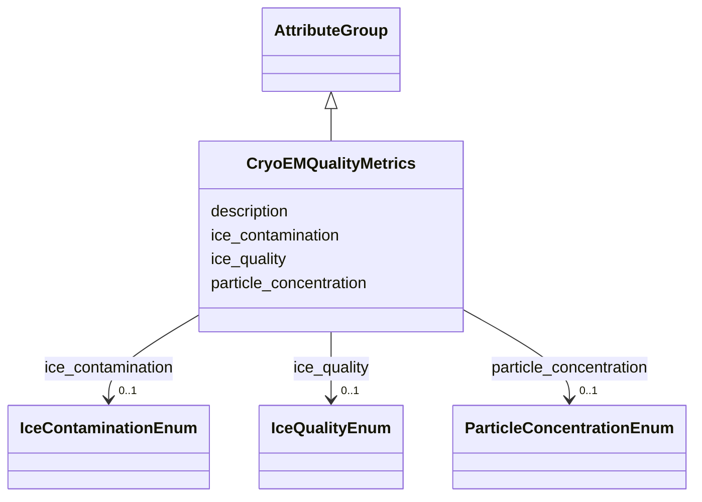

# Class: CryoEMQualityMetrics 


_Cryo-EM specific quality assessments recorded during or after data collection_


URI: [lambda:CryoEMQualityMetrics](http://w3id.org/lambda/CryoEMQualityMetrics)





## Inheritance
* [AttributeGroup](AttributeGroup.md)
    * **CryoEMQualityMetrics**


## Slots

| Name | Cardinality and Range | Description | Inheritance |
| ---  | --- | --- | --- |
| [ice_contamination](ice_contamination.md) | 0..1 <br/> [IceContaminationEnum](IceContaminationEnum.md) | Assessment of ice contamination level on the cryo-EM grid | direct |
| [ice_quality](ice_quality.md) | 0..1 <br/> [IceQualityEnum](IceQualityEnum.md) | Assessment of vitreous ice thickness/quality for data collection | direct |
| [particle_concentration](particle_concentration.md) | 0..1 <br/> [ParticleConcentrationEnum](ParticleConcentrationEnum.md) | Assessment of particle concentration on the cryo-EM grid | direct |
| [description](description.md) | 0..1 <br/> [String](String.md) |  | [AttributeGroup](AttributeGroup.md) |


## Usages

| used by | used in | type | used |
| ---  | --- | --- | --- |
| [QualityMetrics](QualityMetrics.md) | [cryo_em](cryo_em.md) | range | [CryoEMQualityMetrics](CryoEMQualityMetrics.md) |


## Identifier and Mapping Information


### Schema Source


* from schema: http://w3id.org/lambda/


## Mappings

| Mapping Type | Mapped Value |
| ---  | ---  |
| self | lambda:CryoEMQualityMetrics |
| native | lambda:CryoEMQualityMetrics |


## LinkML Source

<!-- TODO: investigate https://stackoverflow.com/questions/37606292/how-to-create-tabbed-code-blocks-in-mkdocs-or-sphinx -->

### Direct

<details>
```yaml
name: CryoEMQualityMetrics
description: Cryo-EM specific quality assessments recorded during or after data collection
from_schema: http://w3id.org/lambda/
is_a: AttributeGroup
attributes:
  ice_contamination:
    name: ice_contamination
    description: Assessment of ice contamination level on the cryo-EM grid
    from_schema: http://w3id.org/lambda/
    rank: 1000
    domain_of:
    - CryoEMQualityMetrics
    range: IceContaminationEnum
  ice_quality:
    name: ice_quality
    description: Assessment of vitreous ice thickness/quality for data collection
    from_schema: http://w3id.org/lambda/
    rank: 1000
    domain_of:
    - CryoEMQualityMetrics
    range: IceQualityEnum
  particle_concentration:
    name: particle_concentration
    description: Assessment of particle concentration on the cryo-EM grid
    from_schema: http://w3id.org/lambda/
    rank: 1000
    domain_of:
    - CryoEMQualityMetrics
    range: ParticleConcentrationEnum

```
</details>

### Induced

<details>
```yaml
name: CryoEMQualityMetrics
description: Cryo-EM specific quality assessments recorded during or after data collection
from_schema: http://w3id.org/lambda/
is_a: AttributeGroup
attributes:
  ice_contamination:
    name: ice_contamination
    description: Assessment of ice contamination level on the cryo-EM grid
    from_schema: http://w3id.org/lambda/
    rank: 1000
    alias: ice_contamination
    owner: CryoEMQualityMetrics
    domain_of:
    - CryoEMQualityMetrics
    range: IceContaminationEnum
  ice_quality:
    name: ice_quality
    description: Assessment of vitreous ice thickness/quality for data collection
    from_schema: http://w3id.org/lambda/
    rank: 1000
    alias: ice_quality
    owner: CryoEMQualityMetrics
    domain_of:
    - CryoEMQualityMetrics
    range: IceQualityEnum
  particle_concentration:
    name: particle_concentration
    description: Assessment of particle concentration on the cryo-EM grid
    from_schema: http://w3id.org/lambda/
    rank: 1000
    alias: particle_concentration
    owner: CryoEMQualityMetrics
    domain_of:
    - CryoEMQualityMetrics
    range: ParticleConcentrationEnum
  description:
    name: description
    from_schema: http://w3id.org/lambda/
    alias: description
    owner: CryoEMQualityMetrics
    domain_of:
    - NamedThing
    - AttributeGroup
    range: string

```
</details>