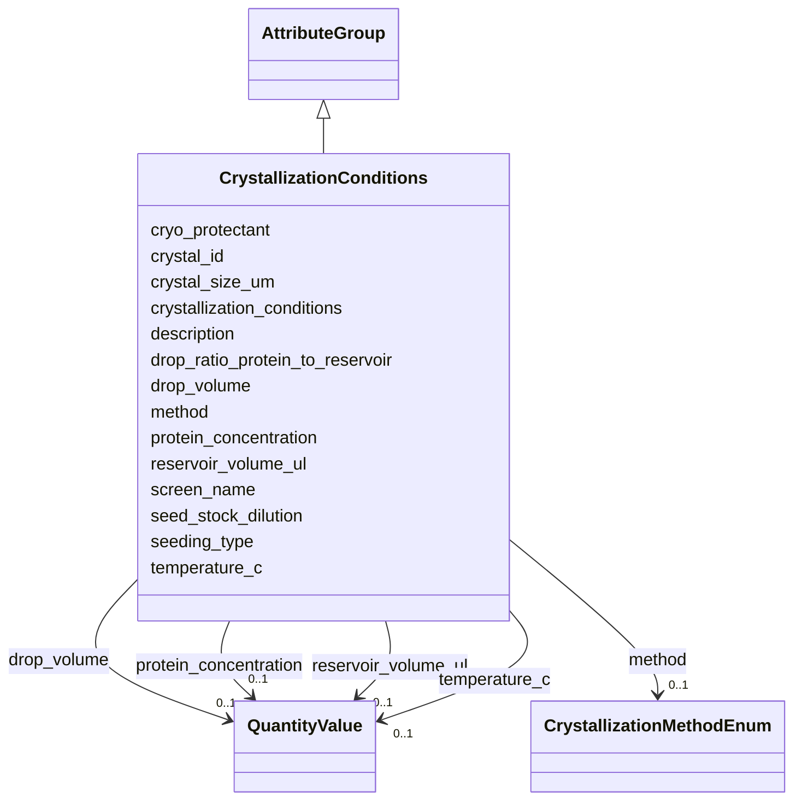

# Class: CrystallizationConditions 


_Crystal growth conditions for X-ray crystallography (NSLS2 Crystallization mapping)_


URI: [lambda:CrystallizationConditions](http://w3id.org/lambda/CrystallizationConditions)





## Inheritance
* [AttributeGroup](AttributeGroup.md)
    * **CrystallizationConditions**


## Slots

| Name | Cardinality and Range | Description | Inheritance |
| ---  | --- | --- | --- |
| [method](method.md) | 0..1 <br/> [CrystallizationMethodEnum](CrystallizationMethodEnum.md) | Crystallization method used | direct |
| [crystallization_conditions](crystallization_conditions.md) | 0..1 <br/> [String](String.md) | Complete description of crystallization conditions including precipitant, pH,... | direct |
| [drop_volume](drop_volume.md) | 0..1 <br/> [QuantityValue](QuantityValue.md) | Total drop volume, typically specified in nanoliters | direct |
| [protein_concentration](protein_concentration.md) | 0..1 <br/> [QuantityValue](QuantityValue.md) | Protein concentration for crystallization in mg/mL | direct |
| [crystal_size_um](crystal_size_um.md) | 0..1 <br/> [String](String.md) | Crystal dimensions in micrometers (length x width x height) | direct |
| [cryo_protectant](cryo_protectant.md) | 0..1 <br/> [String](String.md) | Cryoprotectant used for crystal cooling | direct |
| [crystal_id](crystal_id.md) | 0..1 <br/> [String](String.md) | Identifier for the specific crystal used | direct |
| [screen_name](screen_name.md) | 0..1 <br/> [String](String.md) | Name of crystallization screen used | direct |
| [temperature_c](temperature_c.md) | 0..1 <br/> [QuantityValue](QuantityValue.md) | Crystallization temperature, typically specified in degrees Celsius | direct |
| [drop_ratio_protein_to_reservoir](drop_ratio_protein_to_reservoir.md) | 0..1 <br/> [String](String.md) | Ratio of protein to reservoir solution in drop (e | direct |
| [reservoir_volume_ul](reservoir_volume_ul.md) | 0..1 <br/> [QuantityValue](QuantityValue.md) | Reservoir volume, typically specified in microliters | direct |
| [seeding_type](seeding_type.md) | 0..1 <br/> [String](String.md) | Type of seeding used (micro, macro, streak) | direct |
| [seed_stock_dilution](seed_stock_dilution.md) | 0..1 <br/> [String](String.md) | Dilution factor for seed stock | direct |
| [description](description.md) | 0..1 <br/> [String](String.md) |  | [AttributeGroup](AttributeGroup.md) |


## Usages

| used by | used in | type | used |
| ---  | --- | --- | --- |
| [XRayPreparation](XRayPreparation.md) | [crystallization_conditions](crystallization_conditions.md) | range | [CrystallizationConditions](CrystallizationConditions.md) |


## Identifier and Mapping Information


### Schema Source


* from schema: http://w3id.org/lambda/


## Mappings

| Mapping Type | Mapped Value |
| ---  | ---  |
| self | lambda:CrystallizationConditions |
| native | lambda:CrystallizationConditions |


## LinkML Source

<!-- TODO: investigate https://stackoverflow.com/questions/37606292/how-to-create-tabbed-code-blocks-in-mkdocs-or-sphinx -->

### Direct

<details>
```yaml
name: CrystallizationConditions
description: Crystal growth conditions for X-ray crystallography (NSLS2 Crystallization
  mapping)
from_schema: http://w3id.org/lambda/
is_a: AttributeGroup
attributes:
  method:
    name: method
    description: Crystallization method used
    from_schema: http://w3id.org/lambda/
    exact_mappings:
    - nsls2:Method
    - mmCIF:_exptl_crystal_grow.method
    rank: 1000
    domain_of:
    - CrystallizationConditions
    range: CrystallizationMethodEnum
  crystallization_conditions:
    name: crystallization_conditions
    description: Complete description of crystallization conditions including precipitant,
      pH, salts
    from_schema: http://w3id.org/lambda/
    exact_mappings:
    - nsls2:Conditions
    - mmCIF:_exptl_crystal_grow.pdbx_details
    rank: 1000
    domain_of:
    - CrystallizationConditions
    - XRayPreparation
    range: string
  drop_volume:
    name: drop_volume
    description: Total drop volume, typically specified in nanoliters. Data providers
      may specify alternative units by including the unit in the QuantityValue.
    from_schema: http://w3id.org/lambda/
    exact_mappings:
    - nsls2:Drop_Volume
    rank: 1000
    domain_of:
    - CrystallizationConditions
    range: QuantityValue
    inlined: true
  protein_concentration:
    name: protein_concentration
    description: Protein concentration for crystallization in mg/mL
    from_schema: http://w3id.org/lambda/
    rank: 1000
    domain_of:
    - CrystallizationConditions
    range: QuantityValue
    inlined: true
  crystal_size_um:
    name: crystal_size_um
    description: Crystal dimensions in micrometers (length x width x height)
    from_schema: http://w3id.org/lambda/
    exact_mappings:
    - nsls2:Crystal_Size
    rank: 1000
    domain_of:
    - CrystallizationConditions
    - XRayPreparation
    range: string
  cryo_protectant:
    name: cryo_protectant
    description: Cryoprotectant used for crystal cooling
    from_schema: http://w3id.org/lambda/
    exact_mappings:
    - nsls2:Cryo_Protectant
    rank: 1000
    domain_of:
    - CrystallizationConditions
    range: string
  crystal_id:
    name: crystal_id
    description: Identifier for the specific crystal used
    from_schema: http://w3id.org/lambda/
    exact_mappings:
    - nsls2:Crystal_ID
    rank: 1000
    domain_of:
    - CrystallizationConditions
    range: string
  screen_name:
    name: screen_name
    description: Name of crystallization screen used
    from_schema: http://w3id.org/lambda/
    rank: 1000
    domain_of:
    - CrystallizationConditions
    - XRayPreparation
  temperature_c:
    name: temperature_c
    description: Crystallization temperature, typically specified in degrees Celsius.
      Data providers may specify alternative units by including the unit in the QuantityValue.
    from_schema: http://w3id.org/lambda/
    rank: 1000
    domain_of:
    - CrystallizationConditions
    - XRayPreparation
    range: QuantityValue
    inlined: true
  drop_ratio_protein_to_reservoir:
    name: drop_ratio_protein_to_reservoir
    description: Ratio of protein to reservoir solution in drop (e.g., 1:1, 2:1)
    from_schema: http://w3id.org/lambda/
    rank: 1000
    domain_of:
    - CrystallizationConditions
    - XRayPreparation
  reservoir_volume_ul:
    name: reservoir_volume_ul
    description: Reservoir volume, typically specified in microliters. Data providers
      may specify alternative units by including the unit in the QuantityValue.
    from_schema: http://w3id.org/lambda/
    rank: 1000
    domain_of:
    - CrystallizationConditions
    - XRayPreparation
    range: QuantityValue
    inlined: true
  seeding_type:
    name: seeding_type
    description: Type of seeding used (micro, macro, streak)
    from_schema: http://w3id.org/lambda/
    rank: 1000
    domain_of:
    - CrystallizationConditions
    - XRayPreparation
  seed_stock_dilution:
    name: seed_stock_dilution
    description: Dilution factor for seed stock
    from_schema: http://w3id.org/lambda/
    rank: 1000
    domain_of:
    - CrystallizationConditions
    - XRayPreparation

```
</details>

### Induced

<details>
```yaml
name: CrystallizationConditions
description: Crystal growth conditions for X-ray crystallography (NSLS2 Crystallization
  mapping)
from_schema: http://w3id.org/lambda/
is_a: AttributeGroup
attributes:
  method:
    name: method
    description: Crystallization method used
    from_schema: http://w3id.org/lambda/
    exact_mappings:
    - nsls2:Method
    - mmCIF:_exptl_crystal_grow.method
    rank: 1000
    alias: method
    owner: CrystallizationConditions
    domain_of:
    - CrystallizationConditions
    range: CrystallizationMethodEnum
  crystallization_conditions:
    name: crystallization_conditions
    description: Complete description of crystallization conditions including precipitant,
      pH, salts
    from_schema: http://w3id.org/lambda/
    exact_mappings:
    - nsls2:Conditions
    - mmCIF:_exptl_crystal_grow.pdbx_details
    rank: 1000
    alias: crystallization_conditions
    owner: CrystallizationConditions
    domain_of:
    - CrystallizationConditions
    - XRayPreparation
    range: string
  drop_volume:
    name: drop_volume
    description: Total drop volume, typically specified in nanoliters. Data providers
      may specify alternative units by including the unit in the QuantityValue.
    from_schema: http://w3id.org/lambda/
    exact_mappings:
    - nsls2:Drop_Volume
    rank: 1000
    alias: drop_volume
    owner: CrystallizationConditions
    domain_of:
    - CrystallizationConditions
    range: QuantityValue
    inlined: true
  protein_concentration:
    name: protein_concentration
    description: Protein concentration for crystallization in mg/mL
    from_schema: http://w3id.org/lambda/
    rank: 1000
    alias: protein_concentration
    owner: CrystallizationConditions
    domain_of:
    - CrystallizationConditions
    range: QuantityValue
    inlined: true
  crystal_size_um:
    name: crystal_size_um
    description: Crystal dimensions in micrometers (length x width x height)
    from_schema: http://w3id.org/lambda/
    exact_mappings:
    - nsls2:Crystal_Size
    rank: 1000
    alias: crystal_size_um
    owner: CrystallizationConditions
    domain_of:
    - CrystallizationConditions
    - XRayPreparation
    range: string
  cryo_protectant:
    name: cryo_protectant
    description: Cryoprotectant used for crystal cooling
    from_schema: http://w3id.org/lambda/
    exact_mappings:
    - nsls2:Cryo_Protectant
    rank: 1000
    alias: cryo_protectant
    owner: CrystallizationConditions
    domain_of:
    - CrystallizationConditions
    range: string
  crystal_id:
    name: crystal_id
    description: Identifier for the specific crystal used
    from_schema: http://w3id.org/lambda/
    exact_mappings:
    - nsls2:Crystal_ID
    rank: 1000
    alias: crystal_id
    owner: CrystallizationConditions
    domain_of:
    - CrystallizationConditions
    range: string
  screen_name:
    name: screen_name
    description: Name of crystallization screen used
    from_schema: http://w3id.org/lambda/
    rank: 1000
    alias: screen_name
    owner: CrystallizationConditions
    domain_of:
    - CrystallizationConditions
    - XRayPreparation
    range: string
  temperature_c:
    name: temperature_c
    description: Crystallization temperature, typically specified in degrees Celsius.
      Data providers may specify alternative units by including the unit in the QuantityValue.
    from_schema: http://w3id.org/lambda/
    rank: 1000
    alias: temperature_c
    owner: CrystallizationConditions
    domain_of:
    - CrystallizationConditions
    - XRayPreparation
    range: QuantityValue
    inlined: true
  drop_ratio_protein_to_reservoir:
    name: drop_ratio_protein_to_reservoir
    description: Ratio of protein to reservoir solution in drop (e.g., 1:1, 2:1)
    from_schema: http://w3id.org/lambda/
    rank: 1000
    alias: drop_ratio_protein_to_reservoir
    owner: CrystallizationConditions
    domain_of:
    - CrystallizationConditions
    - XRayPreparation
    range: string
  reservoir_volume_ul:
    name: reservoir_volume_ul
    description: Reservoir volume, typically specified in microliters. Data providers
      may specify alternative units by including the unit in the QuantityValue.
    from_schema: http://w3id.org/lambda/
    rank: 1000
    alias: reservoir_volume_ul
    owner: CrystallizationConditions
    domain_of:
    - CrystallizationConditions
    - XRayPreparation
    range: QuantityValue
    inlined: true
  seeding_type:
    name: seeding_type
    description: Type of seeding used (micro, macro, streak)
    from_schema: http://w3id.org/lambda/
    rank: 1000
    alias: seeding_type
    owner: CrystallizationConditions
    domain_of:
    - CrystallizationConditions
    - XRayPreparation
    range: string
  seed_stock_dilution:
    name: seed_stock_dilution
    description: Dilution factor for seed stock
    from_schema: http://w3id.org/lambda/
    rank: 1000
    alias: seed_stock_dilution
    owner: CrystallizationConditions
    domain_of:
    - CrystallizationConditions
    - XRayPreparation
    range: string
  description:
    name: description
    from_schema: http://w3id.org/lambda/
    alias: description
    owner: CrystallizationConditions
    domain_of:
    - NamedThing
    - AttributeGroup
    range: string

```
</details>