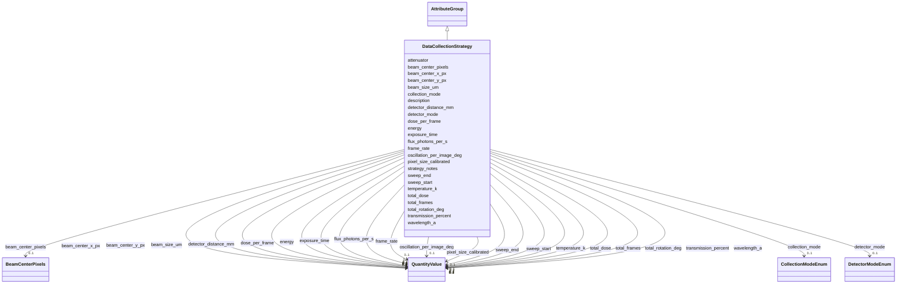

# Class: DataCollectionStrategy 


_Strategy for data collection_


URI: [lambda:DataCollectionStrategy](http://w3id.org/lambda/DataCollectionStrategy)



```mermaid
 classDiagram
    class DataCollectionStrategy
    click DataCollectionStrategy href "../DataCollectionStrategy/"
      AttributeGroup <|-- DataCollectionStrategy
        click AttributeGroup href "../AttributeGroup/"
      
      DataCollectionStrategy : attenuator
        
      DataCollectionStrategy : beam_center_pixels
        
          
    
        
        
        DataCollectionStrategy --> "0..1" BeamCenterPixels : beam_center_pixels
        click BeamCenterPixels href "../BeamCenterPixels/"
    

        
      DataCollectionStrategy : beam_center_x_px
        
          
    
        
        
        DataCollectionStrategy --> "0..1" QuantityValue : beam_center_x_px
        click QuantityValue href "../QuantityValue/"
    

        
      DataCollectionStrategy : beam_center_y_px
        
          
    
        
        
        DataCollectionStrategy --> "0..1" QuantityValue : beam_center_y_px
        click QuantityValue href "../QuantityValue/"
    

        
      DataCollectionStrategy : beam_size_um
        
          
    
        
        
        DataCollectionStrategy --> "0..1" QuantityValue : beam_size_um
        click QuantityValue href "../QuantityValue/"
    

        
      DataCollectionStrategy : collection_mode
        
          
    
        
        
        DataCollectionStrategy --> "0..1" CollectionModeEnum : collection_mode
        click CollectionModeEnum href "../CollectionModeEnum/"
    

        
      DataCollectionStrategy : description
        
      DataCollectionStrategy : detector_distance_mm
        
          
    
        
        
        DataCollectionStrategy --> "0..1" QuantityValue : detector_distance_mm
        click QuantityValue href "../QuantityValue/"
    

        
      DataCollectionStrategy : detector_mode
        
          
    
        
        
        DataCollectionStrategy --> "0..1" DetectorModeEnum : detector_mode
        click DetectorModeEnum href "../DetectorModeEnum/"
    

        
      DataCollectionStrategy : dose_per_frame
        
          
    
        
        
        DataCollectionStrategy --> "0..1" QuantityValue : dose_per_frame
        click QuantityValue href "../QuantityValue/"
    

        
      DataCollectionStrategy : energy
        
          
    
        
        
        DataCollectionStrategy --> "0..1" QuantityValue : energy
        click QuantityValue href "../QuantityValue/"
    

        
      DataCollectionStrategy : exposure_time
        
          
    
        
        
        DataCollectionStrategy --> "0..1" QuantityValue : exposure_time
        click QuantityValue href "../QuantityValue/"
    

        
      DataCollectionStrategy : flux_photons_per_s
        
          
    
        
        
        DataCollectionStrategy --> "0..1" QuantityValue : flux_photons_per_s
        click QuantityValue href "../QuantityValue/"
    

        
      DataCollectionStrategy : frame_rate
        
          
    
        
        
        DataCollectionStrategy --> "0..1" QuantityValue : frame_rate
        click QuantityValue href "../QuantityValue/"
    

        
      DataCollectionStrategy : oscillation_per_image_deg
        
          
    
        
        
        DataCollectionStrategy --> "0..1" QuantityValue : oscillation_per_image_deg
        click QuantityValue href "../QuantityValue/"
    

        
      DataCollectionStrategy : pixel_size_calibrated
        
          
    
        
        
        DataCollectionStrategy --> "0..1" QuantityValue : pixel_size_calibrated
        click QuantityValue href "../QuantityValue/"
    

        
      DataCollectionStrategy : strategy_notes
        
      DataCollectionStrategy : sweep_end
        
          
    
        
        
        DataCollectionStrategy --> "0..1" QuantityValue : sweep_end
        click QuantityValue href "../QuantityValue/"
    

        
      DataCollectionStrategy : sweep_start
        
          
    
        
        
        DataCollectionStrategy --> "0..1" QuantityValue : sweep_start
        click QuantityValue href "../QuantityValue/"
    

        
      DataCollectionStrategy : temperature_k
        
          
    
        
        
        DataCollectionStrategy --> "0..1" QuantityValue : temperature_k
        click QuantityValue href "../QuantityValue/"
    

        
      DataCollectionStrategy : total_dose
        
          
    
        
        
        DataCollectionStrategy --> "0..1" QuantityValue : total_dose
        click QuantityValue href "../QuantityValue/"
    

        
      DataCollectionStrategy : total_frames
        
          
    
        
        
        DataCollectionStrategy --> "0..1" QuantityValue : total_frames
        click QuantityValue href "../QuantityValue/"
    

        
      DataCollectionStrategy : total_rotation_deg
        
          
    
        
        
        DataCollectionStrategy --> "0..1" QuantityValue : total_rotation_deg
        click QuantityValue href "../QuantityValue/"
    

        
      DataCollectionStrategy : transmission_percent
        
          
    
        
        
        DataCollectionStrategy --> "0..1" QuantityValue : transmission_percent
        click QuantityValue href "../QuantityValue/"
    

        
      DataCollectionStrategy : wavelength_a
        
          
    
        
        
        DataCollectionStrategy --> "0..1" QuantityValue : wavelength_a
        click QuantityValue href "../QuantityValue/"
    

        
      
```


## Inheritance
* [AttributeGroup](AttributeGroup.md)
    * **DataCollectionStrategy**


## Slots

| Name | Cardinality and Range | Description | Inheritance |
| ---  | --- | --- | --- |
| [collection_mode](collection_mode.md) | 0..1 <br/> [CollectionModeEnum](CollectionModeEnum.md) | Mode of data collection | direct |
| [total_frames](total_frames.md) | 0..1 <br/> [QuantityValue](QuantityValue.md) | Total number of frames/images | direct |
| [frame_rate](frame_rate.md) | 0..1 <br/> [QuantityValue](QuantityValue.md) | Frame rate, typically specified in frames per second | direct |
| [total_dose](total_dose.md) | 0..1 <br/> [QuantityValue](QuantityValue.md) | Total electron dose for cryo-EM, typically specified in electrons per Angstro... | direct |
| [dose_per_frame](dose_per_frame.md) | 0..1 <br/> [QuantityValue](QuantityValue.md) | Dose per frame, typically specified in electrons per Angstrom squared (e⁻/Ų) | direct |
| [wavelength_a](wavelength_a.md) | 0..1 <br/> [QuantityValue](QuantityValue.md) | X-ray wavelength, typically specified in Angstroms | direct |
| [detector_mode](detector_mode.md) | 0..1 <br/> [DetectorModeEnum](DetectorModeEnum.md) | Detector operating mode used during this experiment | direct |
| [pixel_size_calibrated](pixel_size_calibrated.md) | 0..1 <br/> [QuantityValue](QuantityValue.md) | Calibrated pixel size for this experiment, typically specified in Angstroms (... | direct |
| [detector_distance_mm](detector_distance_mm.md) | 0..1 <br/> [QuantityValue](QuantityValue.md) | Detector distance, typically specified in millimeters | direct |
| [beam_center_x_px](beam_center_x_px.md) | 0..1 <br/> [QuantityValue](QuantityValue.md) | Beam center X coordinate in pixels | direct |
| [beam_center_y_px](beam_center_y_px.md) | 0..1 <br/> [QuantityValue](QuantityValue.md) | Beam center Y coordinate in pixels | direct |
| [beam_center_pixels](beam_center_pixels.md) | 0..1 <br/> [BeamCenterPixels](BeamCenterPixels.md) | Combined beam center pixel coordinates as reported by systems such as NSLS-II... | direct |
| [beam_size_um](beam_size_um.md) | 0..1 <br/> [QuantityValue](QuantityValue.md) | Beam size, typically specified in micrometers | direct |
| [energy](energy.md) | 0..1 <br/> [QuantityValue](QuantityValue.md) | X-ray beam energy for this data collection strategy | direct |
| [flux_photons_per_s](flux_photons_per_s.md) | 0..1 <br/> [QuantityValue](QuantityValue.md) | Photon flux, typically specified in photons per second | direct |
| [transmission_percent](transmission_percent.md) | 0..1 <br/> [QuantityValue](QuantityValue.md) | Beam transmission, typically specified as a percentage (0-100) | direct |
| [attenuator](attenuator.md) | 0..1 <br/> [String](String.md) | Attenuator setting used | direct |
| [temperature_k](temperature_k.md) | 0..1 <br/> [QuantityValue](QuantityValue.md) | Data collection temperature, typically specified in Kelvin | direct |
| [oscillation_per_image_deg](oscillation_per_image_deg.md) | 0..1 <br/> [QuantityValue](QuantityValue.md) | Oscillation angle per image, typically specified in degrees | direct |
| [sweep_start](sweep_start.md) | 0..1 <br/> [QuantityValue](QuantityValue.md) | Starting angle of an X-ray oscillation sweep, typically specified in degrees | direct |
| [sweep_end](sweep_end.md) | 0..1 <br/> [QuantityValue](QuantityValue.md) | Ending angle of an X-ray oscillation sweep, typically specified in degrees | direct |
| [total_rotation_deg](total_rotation_deg.md) | 0..1 <br/> [QuantityValue](QuantityValue.md) | Total rotation range, typically specified in degrees | direct |
| [exposure_time](exposure_time.md) | 0..1 <br/> [QuantityValue](QuantityValue.md) | Exposure time per image, typically specified in seconds | direct |
| [strategy_notes](strategy_notes.md) | 0..1 <br/> [String](String.md) | Notes about data collection strategy | direct |
| [description](description.md) | 0..1 <br/> [String](String.md) |  | [AttributeGroup](AttributeGroup.md) |


## Usages

| used by | used in | type | used |
| ---  | --- | --- | --- |
| [ExperimentRun](ExperimentRun.md) | [data_collection_strategy](data_collection_strategy.md) | range | [DataCollectionStrategy](DataCollectionStrategy.md) |


## Identifier and Mapping Information


### Schema Source


* from schema: http://w3id.org/lambda/


## Mappings

| Mapping Type | Mapped Value |
| ---  | ---  |
| self | lambda:DataCollectionStrategy |
| native | lambda:DataCollectionStrategy |


## LinkML Source

<!-- TODO: investigate https://stackoverflow.com/questions/37606292/how-to-create-tabbed-code-blocks-in-mkdocs-or-sphinx -->

### Direct

<details>
```yaml
name: DataCollectionStrategy
description: Strategy for data collection
from_schema: http://w3id.org/lambda/
is_a: AttributeGroup
attributes:
  collection_mode:
    name: collection_mode
    description: Mode of data collection
    from_schema: http://w3id.org/lambda/
    rank: 1000
    domain_of:
    - DataCollectionStrategy
    range: CollectionModeEnum
  total_frames:
    name: total_frames
    description: Total number of frames/images
    from_schema: http://w3id.org/lambda/
    rank: 1000
    domain_of:
    - DataCollectionStrategy
    range: QuantityValue
    inlined: true
  frame_rate:
    name: frame_rate
    description: Frame rate, typically specified in frames per second. Data providers
      may specify alternative units by including the unit in the QuantityValue.
    from_schema: http://w3id.org/lambda/
    rank: 1000
    domain_of:
    - DataCollectionStrategy
    range: QuantityValue
    inlined: true
  total_dose:
    name: total_dose
    description: Total electron dose for cryo-EM, typically specified in electrons
      per Angstrom squared (e⁻/Ų). Data providers may specify alternative units by
      including the unit in the QuantityValue.
    from_schema: http://w3id.org/lambda/
    domain_of:
    - ExperimentRun
    - DataCollectionStrategy
    range: QuantityValue
    inlined: true
  dose_per_frame:
    name: dose_per_frame
    description: Dose per frame, typically specified in electrons per Angstrom squared
      (e⁻/Ų). Data providers may specify alternative units by including the unit
      in the QuantityValue.
    from_schema: http://w3id.org/lambda/
    domain_of:
    - Movie
    - DataCollectionStrategy
    range: QuantityValue
    inlined: true
  wavelength_a:
    name: wavelength_a
    description: X-ray wavelength, typically specified in Angstroms. Data providers
      may specify alternative units by including the unit in the QuantityValue.
    from_schema: http://w3id.org/lambda/
    aliases:
    - wavelength
    exact_mappings:
    - mmCIF:_diffrn_radiation_wavelength.wavelength
    rank: 1000
    domain_of:
    - DataCollectionStrategy
    range: QuantityValue
    inlined: true
  detector_mode:
    name: detector_mode
    description: Detector operating mode used during this experiment
    comments:
    - 'For cryo-EM: counting, integrating, or super_resolution'
    - Detector technology, manufacturer, and model are specified in the Instrument
    from_schema: http://w3id.org/lambda/
    domain_of:
    - CryoEMInstrument
    - DataCollectionStrategy
    range: DetectorModeEnum
  pixel_size_calibrated:
    name: pixel_size_calibrated
    description: Calibrated pixel size for this experiment, typically specified in
      Angstroms (Å) per pixel. Data providers may specify alternative units by including
      the unit in the QuantityValue.
    comments:
    - 'For cryo-EM: depends on magnification (Å/pixel)'
    - 'For X-ray: typically mm/pixel or µm/pixel'
    - Physical pixel size is hardware spec stored in Instrument
    from_schema: http://w3id.org/lambda/
    exact_mappings:
    - mmCIF:_em_image_recording.calibrated_pixel_size
    rank: 1000
    domain_of:
    - DataCollectionStrategy
    range: QuantityValue
    inlined: true
  detector_distance_mm:
    name: detector_distance_mm
    description: Detector distance, typically specified in millimeters. Data providers
      may specify alternative units by including the unit in the QuantityValue.
    from_schema: http://w3id.org/lambda/
    aliases:
    - detector_distance
    exact_mappings:
    - mmCIF:_diffrn_detector.distance
    rank: 1000
    domain_of:
    - DataCollectionStrategy
    range: QuantityValue
    inlined: true
  beam_center_x_px:
    name: beam_center_x_px
    description: Beam center X coordinate in pixels
    from_schema: http://w3id.org/lambda/
    exact_mappings:
    - mmCIF:_diffrn_detector.beam_center_x
    rank: 1000
    domain_of:
    - DataCollectionStrategy
    range: QuantityValue
    inlined: true
  beam_center_y_px:
    name: beam_center_y_px
    description: Beam center Y coordinate in pixels
    from_schema: http://w3id.org/lambda/
    exact_mappings:
    - mmCIF:_diffrn_detector.beam_center_y
    rank: 1000
    domain_of:
    - DataCollectionStrategy
    range: QuantityValue
    inlined: true
  beam_center_pixels:
    name: beam_center_pixels
    description: Combined beam center pixel coordinates as reported by systems such
      as NSLS-II AMX. Use beam_center_x_px and beam_center_y_px when coordinates are
      represented as separate strategy values.
    from_schema: http://w3id.org/lambda/
    aliases:
    - beam_center
    domain_of:
    - ExperimentRun
    - DataCollectionStrategy
    range: BeamCenterPixels
    inlined: true
  beam_size_um:
    name: beam_size_um
    description: Beam size, typically specified in micrometers. Data providers may
      specify alternative units by including the unit in the QuantityValue.
    from_schema: http://w3id.org/lambda/
    rank: 1000
    domain_of:
    - DataCollectionStrategy
    range: QuantityValue
    inlined: true
  energy:
    name: energy
    description: X-ray beam energy for this data collection strategy. Data providers
      may specify eV, keV, or another appropriate energy unit in the QuantityValue.
    from_schema: http://w3id.org/lambda/
    aliases:
    - beam_energy
    exact_mappings:
    - nsls2:Energy
    domain_of:
    - SANSSource
    - ExperimentRun
    - DataCollectionStrategy
    range: QuantityValue
    inlined: true
  flux_photons_per_s:
    name: flux_photons_per_s
    description: Photon flux, typically specified in photons per second. Data providers
      may specify alternative units by including the unit in the QuantityValue.
    from_schema: http://w3id.org/lambda/
    exact_mappings:
    - mmCIF:_diffrn_source.pdbx_flux
    rank: 1000
    domain_of:
    - DataCollectionStrategy
    range: QuantityValue
    inlined: true
  transmission_percent:
    name: transmission_percent
    description: Beam transmission, typically specified as a percentage (0-100). Data
      providers may specify as decimal fraction by including the unit in the QuantityValue.
    from_schema: http://w3id.org/lambda/
    aliases:
    - attenuation
    rank: 1000
    domain_of:
    - DataCollectionStrategy
    range: QuantityValue
    inlined: true
  attenuator:
    name: attenuator
    description: Attenuator setting used
    from_schema: http://w3id.org/lambda/
    domain_of:
    - SANSConfiguration
    - DataCollectionStrategy
  temperature_k:
    name: temperature_k
    description: Data collection temperature, typically specified in Kelvin. Data
      providers may specify alternative units by including the unit in the QuantityValue.
    from_schema: http://w3id.org/lambda/
    exact_mappings:
    - mmCIF:_diffrn.ambient_temp
    rank: 1000
    domain_of:
    - DataCollectionStrategy
    range: QuantityValue
    inlined: true
  oscillation_per_image_deg:
    name: oscillation_per_image_deg
    description: Oscillation angle per image, typically specified in degrees. Data
      providers may specify alternative units by including the unit in the QuantityValue.
    from_schema: http://w3id.org/lambda/
    aliases:
    - oscillation_width
    exact_mappings:
    - mmCIF:_diffrn_scan.angle_increment
    rank: 1000
    domain_of:
    - DataCollectionStrategy
    range: QuantityValue
    inlined: true
  sweep_start:
    name: sweep_start
    description: Starting angle of an X-ray oscillation sweep, typically specified
      in degrees.
    from_schema: http://w3id.org/lambda/
    exact_mappings:
    - mmCIF:_diffrn_scan_axis.angle_start
    domain_of:
    - ExperimentRun
    - DataCollectionStrategy
    range: QuantityValue
    inlined: true
  sweep_end:
    name: sweep_end
    description: Ending angle of an X-ray oscillation sweep, typically specified in
      degrees.
    from_schema: http://w3id.org/lambda/
    domain_of:
    - ExperimentRun
    - DataCollectionStrategy
    range: QuantityValue
    inlined: true
  total_rotation_deg:
    name: total_rotation_deg
    description: Total rotation range, typically specified in degrees. Data providers
      may specify alternative units by including the unit in the QuantityValue.
    from_schema: http://w3id.org/lambda/
    exact_mappings:
    - mmCIF:_diffrn_scan_axis.angle_range
    rank: 1000
    domain_of:
    - DataCollectionStrategy
    range: QuantityValue
    inlined: true
  exposure_time:
    name: exposure_time
    description: Exposure time per image, typically specified in seconds. Data providers
      may specify alternative units by including the unit in the QuantityValue.
    from_schema: http://w3id.org/lambda/
    exact_mappings:
    - nsls2:Exposure_time
    - ispyb:DataCollection.exposureTime
    domain_of:
    - ExperimentRun
    - Image
    - ExperimentalConditions
    - DataCollectionStrategy
    range: QuantityValue
    inlined: true
  strategy_notes:
    name: strategy_notes
    description: Notes about data collection strategy
    from_schema: http://w3id.org/lambda/
    rank: 1000
    domain_of:
    - DataCollectionStrategy

```
</details>

### Induced

<details>
```yaml
name: DataCollectionStrategy
description: Strategy for data collection
from_schema: http://w3id.org/lambda/
is_a: AttributeGroup
attributes:
  collection_mode:
    name: collection_mode
    description: Mode of data collection
    from_schema: http://w3id.org/lambda/
    rank: 1000
    alias: collection_mode
    owner: DataCollectionStrategy
    domain_of:
    - DataCollectionStrategy
    range: CollectionModeEnum
  total_frames:
    name: total_frames
    description: Total number of frames/images
    from_schema: http://w3id.org/lambda/
    rank: 1000
    alias: total_frames
    owner: DataCollectionStrategy
    domain_of:
    - DataCollectionStrategy
    range: QuantityValue
    inlined: true
  frame_rate:
    name: frame_rate
    description: Frame rate, typically specified in frames per second. Data providers
      may specify alternative units by including the unit in the QuantityValue.
    from_schema: http://w3id.org/lambda/
    rank: 1000
    alias: frame_rate
    owner: DataCollectionStrategy
    domain_of:
    - DataCollectionStrategy
    range: QuantityValue
    inlined: true
  total_dose:
    name: total_dose
    description: Total electron dose for cryo-EM, typically specified in electrons
      per Angstrom squared (e⁻/Ų). Data providers may specify alternative units by
      including the unit in the QuantityValue.
    from_schema: http://w3id.org/lambda/
    alias: total_dose
    owner: DataCollectionStrategy
    domain_of:
    - ExperimentRun
    - DataCollectionStrategy
    range: QuantityValue
    inlined: true
  dose_per_frame:
    name: dose_per_frame
    description: Dose per frame, typically specified in electrons per Angstrom squared
      (e⁻/Ų). Data providers may specify alternative units by including the unit
      in the QuantityValue.
    from_schema: http://w3id.org/lambda/
    alias: dose_per_frame
    owner: DataCollectionStrategy
    domain_of:
    - Movie
    - DataCollectionStrategy
    range: QuantityValue
    inlined: true
  wavelength_a:
    name: wavelength_a
    description: X-ray wavelength, typically specified in Angstroms. Data providers
      may specify alternative units by including the unit in the QuantityValue.
    from_schema: http://w3id.org/lambda/
    aliases:
    - wavelength
    exact_mappings:
    - mmCIF:_diffrn_radiation_wavelength.wavelength
    rank: 1000
    alias: wavelength_a
    owner: DataCollectionStrategy
    domain_of:
    - DataCollectionStrategy
    range: QuantityValue
    inlined: true
  detector_mode:
    name: detector_mode
    description: Detector operating mode used during this experiment
    comments:
    - 'For cryo-EM: counting, integrating, or super_resolution'
    - Detector technology, manufacturer, and model are specified in the Instrument
    from_schema: http://w3id.org/lambda/
    alias: detector_mode
    owner: DataCollectionStrategy
    domain_of:
    - CryoEMInstrument
    - DataCollectionStrategy
    range: DetectorModeEnum
  pixel_size_calibrated:
    name: pixel_size_calibrated
    description: Calibrated pixel size for this experiment, typically specified in
      Angstroms (Å) per pixel. Data providers may specify alternative units by including
      the unit in the QuantityValue.
    comments:
    - 'For cryo-EM: depends on magnification (Å/pixel)'
    - 'For X-ray: typically mm/pixel or µm/pixel'
    - Physical pixel size is hardware spec stored in Instrument
    from_schema: http://w3id.org/lambda/
    exact_mappings:
    - mmCIF:_em_image_recording.calibrated_pixel_size
    rank: 1000
    alias: pixel_size_calibrated
    owner: DataCollectionStrategy
    domain_of:
    - DataCollectionStrategy
    range: QuantityValue
    inlined: true
  detector_distance_mm:
    name: detector_distance_mm
    description: Detector distance, typically specified in millimeters. Data providers
      may specify alternative units by including the unit in the QuantityValue.
    from_schema: http://w3id.org/lambda/
    aliases:
    - detector_distance
    exact_mappings:
    - mmCIF:_diffrn_detector.distance
    rank: 1000
    alias: detector_distance_mm
    owner: DataCollectionStrategy
    domain_of:
    - DataCollectionStrategy
    range: QuantityValue
    inlined: true
  beam_center_x_px:
    name: beam_center_x_px
    description: Beam center X coordinate in pixels
    from_schema: http://w3id.org/lambda/
    exact_mappings:
    - mmCIF:_diffrn_detector.beam_center_x
    rank: 1000
    alias: beam_center_x_px
    owner: DataCollectionStrategy
    domain_of:
    - DataCollectionStrategy
    range: QuantityValue
    inlined: true
  beam_center_y_px:
    name: beam_center_y_px
    description: Beam center Y coordinate in pixels
    from_schema: http://w3id.org/lambda/
    exact_mappings:
    - mmCIF:_diffrn_detector.beam_center_y
    rank: 1000
    alias: beam_center_y_px
    owner: DataCollectionStrategy
    domain_of:
    - DataCollectionStrategy
    range: QuantityValue
    inlined: true
  beam_center_pixels:
    name: beam_center_pixels
    description: Combined beam center pixel coordinates as reported by systems such
      as NSLS-II AMX. Use beam_center_x_px and beam_center_y_px when coordinates are
      represented as separate strategy values.
    from_schema: http://w3id.org/lambda/
    aliases:
    - beam_center
    alias: beam_center_pixels
    owner: DataCollectionStrategy
    domain_of:
    - ExperimentRun
    - DataCollectionStrategy
    range: BeamCenterPixels
    inlined: true
  beam_size_um:
    name: beam_size_um
    description: Beam size, typically specified in micrometers. Data providers may
      specify alternative units by including the unit in the QuantityValue.
    from_schema: http://w3id.org/lambda/
    rank: 1000
    alias: beam_size_um
    owner: DataCollectionStrategy
    domain_of:
    - DataCollectionStrategy
    range: QuantityValue
    inlined: true
  energy:
    name: energy
    description: X-ray beam energy for this data collection strategy. Data providers
      may specify eV, keV, or another appropriate energy unit in the QuantityValue.
    from_schema: http://w3id.org/lambda/
    aliases:
    - beam_energy
    exact_mappings:
    - nsls2:Energy
    alias: energy
    owner: DataCollectionStrategy
    domain_of:
    - SANSSource
    - ExperimentRun
    - DataCollectionStrategy
    range: QuantityValue
    inlined: true
  flux_photons_per_s:
    name: flux_photons_per_s
    description: Photon flux, typically specified in photons per second. Data providers
      may specify alternative units by including the unit in the QuantityValue.
    from_schema: http://w3id.org/lambda/
    exact_mappings:
    - mmCIF:_diffrn_source.pdbx_flux
    rank: 1000
    alias: flux_photons_per_s
    owner: DataCollectionStrategy
    domain_of:
    - DataCollectionStrategy
    range: QuantityValue
    inlined: true
  transmission_percent:
    name: transmission_percent
    description: Beam transmission, typically specified as a percentage (0-100). Data
      providers may specify as decimal fraction by including the unit in the QuantityValue.
    from_schema: http://w3id.org/lambda/
    aliases:
    - attenuation
    rank: 1000
    alias: transmission_percent
    owner: DataCollectionStrategy
    domain_of:
    - DataCollectionStrategy
    range: QuantityValue
    inlined: true
  attenuator:
    name: attenuator
    description: Attenuator setting used
    from_schema: http://w3id.org/lambda/
    alias: attenuator
    owner: DataCollectionStrategy
    domain_of:
    - SANSConfiguration
    - DataCollectionStrategy
    range: string
  temperature_k:
    name: temperature_k
    description: Data collection temperature, typically specified in Kelvin. Data
      providers may specify alternative units by including the unit in the QuantityValue.
    from_schema: http://w3id.org/lambda/
    exact_mappings:
    - mmCIF:_diffrn.ambient_temp
    rank: 1000
    alias: temperature_k
    owner: DataCollectionStrategy
    domain_of:
    - DataCollectionStrategy
    range: QuantityValue
    inlined: true
  oscillation_per_image_deg:
    name: oscillation_per_image_deg
    description: Oscillation angle per image, typically specified in degrees. Data
      providers may specify alternative units by including the unit in the QuantityValue.
    from_schema: http://w3id.org/lambda/
    aliases:
    - oscillation_width
    exact_mappings:
    - mmCIF:_diffrn_scan.angle_increment
    rank: 1000
    alias: oscillation_per_image_deg
    owner: DataCollectionStrategy
    domain_of:
    - DataCollectionStrategy
    range: QuantityValue
    inlined: true
  sweep_start:
    name: sweep_start
    description: Starting angle of an X-ray oscillation sweep, typically specified
      in degrees.
    from_schema: http://w3id.org/lambda/
    exact_mappings:
    - mmCIF:_diffrn_scan_axis.angle_start
    alias: sweep_start
    owner: DataCollectionStrategy
    domain_of:
    - ExperimentRun
    - DataCollectionStrategy
    range: QuantityValue
    inlined: true
  sweep_end:
    name: sweep_end
    description: Ending angle of an X-ray oscillation sweep, typically specified in
      degrees.
    from_schema: http://w3id.org/lambda/
    alias: sweep_end
    owner: DataCollectionStrategy
    domain_of:
    - ExperimentRun
    - DataCollectionStrategy
    range: QuantityValue
    inlined: true
  total_rotation_deg:
    name: total_rotation_deg
    description: Total rotation range, typically specified in degrees. Data providers
      may specify alternative units by including the unit in the QuantityValue.
    from_schema: http://w3id.org/lambda/
    exact_mappings:
    - mmCIF:_diffrn_scan_axis.angle_range
    rank: 1000
    alias: total_rotation_deg
    owner: DataCollectionStrategy
    domain_of:
    - DataCollectionStrategy
    range: QuantityValue
    inlined: true
  exposure_time:
    name: exposure_time
    description: Exposure time per image, typically specified in seconds. Data providers
      may specify alternative units by including the unit in the QuantityValue.
    from_schema: http://w3id.org/lambda/
    exact_mappings:
    - nsls2:Exposure_time
    - ispyb:DataCollection.exposureTime
    alias: exposure_time
    owner: DataCollectionStrategy
    domain_of:
    - ExperimentRun
    - Image
    - ExperimentalConditions
    - DataCollectionStrategy
    range: QuantityValue
    inlined: true
  strategy_notes:
    name: strategy_notes
    description: Notes about data collection strategy
    from_schema: http://w3id.org/lambda/
    rank: 1000
    alias: strategy_notes
    owner: DataCollectionStrategy
    domain_of:
    - DataCollectionStrategy
    range: string
  description:
    name: description
    from_schema: http://w3id.org/lambda/
    alias: description
    owner: DataCollectionStrategy
    domain_of:
    - NamedThing
    - AttributeGroup
    range: string

```
</details>