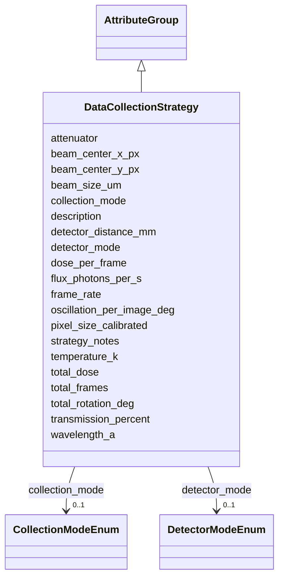

# Class: DataCollectionStrategy 


_Strategy for data collection_


URI: [lambdaber:DataCollectionStrategy](https://w3id.org/lambda-ber-schema/DataCollectionStrategy)





## Inheritance
* [AttributeGroup](AttributeGroup.md)
    * **DataCollectionStrategy**


## Slots

| Name | Cardinality and Range | Description | Inheritance |
| ---  | --- | --- | --- |
| [collection_mode](collection_mode.md) | 0..1 <br/> [CollectionModeEnum](CollectionModeEnum.md) | Mode of data collection | direct |
| [total_frames](total_frames.md) | 0..1 <br/> [Integer](Integer.md) | Total number of frames/images | direct |
| [frame_rate](frame_rate.md) | 0..1 <br/> [Float](Float.md) | Frames per second | direct |
| [total_dose](total_dose.md) | 0..1 <br/> [Float](Float.md) | Total electron dose for cryo-EM | direct |
| [dose_per_frame](dose_per_frame.md) | 0..1 <br/> [Float](Float.md) | Dose per frame | direct |
| [wavelength_a](wavelength_a.md) | 0..1 <br/> [Float](Float.md) | X-ray wavelength in Angstroms | direct |
| [detector_mode](detector_mode.md) | 0..1 <br/> [DetectorModeEnum](DetectorModeEnum.md) | Detector operating mode used during this experiment | direct |
| [pixel_size_calibrated](pixel_size_calibrated.md) | 0..1 <br/> [Float](Float.md) | Calibrated pixel size for this experiment | direct |
| [detector_distance_mm](detector_distance_mm.md) | 0..1 <br/> [Float](Float.md) | Detector distance in millimeters | direct |
| [beam_center_x_px](beam_center_x_px.md) | 0..1 <br/> [Integer](Integer.md) | Beam center X coordinate in pixels | direct |
| [beam_center_y_px](beam_center_y_px.md) | 0..1 <br/> [Integer](Integer.md) | Beam center Y coordinate in pixels | direct |
| [beam_size_um](beam_size_um.md) | 0..1 <br/> [Float](Float.md) | Beam size in micrometers | direct |
| [flux_photons_per_s](flux_photons_per_s.md) | 0..1 <br/> [Float](Float.md) | Photon flux in photons per second | direct |
| [transmission_percent](transmission_percent.md) | 0..1 <br/> [Float](Float.md) | Beam transmission percentage | direct |
| [attenuator](attenuator.md) | 0..1 <br/> [String](String.md) | Attenuator setting used | direct |
| [temperature_k](temperature_k.md) | 0..1 <br/> [Float](Float.md) | Data collection temperature in Kelvin | direct |
| [oscillation_per_image_deg](oscillation_per_image_deg.md) | 0..1 <br/> [Float](Float.md) | Oscillation angle per image in degrees | direct |
| [total_rotation_deg](total_rotation_deg.md) | 0..1 <br/> [Float](Float.md) | Total rotation range in degrees | direct |
| [strategy_notes](strategy_notes.md) | 0..1 <br/> [String](String.md) | Notes about data collection strategy | direct |
| [description](description.md) | 0..1 <br/> [String](String.md) |  | [AttributeGroup](AttributeGroup.md) |


## Usages

| used by | used in | type | used |
| ---  | --- | --- | --- |
| [ExperimentRun](ExperimentRun.md) | [data_collection_strategy](data_collection_strategy.md) | range | [DataCollectionStrategy](DataCollectionStrategy.md) |


## Identifier and Mapping Information


### Schema Source


* from schema: https://w3id.org/lambda-ber-schema/


## Mappings

| Mapping Type | Mapped Value |
| ---  | ---  |
| self | lambdaber:DataCollectionStrategy |
| native | lambdaber:DataCollectionStrategy |


## LinkML Source

<!-- TODO: investigate https://stackoverflow.com/questions/37606292/how-to-create-tabbed-code-blocks-in-mkdocs-or-sphinx -->

### Direct

<details>
```yaml
name: DataCollectionStrategy
description: Strategy for data collection
from_schema: https://w3id.org/lambda-ber-schema/
is_a: AttributeGroup
attributes:
  collection_mode:
    name: collection_mode
    description: Mode of data collection
    from_schema: https://w3id.org/lambda-ber-schema/
    rank: 1000
    domain_of:
    - DataCollectionStrategy
    range: CollectionModeEnum
  total_frames:
    name: total_frames
    description: Total number of frames/images
    from_schema: https://w3id.org/lambda-ber-schema/
    rank: 1000
    domain_of:
    - DataCollectionStrategy
    range: integer
  frame_rate:
    name: frame_rate
    description: Frames per second
    from_schema: https://w3id.org/lambda-ber-schema/
    rank: 1000
    domain_of:
    - DataCollectionStrategy
    range: float
  total_dose:
    name: total_dose
    description: Total electron dose for cryo-EM
    from_schema: https://w3id.org/lambda-ber-schema/
    domain_of:
    - ExperimentRun
    - DataCollectionStrategy
    range: float
  dose_per_frame:
    name: dose_per_frame
    description: Dose per frame
    from_schema: https://w3id.org/lambda-ber-schema/
    domain_of:
    - Movie
    - DataCollectionStrategy
    range: float
  wavelength_a:
    name: wavelength_a
    description: X-ray wavelength in Angstroms
    from_schema: https://w3id.org/lambda-ber-schema/
    rank: 1000
    domain_of:
    - DataCollectionStrategy
    range: float
  detector_mode:
    name: detector_mode
    description: Detector operating mode used during this experiment
    comments:
    - 'For cryo-EM: counting, integrating, or super_resolution'
    - Detector technology, manufacturer, and model are specified in the Instrument
    from_schema: https://w3id.org/lambda-ber-schema/
    domain_of:
    - CryoEMInstrument
    - DataCollectionStrategy
    range: DetectorModeEnum
  pixel_size_calibrated:
    name: pixel_size_calibrated
    description: Calibrated pixel size for this experiment
    comments:
    - 'For cryo-EM: depends on magnification (Å/pixel)'
    - 'For X-ray: typically mm/pixel or µm/pixel'
    - Physical pixel size is hardware spec stored in Instrument
    from_schema: https://w3id.org/lambda-ber-schema/
    rank: 1000
    domain_of:
    - DataCollectionStrategy
    range: float
    unit:
      ucum_code: Ao/px
  detector_distance_mm:
    name: detector_distance_mm
    description: Detector distance in millimeters
    from_schema: https://w3id.org/lambda-ber-schema/
    rank: 1000
    domain_of:
    - DataCollectionStrategy
    range: float
  beam_center_x_px:
    name: beam_center_x_px
    description: Beam center X coordinate in pixels
    from_schema: https://w3id.org/lambda-ber-schema/
    rank: 1000
    domain_of:
    - DataCollectionStrategy
    range: integer
  beam_center_y_px:
    name: beam_center_y_px
    description: Beam center Y coordinate in pixels
    from_schema: https://w3id.org/lambda-ber-schema/
    rank: 1000
    domain_of:
    - DataCollectionStrategy
    range: integer
  beam_size_um:
    name: beam_size_um
    description: Beam size in micrometers
    from_schema: https://w3id.org/lambda-ber-schema/
    rank: 1000
    domain_of:
    - DataCollectionStrategy
    range: float
  flux_photons_per_s:
    name: flux_photons_per_s
    description: Photon flux in photons per second
    from_schema: https://w3id.org/lambda-ber-schema/
    rank: 1000
    domain_of:
    - DataCollectionStrategy
    range: float
  transmission_percent:
    name: transmission_percent
    description: Beam transmission percentage
    from_schema: https://w3id.org/lambda-ber-schema/
    rank: 1000
    domain_of:
    - DataCollectionStrategy
    range: float
  attenuator:
    name: attenuator
    description: Attenuator setting used
    from_schema: https://w3id.org/lambda-ber-schema/
    rank: 1000
    domain_of:
    - DataCollectionStrategy
  temperature_k:
    name: temperature_k
    description: Data collection temperature in Kelvin
    from_schema: https://w3id.org/lambda-ber-schema/
    rank: 1000
    domain_of:
    - DataCollectionStrategy
    range: float
  oscillation_per_image_deg:
    name: oscillation_per_image_deg
    description: Oscillation angle per image in degrees
    from_schema: https://w3id.org/lambda-ber-schema/
    rank: 1000
    domain_of:
    - DataCollectionStrategy
    range: float
  total_rotation_deg:
    name: total_rotation_deg
    description: Total rotation range in degrees
    from_schema: https://w3id.org/lambda-ber-schema/
    rank: 1000
    domain_of:
    - DataCollectionStrategy
    range: float
  strategy_notes:
    name: strategy_notes
    description: Notes about data collection strategy
    from_schema: https://w3id.org/lambda-ber-schema/
    rank: 1000
    domain_of:
    - DataCollectionStrategy

```
</details>

### Induced

<details>
```yaml
name: DataCollectionStrategy
description: Strategy for data collection
from_schema: https://w3id.org/lambda-ber-schema/
is_a: AttributeGroup
attributes:
  collection_mode:
    name: collection_mode
    description: Mode of data collection
    from_schema: https://w3id.org/lambda-ber-schema/
    rank: 1000
    alias: collection_mode
    owner: DataCollectionStrategy
    domain_of:
    - DataCollectionStrategy
    range: CollectionModeEnum
  total_frames:
    name: total_frames
    description: Total number of frames/images
    from_schema: https://w3id.org/lambda-ber-schema/
    rank: 1000
    alias: total_frames
    owner: DataCollectionStrategy
    domain_of:
    - DataCollectionStrategy
    range: integer
  frame_rate:
    name: frame_rate
    description: Frames per second
    from_schema: https://w3id.org/lambda-ber-schema/
    rank: 1000
    alias: frame_rate
    owner: DataCollectionStrategy
    domain_of:
    - DataCollectionStrategy
    range: float
  total_dose:
    name: total_dose
    description: Total electron dose for cryo-EM
    from_schema: https://w3id.org/lambda-ber-schema/
    alias: total_dose
    owner: DataCollectionStrategy
    domain_of:
    - ExperimentRun
    - DataCollectionStrategy
    range: float
  dose_per_frame:
    name: dose_per_frame
    description: Dose per frame
    from_schema: https://w3id.org/lambda-ber-schema/
    alias: dose_per_frame
    owner: DataCollectionStrategy
    domain_of:
    - Movie
    - DataCollectionStrategy
    range: float
  wavelength_a:
    name: wavelength_a
    description: X-ray wavelength in Angstroms
    from_schema: https://w3id.org/lambda-ber-schema/
    rank: 1000
    alias: wavelength_a
    owner: DataCollectionStrategy
    domain_of:
    - DataCollectionStrategy
    range: float
  detector_mode:
    name: detector_mode
    description: Detector operating mode used during this experiment
    comments:
    - 'For cryo-EM: counting, integrating, or super_resolution'
    - Detector technology, manufacturer, and model are specified in the Instrument
    from_schema: https://w3id.org/lambda-ber-schema/
    alias: detector_mode
    owner: DataCollectionStrategy
    domain_of:
    - CryoEMInstrument
    - DataCollectionStrategy
    range: DetectorModeEnum
  pixel_size_calibrated:
    name: pixel_size_calibrated
    description: Calibrated pixel size for this experiment
    comments:
    - 'For cryo-EM: depends on magnification (Å/pixel)'
    - 'For X-ray: typically mm/pixel or µm/pixel'
    - Physical pixel size is hardware spec stored in Instrument
    from_schema: https://w3id.org/lambda-ber-schema/
    rank: 1000
    alias: pixel_size_calibrated
    owner: DataCollectionStrategy
    domain_of:
    - DataCollectionStrategy
    range: float
    unit:
      ucum_code: Ao/px
  detector_distance_mm:
    name: detector_distance_mm
    description: Detector distance in millimeters
    from_schema: https://w3id.org/lambda-ber-schema/
    rank: 1000
    alias: detector_distance_mm
    owner: DataCollectionStrategy
    domain_of:
    - DataCollectionStrategy
    range: float
  beam_center_x_px:
    name: beam_center_x_px
    description: Beam center X coordinate in pixels
    from_schema: https://w3id.org/lambda-ber-schema/
    rank: 1000
    alias: beam_center_x_px
    owner: DataCollectionStrategy
    domain_of:
    - DataCollectionStrategy
    range: integer
  beam_center_y_px:
    name: beam_center_y_px
    description: Beam center Y coordinate in pixels
    from_schema: https://w3id.org/lambda-ber-schema/
    rank: 1000
    alias: beam_center_y_px
    owner: DataCollectionStrategy
    domain_of:
    - DataCollectionStrategy
    range: integer
  beam_size_um:
    name: beam_size_um
    description: Beam size in micrometers
    from_schema: https://w3id.org/lambda-ber-schema/
    rank: 1000
    alias: beam_size_um
    owner: DataCollectionStrategy
    domain_of:
    - DataCollectionStrategy
    range: float
  flux_photons_per_s:
    name: flux_photons_per_s
    description: Photon flux in photons per second
    from_schema: https://w3id.org/lambda-ber-schema/
    rank: 1000
    alias: flux_photons_per_s
    owner: DataCollectionStrategy
    domain_of:
    - DataCollectionStrategy
    range: float
  transmission_percent:
    name: transmission_percent
    description: Beam transmission percentage
    from_schema: https://w3id.org/lambda-ber-schema/
    rank: 1000
    alias: transmission_percent
    owner: DataCollectionStrategy
    domain_of:
    - DataCollectionStrategy
    range: float
  attenuator:
    name: attenuator
    description: Attenuator setting used
    from_schema: https://w3id.org/lambda-ber-schema/
    rank: 1000
    alias: attenuator
    owner: DataCollectionStrategy
    domain_of:
    - DataCollectionStrategy
    range: string
  temperature_k:
    name: temperature_k
    description: Data collection temperature in Kelvin
    from_schema: https://w3id.org/lambda-ber-schema/
    rank: 1000
    alias: temperature_k
    owner: DataCollectionStrategy
    domain_of:
    - DataCollectionStrategy
    range: float
  oscillation_per_image_deg:
    name: oscillation_per_image_deg
    description: Oscillation angle per image in degrees
    from_schema: https://w3id.org/lambda-ber-schema/
    rank: 1000
    alias: oscillation_per_image_deg
    owner: DataCollectionStrategy
    domain_of:
    - DataCollectionStrategy
    range: float
  total_rotation_deg:
    name: total_rotation_deg
    description: Total rotation range in degrees
    from_schema: https://w3id.org/lambda-ber-schema/
    rank: 1000
    alias: total_rotation_deg
    owner: DataCollectionStrategy
    domain_of:
    - DataCollectionStrategy
    range: float
  strategy_notes:
    name: strategy_notes
    description: Notes about data collection strategy
    from_schema: https://w3id.org/lambda-ber-schema/
    rank: 1000
    alias: strategy_notes
    owner: DataCollectionStrategy
    domain_of:
    - DataCollectionStrategy
    range: string
  description:
    name: description
    from_schema: https://w3id.org/lambda-ber-schema/
    alias: description
    owner: DataCollectionStrategy
    domain_of:
    - NamedThing
    - AttributeGroup
    range: string

```
</details>