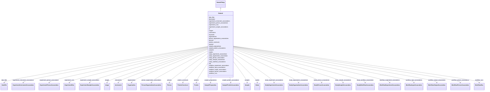

# Class: Dataset 


_Root container holding flat entity collections and association tables. Follows relational database design patterns for structural biology data._


URI: [lambda:Dataset](http://w3id.org/lambda/Dataset)



```mermaid
 classDiagram
    class Dataset
    click Dataset href "../Dataset/"
      NamedThing <|-- Dataset
        click NamedThing href "../NamedThing/"
      
      Dataset : data_files
        
          
    
        
        
        Dataset --> "*" DataFile : data_files
        click DataFile href "../DataFile/"
    

        
      Dataset : description
        
      Dataset : experiment_instrument_associations
        
          
    
        
        
        Dataset --> "*" ExperimentInstrumentAssociation : experiment_instrument_associations
        click ExperimentInstrumentAssociation href "../ExperimentInstrumentAssociation/"
    

        
      Dataset : experiment_person_associations
        
          
    
        
        
        Dataset --> "*" ExperimentPersonAssociation : experiment_person_associations
        click ExperimentPersonAssociation href "../ExperimentPersonAssociation/"
    

        
      Dataset : experiment_runs
        
          
    
        
        
        Dataset --> "*" ExperimentRun : experiment_runs
        click ExperimentRun href "../ExperimentRun/"
    

        
      Dataset : experiment_sample_associations
        
          
    
        
        
        Dataset --> "*" ExperimentSampleAssociation : experiment_sample_associations
        click ExperimentSampleAssociation href "../ExperimentSampleAssociation/"
    

        
      Dataset : id
        
      Dataset : images
        
          
    
        
        
        Dataset --> "*" Image : images
        click Image href "../Image/"
    

        
      Dataset : instruments
        
          
    
        
        
        Dataset --> "*" Instrument : instruments
        click Instrument href "../Instrument/"
    

        
      Dataset : keywords
        
      Dataset : organizations
        
          
    
        
        
        Dataset --> "*" Organization : organizations
        click Organization href "../Organization/"
    

        
      Dataset : person_organization_associations
        
          
    
        
        
        Dataset --> "*" PersonOrganizationAssociation : person_organization_associations
        click PersonOrganizationAssociation href "../PersonOrganizationAssociation/"
    

        
      Dataset : persons
        
          
    
        
        
        Dataset --> "*" Person : persons
        click Person href "../Person/"
    

        
      Dataset : protein_constructs
        
          
    
        
        
        Dataset --> "*" ProteinConstruct : protein_constructs
        click ProteinConstruct href "../ProteinConstruct/"
    

        
      Dataset : proteins
        
          
    
        
        
        Dataset --> "*" Protein : proteins
        click Protein href "../Protein/"
    

        
      Dataset : sample_preparations
        
          
    
        
        
        Dataset --> "*" SamplePreparation : sample_preparations
        click SamplePreparation href "../SamplePreparation/"
    

        
      Dataset : sample_protein_associations
        
          
    
        
        
        Dataset --> "*" SampleProteinAssociation : sample_protein_associations
        click SampleProteinAssociation href "../SampleProteinAssociation/"
    

        
      Dataset : samples
        
          
    
        
        
        Dataset --> "*" Sample : samples
        click Sample href "../Sample/"
    

        
      Dataset : studies
        
          
    
        
        
        Dataset --> "*" Study : studies
        click Study href "../Study/"
    

        
      Dataset : study_experiment_associations
        
          
    
        
        
        Dataset --> "*" StudyExperimentAssociation : study_experiment_associations
        click StudyExperimentAssociation href "../StudyExperimentAssociation/"
    

        
      Dataset : study_organization_associations
        
          
    
        
        
        Dataset --> "*" StudyOrganizationAssociation : study_organization_associations
        click StudyOrganizationAssociation href "../StudyOrganizationAssociation/"
    

        
      Dataset : study_person_associations
        
          
    
        
        
        Dataset --> "*" StudyPersonAssociation : study_person_associations
        click StudyPersonAssociation href "../StudyPersonAssociation/"
    

        
      Dataset : study_sample_associations
        
          
    
        
        
        Dataset --> "*" StudySampleAssociation : study_sample_associations
        click StudySampleAssociation href "../StudySampleAssociation/"
    

        
      Dataset : study_workflow_associations
        
          
    
        
        
        Dataset --> "*" StudyWorkflowAssociation : study_workflow_associations
        click StudyWorkflowAssociation href "../StudyWorkflowAssociation/"
    

        
      Dataset : title
        
      Dataset : workflow_experiment_associations
        
          
    
        
        
        Dataset --> "*" WorkflowExperimentAssociation : workflow_experiment_associations
        click WorkflowExperimentAssociation href "../WorkflowExperimentAssociation/"
    

        
      Dataset : workflow_input_associations
        
          
    
        
        
        Dataset --> "*" WorkflowInputAssociation : workflow_input_associations
        click WorkflowInputAssociation href "../WorkflowInputAssociation/"
    

        
      Dataset : workflow_output_associations
        
          
    
        
        
        Dataset --> "*" WorkflowOutputAssociation : workflow_output_associations
        click WorkflowOutputAssociation href "../WorkflowOutputAssociation/"
    

        
      Dataset : workflow_person_associations
        
          
    
        
        
        Dataset --> "*" WorkflowPersonAssociation : workflow_person_associations
        click WorkflowPersonAssociation href "../WorkflowPersonAssociation/"
    

        
      Dataset : workflow_runs
        
          
    
        
        
        Dataset --> "*" WorkflowRun : workflow_runs
        click WorkflowRun href "../WorkflowRun/"
    

        
      
```


## Inheritance
* [NamedThing](NamedThing.md)
    * **Dataset**


## Slots

| Name | Cardinality and Range | Description | Inheritance |
| ---  | --- | --- | --- |
| [keywords](keywords.md) | * <br/> [String](String.md) | Keywords or tags describing the dataset for search and categorization | direct |
| [studies](studies.md) | * <br/> [Study](Study.md) | All studies in this dataset | direct |
| [persons](persons.md) | * <br/> [Person](Person.md) | All people referenced anywhere in this dataset | direct |
| [organizations](organizations.md) | * <br/> [Organization](Organization.md) | All organizations referenced anywhere in this dataset | direct |
| [instruments](instruments.md) | * <br/> [Instrument](Instrument.md) | All instruments used across studies | direct |
| [proteins](proteins.md) | * <br/> [Protein](Protein.md) | All proteins referenced by samples in this dataset, one record per protein | direct |
| [protein_constructs](protein_constructs.md) | * <br/> [ProteinConstruct](ProteinConstruct.md) | All protein constructs | direct |
| [samples](samples.md) | * <br/> [Sample](Sample.md) | All samples across all studies | direct |
| [sample_preparations](sample_preparations.md) | * <br/> [SamplePreparation](SamplePreparation.md) | All sample preparations | direct |
| [experiment_runs](experiment_runs.md) | * <br/> [ExperimentRun](ExperimentRun.md) | All experiment runs (data collection sessions) | direct |
| [workflow_runs](workflow_runs.md) | * <br/> [WorkflowRun](WorkflowRun.md) | All workflow runs (computational processing) | direct |
| [data_files](data_files.md) | * <br/> [DataFile](DataFile.md) | All data files | direct |
| [images](images.md) | * <br/> [Image](Image.md) | All images | direct |
| [study_sample_associations](study_sample_associations.md) | * <br/> [StudySampleAssociation](StudySampleAssociation.md) | Links between studies and samples (M:N) | direct |
| [study_experiment_associations](study_experiment_associations.md) | * <br/> [StudyExperimentAssociation](StudyExperimentAssociation.md) | Links between studies and experiments (M:N) | direct |
| [study_workflow_associations](study_workflow_associations.md) | * <br/> [StudyWorkflowAssociation](StudyWorkflowAssociation.md) | Links between studies and workflows (M:N) | direct |
| [experiment_sample_associations](experiment_sample_associations.md) | * <br/> [ExperimentSampleAssociation](ExperimentSampleAssociation.md) | Links between experiments and samples (M:N with role) | direct |
| [experiment_instrument_associations](experiment_instrument_associations.md) | * <br/> [ExperimentInstrumentAssociation](ExperimentInstrumentAssociation.md) | Links between experiments and instruments (M:N) | direct |
| [sample_protein_associations](sample_protein_associations.md) | * <br/> [SampleProteinAssociation](SampleProteinAssociation.md) | Links between samples and the proteins they contain (M:N with role, copy numb... | direct |
| [workflow_experiment_associations](workflow_experiment_associations.md) | * <br/> [WorkflowExperimentAssociation](WorkflowExperimentAssociation.md) | Links between workflows and source experiments (M:N) | direct |
| [workflow_input_associations](workflow_input_associations.md) | * <br/> [WorkflowInputAssociation](WorkflowInputAssociation.md) | Links between workflows and input files | direct |
| [workflow_output_associations](workflow_output_associations.md) | * <br/> [WorkflowOutputAssociation](WorkflowOutputAssociation.md) | Links between workflows and output files | direct |
| [study_person_associations](study_person_associations.md) | * <br/> [StudyPersonAssociation](StudyPersonAssociation.md) | Links between studies and people (M:N with role) - where authorship lives | direct |
| [experiment_person_associations](experiment_person_associations.md) | * <br/> [ExperimentPersonAssociation](ExperimentPersonAssociation.md) | Links between experiment runs and people (M:N with role) | direct |
| [workflow_person_associations](workflow_person_associations.md) | * <br/> [WorkflowPersonAssociation](WorkflowPersonAssociation.md) | Links between workflow runs and people (M:N with role) | direct |
| [study_organization_associations](study_organization_associations.md) | * <br/> [StudyOrganizationAssociation](StudyOrganizationAssociation.md) | Links between studies and organizations (M:N with role, award number) | direct |
| [person_organization_associations](person_organization_associations.md) | * <br/> [PersonOrganizationAssociation](PersonOrganizationAssociation.md) | Links between people and organizations (M:N with role and dates) | direct |
| [id](id.md) | 1 <br/> [Uriorcurie](Uriorcurie.md) | Globally unique identifier as an IRI or CURIE for machine processing and exte... | [NamedThing](NamedThing.md) |
| [title](title.md) | 0..1 <br/> [String](String.md) | A human-readable name or title for this entity | [NamedThing](NamedThing.md) |
| [description](description.md) | 0..1 <br/> [String](String.md) | A detailed textual description of this entity | [NamedThing](NamedThing.md) |


## Identifier and Mapping Information


### Schema Source


* from schema: http://w3id.org/lambda/


## Mappings

| Mapping Type | Mapped Value |
| ---  | ---  |
| self | lambda:Dataset |
| native | lambda:Dataset |
| related | IHMCIF:_ihm_entry_collection, IHMCIF:_ihm_dataset_group |


## LinkML Source

<!-- TODO: investigate https://stackoverflow.com/questions/37606292/how-to-create-tabbed-code-blocks-in-mkdocs-or-sphinx -->

### Direct

<details>
```yaml
name: Dataset
description: Root container holding flat entity collections and association tables.
  Follows relational database design patterns for structural biology data.
from_schema: http://w3id.org/lambda/
related_mappings:
- IHMCIF:_ihm_entry_collection
- IHMCIF:_ihm_dataset_group
is_a: NamedThing
attributes:
  keywords:
    name: keywords
    description: Keywords or tags describing the dataset for search and categorization
    from_schema: http://w3id.org/lambda/
    rank: 1000
    domain_of:
    - Dataset
    - Study
    range: string
    multivalued: true
  studies:
    name: studies
    description: All studies in this dataset
    from_schema: http://w3id.org/lambda/
    rank: 1000
    domain_of:
    - Dataset
    range: Study
    multivalued: true
    inlined: true
    inlined_as_list: true
  persons:
    name: persons
    description: All people referenced anywhere in this dataset
    from_schema: http://w3id.org/lambda/
    rank: 1000
    domain_of:
    - Dataset
    range: Person
    multivalued: true
    inlined: true
    inlined_as_list: true
  organizations:
    name: organizations
    description: All organizations referenced anywhere in this dataset
    from_schema: http://w3id.org/lambda/
    rank: 1000
    domain_of:
    - Dataset
    range: Organization
    multivalued: true
    inlined: true
    inlined_as_list: true
  instruments:
    name: instruments
    description: All instruments used across studies
    from_schema: http://w3id.org/lambda/
    rank: 1000
    domain_of:
    - Dataset
    range: Instrument
    multivalued: true
    inlined: true
    inlined_as_list: true
  proteins:
    name: proteins
    description: All proteins referenced by samples in this dataset, one record per
      protein
    from_schema: http://w3id.org/lambda/
    rank: 1000
    domain_of:
    - Dataset
    range: Protein
    multivalued: true
    inlined: true
    inlined_as_list: true
  protein_constructs:
    name: protein_constructs
    description: All protein constructs
    from_schema: http://w3id.org/lambda/
    rank: 1000
    domain_of:
    - Dataset
    range: ProteinConstruct
    multivalued: true
    inlined: true
    inlined_as_list: true
  samples:
    name: samples
    description: All samples across all studies
    from_schema: http://w3id.org/lambda/
    rank: 1000
    domain_of:
    - Dataset
    range: Sample
    multivalued: true
    inlined: true
    inlined_as_list: true
  sample_preparations:
    name: sample_preparations
    description: All sample preparations
    from_schema: http://w3id.org/lambda/
    rank: 1000
    domain_of:
    - Dataset
    range: SamplePreparation
    multivalued: true
    inlined: true
    inlined_as_list: true
  experiment_runs:
    name: experiment_runs
    description: All experiment runs (data collection sessions)
    from_schema: http://w3id.org/lambda/
    rank: 1000
    domain_of:
    - Dataset
    range: ExperimentRun
    multivalued: true
    inlined: true
    inlined_as_list: true
  workflow_runs:
    name: workflow_runs
    description: All workflow runs (computational processing)
    from_schema: http://w3id.org/lambda/
    rank: 1000
    domain_of:
    - Dataset
    range: WorkflowRun
    multivalued: true
    inlined: true
    inlined_as_list: true
  data_files:
    name: data_files
    description: All data files
    from_schema: http://w3id.org/lambda/
    rank: 1000
    domain_of:
    - Dataset
    range: DataFile
    multivalued: true
    inlined: true
    inlined_as_list: true
  images:
    name: images
    description: All images
    from_schema: http://w3id.org/lambda/
    rank: 1000
    domain_of:
    - Dataset
    range: Image
    multivalued: true
    inlined: true
    inlined_as_list: true
  study_sample_associations:
    name: study_sample_associations
    description: Links between studies and samples (M:N)
    from_schema: http://w3id.org/lambda/
    rank: 1000
    domain_of:
    - Dataset
    range: StudySampleAssociation
    multivalued: true
    inlined: true
    inlined_as_list: true
  study_experiment_associations:
    name: study_experiment_associations
    description: Links between studies and experiments (M:N)
    from_schema: http://w3id.org/lambda/
    rank: 1000
    domain_of:
    - Dataset
    range: StudyExperimentAssociation
    multivalued: true
    inlined: true
    inlined_as_list: true
  study_workflow_associations:
    name: study_workflow_associations
    description: Links between studies and workflows (M:N)
    from_schema: http://w3id.org/lambda/
    rank: 1000
    domain_of:
    - Dataset
    range: StudyWorkflowAssociation
    multivalued: true
    inlined: true
    inlined_as_list: true
  experiment_sample_associations:
    name: experiment_sample_associations
    description: Links between experiments and samples (M:N with role)
    from_schema: http://w3id.org/lambda/
    rank: 1000
    domain_of:
    - Dataset
    range: ExperimentSampleAssociation
    multivalued: true
    inlined: true
    inlined_as_list: true
  experiment_instrument_associations:
    name: experiment_instrument_associations
    description: Links between experiments and instruments (M:N)
    from_schema: http://w3id.org/lambda/
    rank: 1000
    domain_of:
    - Dataset
    range: ExperimentInstrumentAssociation
    multivalued: true
    inlined: true
    inlined_as_list: true
  sample_protein_associations:
    name: sample_protein_associations
    description: Links between samples and the proteins they contain (M:N with role,
      copy number, construct)
    from_schema: http://w3id.org/lambda/
    rank: 1000
    domain_of:
    - Dataset
    range: SampleProteinAssociation
    multivalued: true
    inlined: true
    inlined_as_list: true
  workflow_experiment_associations:
    name: workflow_experiment_associations
    description: Links between workflows and source experiments (M:N)
    from_schema: http://w3id.org/lambda/
    rank: 1000
    domain_of:
    - Dataset
    range: WorkflowExperimentAssociation
    multivalued: true
    inlined: true
    inlined_as_list: true
  workflow_input_associations:
    name: workflow_input_associations
    description: Links between workflows and input files
    from_schema: http://w3id.org/lambda/
    rank: 1000
    domain_of:
    - Dataset
    range: WorkflowInputAssociation
    multivalued: true
    inlined: true
    inlined_as_list: true
  workflow_output_associations:
    name: workflow_output_associations
    description: Links between workflows and output files
    from_schema: http://w3id.org/lambda/
    rank: 1000
    domain_of:
    - Dataset
    range: WorkflowOutputAssociation
    multivalued: true
    inlined: true
    inlined_as_list: true
  study_person_associations:
    name: study_person_associations
    description: Links between studies and people (M:N with role) - where authorship
      lives
    from_schema: http://w3id.org/lambda/
    rank: 1000
    domain_of:
    - Dataset
    range: StudyPersonAssociation
    multivalued: true
    inlined: true
    inlined_as_list: true
  experiment_person_associations:
    name: experiment_person_associations
    description: Links between experiment runs and people (M:N with role)
    from_schema: http://w3id.org/lambda/
    rank: 1000
    domain_of:
    - Dataset
    range: ExperimentPersonAssociation
    multivalued: true
    inlined: true
    inlined_as_list: true
  workflow_person_associations:
    name: workflow_person_associations
    description: Links between workflow runs and people (M:N with role)
    from_schema: http://w3id.org/lambda/
    rank: 1000
    domain_of:
    - Dataset
    range: WorkflowPersonAssociation
    multivalued: true
    inlined: true
    inlined_as_list: true
  study_organization_associations:
    name: study_organization_associations
    description: Links between studies and organizations (M:N with role, award number)
    from_schema: http://w3id.org/lambda/
    rank: 1000
    domain_of:
    - Dataset
    range: StudyOrganizationAssociation
    multivalued: true
    inlined: true
    inlined_as_list: true
  person_organization_associations:
    name: person_organization_associations
    description: Links between people and organizations (M:N with role and dates)
    from_schema: http://w3id.org/lambda/
    rank: 1000
    domain_of:
    - Dataset
    range: PersonOrganizationAssociation
    multivalued: true
    inlined: true
    inlined_as_list: true
tree_root: true

```
</details>

### Induced

<details>
```yaml
name: Dataset
description: Root container holding flat entity collections and association tables.
  Follows relational database design patterns for structural biology data.
from_schema: http://w3id.org/lambda/
related_mappings:
- IHMCIF:_ihm_entry_collection
- IHMCIF:_ihm_dataset_group
is_a: NamedThing
attributes:
  keywords:
    name: keywords
    description: Keywords or tags describing the dataset for search and categorization
    from_schema: http://w3id.org/lambda/
    rank: 1000
    alias: keywords
    owner: Dataset
    domain_of:
    - Dataset
    - Study
    range: string
    multivalued: true
  studies:
    name: studies
    description: All studies in this dataset
    from_schema: http://w3id.org/lambda/
    rank: 1000
    alias: studies
    owner: Dataset
    domain_of:
    - Dataset
    range: Study
    multivalued: true
    inlined: true
    inlined_as_list: true
  persons:
    name: persons
    description: All people referenced anywhere in this dataset
    from_schema: http://w3id.org/lambda/
    rank: 1000
    alias: persons
    owner: Dataset
    domain_of:
    - Dataset
    range: Person
    multivalued: true
    inlined: true
    inlined_as_list: true
  organizations:
    name: organizations
    description: All organizations referenced anywhere in this dataset
    from_schema: http://w3id.org/lambda/
    rank: 1000
    alias: organizations
    owner: Dataset
    domain_of:
    - Dataset
    range: Organization
    multivalued: true
    inlined: true
    inlined_as_list: true
  instruments:
    name: instruments
    description: All instruments used across studies
    from_schema: http://w3id.org/lambda/
    rank: 1000
    alias: instruments
    owner: Dataset
    domain_of:
    - Dataset
    range: Instrument
    multivalued: true
    inlined: true
    inlined_as_list: true
  proteins:
    name: proteins
    description: All proteins referenced by samples in this dataset, one record per
      protein
    from_schema: http://w3id.org/lambda/
    rank: 1000
    alias: proteins
    owner: Dataset
    domain_of:
    - Dataset
    range: Protein
    multivalued: true
    inlined: true
    inlined_as_list: true
  protein_constructs:
    name: protein_constructs
    description: All protein constructs
    from_schema: http://w3id.org/lambda/
    rank: 1000
    alias: protein_constructs
    owner: Dataset
    domain_of:
    - Dataset
    range: ProteinConstruct
    multivalued: true
    inlined: true
    inlined_as_list: true
  samples:
    name: samples
    description: All samples across all studies
    from_schema: http://w3id.org/lambda/
    rank: 1000
    alias: samples
    owner: Dataset
    domain_of:
    - Dataset
    range: Sample
    multivalued: true
    inlined: true
    inlined_as_list: true
  sample_preparations:
    name: sample_preparations
    description: All sample preparations
    from_schema: http://w3id.org/lambda/
    rank: 1000
    alias: sample_preparations
    owner: Dataset
    domain_of:
    - Dataset
    range: SamplePreparation
    multivalued: true
    inlined: true
    inlined_as_list: true
  experiment_runs:
    name: experiment_runs
    description: All experiment runs (data collection sessions)
    from_schema: http://w3id.org/lambda/
    rank: 1000
    alias: experiment_runs
    owner: Dataset
    domain_of:
    - Dataset
    range: ExperimentRun
    multivalued: true
    inlined: true
    inlined_as_list: true
  workflow_runs:
    name: workflow_runs
    description: All workflow runs (computational processing)
    from_schema: http://w3id.org/lambda/
    rank: 1000
    alias: workflow_runs
    owner: Dataset
    domain_of:
    - Dataset
    range: WorkflowRun
    multivalued: true
    inlined: true
    inlined_as_list: true
  data_files:
    name: data_files
    description: All data files
    from_schema: http://w3id.org/lambda/
    rank: 1000
    alias: data_files
    owner: Dataset
    domain_of:
    - Dataset
    range: DataFile
    multivalued: true
    inlined: true
    inlined_as_list: true
  images:
    name: images
    description: All images
    from_schema: http://w3id.org/lambda/
    rank: 1000
    alias: images
    owner: Dataset
    domain_of:
    - Dataset
    range: Image
    multivalued: true
    inlined: true
    inlined_as_list: true
  study_sample_associations:
    name: study_sample_associations
    description: Links between studies and samples (M:N)
    from_schema: http://w3id.org/lambda/
    rank: 1000
    alias: study_sample_associations
    owner: Dataset
    domain_of:
    - Dataset
    range: StudySampleAssociation
    multivalued: true
    inlined: true
    inlined_as_list: true
  study_experiment_associations:
    name: study_experiment_associations
    description: Links between studies and experiments (M:N)
    from_schema: http://w3id.org/lambda/
    rank: 1000
    alias: study_experiment_associations
    owner: Dataset
    domain_of:
    - Dataset
    range: StudyExperimentAssociation
    multivalued: true
    inlined: true
    inlined_as_list: true
  study_workflow_associations:
    name: study_workflow_associations
    description: Links between studies and workflows (M:N)
    from_schema: http://w3id.org/lambda/
    rank: 1000
    alias: study_workflow_associations
    owner: Dataset
    domain_of:
    - Dataset
    range: StudyWorkflowAssociation
    multivalued: true
    inlined: true
    inlined_as_list: true
  experiment_sample_associations:
    name: experiment_sample_associations
    description: Links between experiments and samples (M:N with role)
    from_schema: http://w3id.org/lambda/
    rank: 1000
    alias: experiment_sample_associations
    owner: Dataset
    domain_of:
    - Dataset
    range: ExperimentSampleAssociation
    multivalued: true
    inlined: true
    inlined_as_list: true
  experiment_instrument_associations:
    name: experiment_instrument_associations
    description: Links between experiments and instruments (M:N)
    from_schema: http://w3id.org/lambda/
    rank: 1000
    alias: experiment_instrument_associations
    owner: Dataset
    domain_of:
    - Dataset
    range: ExperimentInstrumentAssociation
    multivalued: true
    inlined: true
    inlined_as_list: true
  sample_protein_associations:
    name: sample_protein_associations
    description: Links between samples and the proteins they contain (M:N with role,
      copy number, construct)
    from_schema: http://w3id.org/lambda/
    rank: 1000
    alias: sample_protein_associations
    owner: Dataset
    domain_of:
    - Dataset
    range: SampleProteinAssociation
    multivalued: true
    inlined: true
    inlined_as_list: true
  workflow_experiment_associations:
    name: workflow_experiment_associations
    description: Links between workflows and source experiments (M:N)
    from_schema: http://w3id.org/lambda/
    rank: 1000
    alias: workflow_experiment_associations
    owner: Dataset
    domain_of:
    - Dataset
    range: WorkflowExperimentAssociation
    multivalued: true
    inlined: true
    inlined_as_list: true
  workflow_input_associations:
    name: workflow_input_associations
    description: Links between workflows and input files
    from_schema: http://w3id.org/lambda/
    rank: 1000
    alias: workflow_input_associations
    owner: Dataset
    domain_of:
    - Dataset
    range: WorkflowInputAssociation
    multivalued: true
    inlined: true
    inlined_as_list: true
  workflow_output_associations:
    name: workflow_output_associations
    description: Links between workflows and output files
    from_schema: http://w3id.org/lambda/
    rank: 1000
    alias: workflow_output_associations
    owner: Dataset
    domain_of:
    - Dataset
    range: WorkflowOutputAssociation
    multivalued: true
    inlined: true
    inlined_as_list: true
  study_person_associations:
    name: study_person_associations
    description: Links between studies and people (M:N with role) - where authorship
      lives
    from_schema: http://w3id.org/lambda/
    rank: 1000
    alias: study_person_associations
    owner: Dataset
    domain_of:
    - Dataset
    range: StudyPersonAssociation
    multivalued: true
    inlined: true
    inlined_as_list: true
  experiment_person_associations:
    name: experiment_person_associations
    description: Links between experiment runs and people (M:N with role)
    from_schema: http://w3id.org/lambda/
    rank: 1000
    alias: experiment_person_associations
    owner: Dataset
    domain_of:
    - Dataset
    range: ExperimentPersonAssociation
    multivalued: true
    inlined: true
    inlined_as_list: true
  workflow_person_associations:
    name: workflow_person_associations
    description: Links between workflow runs and people (M:N with role)
    from_schema: http://w3id.org/lambda/
    rank: 1000
    alias: workflow_person_associations
    owner: Dataset
    domain_of:
    - Dataset
    range: WorkflowPersonAssociation
    multivalued: true
    inlined: true
    inlined_as_list: true
  study_organization_associations:
    name: study_organization_associations
    description: Links between studies and organizations (M:N with role, award number)
    from_schema: http://w3id.org/lambda/
    rank: 1000
    alias: study_organization_associations
    owner: Dataset
    domain_of:
    - Dataset
    range: StudyOrganizationAssociation
    multivalued: true
    inlined: true
    inlined_as_list: true
  person_organization_associations:
    name: person_organization_associations
    description: Links between people and organizations (M:N with role and dates)
    from_schema: http://w3id.org/lambda/
    rank: 1000
    alias: person_organization_associations
    owner: Dataset
    domain_of:
    - Dataset
    range: PersonOrganizationAssociation
    multivalued: true
    inlined: true
    inlined_as_list: true
  id:
    name: id
    description: Globally unique identifier as an IRI or CURIE for machine processing
      and external references. Used for linking data across systems and semantic web
      integration.
    from_schema: http://w3id.org/lambda/
    rank: 1000
    identifier: true
    alias: id
    owner: Dataset
    domain_of:
    - NamedThing
    - Attribute
    range: uriorcurie
    required: true
  title:
    name: title
    description: A human-readable name or title for this entity
    from_schema: http://w3id.org/lambda/
    rank: 1000
    slot_uri: dcterms:title
    alias: title
    owner: Dataset
    domain_of:
    - NamedThing
    range: string
  description:
    name: description
    description: A detailed textual description of this entity
    from_schema: http://w3id.org/lambda/
    rank: 1000
    alias: description
    owner: Dataset
    domain_of:
    - NamedThing
    - AttributeGroup
    range: string
tree_root: true

```
</details>