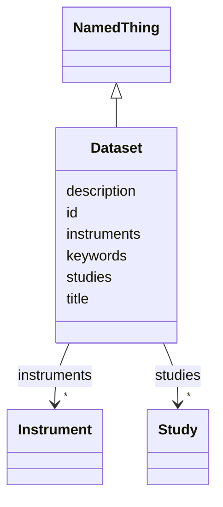

# Class: Dataset 


_A collection of studies_


URI: [lambdaber:Dataset](https://w3id.org/lambda-ber-schema/Dataset)





## Inheritance
* [NamedThing](NamedThing.md)
    * **Dataset**


## Slots

| Name | Cardinality and Range | Description | Inheritance |
| ---  | --- | --- | --- |
| [keywords](keywords.md) | * <br/> [String](String.md) | Keywords or tags describing the dataset for search and categorization | direct |
| [instruments](instruments.md) | * <br/> [Instrument](Instrument.md) | Instruments used across all studies in this dataset | direct |
| [studies](studies.md) | * <br/> [Study](Study.md) | Individual research studies contained in this dataset | direct |
| [id](id.md) | 1 <br/> [Uriorcurie](Uriorcurie.md) | Globally unique identifier as an IRI or CURIE for machine processing and exte... | [NamedThing](NamedThing.md) |
| [title](title.md) | 0..1 <br/> [String](String.md) | A human-readable name or title for this entity | [NamedThing](NamedThing.md) |
| [description](description.md) | 0..1 <br/> [String](String.md) | A detailed textual description of this entity | [NamedThing](NamedThing.md) |


## Identifier and Mapping Information


### Schema Source


* from schema: https://w3id.org/lambda-ber-schema/


## Mappings

| Mapping Type | Mapped Value |
| ---  | ---  |
| self | lambdaber:Dataset |
| native | lambdaber:Dataset |


## LinkML Source

<!-- TODO: investigate https://stackoverflow.com/questions/37606292/how-to-create-tabbed-code-blocks-in-mkdocs-or-sphinx -->

### Direct

<details>
```yaml
name: Dataset
description: A collection of studies
from_schema: https://w3id.org/lambda-ber-schema/
is_a: NamedThing
attributes:
  keywords:
    name: keywords
    description: Keywords or tags describing the dataset for search and categorization
    from_schema: https://w3id.org/lambda-ber-schema/
    rank: 1000
    domain_of:
    - Dataset
    range: string
    multivalued: true
  instruments:
    name: instruments
    description: Instruments used across all studies in this dataset
    from_schema: https://w3id.org/lambda-ber-schema/
    rank: 1000
    domain_of:
    - Dataset
    range: Instrument
    multivalued: true
    inlined: true
    inlined_as_list: true
  studies:
    name: studies
    description: Individual research studies contained in this dataset
    from_schema: https://w3id.org/lambda-ber-schema/
    rank: 1000
    domain_of:
    - Dataset
    range: Study
    multivalued: true
    inlined: true
    inlined_as_list: true
tree_root: true

```
</details>

### Induced

<details>
```yaml
name: Dataset
description: A collection of studies
from_schema: https://w3id.org/lambda-ber-schema/
is_a: NamedThing
attributes:
  keywords:
    name: keywords
    description: Keywords or tags describing the dataset for search and categorization
    from_schema: https://w3id.org/lambda-ber-schema/
    rank: 1000
    alias: keywords
    owner: Dataset
    domain_of:
    - Dataset
    range: string
    multivalued: true
  instruments:
    name: instruments
    description: Instruments used across all studies in this dataset
    from_schema: https://w3id.org/lambda-ber-schema/
    rank: 1000
    alias: instruments
    owner: Dataset
    domain_of:
    - Dataset
    range: Instrument
    multivalued: true
    inlined: true
    inlined_as_list: true
  studies:
    name: studies
    description: Individual research studies contained in this dataset
    from_schema: https://w3id.org/lambda-ber-schema/
    rank: 1000
    alias: studies
    owner: Dataset
    domain_of:
    - Dataset
    range: Study
    multivalued: true
    inlined: true
    inlined_as_list: true
  id:
    name: id
    description: Globally unique identifier as an IRI or CURIE for machine processing
      and external references. Used for linking data across systems and semantic web
      integration.
    from_schema: https://w3id.org/lambda-ber-schema/
    rank: 1000
    identifier: true
    alias: id
    owner: Dataset
    domain_of:
    - NamedThing
    range: uriorcurie
    required: true
  title:
    name: title
    description: A human-readable name or title for this entity
    from_schema: https://w3id.org/lambda-ber-schema/
    rank: 1000
    slot_uri: dcterms:title
    alias: title
    owner: Dataset
    domain_of:
    - NamedThing
    range: string
  description:
    name: description
    description: A detailed textual description of this entity
    from_schema: https://w3id.org/lambda-ber-schema/
    rank: 1000
    alias: description
    owner: Dataset
    domain_of:
    - NamedThing
    - AttributeGroup
    range: string
tree_root: true

```
</details>