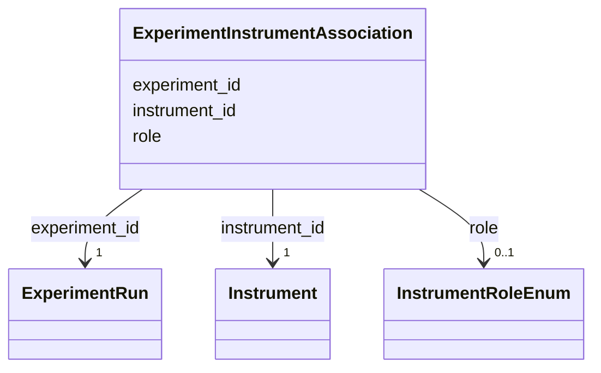

# Class: ExperimentInstrumentAssociation 


_M:N link between ExperimentRun and Instrument_


URI: [lambda:ExperimentInstrumentAssociation](http://w3id.org/lambda/ExperimentInstrumentAssociation)





<!-- no inheritance hierarchy -->


## Slots

| Name | Cardinality and Range | Description | Inheritance |
| ---  | --- | --- | --- |
| [experiment_id](experiment_id.md) | 1 <br/> [ExperimentRun](ExperimentRun.md) | Reference to the experiment run | direct |
| [instrument_id](instrument_id.md) | 1 <br/> [Instrument](Instrument.md) | Reference to the instrument | direct |
| [role](role.md) | 0..1 <br/> [InstrumentRoleEnum](InstrumentRoleEnum.md) | Role of instrument in experiment | direct |


## Usages

| used by | used in | type | used |
| ---  | --- | --- | --- |
| [Dataset](Dataset.md) | [experiment_instrument_associations](experiment_instrument_associations.md) | range | [ExperimentInstrumentAssociation](ExperimentInstrumentAssociation.md) |


## Identifier and Mapping Information


### Schema Source


* from schema: http://w3id.org/lambda/


## Mappings

| Mapping Type | Mapped Value |
| ---  | ---  |
| self | lambda:ExperimentInstrumentAssociation |
| native | lambda:ExperimentInstrumentAssociation |


## LinkML Source

<!-- TODO: investigate https://stackoverflow.com/questions/37606292/how-to-create-tabbed-code-blocks-in-mkdocs-or-sphinx -->

### Direct

<details>
```yaml
name: ExperimentInstrumentAssociation
description: M:N link between ExperimentRun and Instrument
from_schema: http://w3id.org/lambda/
attributes:
  experiment_id:
    name: experiment_id
    description: Reference to the experiment run
    from_schema: http://w3id.org/lambda/
    domain_of:
    - StudyExperimentAssociation
    - ExperimentSampleAssociation
    - ExperimentInstrumentAssociation
    - WorkflowExperimentAssociation
    range: ExperimentRun
    required: true
  instrument_id:
    name: instrument_id
    description: Reference to the instrument
    from_schema: http://w3id.org/lambda/
    rank: 1000
    domain_of:
    - ExperimentInstrumentAssociation
    range: Instrument
    required: true
  role:
    name: role
    description: Role of instrument in experiment
    from_schema: http://w3id.org/lambda/
    domain_of:
    - StudySampleAssociation
    - ExperimentSampleAssociation
    - ExperimentInstrumentAssociation
    range: InstrumentRoleEnum

```
</details>

### Induced

<details>
```yaml
name: ExperimentInstrumentAssociation
description: M:N link between ExperimentRun and Instrument
from_schema: http://w3id.org/lambda/
attributes:
  experiment_id:
    name: experiment_id
    description: Reference to the experiment run
    from_schema: http://w3id.org/lambda/
    alias: experiment_id
    owner: ExperimentInstrumentAssociation
    domain_of:
    - StudyExperimentAssociation
    - ExperimentSampleAssociation
    - ExperimentInstrumentAssociation
    - WorkflowExperimentAssociation
    range: ExperimentRun
    required: true
  instrument_id:
    name: instrument_id
    description: Reference to the instrument
    from_schema: http://w3id.org/lambda/
    rank: 1000
    alias: instrument_id
    owner: ExperimentInstrumentAssociation
    domain_of:
    - ExperimentInstrumentAssociation
    range: Instrument
    required: true
  role:
    name: role
    description: Role of instrument in experiment
    from_schema: http://w3id.org/lambda/
    alias: role
    owner: ExperimentInstrumentAssociation
    domain_of:
    - StudySampleAssociation
    - ExperimentSampleAssociation
    - ExperimentInstrumentAssociation
    range: InstrumentRoleEnum

```
</details>