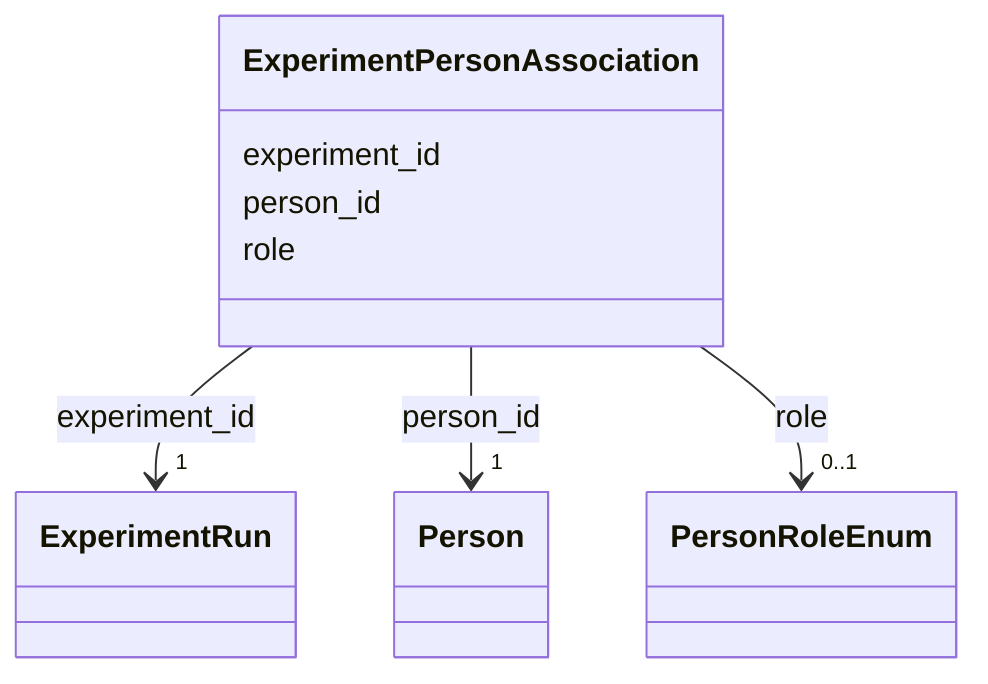

# Class: ExperimentPersonAssociation 


_M:N link between ExperimentRun and Person with role metadata - who actually collected the data, and who was the local contact._


URI: [lambda:ExperimentPersonAssociation](http://w3id.org/lambda/ExperimentPersonAssociation)





<!-- no inheritance hierarchy -->


## Slots

| Name | Cardinality and Range | Description | Inheritance |
| ---  | --- | --- | --- |
| [experiment_id](experiment_id.md) | 1 <br/> [ExperimentRun](ExperimentRun.md) | Reference to the experiment run | direct |
| [person_id](person_id.md) | 1 <br/> [Person](Person.md) | Reference to the person | direct |
| [role](role.md) | 0..1 <br/> [PersonRoleEnum](PersonRoleEnum.md) | Capacity in which the person is attached to the experiment run | direct |


## Usages

| used by | used in | type | used |
| ---  | --- | --- | --- |
| [Dataset](Dataset.md) | [experiment_person_associations](experiment_person_associations.md) | range | [ExperimentPersonAssociation](ExperimentPersonAssociation.md) |


## Comments

* Structured alternative to the free-text ExperimentRun.operator_id

## Identifier and Mapping Information


### Schema Source


* from schema: http://w3id.org/lambda/


## Mappings

| Mapping Type | Mapped Value |
| ---  | ---  |
| self | lambda:ExperimentPersonAssociation |
| native | lambda:ExperimentPersonAssociation |


## LinkML Source

<!-- TODO: investigate https://stackoverflow.com/questions/37606292/how-to-create-tabbed-code-blocks-in-mkdocs-or-sphinx -->

### Direct

<details>
```yaml
name: ExperimentPersonAssociation
description: M:N link between ExperimentRun and Person with role metadata - who actually
  collected the data, and who was the local contact.
comments:
- Structured alternative to the free-text ExperimentRun.operator_id
from_schema: http://w3id.org/lambda/
attributes:
  experiment_id:
    name: experiment_id
    description: Reference to the experiment run
    from_schema: http://w3id.org/lambda/
    domain_of:
    - StudyExperimentAssociation
    - ExperimentSampleAssociation
    - ExperimentInstrumentAssociation
    - WorkflowExperimentAssociation
    - ExperimentPersonAssociation
    range: ExperimentRun
    required: true
  person_id:
    name: person_id
    description: Reference to the person
    from_schema: http://w3id.org/lambda/
    domain_of:
    - StudyPersonAssociation
    - ExperimentPersonAssociation
    - WorkflowPersonAssociation
    - PersonOrganizationAssociation
    range: Person
    required: true
  role:
    name: role
    description: Capacity in which the person is attached to the experiment run
    from_schema: http://w3id.org/lambda/
    domain_of:
    - StudySampleAssociation
    - ExperimentSampleAssociation
    - SampleProteinAssociation
    - ExperimentInstrumentAssociation
    - StudyPersonAssociation
    - ExperimentPersonAssociation
    - WorkflowPersonAssociation
    - StudyOrganizationAssociation
    - PersonOrganizationAssociation
    range: PersonRoleEnum

```
</details>

### Induced

<details>
```yaml
name: ExperimentPersonAssociation
description: M:N link between ExperimentRun and Person with role metadata - who actually
  collected the data, and who was the local contact.
comments:
- Structured alternative to the free-text ExperimentRun.operator_id
from_schema: http://w3id.org/lambda/
attributes:
  experiment_id:
    name: experiment_id
    description: Reference to the experiment run
    from_schema: http://w3id.org/lambda/
    alias: experiment_id
    owner: ExperimentPersonAssociation
    domain_of:
    - StudyExperimentAssociation
    - ExperimentSampleAssociation
    - ExperimentInstrumentAssociation
    - WorkflowExperimentAssociation
    - ExperimentPersonAssociation
    range: ExperimentRun
    required: true
  person_id:
    name: person_id
    description: Reference to the person
    from_schema: http://w3id.org/lambda/
    alias: person_id
    owner: ExperimentPersonAssociation
    domain_of:
    - StudyPersonAssociation
    - ExperimentPersonAssociation
    - WorkflowPersonAssociation
    - PersonOrganizationAssociation
    range: Person
    required: true
  role:
    name: role
    description: Capacity in which the person is attached to the experiment run
    from_schema: http://w3id.org/lambda/
    alias: role
    owner: ExperimentPersonAssociation
    domain_of:
    - StudySampleAssociation
    - ExperimentSampleAssociation
    - SampleProteinAssociation
    - ExperimentInstrumentAssociation
    - StudyPersonAssociation
    - ExperimentPersonAssociation
    - WorkflowPersonAssociation
    - StudyOrganizationAssociation
    - PersonOrganizationAssociation
    range: PersonRoleEnum

```
</details>