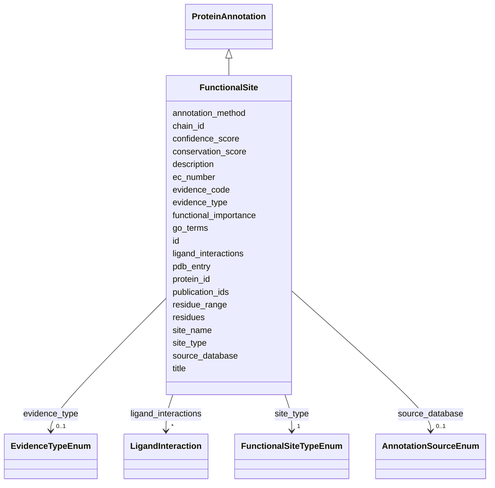

# Class: FunctionalSite 


_Functional sites including catalytic, binding, and regulatory sites_


URI: [lambdaber:FunctionalSite](https://w3id.org/lambda-ber-schema/FunctionalSite)





## Inheritance
* [NamedThing](NamedThing.md)
    * [ProteinAnnotation](ProteinAnnotation.md)
        * **FunctionalSite**


## Slots

| Name | Cardinality and Range | Description | Inheritance |
| ---  | --- | --- | --- |
| [site_type](site_type.md) | 1 <br/> [FunctionalSiteTypeEnum](FunctionalSiteTypeEnum.md) | Type of functional site | direct |
| [site_name](site_name.md) | 0..1 <br/> [String](String.md) | Common name for this site | direct |
| [residues](residues.md) | * <br/> [String](String.md) | List of residues forming the functional site | direct |
| [ligand_interactions](ligand_interactions.md) | * <br/> [LigandInteraction](LigandInteraction.md) | Ligands that interact with this site | direct |
| [conservation_score](conservation_score.md) | 0..1 <br/> [Float](Float.md) | Evolutionary conservation score (range: 0-1) | direct |
| [functional_importance](functional_importance.md) | 0..1 <br/> [String](String.md) | Description of functional importance | direct |
| [go_terms](go_terms.md) | * <br/> [Uriorcurie](Uriorcurie.md) | Associated Gene Ontology terms | direct |
| [ec_number](ec_number.md) | 0..1 <br/> [String](String.md) | Enzyme Commission number for catalytic sites | direct |
| [protein_id](protein_id.md) | 1 <br/> [String](String.md) | UniProt accession number | [ProteinAnnotation](ProteinAnnotation.md) |
| [pdb_entry](pdb_entry.md) | 0..1 <br/> [String](String.md) | PDB identifier | [ProteinAnnotation](ProteinAnnotation.md) |
| [chain_id](chain_id.md) | 0..1 <br/> [String](String.md) | Chain identifier in the PDB structure | [ProteinAnnotation](ProteinAnnotation.md) |
| [residue_range](residue_range.md) | 0..1 <br/> [String](String.md) | Range of residues (e | [ProteinAnnotation](ProteinAnnotation.md) |
| [confidence_score](confidence_score.md) | 0..1 <br/> [Float](Float.md) | Confidence score for the annotation (range: 0-1) | [ProteinAnnotation](ProteinAnnotation.md) |
| [evidence_type](evidence_type.md) | 0..1 <br/> [EvidenceTypeEnum](EvidenceTypeEnum.md) | Type of evidence supporting this annotation | [ProteinAnnotation](ProteinAnnotation.md) |
| [evidence_code](evidence_code.md) | 0..1 <br/> [Uriorcurie](Uriorcurie.md) | Evidence and Conclusion Ontology (ECO) code | [ProteinAnnotation](ProteinAnnotation.md) |
| [source_database](source_database.md) | 0..1 <br/> [AnnotationSourceEnum](AnnotationSourceEnum.md) | Source database or resource that provided this annotation | [ProteinAnnotation](ProteinAnnotation.md) |
| [annotation_method](annotation_method.md) | 0..1 <br/> [String](String.md) | Computational or experimental method used | [ProteinAnnotation](ProteinAnnotation.md) |
| [publication_ids](publication_ids.md) | * <br/> [String](String.md) | IDs of one or more publications supporting this annotation | [ProteinAnnotation](ProteinAnnotation.md) |
| [id](id.md) | 1 <br/> [Uriorcurie](Uriorcurie.md) | Globally unique identifier as an IRI or CURIE for machine processing and exte... | [NamedThing](NamedThing.md) |
| [title](title.md) | 0..1 <br/> [String](String.md) | A human-readable name or title for this entity | [NamedThing](NamedThing.md) |
| [description](description.md) | 0..1 <br/> [String](String.md) | A detailed textual description of this entity | [NamedThing](NamedThing.md) |


## Usages

| used by | used in | type | used |
| ---  | --- | --- | --- |
| [Sample](Sample.md) | [functional_sites](functional_sites.md) | range | [FunctionalSite](FunctionalSite.md) |
| [AggregatedProteinView](AggregatedProteinView.md) | [functional_sites](functional_sites.md) | range | [FunctionalSite](FunctionalSite.md) |


## Identifier and Mapping Information


### Schema Source


* from schema: https://w3id.org/lambda-ber-schema/


## Mappings

| Mapping Type | Mapped Value |
| ---  | ---  |
| self | lambdaber:FunctionalSite |
| native | lambdaber:FunctionalSite |


## LinkML Source

<!-- TODO: investigate https://stackoverflow.com/questions/37606292/how-to-create-tabbed-code-blocks-in-mkdocs-or-sphinx -->

### Direct

<details>
```yaml
name: FunctionalSite
description: Functional sites including catalytic, binding, and regulatory sites
from_schema: https://w3id.org/lambda-ber-schema/
is_a: ProteinAnnotation
attributes:
  site_type:
    name: site_type
    description: Type of functional site
    from_schema: https://w3id.org/lambda-ber-schema/functional_annotation
    rank: 1000
    domain_of:
    - FunctionalSite
    range: FunctionalSiteTypeEnum
    required: true
  site_name:
    name: site_name
    description: Common name for this site
    from_schema: https://w3id.org/lambda-ber-schema/functional_annotation
    rank: 1000
    domain_of:
    - FunctionalSite
  residues:
    name: residues
    description: List of residues forming the functional site. Each should be specified
      as a string (e.g., "45", "120A").
    from_schema: https://w3id.org/lambda-ber-schema/functional_annotation
    rank: 1000
    domain_of:
    - FunctionalSite
    multivalued: true
  ligand_interactions:
    name: ligand_interactions
    description: Ligands that interact with this site
    from_schema: https://w3id.org/lambda-ber-schema/functional_annotation
    domain_of:
    - Sample
    - FunctionalSite
    - AggregatedProteinView
    range: LigandInteraction
    multivalued: true
    inlined: true
    inlined_as_list: true
  conservation_score:
    name: conservation_score
    description: 'Evolutionary conservation score (range: 0-1)'
    from_schema: https://w3id.org/lambda-ber-schema/functional_annotation
    rank: 1000
    domain_of:
    - FunctionalSite
    - EvolutionaryConservation
    range: float
    minimum_value: 0
    maximum_value: 1
  functional_importance:
    name: functional_importance
    description: Description of functional importance
    from_schema: https://w3id.org/lambda-ber-schema/functional_annotation
    rank: 1000
    domain_of:
    - FunctionalSite
  go_terms:
    name: go_terms
    description: Associated Gene Ontology terms
    from_schema: https://w3id.org/lambda-ber-schema/functional_annotation
    rank: 1000
    domain_of:
    - FunctionalSite
    range: uriorcurie
    multivalued: true
  ec_number:
    name: ec_number
    description: Enzyme Commission number for catalytic sites
    from_schema: https://w3id.org/lambda-ber-schema/functional_annotation
    rank: 1000
    domain_of:
    - FunctionalSite
    pattern: ^[0-9]+\.[0-9]+\.[0-9]+\.[0-9]+$

```
</details>

### Induced

<details>
```yaml
name: FunctionalSite
description: Functional sites including catalytic, binding, and regulatory sites
from_schema: https://w3id.org/lambda-ber-schema/
is_a: ProteinAnnotation
attributes:
  site_type:
    name: site_type
    description: Type of functional site
    from_schema: https://w3id.org/lambda-ber-schema/functional_annotation
    rank: 1000
    alias: site_type
    owner: FunctionalSite
    domain_of:
    - FunctionalSite
    range: FunctionalSiteTypeEnum
    required: true
  site_name:
    name: site_name
    description: Common name for this site
    from_schema: https://w3id.org/lambda-ber-schema/functional_annotation
    rank: 1000
    alias: site_name
    owner: FunctionalSite
    domain_of:
    - FunctionalSite
    range: string
  residues:
    name: residues
    description: List of residues forming the functional site. Each should be specified
      as a string (e.g., "45", "120A").
    from_schema: https://w3id.org/lambda-ber-schema/functional_annotation
    rank: 1000
    alias: residues
    owner: FunctionalSite
    domain_of:
    - FunctionalSite
    range: string
    multivalued: true
  ligand_interactions:
    name: ligand_interactions
    description: Ligands that interact with this site
    from_schema: https://w3id.org/lambda-ber-schema/functional_annotation
    alias: ligand_interactions
    owner: FunctionalSite
    domain_of:
    - Sample
    - FunctionalSite
    - AggregatedProteinView
    range: LigandInteraction
    multivalued: true
    inlined: true
    inlined_as_list: true
  conservation_score:
    name: conservation_score
    description: 'Evolutionary conservation score (range: 0-1)'
    from_schema: https://w3id.org/lambda-ber-schema/functional_annotation
    rank: 1000
    alias: conservation_score
    owner: FunctionalSite
    domain_of:
    - FunctionalSite
    - EvolutionaryConservation
    range: float
    minimum_value: 0
    maximum_value: 1
  functional_importance:
    name: functional_importance
    description: Description of functional importance
    from_schema: https://w3id.org/lambda-ber-schema/functional_annotation
    rank: 1000
    alias: functional_importance
    owner: FunctionalSite
    domain_of:
    - FunctionalSite
    range: string
  go_terms:
    name: go_terms
    description: Associated Gene Ontology terms
    from_schema: https://w3id.org/lambda-ber-schema/functional_annotation
    rank: 1000
    alias: go_terms
    owner: FunctionalSite
    domain_of:
    - FunctionalSite
    range: uriorcurie
    multivalued: true
  ec_number:
    name: ec_number
    description: Enzyme Commission number for catalytic sites
    from_schema: https://w3id.org/lambda-ber-schema/functional_annotation
    rank: 1000
    alias: ec_number
    owner: FunctionalSite
    domain_of:
    - FunctionalSite
    range: string
    pattern: ^[0-9]+\.[0-9]+\.[0-9]+\.[0-9]+$
  protein_id:
    name: protein_id
    description: UniProt accession number
    from_schema: https://w3id.org/lambda-ber-schema/functional_annotation
    rank: 1000
    alias: protein_id
    owner: FunctionalSite
    domain_of:
    - ProteinAnnotation
    - ConformationalEnsemble
    range: string
    required: true
    pattern: ^[A-Z][0-9][A-Z0-9]{3}[0-9]|[A-Z][0-9][A-Z0-9]{3}[0-9]-[0-9]+$
  pdb_entry:
    name: pdb_entry
    description: PDB identifier
    from_schema: https://w3id.org/lambda-ber-schema/functional_annotation
    rank: 1000
    alias: pdb_entry
    owner: FunctionalSite
    domain_of:
    - ProteinAnnotation
    range: string
    pattern: ^[0-9][A-Za-z0-9]{3}$
  chain_id:
    name: chain_id
    description: Chain identifier in the PDB structure
    from_schema: https://w3id.org/lambda-ber-schema/functional_annotation
    rank: 1000
    alias: chain_id
    owner: FunctionalSite
    domain_of:
    - ProteinAnnotation
    range: string
    pattern: ^[A-Za-z0-9]+$
  residue_range:
    name: residue_range
    description: Range of residues (e.g., '1-100', '25,27,30-35')
    from_schema: https://w3id.org/lambda-ber-schema/functional_annotation
    rank: 1000
    alias: residue_range
    owner: FunctionalSite
    domain_of:
    - ProteinAnnotation
    range: string
    pattern: ^[0-9,\-]+$
  confidence_score:
    name: confidence_score
    description: 'Confidence score for the annotation (range: 0-1)'
    from_schema: https://w3id.org/lambda-ber-schema/functional_annotation
    rank: 1000
    alias: confidence_score
    owner: FunctionalSite
    domain_of:
    - ProteinAnnotation
    range: float
    minimum_value: 0
    maximum_value: 1
  evidence_type:
    name: evidence_type
    description: Type of evidence supporting this annotation
    from_schema: https://w3id.org/lambda-ber-schema/functional_annotation
    rank: 1000
    alias: evidence_type
    owner: FunctionalSite
    domain_of:
    - ProteinAnnotation
    range: EvidenceTypeEnum
  evidence_code:
    name: evidence_code
    description: Evidence and Conclusion Ontology (ECO) code
    from_schema: https://w3id.org/lambda-ber-schema/functional_annotation
    rank: 1000
    alias: evidence_code
    owner: FunctionalSite
    domain_of:
    - ProteinAnnotation
    range: uriorcurie
  source_database:
    name: source_database
    description: Source database or resource that provided this annotation
    from_schema: https://w3id.org/lambda-ber-schema/functional_annotation
    rank: 1000
    alias: source_database
    owner: FunctionalSite
    domain_of:
    - ProteinAnnotation
    range: AnnotationSourceEnum
  annotation_method:
    name: annotation_method
    description: Computational or experimental method used
    from_schema: https://w3id.org/lambda-ber-schema/functional_annotation
    rank: 1000
    alias: annotation_method
    owner: FunctionalSite
    domain_of:
    - ProteinAnnotation
    range: string
  publication_ids:
    name: publication_ids
    description: IDs of one or more publications supporting this annotation. Use PubMed
      IDs in the format 'PMID:XXXXXXX' or DOIs with 'DOI:' prefix.
    from_schema: https://w3id.org/lambda-ber-schema/functional_annotation
    rank: 1000
    alias: publication_ids
    owner: FunctionalSite
    domain_of:
    - ProteinAnnotation
    range: string
    multivalued: true
    pattern: ^(PMID:[0-9]+|DOI:10\.[0-9]{4,}/[-._;()/:A-Za-z0-9]+)$
  id:
    name: id
    description: Globally unique identifier as an IRI or CURIE for machine processing
      and external references. Used for linking data across systems and semantic web
      integration.
    from_schema: https://w3id.org/lambda-ber-schema/
    rank: 1000
    identifier: true
    alias: id
    owner: FunctionalSite
    domain_of:
    - NamedThing
    range: uriorcurie
    required: true
  title:
    name: title
    description: A human-readable name or title for this entity
    from_schema: https://w3id.org/lambda-ber-schema/
    rank: 1000
    slot_uri: dcterms:title
    alias: title
    owner: FunctionalSite
    domain_of:
    - NamedThing
    range: string
  description:
    name: description
    description: A detailed textual description of this entity
    from_schema: https://w3id.org/lambda-ber-schema/
    rank: 1000
    alias: description
    owner: FunctionalSite
    domain_of:
    - NamedThing
    - AttributeGroup
    range: string

```
</details>