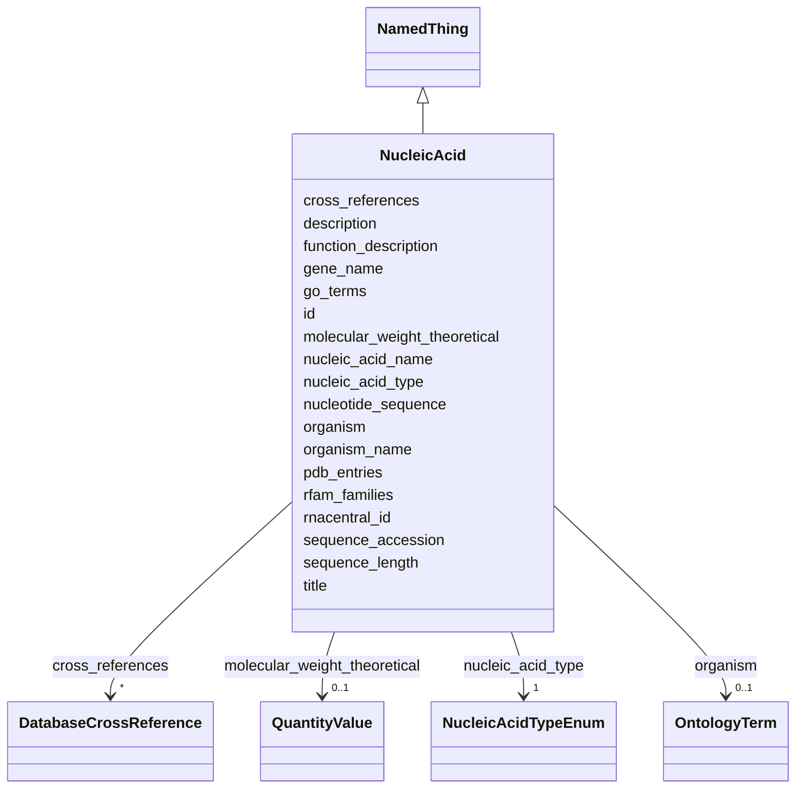

# Class: NucleicAcid 


_A nucleic acid as a molecular entity: one DNA, RNA or hybrid strand, with its sequence, type, source and the annotations that hold for it regardless of any one preparation. The counterpart of Protein for the other biopolymer. One NucleicAcid record is shared by every Sample that contains it, through SampleNucleicAcidAssociation. A duplex of two different strands is two records; a self-complementary duplex is one record with copy_number 2 on the association. Whether the strand is paired in a given sample, how it was made, and which chemical modifications it carries are preparation facts and live on the association._


URI: [lambda:NucleicAcid](http://w3id.org/lambda/NucleicAcid)





## Inheritance
* [NamedThing](NamedThing.md)
    * **NucleicAcid**


## Slots

| Name | Cardinality and Range | Description | Inheritance |
| ---  | --- | --- | --- |
| [nucleic_acid_type](nucleic_acid_type.md) | 1 <br/> [NucleicAcidTypeEnum](NucleicAcidTypeEnum.md) | Chemical type of the polymer: DNA, RNA, a DNA/RNA hybrid, or an analogue | direct |
| [nucleic_acid_name](nucleic_acid_name.md) | 0..1 _recommended_ <br/> [String](String.md) | Name as the depositor or database gives it (e | direct |
| [rnacentral_id](rnacentral_id.md) | 0..1 <br/> [Uriorcurie](Uriorcurie.md) | RNAcentral identifier as a Bioregistry CURIE (rnacentral:URS0000759CF4), opti... | direct |
| [sequence_accession](sequence_accession.md) | 0..1 <br/> [Uriorcurie](Uriorcurie.md) | Accession of the reference nucleotide sequence as a CURIE: RefSeq (refseq:NM_... | direct |
| [rfam_families](rfam_families.md) | * <br/> [Uriorcurie](Uriorcurie.md) | Rfam families the RNA belongs to, as CURIEs (rfam:RF00005 for tRNA) | direct |
| [gene_name](gene_name.md) | 0..1 <br/> [String](String.md) | Gene the sequence is transcribed from or taken from (e | direct |
| [organism](organism.md) | 0..1 <br/> [OntologyTerm](OntologyTerm.md) | Source organism as an NCBI Taxonomy CURIE (e | direct |
| [organism_name](organism_name.md) | 0..1 <br/> [String](String.md) | Scientific name of the source organism | direct |
| [nucleotide_sequence](nucleotide_sequence.md) | 0..1 <br/> [String](String.md) | Sequence in one-letter code, written 5' to 3' | direct |
| [sequence_length](sequence_length.md) | 0..1 <br/> [Integer](Integer.md) | Length of the sequence in nucleotides | direct |
| [molecular_weight_theoretical](molecular_weight_theoretical.md) | 0..1 <br/> [QuantityValue](QuantityValue.md) | Mass computed from the sequence, typically in kDa | direct |
| [function_description](function_description.md) | 0..1 <br/> [String](String.md) | Free-text summary of the molecule's role, typically from RNAcentral or the li... | direct |
| [go_terms](go_terms.md) | * <br/> [Uriorcurie](Uriorcurie.md) | Gene Ontology annotations as CURIEs (e | direct |
| [pdb_entries](pdb_entries.md) | * <br/> [Uriorcurie](Uriorcurie.md) | PDB entries containing this nucleic acid, as CURIEs (e | direct |
| [cross_references](cross_references.md) | * <br/> [DatabaseCrossReference](DatabaseCrossReference.md) | Cross-references to external databases other than those named by rnacentral_i... | direct |
| [id](id.md) | 1 <br/> [Uriorcurie](Uriorcurie.md) | Globally unique identifier as an IRI or CURIE for machine processing and exte... | [NamedThing](NamedThing.md) |
| [title](title.md) | 0..1 <br/> [String](String.md) | A human-readable name or title for this entity | [NamedThing](NamedThing.md) |
| [description](description.md) | 0..1 <br/> [String](String.md) | A detailed textual description of this entity | [NamedThing](NamedThing.md) |


## Usages

| used by | used in | type | used |
| ---  | --- | --- | --- |
| [Dataset](Dataset.md) | [nucleic_acids](nucleic_acids.md) | range | [NucleicAcid](NucleicAcid.md) |
| [SampleNucleicAcidAssociation](SampleNucleicAcidAssociation.md) | [nucleic_acid_id](nucleic_acid_id.md) | range | [NucleicAcid](NucleicAcid.md) |


## Comments

* Nucleic acids have no single registry the way proteins have UniProt. Use RNAcentral for a non-coding RNA (rnacentral:URS0000759CF4), RefSeq or INSDC for a transcript or genomic sequence (refseq:NM_000518, insdc:J00153), and a lambda-prefixed id for a synthetic oligonucleotide, which is most of what structural biology sees. A record derived from a PDB entry may be named by entry and entity (pdb:1AAY/nucleic_acid/1).
* Modified nucleotides that belong to the molecule itself, such as the modified bases of a mature tRNA, are part of its identity and are noted in description or cross_references. Modifications introduced for a preparation - labels, 2'-O-methyl groups, phosphorothioate linkages - go on SampleNucleicAcidAssociation.modifications.

## Identifier and Mapping Information


### Valid ID Prefixes

Instances of this class *should* have identifiers with one of the following prefixes:

* rnacentral

* refseq

* insdc

* lambda

* pdb


### Schema Source


* from schema: http://w3id.org/lambda/


## Mappings

| Mapping Type | Mapped Value |
| ---  | ---  |
| self | lambda:NucleicAcid |
| native | lambda:NucleicAcid |
| related | mmCIF:_entity, mmCIF:_entity_poly |


## LinkML Source

<!-- TODO: investigate https://stackoverflow.com/questions/37606292/how-to-create-tabbed-code-blocks-in-mkdocs-or-sphinx -->

### Direct

<details>
```yaml
name: NucleicAcid
id_prefixes:
- rnacentral
- refseq
- insdc
- lambda
- pdb
description: 'A nucleic acid as a molecular entity: one DNA, RNA or hybrid strand,
  with its sequence, type, source and the annotations that hold for it regardless
  of any one preparation. The counterpart of Protein for the other biopolymer. One
  NucleicAcid record is shared by every Sample that contains it, through SampleNucleicAcidAssociation.
  A duplex of two different strands is two records; a self-complementary duplex is
  one record with copy_number 2 on the association. Whether the strand is paired in
  a given sample, how it was made, and which chemical modifications it carries are
  preparation facts and live on the association.'
comments:
- Nucleic acids have no single registry the way proteins have UniProt. Use RNAcentral
  for a non-coding RNA (rnacentral:URS0000759CF4), RefSeq or INSDC for a transcript
  or genomic sequence (refseq:NM_000518, insdc:J00153), and a lambda-prefixed id for
  a synthetic oligonucleotide, which is most of what structural biology sees. A record
  derived from a PDB entry may be named by entry and entity (pdb:1AAY/nucleic_acid/1).
- Modified nucleotides that belong to the molecule itself, such as the modified bases
  of a mature tRNA, are part of its identity and are noted in description or cross_references.
  Modifications introduced for a preparation - labels, 2'-O-methyl groups, phosphorothioate
  linkages - go on SampleNucleicAcidAssociation.modifications.
from_schema: http://w3id.org/lambda/
related_mappings:
- mmCIF:_entity
- mmCIF:_entity_poly
is_a: NamedThing
attributes:
  nucleic_acid_type:
    name: nucleic_acid_type
    description: 'Chemical type of the polymer: DNA, RNA, a DNA/RNA hybrid, or an
      analogue'
    from_schema: http://w3id.org/lambda/
    exact_mappings:
    - mmCIF:_entity_poly.type
    rank: 1000
    domain_of:
    - NucleicAcid
    range: NucleicAcidTypeEnum
    required: true
  nucleic_acid_name:
    name: nucleic_acid_name
    description: Name as the depositor or database gives it (e.g., 'tRNA-Phe', 'Dickerson
      dodecamer', 'sgRNA targeting EMX1'). Recommended, not required, so that a record
      seeded from an accession alone can be enriched later.
    from_schema: http://w3id.org/lambda/
    related_mappings:
    - mmCIF:_entity.pdbx_description
    rank: 1000
    domain_of:
    - NucleicAcid
    recommended: true
  rnacentral_id:
    name: rnacentral_id
    description: RNAcentral identifier as a Bioregistry CURIE (rnacentral:URS0000759CF4),
      optionally with the taxon suffix (rnacentral:URS0000759CF4_9606). For non-coding
      RNAs. Normally identical to id when set.
    from_schema: http://w3id.org/lambda/
    rank: 1000
    domain_of:
    - NucleicAcid
    range: uriorcurie
    pattern: ^rnacentral:URS[0-9A-F]{10}(_[0-9]+)?$
  sequence_accession:
    name: sequence_accession
    description: 'Accession of the reference nucleotide sequence as a CURIE: RefSeq
      (refseq:NM_000518.5) or INSDC, which covers GenBank, ENA and DDBJ (insdc:J00153.1).
      For transcripts, genes and genomic fragments; a synthetic oligonucleotide has
      none.'
    from_schema: http://w3id.org/lambda/
    exact_mappings:
    - mmCIF:_struct_ref.pdbx_db_accession
    rank: 1000
    domain_of:
    - NucleicAcid
    range: uriorcurie
    pattern: ^(refseq|insdc):[A-Z][A-Z0-9_]*[0-9](\.[0-9]+)?$
  rfam_families:
    name: rfam_families
    description: Rfam families the RNA belongs to, as CURIEs (rfam:RF00005 for tRNA)
    from_schema: http://w3id.org/lambda/
    rank: 1000
    domain_of:
    - NucleicAcid
    range: uriorcurie
    multivalued: true
    pattern: ^rfam:RF[0-9]{5}$
  gene_name:
    name: gene_name
    description: Gene the sequence is transcribed from or taken from (e.g., HBB for
      a beta-globin mRNA, EMX1 for the target site a guide RNA is designed against)
    from_schema: http://w3id.org/lambda/
    exact_mappings:
    - mmCIF:_entity_src_gen.pdbx_gene_src_gene
    domain_of:
    - Protein
    - ProteinConstruct
    - NucleicAcid
  organism:
    name: organism
    description: Source organism as an NCBI Taxonomy CURIE (e.g., NCBITaxon:9606).
      A chemically synthesized oligonucleotide is NCBITaxon:32630 (synthetic construct),
      as the PDB records it; a synthetic copy of a natural sequence may instead name
      the organism the sequence comes from, with the synthesis recorded in SampleNucleicAcidAssociation.source_method.
    from_schema: http://w3id.org/lambda/
    exact_mappings:
    - mmCIF:_entity_src_gen.pdbx_gene_src_ncbi_taxonomy_id
    domain_of:
    - Sample
    - Protein
    - NucleicAcid
    - AggregatedProteinView
    range: OntologyTerm
  organism_name:
    name: organism_name
    description: Scientific name of the source organism. For display, and for sources
      that give a name but no taxonomy identifier.
    from_schema: http://w3id.org/lambda/
    exact_mappings:
    - mmCIF:_entity_src_gen.pdbx_gene_src_scientific_name
    domain_of:
    - Protein
    - NucleicAcid
  nucleotide_sequence:
    name: nucleotide_sequence
    description: Sequence in one-letter code, written 5' to 3'. T for DNA, U for RNA;
      IUPAC ambiguity codes and I for inosine are allowed. A modified nucleotide is
      written as its parent base and described in the association's modifications
      or in cross_references.
    from_schema: http://w3id.org/lambda/
    exact_mappings:
    - mmCIF:_entity_poly.pdbx_seq_one_letter_code_can
    rank: 1000
    domain_of:
    - NucleicAcid
    pattern: ^[ACGTURYKMSWBDHVNI]+$
  sequence_length:
    name: sequence_length
    description: Length of the sequence in nucleotides
    from_schema: http://w3id.org/lambda/
    domain_of:
    - Protein
    - NucleicAcid
    range: integer
  molecular_weight_theoretical:
    name: molecular_weight_theoretical
    description: Mass computed from the sequence, typically in kDa. A mass measured
      for a given preparation belongs on SampleNucleicAcidAssociation.observed_molecular_weight.
    from_schema: http://w3id.org/lambda/
    related_mappings:
    - mmCIF:_entity.formula_weight
    domain_of:
    - Protein
    - NucleicAcid
    range: QuantityValue
    inlined: true
  function_description:
    name: function_description
    description: Free-text summary of the molecule's role, typically from RNAcentral
      or the literature
    from_schema: http://w3id.org/lambda/
    domain_of:
    - Protein
    - NucleicAcid
  go_terms:
    name: go_terms
    description: Gene Ontology annotations as CURIEs (e.g., GO:0030533 for triplet
      codon-amino acid adaptor activity)
    from_schema: http://w3id.org/lambda/
    domain_of:
    - Protein
    - NucleicAcid
    - FunctionalSite
    range: uriorcurie
    multivalued: true
  pdb_entries:
    name: pdb_entries
    description: PDB entries containing this nucleic acid, as CURIEs (e.g., pdb:1AAY)
    from_schema: http://w3id.org/lambda/
    domain_of:
    - Protein
    - NucleicAcid
    - ConformationalState
    - AggregatedProteinView
    range: uriorcurie
    multivalued: true
  cross_references:
    name: cross_references
    description: Cross-references to external databases other than those named by
      rnacentral_id, sequence_accession and rfam_families (miRBase, GtRNAdb, NDB,
      ...).
    from_schema: http://w3id.org/lambda/
    domain_of:
    - Protein
    - NucleicAcid
    - AggregatedProteinView
    range: DatabaseCrossReference
    multivalued: true
    inlined: true
    inlined_as_list: true

```
</details>

### Induced

<details>
```yaml
name: NucleicAcid
id_prefixes:
- rnacentral
- refseq
- insdc
- lambda
- pdb
description: 'A nucleic acid as a molecular entity: one DNA, RNA or hybrid strand,
  with its sequence, type, source and the annotations that hold for it regardless
  of any one preparation. The counterpart of Protein for the other biopolymer. One
  NucleicAcid record is shared by every Sample that contains it, through SampleNucleicAcidAssociation.
  A duplex of two different strands is two records; a self-complementary duplex is
  one record with copy_number 2 on the association. Whether the strand is paired in
  a given sample, how it was made, and which chemical modifications it carries are
  preparation facts and live on the association.'
comments:
- Nucleic acids have no single registry the way proteins have UniProt. Use RNAcentral
  for a non-coding RNA (rnacentral:URS0000759CF4), RefSeq or INSDC for a transcript
  or genomic sequence (refseq:NM_000518, insdc:J00153), and a lambda-prefixed id for
  a synthetic oligonucleotide, which is most of what structural biology sees. A record
  derived from a PDB entry may be named by entry and entity (pdb:1AAY/nucleic_acid/1).
- Modified nucleotides that belong to the molecule itself, such as the modified bases
  of a mature tRNA, are part of its identity and are noted in description or cross_references.
  Modifications introduced for a preparation - labels, 2'-O-methyl groups, phosphorothioate
  linkages - go on SampleNucleicAcidAssociation.modifications.
from_schema: http://w3id.org/lambda/
related_mappings:
- mmCIF:_entity
- mmCIF:_entity_poly
is_a: NamedThing
attributes:
  nucleic_acid_type:
    name: nucleic_acid_type
    description: 'Chemical type of the polymer: DNA, RNA, a DNA/RNA hybrid, or an
      analogue'
    from_schema: http://w3id.org/lambda/
    exact_mappings:
    - mmCIF:_entity_poly.type
    rank: 1000
    alias: nucleic_acid_type
    owner: NucleicAcid
    domain_of:
    - NucleicAcid
    range: NucleicAcidTypeEnum
    required: true
  nucleic_acid_name:
    name: nucleic_acid_name
    description: Name as the depositor or database gives it (e.g., 'tRNA-Phe', 'Dickerson
      dodecamer', 'sgRNA targeting EMX1'). Recommended, not required, so that a record
      seeded from an accession alone can be enriched later.
    from_schema: http://w3id.org/lambda/
    related_mappings:
    - mmCIF:_entity.pdbx_description
    rank: 1000
    alias: nucleic_acid_name
    owner: NucleicAcid
    domain_of:
    - NucleicAcid
    range: string
    recommended: true
  rnacentral_id:
    name: rnacentral_id
    description: RNAcentral identifier as a Bioregistry CURIE (rnacentral:URS0000759CF4),
      optionally with the taxon suffix (rnacentral:URS0000759CF4_9606). For non-coding
      RNAs. Normally identical to id when set.
    from_schema: http://w3id.org/lambda/
    rank: 1000
    alias: rnacentral_id
    owner: NucleicAcid
    domain_of:
    - NucleicAcid
    range: uriorcurie
    pattern: ^rnacentral:URS[0-9A-F]{10}(_[0-9]+)?$
  sequence_accession:
    name: sequence_accession
    description: 'Accession of the reference nucleotide sequence as a CURIE: RefSeq
      (refseq:NM_000518.5) or INSDC, which covers GenBank, ENA and DDBJ (insdc:J00153.1).
      For transcripts, genes and genomic fragments; a synthetic oligonucleotide has
      none.'
    from_schema: http://w3id.org/lambda/
    exact_mappings:
    - mmCIF:_struct_ref.pdbx_db_accession
    rank: 1000
    alias: sequence_accession
    owner: NucleicAcid
    domain_of:
    - NucleicAcid
    range: uriorcurie
    pattern: ^(refseq|insdc):[A-Z][A-Z0-9_]*[0-9](\.[0-9]+)?$
  rfam_families:
    name: rfam_families
    description: Rfam families the RNA belongs to, as CURIEs (rfam:RF00005 for tRNA)
    from_schema: http://w3id.org/lambda/
    rank: 1000
    alias: rfam_families
    owner: NucleicAcid
    domain_of:
    - NucleicAcid
    range: uriorcurie
    multivalued: true
    pattern: ^rfam:RF[0-9]{5}$
  gene_name:
    name: gene_name
    description: Gene the sequence is transcribed from or taken from (e.g., HBB for
      a beta-globin mRNA, EMX1 for the target site a guide RNA is designed against)
    from_schema: http://w3id.org/lambda/
    exact_mappings:
    - mmCIF:_entity_src_gen.pdbx_gene_src_gene
    alias: gene_name
    owner: NucleicAcid
    domain_of:
    - Protein
    - ProteinConstruct
    - NucleicAcid
    range: string
  organism:
    name: organism
    description: Source organism as an NCBI Taxonomy CURIE (e.g., NCBITaxon:9606).
      A chemically synthesized oligonucleotide is NCBITaxon:32630 (synthetic construct),
      as the PDB records it; a synthetic copy of a natural sequence may instead name
      the organism the sequence comes from, with the synthesis recorded in SampleNucleicAcidAssociation.source_method.
    from_schema: http://w3id.org/lambda/
    exact_mappings:
    - mmCIF:_entity_src_gen.pdbx_gene_src_ncbi_taxonomy_id
    alias: organism
    owner: NucleicAcid
    domain_of:
    - Sample
    - Protein
    - NucleicAcid
    - AggregatedProteinView
    range: OntologyTerm
  organism_name:
    name: organism_name
    description: Scientific name of the source organism. For display, and for sources
      that give a name but no taxonomy identifier.
    from_schema: http://w3id.org/lambda/
    exact_mappings:
    - mmCIF:_entity_src_gen.pdbx_gene_src_scientific_name
    alias: organism_name
    owner: NucleicAcid
    domain_of:
    - Protein
    - NucleicAcid
    range: string
  nucleotide_sequence:
    name: nucleotide_sequence
    description: Sequence in one-letter code, written 5' to 3'. T for DNA, U for RNA;
      IUPAC ambiguity codes and I for inosine are allowed. A modified nucleotide is
      written as its parent base and described in the association's modifications
      or in cross_references.
    from_schema: http://w3id.org/lambda/
    exact_mappings:
    - mmCIF:_entity_poly.pdbx_seq_one_letter_code_can
    rank: 1000
    alias: nucleotide_sequence
    owner: NucleicAcid
    domain_of:
    - NucleicAcid
    range: string
    pattern: ^[ACGTURYKMSWBDHVNI]+$
  sequence_length:
    name: sequence_length
    description: Length of the sequence in nucleotides
    from_schema: http://w3id.org/lambda/
    alias: sequence_length
    owner: NucleicAcid
    domain_of:
    - Protein
    - NucleicAcid
    range: integer
  molecular_weight_theoretical:
    name: molecular_weight_theoretical
    description: Mass computed from the sequence, typically in kDa. A mass measured
      for a given preparation belongs on SampleNucleicAcidAssociation.observed_molecular_weight.
    from_schema: http://w3id.org/lambda/
    related_mappings:
    - mmCIF:_entity.formula_weight
    alias: molecular_weight_theoretical
    owner: NucleicAcid
    domain_of:
    - Protein
    - NucleicAcid
    range: QuantityValue
    inlined: true
  function_description:
    name: function_description
    description: Free-text summary of the molecule's role, typically from RNAcentral
      or the literature
    from_schema: http://w3id.org/lambda/
    alias: function_description
    owner: NucleicAcid
    domain_of:
    - Protein
    - NucleicAcid
    range: string
  go_terms:
    name: go_terms
    description: Gene Ontology annotations as CURIEs (e.g., GO:0030533 for triplet
      codon-amino acid adaptor activity)
    from_schema: http://w3id.org/lambda/
    alias: go_terms
    owner: NucleicAcid
    domain_of:
    - Protein
    - NucleicAcid
    - FunctionalSite
    range: uriorcurie
    multivalued: true
  pdb_entries:
    name: pdb_entries
    description: PDB entries containing this nucleic acid, as CURIEs (e.g., pdb:1AAY)
    from_schema: http://w3id.org/lambda/
    alias: pdb_entries
    owner: NucleicAcid
    domain_of:
    - Protein
    - NucleicAcid
    - ConformationalState
    - AggregatedProteinView
    range: uriorcurie
    multivalued: true
  cross_references:
    name: cross_references
    description: Cross-references to external databases other than those named by
      rnacentral_id, sequence_accession and rfam_families (miRBase, GtRNAdb, NDB,
      ...).
    from_schema: http://w3id.org/lambda/
    alias: cross_references
    owner: NucleicAcid
    domain_of:
    - Protein
    - NucleicAcid
    - AggregatedProteinView
    range: DatabaseCrossReference
    multivalued: true
    inlined: true
    inlined_as_list: true
  id:
    name: id
    description: Globally unique identifier as an IRI or CURIE for machine processing
      and external references. Used for linking data across systems and semantic web
      integration.
    from_schema: http://w3id.org/lambda/
    rank: 1000
    identifier: true
    alias: id
    owner: NucleicAcid
    domain_of:
    - NamedThing
    - Attribute
    range: uriorcurie
    required: true
  title:
    name: title
    description: A human-readable name or title for this entity
    from_schema: http://w3id.org/lambda/
    rank: 1000
    slot_uri: dcterms:title
    alias: title
    owner: NucleicAcid
    domain_of:
    - NamedThing
    range: string
  description:
    name: description
    description: A detailed textual description of this entity
    from_schema: http://w3id.org/lambda/
    rank: 1000
    alias: description
    owner: NucleicAcid
    domain_of:
    - NamedThing
    - AttributeGroup
    range: string

```
</details>