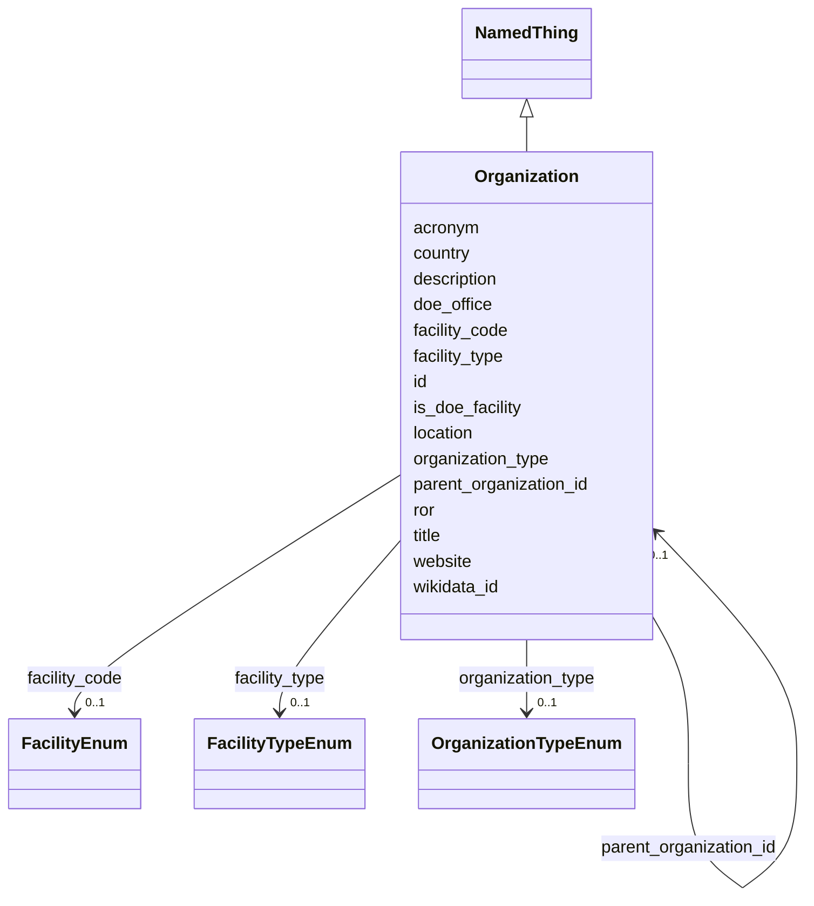

# Class: Organization 


_An institution, facility, laboratory or funding body - a national laboratory, a university, a light source, an agency that funded the work._

_This is the structured home for organizational identity that the schema otherwise carries as unvalidated free text in three places: the annotations on FacilityEnum permissible values (`parent_organization`, `parent_ror`, `location`, `country`, `doe_office`, `website`, `wikidata_id`), Instrument's `facility_name` / `facility_ror` pair, and Person's `affiliation` / `affiliation_ror` pair. FacilityEnum remains the controlled vocabulary that says *which* facility something is; Organization is the record that says what that facility is, where, and who runs it - and lets a parent institution be stated once rather than restated by every entity that refers to it._


URI: [lambda:Organization](http://w3id.org/lambda/Organization)





## Inheritance
* [NamedThing](NamedThing.md)
    * **Organization**


## Slots

| Name | Cardinality and Range | Description | Inheritance |
| ---  | --- | --- | --- |
| [ror](ror.md) | 0..1 <br/> [Uriorcurie](Uriorcurie.md) | Research Organization Registry (ROR) identifier for the organization | direct |
| [acronym](acronym.md) | 0..1 <br/> [String](String.md) | Short name or acronym, e | direct |
| [organization_type](organization_type.md) | 0..1 <br/> [OrganizationTypeEnum](OrganizationTypeEnum.md) | What kind of organization this is | direct |
| [facility_code](facility_code.md) | 0..1 <br/> [FacilityEnum](FacilityEnum.md) | The FacilityEnum term this organization corresponds to, where it is one of th... | direct |
| [facility_type](facility_type.md) | 0..1 <br/> [FacilityTypeEnum](FacilityTypeEnum.md) | For a research facility, the kind of facility it is | direct |
| [parent_organization_id](parent_organization_id.md) | 0..1 <br/> [Organization](Organization.md) | The organization this one belongs to - a light source's national laboratory, ... | direct |
| [location](location.md) | 0..1 <br/> [String](String.md) | Free-text location, e | direct |
| [country](country.md) | 0..1 <br/> [String](String.md) | Country the organization is located in | direct |
| [website](website.md) | 0..1 <br/> [Uriorcurie](Uriorcurie.md) | Organization or facility website | direct |
| [wikidata_id](wikidata_id.md) | 0..1 <br/> [String](String.md) | Wikidata entity identifier, where one exists | direct |
| [is_doe_facility](is_doe_facility.md) | 0..1 <br/> [Boolean](Boolean.md) | Whether this is a US Department of Energy facility | direct |
| [doe_office](doe_office.md) | 0..1 <br/> [String](String.md) | Sponsoring DOE office, e | direct |
| [id](id.md) | 1 <br/> [Uriorcurie](Uriorcurie.md) | Globally unique identifier as an IRI or CURIE for machine processing and exte... | [NamedThing](NamedThing.md) |
| [title](title.md) | 0..1 <br/> [String](String.md) | A human-readable name or title for this entity | [NamedThing](NamedThing.md) |
| [description](description.md) | 0..1 <br/> [String](String.md) | A detailed textual description of this entity | [NamedThing](NamedThing.md) |


## Usages

| used by | used in | type | used |
| ---  | --- | --- | --- |
| [Dataset](Dataset.md) | [organizations](organizations.md) | range | [Organization](Organization.md) |
| [Organization](Organization.md) | [parent_organization_id](parent_organization_id.md) | range | [Organization](Organization.md) |
| [Instrument](Instrument.md) | [facility_organization_id](facility_organization_id.md) | range | [Organization](Organization.md) |
| [CryoEMInstrument](CryoEMInstrument.md) | [facility_organization_id](facility_organization_id.md) | range | [Organization](Organization.md) |
| [XRayInstrument](XRayInstrument.md) | [facility_organization_id](facility_organization_id.md) | range | [Organization](Organization.md) |
| [SANSInstrument](SANSInstrument.md) | [facility_organization_id](facility_organization_id.md) | range | [Organization](Organization.md) |
| [SAXSInstrument](SAXSInstrument.md) | [facility_organization_id](facility_organization_id.md) | range | [Organization](Organization.md) |
| [BeamlineInstrument](BeamlineInstrument.md) | [facility_organization_id](facility_organization_id.md) | range | [Organization](Organization.md) |
| [StudyOrganizationAssociation](StudyOrganizationAssociation.md) | [organization_id](organization_id.md) | range | [Organization](Organization.md) |
| [PersonOrganizationAssociation](PersonOrganizationAssociation.md) | [organization_id](organization_id.md) | range | [Organization](Organization.md) |


## Comments

* As with Person, nothing beyond the inherited id is required: a ROR alone identifies an organization completely, and a source that gives only a name is common.

## Identifier and Mapping Information


### Schema Source


* from schema: http://w3id.org/lambda/


## Mappings

| Mapping Type | Mapped Value |
| ---  | ---  |
| self | lambda:Organization |
| native | lambda:Organization |
| exact | prov:Organization |


## LinkML Source

<!-- TODO: investigate https://stackoverflow.com/questions/37606292/how-to-create-tabbed-code-blocks-in-mkdocs-or-sphinx -->

### Direct

<details>
```yaml
name: Organization
description: 'An institution, facility, laboratory or funding body - a national laboratory,
  a university, a light source, an agency that funded the work.

  This is the structured home for organizational identity that the schema otherwise
  carries as unvalidated free text in three places: the annotations on FacilityEnum
  permissible values (`parent_organization`, `parent_ror`, `location`, `country`,
  `doe_office`, `website`, `wikidata_id`), Instrument''s `facility_name` / `facility_ror`
  pair, and Person''s `affiliation` / `affiliation_ror` pair. FacilityEnum remains
  the controlled vocabulary that says *which* facility something is; Organization
  is the record that says what that facility is, where, and who runs it - and lets
  a parent institution be stated once rather than restated by every entity that refers
  to it.'
comments:
- 'As with Person, nothing beyond the inherited id is required: a ROR alone identifies
  an organization completely, and a source that gives only a name is common.'
from_schema: http://w3id.org/lambda/
exact_mappings:
- prov:Organization
is_a: NamedThing
attributes:
  ror:
    name: ror
    description: Research Organization Registry (ROR) identifier for the organization
    comments:
    - The preferred way to identify an organization
    - Every FacilityEnum permissible value already carries its ROR as the term's meaning
    - 'Example: https://ror.org/02jbv0t02 (Lawrence Berkeley National Laboratory)'
    from_schema: http://w3id.org/lambda/
    rank: 1000
    domain_of:
    - Organization
    range: uriorcurie
    pattern: ^https://ror\.org/\w+$
  acronym:
    name: acronym
    description: Short name or acronym, e.g. 'LBNL', 'SSRL', 'PNNL'
    from_schema: http://w3id.org/lambda/
    rank: 1000
    domain_of:
    - Organization
    range: string
  organization_type:
    name: organization_type
    description: What kind of organization this is
    from_schema: http://w3id.org/lambda/
    rank: 1000
    domain_of:
    - Organization
    range: OrganizationTypeEnum
  facility_code:
    name: facility_code
    description: The FacilityEnum term this organization corresponds to, where it
      is one of the facilities the schema already names. Ties the record to the search
      vocabulary.
    from_schema: http://w3id.org/lambda/
    rank: 1000
    domain_of:
    - Organization
    range: FacilityEnum
  facility_type:
    name: facility_type
    description: For a research facility, the kind of facility it is
    from_schema: http://w3id.org/lambda/
    rank: 1000
    domain_of:
    - Organization
    range: FacilityTypeEnum
  parent_organization_id:
    name: parent_organization_id
    description: The organization this one belongs to - a light source's national
      laboratory, a department's university. Self-referential, as Sample.parent_sample_id
      is.
    from_schema: http://w3id.org/lambda/
    rank: 1000
    domain_of:
    - Organization
    range: Organization
  location:
    name: location
    description: Free-text location, e.g. 'Berkeley, California, USA'
    from_schema: http://w3id.org/lambda/
    rank: 1000
    domain_of:
    - Organization
    range: string
  country:
    name: country
    description: Country the organization is located in
    from_schema: http://w3id.org/lambda/
    rank: 1000
    domain_of:
    - Organization
    range: string
  website:
    name: website
    description: Organization or facility website
    from_schema: http://w3id.org/lambda/
    rank: 1000
    domain_of:
    - Organization
    - BeamlineInstrument
    range: uriorcurie
  wikidata_id:
    name: wikidata_id
    description: Wikidata entity identifier, where one exists
    from_schema: http://w3id.org/lambda/
    rank: 1000
    domain_of:
    - Organization
    range: string
  is_doe_facility:
    name: is_doe_facility
    description: Whether this is a US Department of Energy facility
    from_schema: http://w3id.org/lambda/
    rank: 1000
    domain_of:
    - Organization
    range: boolean
  doe_office:
    name: doe_office
    description: Sponsoring DOE office, e.g. 'Office of Science'
    from_schema: http://w3id.org/lambda/
    rank: 1000
    domain_of:
    - Organization
    range: string

```
</details>

### Induced

<details>
```yaml
name: Organization
description: 'An institution, facility, laboratory or funding body - a national laboratory,
  a university, a light source, an agency that funded the work.

  This is the structured home for organizational identity that the schema otherwise
  carries as unvalidated free text in three places: the annotations on FacilityEnum
  permissible values (`parent_organization`, `parent_ror`, `location`, `country`,
  `doe_office`, `website`, `wikidata_id`), Instrument''s `facility_name` / `facility_ror`
  pair, and Person''s `affiliation` / `affiliation_ror` pair. FacilityEnum remains
  the controlled vocabulary that says *which* facility something is; Organization
  is the record that says what that facility is, where, and who runs it - and lets
  a parent institution be stated once rather than restated by every entity that refers
  to it.'
comments:
- 'As with Person, nothing beyond the inherited id is required: a ROR alone identifies
  an organization completely, and a source that gives only a name is common.'
from_schema: http://w3id.org/lambda/
exact_mappings:
- prov:Organization
is_a: NamedThing
attributes:
  ror:
    name: ror
    description: Research Organization Registry (ROR) identifier for the organization
    comments:
    - The preferred way to identify an organization
    - Every FacilityEnum permissible value already carries its ROR as the term's meaning
    - 'Example: https://ror.org/02jbv0t02 (Lawrence Berkeley National Laboratory)'
    from_schema: http://w3id.org/lambda/
    rank: 1000
    alias: ror
    owner: Organization
    domain_of:
    - Organization
    range: uriorcurie
    pattern: ^https://ror\.org/\w+$
  acronym:
    name: acronym
    description: Short name or acronym, e.g. 'LBNL', 'SSRL', 'PNNL'
    from_schema: http://w3id.org/lambda/
    rank: 1000
    alias: acronym
    owner: Organization
    domain_of:
    - Organization
    range: string
  organization_type:
    name: organization_type
    description: What kind of organization this is
    from_schema: http://w3id.org/lambda/
    rank: 1000
    alias: organization_type
    owner: Organization
    domain_of:
    - Organization
    range: OrganizationTypeEnum
  facility_code:
    name: facility_code
    description: The FacilityEnum term this organization corresponds to, where it
      is one of the facilities the schema already names. Ties the record to the search
      vocabulary.
    from_schema: http://w3id.org/lambda/
    rank: 1000
    alias: facility_code
    owner: Organization
    domain_of:
    - Organization
    range: FacilityEnum
  facility_type:
    name: facility_type
    description: For a research facility, the kind of facility it is
    from_schema: http://w3id.org/lambda/
    rank: 1000
    alias: facility_type
    owner: Organization
    domain_of:
    - Organization
    range: FacilityTypeEnum
  parent_organization_id:
    name: parent_organization_id
    description: The organization this one belongs to - a light source's national
      laboratory, a department's university. Self-referential, as Sample.parent_sample_id
      is.
    from_schema: http://w3id.org/lambda/
    rank: 1000
    alias: parent_organization_id
    owner: Organization
    domain_of:
    - Organization
    range: Organization
  location:
    name: location
    description: Free-text location, e.g. 'Berkeley, California, USA'
    from_schema: http://w3id.org/lambda/
    rank: 1000
    alias: location
    owner: Organization
    domain_of:
    - Organization
    range: string
  country:
    name: country
    description: Country the organization is located in
    from_schema: http://w3id.org/lambda/
    rank: 1000
    alias: country
    owner: Organization
    domain_of:
    - Organization
    range: string
  website:
    name: website
    description: Organization or facility website
    from_schema: http://w3id.org/lambda/
    rank: 1000
    alias: website
    owner: Organization
    domain_of:
    - Organization
    - BeamlineInstrument
    range: uriorcurie
  wikidata_id:
    name: wikidata_id
    description: Wikidata entity identifier, where one exists
    from_schema: http://w3id.org/lambda/
    rank: 1000
    alias: wikidata_id
    owner: Organization
    domain_of:
    - Organization
    range: string
  is_doe_facility:
    name: is_doe_facility
    description: Whether this is a US Department of Energy facility
    from_schema: http://w3id.org/lambda/
    rank: 1000
    alias: is_doe_facility
    owner: Organization
    domain_of:
    - Organization
    range: boolean
  doe_office:
    name: doe_office
    description: Sponsoring DOE office, e.g. 'Office of Science'
    from_schema: http://w3id.org/lambda/
    rank: 1000
    alias: doe_office
    owner: Organization
    domain_of:
    - Organization
    range: string
  id:
    name: id
    description: Globally unique identifier as an IRI or CURIE for machine processing
      and external references. Used for linking data across systems and semantic web
      integration.
    from_schema: http://w3id.org/lambda/
    rank: 1000
    identifier: true
    alias: id
    owner: Organization
    domain_of:
    - NamedThing
    - Attribute
    range: uriorcurie
    required: true
  title:
    name: title
    description: A human-readable name or title for this entity
    from_schema: http://w3id.org/lambda/
    rank: 1000
    slot_uri: dcterms:title
    alias: title
    owner: Organization
    domain_of:
    - NamedThing
    range: string
  description:
    name: description
    description: A detailed textual description of this entity
    from_schema: http://w3id.org/lambda/
    rank: 1000
    alias: description
    owner: Organization
    domain_of:
    - NamedThing
    - AttributeGroup
    range: string

```
</details>