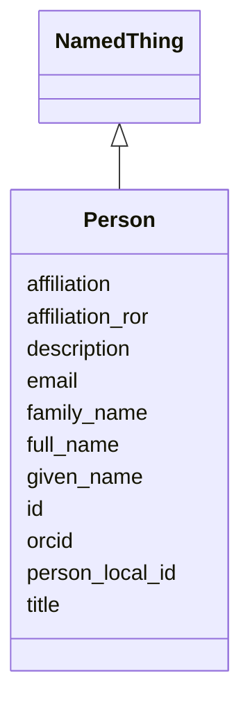

# Class: Person 


_A person involved in producing, processing or publishing data - a principal investigator, beamline operator, data analyst or curator. In the relational model, Person is lightweight: which study, experiment or workflow a person is attached to, and in what capacity, is carried by the person association tables in Dataset, so one person record serves every role they hold across a dataset._


URI: [lambda:Person](http://w3id.org/lambda/Person)





## Inheritance
* [NamedThing](NamedThing.md)
    * **Person**


## Slots

| Name | Cardinality and Range | Description | Inheritance |
| ---  | --- | --- | --- |
| [orcid](orcid.md) | 0..1 <br/> [Uriorcurie](Uriorcurie.md) | ORCID identifier for the person | direct |
| [full_name](full_name.md) | 0..1 <br/> [String](String.md) | Full formal name of the person, as they write it in publications | direct |
| [given_name](given_name.md) | 0..1 <br/> [String](String.md) | Given (personal) name, where the name has been parsed into parts | direct |
| [family_name](family_name.md) | 0..1 <br/> [String](String.md) | Family name, where the name has been parsed into parts | direct |
| [email](email.md) | 0..1 <br/> [String](String.md) | Contact email address | direct |
| [affiliation](affiliation.md) | 0..1 <br/> [String](String.md) | Institution the person is affiliated with | direct |
| [affiliation_ror](affiliation_ror.md) | 0..1 <br/> [Uriorcurie](Uriorcurie.md) | Research Organization Registry (ROR) identifier for the affiliated institutio... | direct |
| [person_local_id](person_local_id.md) | 0..1 <br/> [String](String.md) | Facility-local user or badge identifier, where one exists | direct |
| [id](id.md) | 1 <br/> [Uriorcurie](Uriorcurie.md) | Globally unique identifier as an IRI or CURIE for machine processing and exte... | [NamedThing](NamedThing.md) |
| [title](title.md) | 0..1 <br/> [String](String.md) | A human-readable name or title for this entity | [NamedThing](NamedThing.md) |
| [description](description.md) | 0..1 <br/> [String](String.md) | A detailed textual description of this entity | [NamedThing](NamedThing.md) |


## Usages

| used by | used in | type | used |
| ---  | --- | --- | --- |
| [Dataset](Dataset.md) | [persons](persons.md) | range | [Person](Person.md) |
| [StudyPersonAssociation](StudyPersonAssociation.md) | [person_id](person_id.md) | range | [Person](Person.md) |
| [ExperimentPersonAssociation](ExperimentPersonAssociation.md) | [person_id](person_id.md) | range | [Person](Person.md) |
| [WorkflowPersonAssociation](WorkflowPersonAssociation.md) | [person_id](person_id.md) | range | [Person](Person.md) |
| [PersonOrganizationAssociation](PersonOrganizationAssociation.md) | [person_id](person_id.md) | range | [Person](Person.md) |


## Comments

* No slot is required beyond the inherited id. An ORCID alone is a complete identification of a person, and a source that publishes only a name is equally common - so neither can be insisted upon. Where a name is genuinely unavailable, record that fact rather than substituting the identifier for it.

## Identifier and Mapping Information


### Schema Source


* from schema: http://w3id.org/lambda/


## Mappings

| Mapping Type | Mapped Value |
| ---  | ---  |
| self | lambda:Person |
| native | lambda:Person |
| exact | prov:Agent |


## LinkML Source

<!-- TODO: investigate https://stackoverflow.com/questions/37606292/how-to-create-tabbed-code-blocks-in-mkdocs-or-sphinx -->

### Direct

<details>
```yaml
name: Person
description: 'A person involved in producing, processing or publishing data - a principal
  investigator, beamline operator, data analyst or curator. In the relational model,
  Person is lightweight: which study, experiment or workflow a person is attached
  to, and in what capacity, is carried by the person association tables in Dataset,
  so one person record serves every role they hold across a dataset.'
comments:
- No slot is required beyond the inherited id. An ORCID alone is a complete identification
  of a person, and a source that publishes only a name is equally common - so neither
  can be insisted upon. Where a name is genuinely unavailable, record that fact rather
  than substituting the identifier for it.
from_schema: http://w3id.org/lambda/
exact_mappings:
- prov:Agent
is_a: NamedThing
attributes:
  orcid:
    name: orcid
    description: ORCID identifier for the person
    comments:
    - Persistent identifier for the individual; the preferred way to identify a person
    - 'Example: https://orcid.org/0000-0002-1885-1511'
    from_schema: http://w3id.org/lambda/
    rank: 1000
    domain_of:
    - Person
    range: uriorcurie
    pattern: ^https://orcid\.org/\d{4}-\d{4}-\d{4}-\d{3}[0-9X]$
  full_name:
    name: full_name
    description: Full formal name of the person, as they write it in publications
    comments:
    - Overlaps the inherited `title`, deliberately but not redundantly. `title` is
      the display label every NamedThing carries and is what a listing shows ("Clyde
      Smith"); `full_name` is the formal name a citation needs ("Clyde A. Smith").
      They are equal often enough that a consumer reading only one is usually fine,
      so record `title` whenever `full_name` is known - a Person with a formal name
      and no display label is awkward for every UI that treats NamedThing uniformly.
    - Where the two would be identical, carrying only `title` is correct and `full_name`
      adds nothing.
    from_schema: http://w3id.org/lambda/
    close_mappings:
    - lambda:title
    rank: 1000
    domain_of:
    - Person
    range: string
  given_name:
    name: given_name
    description: Given (personal) name, where the name has been parsed into parts
    from_schema: http://w3id.org/lambda/
    rank: 1000
    domain_of:
    - Person
    range: string
  family_name:
    name: family_name
    description: Family name, where the name has been parsed into parts
    from_schema: http://w3id.org/lambda/
    rank: 1000
    domain_of:
    - Person
    range: string
  email:
    name: email
    description: Contact email address
    from_schema: http://w3id.org/lambda/
    rank: 1000
    domain_of:
    - Person
    range: string
  affiliation:
    name: affiliation
    description: Institution the person is affiliated with
    from_schema: http://w3id.org/lambda/
    rank: 1000
    domain_of:
    - Person
    range: string
  affiliation_ror:
    name: affiliation_ror
    description: Research Organization Registry (ROR) identifier for the affiliated
      institution
    comments:
    - Free-text convenience, retained for sources that publish only an affiliation
      string. Where the institution can be resolved, prefer an Organization record
      linked by PersonOrganizationAssociation, which can carry more than one affiliation
      and date them.
    from_schema: http://w3id.org/lambda/
    rank: 1000
    domain_of:
    - Person
    range: uriorcurie
    pattern: ^https://ror\.org/\w+$
  person_local_id:
    name: person_local_id
    description: Facility-local user or badge identifier, where one exists
    from_schema: http://w3id.org/lambda/
    rank: 1000
    domain_of:
    - Person
    range: string

```
</details>

### Induced

<details>
```yaml
name: Person
description: 'A person involved in producing, processing or publishing data - a principal
  investigator, beamline operator, data analyst or curator. In the relational model,
  Person is lightweight: which study, experiment or workflow a person is attached
  to, and in what capacity, is carried by the person association tables in Dataset,
  so one person record serves every role they hold across a dataset.'
comments:
- No slot is required beyond the inherited id. An ORCID alone is a complete identification
  of a person, and a source that publishes only a name is equally common - so neither
  can be insisted upon. Where a name is genuinely unavailable, record that fact rather
  than substituting the identifier for it.
from_schema: http://w3id.org/lambda/
exact_mappings:
- prov:Agent
is_a: NamedThing
attributes:
  orcid:
    name: orcid
    description: ORCID identifier for the person
    comments:
    - Persistent identifier for the individual; the preferred way to identify a person
    - 'Example: https://orcid.org/0000-0002-1885-1511'
    from_schema: http://w3id.org/lambda/
    rank: 1000
    alias: orcid
    owner: Person
    domain_of:
    - Person
    range: uriorcurie
    pattern: ^https://orcid\.org/\d{4}-\d{4}-\d{4}-\d{3}[0-9X]$
  full_name:
    name: full_name
    description: Full formal name of the person, as they write it in publications
    comments:
    - Overlaps the inherited `title`, deliberately but not redundantly. `title` is
      the display label every NamedThing carries and is what a listing shows ("Clyde
      Smith"); `full_name` is the formal name a citation needs ("Clyde A. Smith").
      They are equal often enough that a consumer reading only one is usually fine,
      so record `title` whenever `full_name` is known - a Person with a formal name
      and no display label is awkward for every UI that treats NamedThing uniformly.
    - Where the two would be identical, carrying only `title` is correct and `full_name`
      adds nothing.
    from_schema: http://w3id.org/lambda/
    close_mappings:
    - lambda:title
    rank: 1000
    alias: full_name
    owner: Person
    domain_of:
    - Person
    range: string
  given_name:
    name: given_name
    description: Given (personal) name, where the name has been parsed into parts
    from_schema: http://w3id.org/lambda/
    rank: 1000
    alias: given_name
    owner: Person
    domain_of:
    - Person
    range: string
  family_name:
    name: family_name
    description: Family name, where the name has been parsed into parts
    from_schema: http://w3id.org/lambda/
    rank: 1000
    alias: family_name
    owner: Person
    domain_of:
    - Person
    range: string
  email:
    name: email
    description: Contact email address
    from_schema: http://w3id.org/lambda/
    rank: 1000
    alias: email
    owner: Person
    domain_of:
    - Person
    range: string
  affiliation:
    name: affiliation
    description: Institution the person is affiliated with
    from_schema: http://w3id.org/lambda/
    rank: 1000
    alias: affiliation
    owner: Person
    domain_of:
    - Person
    range: string
  affiliation_ror:
    name: affiliation_ror
    description: Research Organization Registry (ROR) identifier for the affiliated
      institution
    comments:
    - Free-text convenience, retained for sources that publish only an affiliation
      string. Where the institution can be resolved, prefer an Organization record
      linked by PersonOrganizationAssociation, which can carry more than one affiliation
      and date them.
    from_schema: http://w3id.org/lambda/
    rank: 1000
    alias: affiliation_ror
    owner: Person
    domain_of:
    - Person
    range: uriorcurie
    pattern: ^https://ror\.org/\w+$
  person_local_id:
    name: person_local_id
    description: Facility-local user or badge identifier, where one exists
    from_schema: http://w3id.org/lambda/
    rank: 1000
    alias: person_local_id
    owner: Person
    domain_of:
    - Person
    range: string
  id:
    name: id
    description: Globally unique identifier as an IRI or CURIE for machine processing
      and external references. Used for linking data across systems and semantic web
      integration.
    from_schema: http://w3id.org/lambda/
    rank: 1000
    identifier: true
    alias: id
    owner: Person
    domain_of:
    - NamedThing
    - Attribute
    range: uriorcurie
    required: true
  title:
    name: title
    description: A human-readable name or title for this entity
    from_schema: http://w3id.org/lambda/
    rank: 1000
    slot_uri: dcterms:title
    alias: title
    owner: Person
    domain_of:
    - NamedThing
    range: string
  description:
    name: description
    description: A detailed textual description of this entity
    from_schema: http://w3id.org/lambda/
    rank: 1000
    alias: description
    owner: Person
    domain_of:
    - NamedThing
    - AttributeGroup
    range: string

```
</details>