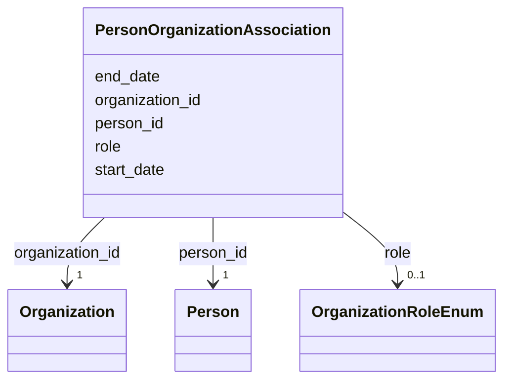

# Class: PersonOrganizationAssociation 


_M:N link between Person and Organization with role metadata. An association table rather than a slot on Person because people hold several affiliations at once and move between them, and a dataset's provenance may need to say which affiliation applied at the time._


URI: [lambda:PersonOrganizationAssociation](http://w3id.org/lambda/PersonOrganizationAssociation)





<!-- no inheritance hierarchy -->


## Slots

| Name | Cardinality and Range | Description | Inheritance |
| ---  | --- | --- | --- |
| [person_id](person_id.md) | 1 <br/> [Person](Person.md) | Reference to the person | direct |
| [organization_id](organization_id.md) | 1 <br/> [Organization](Organization.md) | Reference to the organization | direct |
| [role](role.md) | 0..1 <br/> [OrganizationRoleEnum](OrganizationRoleEnum.md) | Nature of the person's attachment to the organization | direct |
| [start_date](start_date.md) | 0..1 <br/> [String](String.md) | Date the affiliation began, where known | direct |
| [end_date](end_date.md) | 0..1 <br/> [String](String.md) | Date the affiliation ended, where known and ended | direct |


## Usages

| used by | used in | type | used |
| ---  | --- | --- | --- |
| [Dataset](Dataset.md) | [person_organization_associations](person_organization_associations.md) | range | [PersonOrganizationAssociation](PersonOrganizationAssociation.md) |


## Identifier and Mapping Information


### Schema Source


* from schema: http://w3id.org/lambda/


## Mappings

| Mapping Type | Mapped Value |
| ---  | ---  |
| self | lambda:PersonOrganizationAssociation |
| native | lambda:PersonOrganizationAssociation |


## LinkML Source

<!-- TODO: investigate https://stackoverflow.com/questions/37606292/how-to-create-tabbed-code-blocks-in-mkdocs-or-sphinx -->

### Direct

<details>
```yaml
name: PersonOrganizationAssociation
description: M:N link between Person and Organization with role metadata. An association
  table rather than a slot on Person because people hold several affiliations at once
  and move between them, and a dataset's provenance may need to say which affiliation
  applied at the time.
from_schema: http://w3id.org/lambda/
attributes:
  person_id:
    name: person_id
    description: Reference to the person
    from_schema: http://w3id.org/lambda/
    domain_of:
    - StudyPersonAssociation
    - ExperimentPersonAssociation
    - WorkflowPersonAssociation
    - PersonOrganizationAssociation
    range: Person
    required: true
  organization_id:
    name: organization_id
    description: Reference to the organization
    from_schema: http://w3id.org/lambda/
    domain_of:
    - StudyOrganizationAssociation
    - PersonOrganizationAssociation
    range: Organization
    required: true
  role:
    name: role
    description: Nature of the person's attachment to the organization
    from_schema: http://w3id.org/lambda/
    domain_of:
    - StudySampleAssociation
    - ExperimentSampleAssociation
    - SampleProteinAssociation
    - ExperimentInstrumentAssociation
    - StudyPersonAssociation
    - ExperimentPersonAssociation
    - WorkflowPersonAssociation
    - StudyOrganizationAssociation
    - PersonOrganizationAssociation
    range: OrganizationRoleEnum
  start_date:
    name: start_date
    description: Date the affiliation began, where known
    from_schema: http://w3id.org/lambda/
    rank: 1000
    domain_of:
    - PersonOrganizationAssociation
    range: string
  end_date:
    name: end_date
    description: Date the affiliation ended, where known and ended
    from_schema: http://w3id.org/lambda/
    rank: 1000
    domain_of:
    - PersonOrganizationAssociation
    range: string

```
</details>

### Induced

<details>
```yaml
name: PersonOrganizationAssociation
description: M:N link between Person and Organization with role metadata. An association
  table rather than a slot on Person because people hold several affiliations at once
  and move between them, and a dataset's provenance may need to say which affiliation
  applied at the time.
from_schema: http://w3id.org/lambda/
attributes:
  person_id:
    name: person_id
    description: Reference to the person
    from_schema: http://w3id.org/lambda/
    alias: person_id
    owner: PersonOrganizationAssociation
    domain_of:
    - StudyPersonAssociation
    - ExperimentPersonAssociation
    - WorkflowPersonAssociation
    - PersonOrganizationAssociation
    range: Person
    required: true
  organization_id:
    name: organization_id
    description: Reference to the organization
    from_schema: http://w3id.org/lambda/
    alias: organization_id
    owner: PersonOrganizationAssociation
    domain_of:
    - StudyOrganizationAssociation
    - PersonOrganizationAssociation
    range: Organization
    required: true
  role:
    name: role
    description: Nature of the person's attachment to the organization
    from_schema: http://w3id.org/lambda/
    alias: role
    owner: PersonOrganizationAssociation
    domain_of:
    - StudySampleAssociation
    - ExperimentSampleAssociation
    - SampleProteinAssociation
    - ExperimentInstrumentAssociation
    - StudyPersonAssociation
    - ExperimentPersonAssociation
    - WorkflowPersonAssociation
    - StudyOrganizationAssociation
    - PersonOrganizationAssociation
    range: OrganizationRoleEnum
  start_date:
    name: start_date
    description: Date the affiliation began, where known
    from_schema: http://w3id.org/lambda/
    rank: 1000
    alias: start_date
    owner: PersonOrganizationAssociation
    domain_of:
    - PersonOrganizationAssociation
    range: string
  end_date:
    name: end_date
    description: Date the affiliation ended, where known and ended
    from_schema: http://w3id.org/lambda/
    rank: 1000
    alias: end_date
    owner: PersonOrganizationAssociation
    domain_of:
    - PersonOrganizationAssociation
    range: string

```
</details>