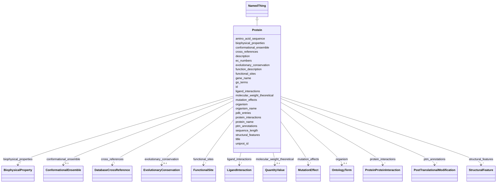

# Class: Protein 


_A protein as a biological entity: its sequence, source organism, gene, and the functional and structural annotations that hold for it regardless of any one preparation. One Protein record is shared by every Sample that contains it, through SampleProteinAssociation. Facts about a particular preparation - buffer, concentration, tags left on, the residue range actually present, the mass actually measured - stay on Sample and on the association._


URI: [lambda:Protein](http://w3id.org/lambda/Protein)





## Inheritance
* [NamedThing](NamedThing.md)
    * **Protein**


## Slots

| Name | Cardinality and Range | Description | Inheritance |
| ---  | --- | --- | --- |
| [uniprot_id](uniprot_id.md) | 0..1 _recommended_ <br/> [Uriorcurie](Uriorcurie.md) | UniProt accession as a Bioregistry CURIE (e | direct |
| [protein_name](protein_name.md) | 0..1 _recommended_ <br/> [String](String.md) | Recommended protein name, as UniProt or the depositor gives it | direct |
| [gene_name](gene_name.md) | 0..1 <br/> [String](String.md) | Primary gene symbol (e | direct |
| [organism](organism.md) | 0..1 <br/> [OntologyTerm](OntologyTerm.md) | Source organism as an NCBI Taxonomy CURIE (e | direct |
| [organism_name](organism_name.md) | 0..1 <br/> [String](String.md) | Scientific name of the source organism | direct |
| [amino_acid_sequence](amino_acid_sequence.md) | 0..1 <br/> [String](String.md) | Canonical one-letter amino acid sequence of the protein, without tags or othe... | direct |
| [sequence_length](sequence_length.md) | 0..1 <br/> [Integer](Integer.md) | Length of the canonical sequence in residues | direct |
| [molecular_weight_theoretical](molecular_weight_theoretical.md) | 0..1 <br/> [QuantityValue](QuantityValue.md) | Mass computed from the canonical sequence, typically in kDa | direct |
| [ec_numbers](ec_numbers.md) | * <br/> [String](String.md) | Enzyme Commission numbers, where the protein is an enzyme (e | direct |
| [function_description](function_description.md) | 0..1 <br/> [String](String.md) | Free-text summary of molecular function, typically from UniProt | direct |
| [go_terms](go_terms.md) | * <br/> [Uriorcurie](Uriorcurie.md) | Gene Ontology annotations as CURIEs (e | direct |
| [pdb_entries](pdb_entries.md) | * <br/> [Uriorcurie](Uriorcurie.md) | PDB entries containing this protein, as CURIEs (e | direct |
| [functional_sites](functional_sites.md) | * <br/> [FunctionalSite](FunctionalSite.md) | Functional site annotations for this protein | direct |
| [structural_features](structural_features.md) | * <br/> [StructuralFeature](StructuralFeature.md) | Structural feature annotations for this protein | direct |
| [protein_interactions](protein_interactions.md) | * <br/> [ProteinProteinInteraction](ProteinProteinInteraction.md) | Protein-protein interaction annotations | direct |
| [ligand_interactions](ligand_interactions.md) | * <br/> [LigandInteraction](LigandInteraction.md) | Small molecule interaction annotations | direct |
| [mutation_effects](mutation_effects.md) | * <br/> [MutationEffect](MutationEffect.md) | Known effects of mutations in this protein | direct |
| [ptm_annotations](ptm_annotations.md) | * <br/> [PostTranslationalModification](PostTranslationalModification.md) | Post-translational modification annotations | direct |
| [biophysical_properties](biophysical_properties.md) | * <br/> [BiophysicalProperty](BiophysicalProperty.md) | Measured or predicted biophysical properties | direct |
| [evolutionary_conservation](evolutionary_conservation.md) | 0..1 <br/> [EvolutionaryConservation](EvolutionaryConservation.md) | Evolutionary conservation data | direct |
| [conformational_ensemble](conformational_ensemble.md) | 0..1 <br/> [ConformationalEnsemble](ConformationalEnsemble.md) | Conformational states and dynamics | direct |
| [cross_references](cross_references.md) | * <br/> [DatabaseCrossReference](DatabaseCrossReference.md) | Cross-references to external databases other than UniProt (Pfam, InterPro, Ch... | direct |
| [id](id.md) | 1 <br/> [Uriorcurie](Uriorcurie.md) | Globally unique identifier as an IRI or CURIE for machine processing and exte... | [NamedThing](NamedThing.md) |
| [title](title.md) | 0..1 <br/> [String](String.md) | A human-readable name or title for this entity | [NamedThing](NamedThing.md) |
| [description](description.md) | 0..1 <br/> [String](String.md) | A detailed textual description of this entity | [NamedThing](NamedThing.md) |


## Usages

| used by | used in | type | used |
| ---  | --- | --- | --- |
| [Dataset](Dataset.md) | [proteins](proteins.md) | range | [Protein](Protein.md) |
| [ProteinConstruct](ProteinConstruct.md) | [protein_id](protein_id.md) | range | [Protein](Protein.md) |
| [SampleProteinAssociation](SampleProteinAssociation.md) | [protein_id](protein_id.md) | range | [Protein](Protein.md) |


## Comments

* Use the UniProt accession as a Bioregistry CURIE for the id wherever one exists (uniprot:P69905). Reserve lambda-prefixed ids for proteins with no UniProt entry, such as designed proteins or uncharacterized metagenomic sequences.
* Supersedes AggregatedProteinView from the functional_annotation extension, which carried the same annotation collections but lived outside the Dataset tables.

## Identifier and Mapping Information


### Valid ID Prefixes

Instances of this class *should* have identifiers with one of the following prefixes:

* uniprot

* lambda


### Schema Source


* from schema: http://w3id.org/lambda/


## Mappings

| Mapping Type | Mapped Value |
| ---  | ---  |
| self | lambda:Protein |
| native | lambda:Protein |
| related | mmCIF:_entity, mmCIF:_struct_ref |


## LinkML Source

<!-- TODO: investigate https://stackoverflow.com/questions/37606292/how-to-create-tabbed-code-blocks-in-mkdocs-or-sphinx -->

### Direct

<details>
```yaml
name: Protein
id_prefixes:
- uniprot
- lambda
description: 'A protein as a biological entity: its sequence, source organism, gene,
  and the functional and structural annotations that hold for it regardless of any
  one preparation. One Protein record is shared by every Sample that contains it,
  through SampleProteinAssociation. Facts about a particular preparation - buffer,
  concentration, tags left on, the residue range actually present, the mass actually
  measured - stay on Sample and on the association.'
comments:
- Use the UniProt accession as a Bioregistry CURIE for the id wherever one exists
  (uniprot:P69905). Reserve lambda-prefixed ids for proteins with no UniProt entry,
  such as designed proteins or uncharacterized metagenomic sequences.
- Supersedes AggregatedProteinView from the functional_annotation extension, which
  carried the same annotation collections but lived outside the Dataset tables.
from_schema: http://w3id.org/lambda/
related_mappings:
- mmCIF:_entity
- mmCIF:_struct_ref
is_a: NamedThing
attributes:
  uniprot_id:
    name: uniprot_id
    description: UniProt accession as a Bioregistry CURIE (e.g., uniprot:P69905).
      An isoform suffix is allowed (uniprot:P69905-2). Normally identical to id.
    from_schema: http://w3id.org/lambda/
    exact_mappings:
    - mmCIF:_struct_ref.pdbx_db_accession
    rank: 1000
    domain_of:
    - Protein
    - ProteinConstruct
    - AggregatedProteinView
    range: uriorcurie
    recommended: true
    pattern: ^uniprot:([OPQ][0-9][A-Z0-9]{3}[0-9]|[A-NR-Z][0-9]([A-Z][A-Z0-9]{2}[0-9]){1,2})(-[0-9]+)?$
  protein_name:
    name: protein_name
    description: Recommended protein name, as UniProt or the depositor gives it. Not
      required, so that a record seeded from an accession alone can be enriched from
      UniProt later.
    from_schema: http://w3id.org/lambda/
    related_mappings:
    - mmCIF:_entity.pdbx_description
    domain_of:
    - Sample
    - Protein
    - AggregatedProteinView
    recommended: true
  gene_name:
    name: gene_name
    description: Primary gene symbol (e.g., HBA1)
    from_schema: http://w3id.org/lambda/
    exact_mappings:
    - mmCIF:_entity_src_gen.pdbx_gene_src_gene
    rank: 1000
    domain_of:
    - Protein
    - ProteinConstruct
  organism:
    name: organism
    description: Source organism as an NCBI Taxonomy CURIE (e.g., NCBITaxon:9606)
    from_schema: http://w3id.org/lambda/
    exact_mappings:
    - mmCIF:_entity_src_gen.pdbx_gene_src_ncbi_taxonomy_id
    domain_of:
    - Sample
    - Protein
    - AggregatedProteinView
    range: OntologyTerm
  organism_name:
    name: organism_name
    description: Scientific name of the source organism. For display, and for sources
      that give a name but no taxonomy identifier.
    from_schema: http://w3id.org/lambda/
    exact_mappings:
    - mmCIF:_entity_src_gen.pdbx_gene_src_scientific_name
    rank: 1000
    domain_of:
    - Protein
  amino_acid_sequence:
    name: amino_acid_sequence
    description: Canonical one-letter amino acid sequence of the protein, without
      tags or other construct additions. Construct-level sequence belongs on ProteinConstruct.
    from_schema: http://w3id.org/lambda/
    exact_mappings:
    - mmCIF:_entity_poly.pdbx_seq_one_letter_code_can
    rank: 1000
    domain_of:
    - Protein
    pattern: ^[ACDEFGHIKLMNPQRSTVWYBJOUXZ]+$
  sequence_length:
    name: sequence_length
    description: Length of the canonical sequence in residues
    from_schema: http://w3id.org/lambda/
    rank: 1000
    domain_of:
    - Protein
    range: integer
  molecular_weight_theoretical:
    name: molecular_weight_theoretical
    description: Mass computed from the canonical sequence, typically in kDa. A mass
      measured for a given preparation belongs on SampleProteinAssociation.observed_molecular_weight.
    from_schema: http://w3id.org/lambda/
    related_mappings:
    - mmCIF:_entity.formula_weight
    rank: 1000
    domain_of:
    - Protein
    range: QuantityValue
    inlined: true
  ec_numbers:
    name: ec_numbers
    description: Enzyme Commission numbers, where the protein is an enzyme (e.g.,
      1.1.1.1)
    from_schema: http://w3id.org/lambda/
    exact_mappings:
    - mmCIF:_entity.pdbx_ec
    rank: 1000
    domain_of:
    - Protein
    multivalued: true
    pattern: ^([0-9]+|-)\.([0-9]+|-)\.([0-9]+|-)\.([0-9]+|n[0-9]*|-)$
  function_description:
    name: function_description
    description: Free-text summary of molecular function, typically from UniProt
    from_schema: http://w3id.org/lambda/
    rank: 1000
    domain_of:
    - Protein
  go_terms:
    name: go_terms
    description: Gene Ontology annotations as CURIEs (e.g., GO:0005344 for oxygen
      carrier activity)
    from_schema: http://w3id.org/lambda/
    rank: 1000
    domain_of:
    - Protein
    - FunctionalSite
    range: uriorcurie
    multivalued: true
  pdb_entries:
    name: pdb_entries
    description: PDB entries containing this protein, as CURIEs (e.g., pdb:1HHO)
    from_schema: http://w3id.org/lambda/
    rank: 1000
    domain_of:
    - Protein
    - ConformationalState
    - AggregatedProteinView
    range: uriorcurie
    multivalued: true
  functional_sites:
    name: functional_sites
    description: Functional site annotations for this protein
    from_schema: http://w3id.org/lambda/
    domain_of:
    - Sample
    - Protein
    - AggregatedProteinView
    range: FunctionalSite
    multivalued: true
    inlined: true
    inlined_as_list: true
  structural_features:
    name: structural_features
    description: Structural feature annotations for this protein
    from_schema: http://w3id.org/lambda/
    domain_of:
    - Sample
    - Protein
    - AggregatedProteinView
    range: StructuralFeature
    multivalued: true
    inlined: true
    inlined_as_list: true
  protein_interactions:
    name: protein_interactions
    description: Protein-protein interaction annotations
    from_schema: http://w3id.org/lambda/
    domain_of:
    - Sample
    - Protein
    - AggregatedProteinView
    range: ProteinProteinInteraction
    multivalued: true
    inlined: true
    inlined_as_list: true
  ligand_interactions:
    name: ligand_interactions
    description: Small molecule interaction annotations
    from_schema: http://w3id.org/lambda/
    domain_of:
    - Sample
    - Protein
    - FunctionalSite
    - AggregatedProteinView
    range: LigandInteraction
    multivalued: true
    inlined: true
    inlined_as_list: true
  mutation_effects:
    name: mutation_effects
    description: Known effects of mutations in this protein
    from_schema: http://w3id.org/lambda/
    domain_of:
    - Sample
    - Protein
    range: MutationEffect
    multivalued: true
    inlined: true
    inlined_as_list: true
  ptm_annotations:
    name: ptm_annotations
    description: Post-translational modification annotations
    from_schema: http://w3id.org/lambda/
    domain_of:
    - Sample
    - Protein
    range: PostTranslationalModification
    multivalued: true
    inlined: true
    inlined_as_list: true
  biophysical_properties:
    name: biophysical_properties
    description: Measured or predicted biophysical properties
    from_schema: http://w3id.org/lambda/
    domain_of:
    - Sample
    - Protein
    - AggregatedProteinView
    range: BiophysicalProperty
    multivalued: true
    inlined: true
    inlined_as_list: true
  evolutionary_conservation:
    name: evolutionary_conservation
    description: Evolutionary conservation data
    from_schema: http://w3id.org/lambda/
    domain_of:
    - Sample
    - Protein
    - AggregatedProteinView
    range: EvolutionaryConservation
    inlined: true
  conformational_ensemble:
    name: conformational_ensemble
    description: Conformational states and dynamics
    from_schema: http://w3id.org/lambda/
    domain_of:
    - Sample
    - Protein
    - AggregatedProteinView
    range: ConformationalEnsemble
    inlined: true
  cross_references:
    name: cross_references
    description: Cross-references to external databases other than UniProt (Pfam,
      InterPro, ChEMBL, ...). The UniProt accession itself goes in uniprot_id.
    from_schema: http://w3id.org/lambda/
    rank: 1000
    domain_of:
    - Protein
    - AggregatedProteinView
    range: DatabaseCrossReference
    multivalued: true
    inlined: true
    inlined_as_list: true

```
</details>

### Induced

<details>
```yaml
name: Protein
id_prefixes:
- uniprot
- lambda
description: 'A protein as a biological entity: its sequence, source organism, gene,
  and the functional and structural annotations that hold for it regardless of any
  one preparation. One Protein record is shared by every Sample that contains it,
  through SampleProteinAssociation. Facts about a particular preparation - buffer,
  concentration, tags left on, the residue range actually present, the mass actually
  measured - stay on Sample and on the association.'
comments:
- Use the UniProt accession as a Bioregistry CURIE for the id wherever one exists
  (uniprot:P69905). Reserve lambda-prefixed ids for proteins with no UniProt entry,
  such as designed proteins or uncharacterized metagenomic sequences.
- Supersedes AggregatedProteinView from the functional_annotation extension, which
  carried the same annotation collections but lived outside the Dataset tables.
from_schema: http://w3id.org/lambda/
related_mappings:
- mmCIF:_entity
- mmCIF:_struct_ref
is_a: NamedThing
attributes:
  uniprot_id:
    name: uniprot_id
    description: UniProt accession as a Bioregistry CURIE (e.g., uniprot:P69905).
      An isoform suffix is allowed (uniprot:P69905-2). Normally identical to id.
    from_schema: http://w3id.org/lambda/
    exact_mappings:
    - mmCIF:_struct_ref.pdbx_db_accession
    rank: 1000
    alias: uniprot_id
    owner: Protein
    domain_of:
    - Protein
    - ProteinConstruct
    - AggregatedProteinView
    range: uriorcurie
    recommended: true
    pattern: ^uniprot:([OPQ][0-9][A-Z0-9]{3}[0-9]|[A-NR-Z][0-9]([A-Z][A-Z0-9]{2}[0-9]){1,2})(-[0-9]+)?$
  protein_name:
    name: protein_name
    description: Recommended protein name, as UniProt or the depositor gives it. Not
      required, so that a record seeded from an accession alone can be enriched from
      UniProt later.
    from_schema: http://w3id.org/lambda/
    related_mappings:
    - mmCIF:_entity.pdbx_description
    alias: protein_name
    owner: Protein
    domain_of:
    - Sample
    - Protein
    - AggregatedProteinView
    range: string
    recommended: true
  gene_name:
    name: gene_name
    description: Primary gene symbol (e.g., HBA1)
    from_schema: http://w3id.org/lambda/
    exact_mappings:
    - mmCIF:_entity_src_gen.pdbx_gene_src_gene
    rank: 1000
    alias: gene_name
    owner: Protein
    domain_of:
    - Protein
    - ProteinConstruct
    range: string
  organism:
    name: organism
    description: Source organism as an NCBI Taxonomy CURIE (e.g., NCBITaxon:9606)
    from_schema: http://w3id.org/lambda/
    exact_mappings:
    - mmCIF:_entity_src_gen.pdbx_gene_src_ncbi_taxonomy_id
    alias: organism
    owner: Protein
    domain_of:
    - Sample
    - Protein
    - AggregatedProteinView
    range: OntologyTerm
  organism_name:
    name: organism_name
    description: Scientific name of the source organism. For display, and for sources
      that give a name but no taxonomy identifier.
    from_schema: http://w3id.org/lambda/
    exact_mappings:
    - mmCIF:_entity_src_gen.pdbx_gene_src_scientific_name
    rank: 1000
    alias: organism_name
    owner: Protein
    domain_of:
    - Protein
    range: string
  amino_acid_sequence:
    name: amino_acid_sequence
    description: Canonical one-letter amino acid sequence of the protein, without
      tags or other construct additions. Construct-level sequence belongs on ProteinConstruct.
    from_schema: http://w3id.org/lambda/
    exact_mappings:
    - mmCIF:_entity_poly.pdbx_seq_one_letter_code_can
    rank: 1000
    alias: amino_acid_sequence
    owner: Protein
    domain_of:
    - Protein
    range: string
    pattern: ^[ACDEFGHIKLMNPQRSTVWYBJOUXZ]+$
  sequence_length:
    name: sequence_length
    description: Length of the canonical sequence in residues
    from_schema: http://w3id.org/lambda/
    rank: 1000
    alias: sequence_length
    owner: Protein
    domain_of:
    - Protein
    range: integer
  molecular_weight_theoretical:
    name: molecular_weight_theoretical
    description: Mass computed from the canonical sequence, typically in kDa. A mass
      measured for a given preparation belongs on SampleProteinAssociation.observed_molecular_weight.
    from_schema: http://w3id.org/lambda/
    related_mappings:
    - mmCIF:_entity.formula_weight
    rank: 1000
    alias: molecular_weight_theoretical
    owner: Protein
    domain_of:
    - Protein
    range: QuantityValue
    inlined: true
  ec_numbers:
    name: ec_numbers
    description: Enzyme Commission numbers, where the protein is an enzyme (e.g.,
      1.1.1.1)
    from_schema: http://w3id.org/lambda/
    exact_mappings:
    - mmCIF:_entity.pdbx_ec
    rank: 1000
    alias: ec_numbers
    owner: Protein
    domain_of:
    - Protein
    range: string
    multivalued: true
    pattern: ^([0-9]+|-)\.([0-9]+|-)\.([0-9]+|-)\.([0-9]+|n[0-9]*|-)$
  function_description:
    name: function_description
    description: Free-text summary of molecular function, typically from UniProt
    from_schema: http://w3id.org/lambda/
    rank: 1000
    alias: function_description
    owner: Protein
    domain_of:
    - Protein
    range: string
  go_terms:
    name: go_terms
    description: Gene Ontology annotations as CURIEs (e.g., GO:0005344 for oxygen
      carrier activity)
    from_schema: http://w3id.org/lambda/
    rank: 1000
    alias: go_terms
    owner: Protein
    domain_of:
    - Protein
    - FunctionalSite
    range: uriorcurie
    multivalued: true
  pdb_entries:
    name: pdb_entries
    description: PDB entries containing this protein, as CURIEs (e.g., pdb:1HHO)
    from_schema: http://w3id.org/lambda/
    rank: 1000
    alias: pdb_entries
    owner: Protein
    domain_of:
    - Protein
    - ConformationalState
    - AggregatedProteinView
    range: uriorcurie
    multivalued: true
  functional_sites:
    name: functional_sites
    description: Functional site annotations for this protein
    from_schema: http://w3id.org/lambda/
    alias: functional_sites
    owner: Protein
    domain_of:
    - Sample
    - Protein
    - AggregatedProteinView
    range: FunctionalSite
    multivalued: true
    inlined: true
    inlined_as_list: true
  structural_features:
    name: structural_features
    description: Structural feature annotations for this protein
    from_schema: http://w3id.org/lambda/
    alias: structural_features
    owner: Protein
    domain_of:
    - Sample
    - Protein
    - AggregatedProteinView
    range: StructuralFeature
    multivalued: true
    inlined: true
    inlined_as_list: true
  protein_interactions:
    name: protein_interactions
    description: Protein-protein interaction annotations
    from_schema: http://w3id.org/lambda/
    alias: protein_interactions
    owner: Protein
    domain_of:
    - Sample
    - Protein
    - AggregatedProteinView
    range: ProteinProteinInteraction
    multivalued: true
    inlined: true
    inlined_as_list: true
  ligand_interactions:
    name: ligand_interactions
    description: Small molecule interaction annotations
    from_schema: http://w3id.org/lambda/
    alias: ligand_interactions
    owner: Protein
    domain_of:
    - Sample
    - Protein
    - FunctionalSite
    - AggregatedProteinView
    range: LigandInteraction
    multivalued: true
    inlined: true
    inlined_as_list: true
  mutation_effects:
    name: mutation_effects
    description: Known effects of mutations in this protein
    from_schema: http://w3id.org/lambda/
    alias: mutation_effects
    owner: Protein
    domain_of:
    - Sample
    - Protein
    range: MutationEffect
    multivalued: true
    inlined: true
    inlined_as_list: true
  ptm_annotations:
    name: ptm_annotations
    description: Post-translational modification annotations
    from_schema: http://w3id.org/lambda/
    alias: ptm_annotations
    owner: Protein
    domain_of:
    - Sample
    - Protein
    range: PostTranslationalModification
    multivalued: true
    inlined: true
    inlined_as_list: true
  biophysical_properties:
    name: biophysical_properties
    description: Measured or predicted biophysical properties
    from_schema: http://w3id.org/lambda/
    alias: biophysical_properties
    owner: Protein
    domain_of:
    - Sample
    - Protein
    - AggregatedProteinView
    range: BiophysicalProperty
    multivalued: true
    inlined: true
    inlined_as_list: true
  evolutionary_conservation:
    name: evolutionary_conservation
    description: Evolutionary conservation data
    from_schema: http://w3id.org/lambda/
    alias: evolutionary_conservation
    owner: Protein
    domain_of:
    - Sample
    - Protein
    - AggregatedProteinView
    range: EvolutionaryConservation
    inlined: true
  conformational_ensemble:
    name: conformational_ensemble
    description: Conformational states and dynamics
    from_schema: http://w3id.org/lambda/
    alias: conformational_ensemble
    owner: Protein
    domain_of:
    - Sample
    - Protein
    - AggregatedProteinView
    range: ConformationalEnsemble
    inlined: true
  cross_references:
    name: cross_references
    description: Cross-references to external databases other than UniProt (Pfam,
      InterPro, ChEMBL, ...). The UniProt accession itself goes in uniprot_id.
    from_schema: http://w3id.org/lambda/
    rank: 1000
    alias: cross_references
    owner: Protein
    domain_of:
    - Protein
    - AggregatedProteinView
    range: DatabaseCrossReference
    multivalued: true
    inlined: true
    inlined_as_list: true
  id:
    name: id
    description: Globally unique identifier as an IRI or CURIE for machine processing
      and external references. Used for linking data across systems and semantic web
      integration.
    from_schema: http://w3id.org/lambda/
    rank: 1000
    identifier: true
    alias: id
    owner: Protein
    domain_of:
    - NamedThing
    - Attribute
    range: uriorcurie
    required: true
  title:
    name: title
    description: A human-readable name or title for this entity
    from_schema: http://w3id.org/lambda/
    rank: 1000
    slot_uri: dcterms:title
    alias: title
    owner: Protein
    domain_of:
    - NamedThing
    range: string
  description:
    name: description
    description: A detailed textual description of this entity
    from_schema: http://w3id.org/lambda/
    rank: 1000
    alias: description
    owner: Protein
    domain_of:
    - NamedThing
    - AttributeGroup
    range: string

```
</details>