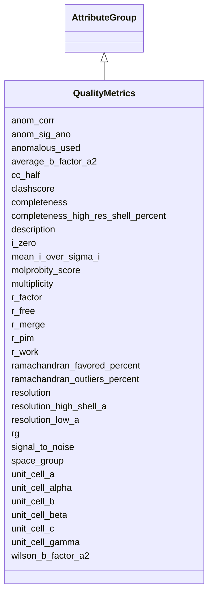

# Class: QualityMetrics 


_Quality metrics for experiments_


URI: [lambdaber:QualityMetrics](https://w3id.org/lambda-ber-schema/QualityMetrics)





## Inheritance
* [AttributeGroup](AttributeGroup.md)
    * **QualityMetrics**


## Slots

| Name | Cardinality and Range | Description | Inheritance |
| ---  | --- | --- | --- |
| [resolution](resolution.md) | 0..1 <br/> [Float](Float.md) | Resolution in Angstroms | direct |
| [resolution_high_shell_a](resolution_high_shell_a.md) | 0..1 <br/> [Float](Float.md) | High resolution shell limit in Angstroms | direct |
| [resolution_low_a](resolution_low_a.md) | 0..1 <br/> [Float](Float.md) | Low resolution limit in Angstroms | direct |
| [completeness](completeness.md) | 0..1 <br/> [Float](Float.md) | Data completeness percentage | direct |
| [completeness_high_res_shell_percent](completeness_high_res_shell_percent.md) | 0..1 <br/> [Float](Float.md) | Completeness in highest resolution shell | direct |
| [signal_to_noise](signal_to_noise.md) | 0..1 <br/> [Float](Float.md) | Signal to noise ratio | direct |
| [mean_i_over_sigma_i](mean_i_over_sigma_i.md) | 0..1 <br/> [Float](Float.md) | Mean I/sigma(I) | direct |
| [space_group](space_group.md) | 0..1 <br/> [String](String.md) | Crystallographic space group | direct |
| [unit_cell_a](unit_cell_a.md) | 0..1 <br/> [Float](Float.md) | Unit cell parameter a in Angstroms | direct |
| [unit_cell_b](unit_cell_b.md) | 0..1 <br/> [Float](Float.md) | Unit cell parameter b in Angstroms | direct |
| [unit_cell_c](unit_cell_c.md) | 0..1 <br/> [Float](Float.md) | Unit cell parameter c in Angstroms | direct |
| [unit_cell_alpha](unit_cell_alpha.md) | 0..1 <br/> [Float](Float.md) | Unit cell angle alpha in degrees | direct |
| [unit_cell_beta](unit_cell_beta.md) | 0..1 <br/> [Float](Float.md) | Unit cell angle beta in degrees | direct |
| [unit_cell_gamma](unit_cell_gamma.md) | 0..1 <br/> [Float](Float.md) | Unit cell angle gamma in degrees | direct |
| [multiplicity](multiplicity.md) | 0..1 <br/> [Float](Float.md) | Data multiplicity (redundancy) | direct |
| [cc_half](cc_half.md) | 0..1 <br/> [Float](Float.md) | Half-set correlation coefficient CC(1/2) | direct |
| [r_merge](r_merge.md) | 0..1 <br/> [Float](Float.md) | Rmerge - merge R-factor | direct |
| [r_pim](r_pim.md) | 0..1 <br/> [Float](Float.md) | Rpim - precision-indicating merging R-factor | direct |
| [wilson_b_factor_a2](wilson_b_factor_a2.md) | 0..1 <br/> [Float](Float.md) | Wilson B-factor in Angstroms squared | direct |
| [anomalous_used](anomalous_used.md) | 0..1 <br/> [Boolean](Boolean.md) | Whether anomalous signal was used | direct |
| [anom_corr](anom_corr.md) | 0..1 <br/> [Float](Float.md) | Anomalous correlation | direct |
| [anom_sig_ano](anom_sig_ano.md) | 0..1 <br/> [Float](Float.md) | Anomalous signal strength | direct |
| [r_work](r_work.md) | 0..1 <br/> [Float](Float.md) | Refinement R-factor (working set) | direct |
| [r_free](r_free.md) | 0..1 <br/> [Float](Float.md) | R-free (test set) | direct |
| [ramachandran_favored_percent](ramachandran_favored_percent.md) | 0..1 <br/> [Float](Float.md) | Percentage of residues in favored Ramachandran regions | direct |
| [ramachandran_outliers_percent](ramachandran_outliers_percent.md) | 0..1 <br/> [Float](Float.md) | Percentage of Ramachandran outliers | direct |
| [clashscore](clashscore.md) | 0..1 <br/> [Float](Float.md) | MolProbity clashscore | direct |
| [molprobity_score](molprobity_score.md) | 0..1 <br/> [Float](Float.md) | Overall MolProbity score | direct |
| [average_b_factor_a2](average_b_factor_a2.md) | 0..1 <br/> [Float](Float.md) | Average B-factor in Angstroms squared | direct |
| [i_zero](i_zero.md) | 0..1 <br/> [Float](Float.md) | Forward scattering intensity I(0) | direct |
| [rg](rg.md) | 0..1 <br/> [Float](Float.md) | Radius of gyration in Angstroms | direct |
| [r_factor](r_factor.md) | 0..1 <br/> [Float](Float.md) | R-factor for crystallography (deprecated, use r_work) | direct |
| [description](description.md) | 0..1 <br/> [String](String.md) |  | [AttributeGroup](AttributeGroup.md) |


## Usages

| used by | used in | type | used |
| ---  | --- | --- | --- |
| [ExperimentRun](ExperimentRun.md) | [quality_metrics](quality_metrics.md) | range | [QualityMetrics](QualityMetrics.md) |


## Identifier and Mapping Information


### Schema Source


* from schema: https://w3id.org/lambda-ber-schema/


## Mappings

| Mapping Type | Mapped Value |
| ---  | ---  |
| self | lambdaber:QualityMetrics |
| native | lambdaber:QualityMetrics |


## LinkML Source

<!-- TODO: investigate https://stackoverflow.com/questions/37606292/how-to-create-tabbed-code-blocks-in-mkdocs-or-sphinx -->

### Direct

<details>
```yaml
name: QualityMetrics
description: Quality metrics for experiments
from_schema: https://w3id.org/lambda-ber-schema/
is_a: AttributeGroup
attributes:
  resolution:
    name: resolution
    description: Resolution in Angstroms
    from_schema: https://w3id.org/lambda-ber-schema/
    domain_of:
    - ExperimentRun
    - QualityMetrics
    range: float
  resolution_high_shell_a:
    name: resolution_high_shell_a
    description: High resolution shell limit in Angstroms
    from_schema: https://w3id.org/lambda-ber-schema/
    rank: 1000
    domain_of:
    - QualityMetrics
    range: float
  resolution_low_a:
    name: resolution_low_a
    description: Low resolution limit in Angstroms
    from_schema: https://w3id.org/lambda-ber-schema/
    rank: 1000
    domain_of:
    - QualityMetrics
    range: float
  completeness:
    name: completeness
    description: Data completeness percentage
    from_schema: https://w3id.org/lambda-ber-schema/
    rank: 1000
    domain_of:
    - QualityMetrics
    range: float
  completeness_high_res_shell_percent:
    name: completeness_high_res_shell_percent
    description: Completeness in highest resolution shell
    from_schema: https://w3id.org/lambda-ber-schema/
    rank: 1000
    domain_of:
    - QualityMetrics
    range: float
  signal_to_noise:
    name: signal_to_noise
    description: Signal to noise ratio
    from_schema: https://w3id.org/lambda-ber-schema/
    rank: 1000
    domain_of:
    - QualityMetrics
    range: float
  mean_i_over_sigma_i:
    name: mean_i_over_sigma_i
    description: Mean I/sigma(I)
    from_schema: https://w3id.org/lambda-ber-schema/
    rank: 1000
    domain_of:
    - QualityMetrics
    range: float
  space_group:
    name: space_group
    description: Crystallographic space group
    from_schema: https://w3id.org/lambda-ber-schema/
    domain_of:
    - WorkflowRun
    - QualityMetrics
  unit_cell_a:
    name: unit_cell_a
    description: Unit cell parameter a in Angstroms
    from_schema: https://w3id.org/lambda-ber-schema/
    domain_of:
    - WorkflowRun
    - QualityMetrics
    range: float
  unit_cell_b:
    name: unit_cell_b
    description: Unit cell parameter b in Angstroms
    from_schema: https://w3id.org/lambda-ber-schema/
    domain_of:
    - WorkflowRun
    - QualityMetrics
    range: float
  unit_cell_c:
    name: unit_cell_c
    description: Unit cell parameter c in Angstroms
    from_schema: https://w3id.org/lambda-ber-schema/
    domain_of:
    - WorkflowRun
    - QualityMetrics
    range: float
  unit_cell_alpha:
    name: unit_cell_alpha
    description: Unit cell angle alpha in degrees
    from_schema: https://w3id.org/lambda-ber-schema/
    domain_of:
    - WorkflowRun
    - QualityMetrics
    range: float
  unit_cell_beta:
    name: unit_cell_beta
    description: Unit cell angle beta in degrees
    from_schema: https://w3id.org/lambda-ber-schema/
    domain_of:
    - WorkflowRun
    - QualityMetrics
    range: float
  unit_cell_gamma:
    name: unit_cell_gamma
    description: Unit cell angle gamma in degrees
    from_schema: https://w3id.org/lambda-ber-schema/
    domain_of:
    - WorkflowRun
    - QualityMetrics
    range: float
  multiplicity:
    name: multiplicity
    description: Data multiplicity (redundancy)
    from_schema: https://w3id.org/lambda-ber-schema/
    domain_of:
    - WorkflowRun
    - QualityMetrics
    range: float
  cc_half:
    name: cc_half
    description: Half-set correlation coefficient CC(1/2)
    from_schema: https://w3id.org/lambda-ber-schema/
    domain_of:
    - WorkflowRun
    - QualityMetrics
    range: float
  r_merge:
    name: r_merge
    description: Rmerge - merge R-factor
    from_schema: https://w3id.org/lambda-ber-schema/
    rank: 1000
    domain_of:
    - QualityMetrics
    range: float
  r_pim:
    name: r_pim
    description: Rpim - precision-indicating merging R-factor
    from_schema: https://w3id.org/lambda-ber-schema/
    rank: 1000
    domain_of:
    - QualityMetrics
    range: float
  wilson_b_factor_a2:
    name: wilson_b_factor_a2
    description: Wilson B-factor in Angstroms squared
    from_schema: https://w3id.org/lambda-ber-schema/
    rank: 1000
    domain_of:
    - QualityMetrics
    range: float
  anomalous_used:
    name: anomalous_used
    description: Whether anomalous signal was used
    from_schema: https://w3id.org/lambda-ber-schema/
    rank: 1000
    domain_of:
    - QualityMetrics
    range: boolean
  anom_corr:
    name: anom_corr
    description: Anomalous correlation
    from_schema: https://w3id.org/lambda-ber-schema/
    rank: 1000
    domain_of:
    - QualityMetrics
    range: float
  anom_sig_ano:
    name: anom_sig_ano
    description: Anomalous signal strength
    from_schema: https://w3id.org/lambda-ber-schema/
    rank: 1000
    domain_of:
    - QualityMetrics
    range: float
  r_work:
    name: r_work
    description: Refinement R-factor (working set)
    from_schema: https://w3id.org/lambda-ber-schema/
    rank: 1000
    domain_of:
    - QualityMetrics
    range: float
  r_free:
    name: r_free
    description: R-free (test set)
    from_schema: https://w3id.org/lambda-ber-schema/
    rank: 1000
    domain_of:
    - QualityMetrics
    range: float
  ramachandran_favored_percent:
    name: ramachandran_favored_percent
    description: Percentage of residues in favored Ramachandran regions
    from_schema: https://w3id.org/lambda-ber-schema/
    rank: 1000
    domain_of:
    - QualityMetrics
    range: float
  ramachandran_outliers_percent:
    name: ramachandran_outliers_percent
    description: Percentage of Ramachandran outliers
    from_schema: https://w3id.org/lambda-ber-schema/
    rank: 1000
    domain_of:
    - QualityMetrics
    range: float
  clashscore:
    name: clashscore
    description: MolProbity clashscore
    from_schema: https://w3id.org/lambda-ber-schema/
    domain_of:
    - WorkflowRun
    - QualityMetrics
    range: float
  molprobity_score:
    name: molprobity_score
    description: Overall MolProbity score
    from_schema: https://w3id.org/lambda-ber-schema/
    rank: 1000
    domain_of:
    - QualityMetrics
    range: float
  average_b_factor_a2:
    name: average_b_factor_a2
    description: Average B-factor in Angstroms squared
    from_schema: https://w3id.org/lambda-ber-schema/
    rank: 1000
    domain_of:
    - QualityMetrics
    range: float
  i_zero:
    name: i_zero
    description: Forward scattering intensity I(0)
    from_schema: https://w3id.org/lambda-ber-schema/
    rank: 1000
    domain_of:
    - QualityMetrics
    range: float
  rg:
    name: rg
    description: Radius of gyration in Angstroms
    from_schema: https://w3id.org/lambda-ber-schema/
    rank: 1000
    domain_of:
    - QualityMetrics
    range: float
  r_factor:
    name: r_factor
    description: R-factor for crystallography (deprecated, use r_work)
    from_schema: https://w3id.org/lambda-ber-schema/
    rank: 1000
    domain_of:
    - QualityMetrics
    range: float

```
</details>

### Induced

<details>
```yaml
name: QualityMetrics
description: Quality metrics for experiments
from_schema: https://w3id.org/lambda-ber-schema/
is_a: AttributeGroup
attributes:
  resolution:
    name: resolution
    description: Resolution in Angstroms
    from_schema: https://w3id.org/lambda-ber-schema/
    alias: resolution
    owner: QualityMetrics
    domain_of:
    - ExperimentRun
    - QualityMetrics
    range: float
  resolution_high_shell_a:
    name: resolution_high_shell_a
    description: High resolution shell limit in Angstroms
    from_schema: https://w3id.org/lambda-ber-schema/
    rank: 1000
    alias: resolution_high_shell_a
    owner: QualityMetrics
    domain_of:
    - QualityMetrics
    range: float
  resolution_low_a:
    name: resolution_low_a
    description: Low resolution limit in Angstroms
    from_schema: https://w3id.org/lambda-ber-schema/
    rank: 1000
    alias: resolution_low_a
    owner: QualityMetrics
    domain_of:
    - QualityMetrics
    range: float
  completeness:
    name: completeness
    description: Data completeness percentage
    from_schema: https://w3id.org/lambda-ber-schema/
    rank: 1000
    alias: completeness
    owner: QualityMetrics
    domain_of:
    - QualityMetrics
    range: float
  completeness_high_res_shell_percent:
    name: completeness_high_res_shell_percent
    description: Completeness in highest resolution shell
    from_schema: https://w3id.org/lambda-ber-schema/
    rank: 1000
    alias: completeness_high_res_shell_percent
    owner: QualityMetrics
    domain_of:
    - QualityMetrics
    range: float
  signal_to_noise:
    name: signal_to_noise
    description: Signal to noise ratio
    from_schema: https://w3id.org/lambda-ber-schema/
    rank: 1000
    alias: signal_to_noise
    owner: QualityMetrics
    domain_of:
    - QualityMetrics
    range: float
  mean_i_over_sigma_i:
    name: mean_i_over_sigma_i
    description: Mean I/sigma(I)
    from_schema: https://w3id.org/lambda-ber-schema/
    rank: 1000
    alias: mean_i_over_sigma_i
    owner: QualityMetrics
    domain_of:
    - QualityMetrics
    range: float
  space_group:
    name: space_group
    description: Crystallographic space group
    from_schema: https://w3id.org/lambda-ber-schema/
    alias: space_group
    owner: QualityMetrics
    domain_of:
    - WorkflowRun
    - QualityMetrics
    range: string
  unit_cell_a:
    name: unit_cell_a
    description: Unit cell parameter a in Angstroms
    from_schema: https://w3id.org/lambda-ber-schema/
    alias: unit_cell_a
    owner: QualityMetrics
    domain_of:
    - WorkflowRun
    - QualityMetrics
    range: float
  unit_cell_b:
    name: unit_cell_b
    description: Unit cell parameter b in Angstroms
    from_schema: https://w3id.org/lambda-ber-schema/
    alias: unit_cell_b
    owner: QualityMetrics
    domain_of:
    - WorkflowRun
    - QualityMetrics
    range: float
  unit_cell_c:
    name: unit_cell_c
    description: Unit cell parameter c in Angstroms
    from_schema: https://w3id.org/lambda-ber-schema/
    alias: unit_cell_c
    owner: QualityMetrics
    domain_of:
    - WorkflowRun
    - QualityMetrics
    range: float
  unit_cell_alpha:
    name: unit_cell_alpha
    description: Unit cell angle alpha in degrees
    from_schema: https://w3id.org/lambda-ber-schema/
    alias: unit_cell_alpha
    owner: QualityMetrics
    domain_of:
    - WorkflowRun
    - QualityMetrics
    range: float
  unit_cell_beta:
    name: unit_cell_beta
    description: Unit cell angle beta in degrees
    from_schema: https://w3id.org/lambda-ber-schema/
    alias: unit_cell_beta
    owner: QualityMetrics
    domain_of:
    - WorkflowRun
    - QualityMetrics
    range: float
  unit_cell_gamma:
    name: unit_cell_gamma
    description: Unit cell angle gamma in degrees
    from_schema: https://w3id.org/lambda-ber-schema/
    alias: unit_cell_gamma
    owner: QualityMetrics
    domain_of:
    - WorkflowRun
    - QualityMetrics
    range: float
  multiplicity:
    name: multiplicity
    description: Data multiplicity (redundancy)
    from_schema: https://w3id.org/lambda-ber-schema/
    alias: multiplicity
    owner: QualityMetrics
    domain_of:
    - WorkflowRun
    - QualityMetrics
    range: float
  cc_half:
    name: cc_half
    description: Half-set correlation coefficient CC(1/2)
    from_schema: https://w3id.org/lambda-ber-schema/
    alias: cc_half
    owner: QualityMetrics
    domain_of:
    - WorkflowRun
    - QualityMetrics
    range: float
  r_merge:
    name: r_merge
    description: Rmerge - merge R-factor
    from_schema: https://w3id.org/lambda-ber-schema/
    rank: 1000
    alias: r_merge
    owner: QualityMetrics
    domain_of:
    - QualityMetrics
    range: float
  r_pim:
    name: r_pim
    description: Rpim - precision-indicating merging R-factor
    from_schema: https://w3id.org/lambda-ber-schema/
    rank: 1000
    alias: r_pim
    owner: QualityMetrics
    domain_of:
    - QualityMetrics
    range: float
  wilson_b_factor_a2:
    name: wilson_b_factor_a2
    description: Wilson B-factor in Angstroms squared
    from_schema: https://w3id.org/lambda-ber-schema/
    rank: 1000
    alias: wilson_b_factor_a2
    owner: QualityMetrics
    domain_of:
    - QualityMetrics
    range: float
  anomalous_used:
    name: anomalous_used
    description: Whether anomalous signal was used
    from_schema: https://w3id.org/lambda-ber-schema/
    rank: 1000
    alias: anomalous_used
    owner: QualityMetrics
    domain_of:
    - QualityMetrics
    range: boolean
  anom_corr:
    name: anom_corr
    description: Anomalous correlation
    from_schema: https://w3id.org/lambda-ber-schema/
    rank: 1000
    alias: anom_corr
    owner: QualityMetrics
    domain_of:
    - QualityMetrics
    range: float
  anom_sig_ano:
    name: anom_sig_ano
    description: Anomalous signal strength
    from_schema: https://w3id.org/lambda-ber-schema/
    rank: 1000
    alias: anom_sig_ano
    owner: QualityMetrics
    domain_of:
    - QualityMetrics
    range: float
  r_work:
    name: r_work
    description: Refinement R-factor (working set)
    from_schema: https://w3id.org/lambda-ber-schema/
    rank: 1000
    alias: r_work
    owner: QualityMetrics
    domain_of:
    - QualityMetrics
    range: float
  r_free:
    name: r_free
    description: R-free (test set)
    from_schema: https://w3id.org/lambda-ber-schema/
    rank: 1000
    alias: r_free
    owner: QualityMetrics
    domain_of:
    - QualityMetrics
    range: float
  ramachandran_favored_percent:
    name: ramachandran_favored_percent
    description: Percentage of residues in favored Ramachandran regions
    from_schema: https://w3id.org/lambda-ber-schema/
    rank: 1000
    alias: ramachandran_favored_percent
    owner: QualityMetrics
    domain_of:
    - QualityMetrics
    range: float
  ramachandran_outliers_percent:
    name: ramachandran_outliers_percent
    description: Percentage of Ramachandran outliers
    from_schema: https://w3id.org/lambda-ber-schema/
    rank: 1000
    alias: ramachandran_outliers_percent
    owner: QualityMetrics
    domain_of:
    - QualityMetrics
    range: float
  clashscore:
    name: clashscore
    description: MolProbity clashscore
    from_schema: https://w3id.org/lambda-ber-schema/
    alias: clashscore
    owner: QualityMetrics
    domain_of:
    - WorkflowRun
    - QualityMetrics
    range: float
  molprobity_score:
    name: molprobity_score
    description: Overall MolProbity score
    from_schema: https://w3id.org/lambda-ber-schema/
    rank: 1000
    alias: molprobity_score
    owner: QualityMetrics
    domain_of:
    - QualityMetrics
    range: float
  average_b_factor_a2:
    name: average_b_factor_a2
    description: Average B-factor in Angstroms squared
    from_schema: https://w3id.org/lambda-ber-schema/
    rank: 1000
    alias: average_b_factor_a2
    owner: QualityMetrics
    domain_of:
    - QualityMetrics
    range: float
  i_zero:
    name: i_zero
    description: Forward scattering intensity I(0)
    from_schema: https://w3id.org/lambda-ber-schema/
    rank: 1000
    alias: i_zero
    owner: QualityMetrics
    domain_of:
    - QualityMetrics
    range: float
  rg:
    name: rg
    description: Radius of gyration in Angstroms
    from_schema: https://w3id.org/lambda-ber-schema/
    rank: 1000
    alias: rg
    owner: QualityMetrics
    domain_of:
    - QualityMetrics
    range: float
  r_factor:
    name: r_factor
    description: R-factor for crystallography (deprecated, use r_work)
    from_schema: https://w3id.org/lambda-ber-schema/
    rank: 1000
    alias: r_factor
    owner: QualityMetrics
    domain_of:
    - QualityMetrics
    range: float
  description:
    name: description
    from_schema: https://w3id.org/lambda-ber-schema/
    alias: description
    owner: QualityMetrics
    domain_of:
    - NamedThing
    - AttributeGroup
    range: string

```
</details>