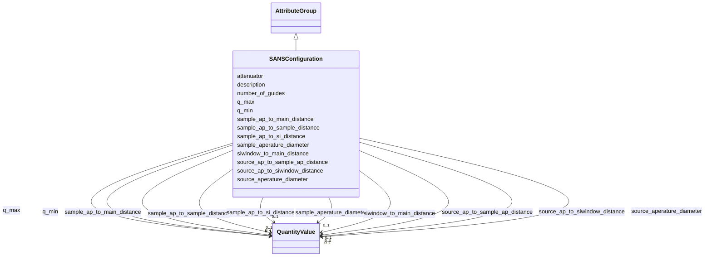

# Class: SANSConfiguration 


_Experimental configuration for a SANS instrument_


URI: [lambda:SANSConfiguration](http://w3id.org/lambda/SANSConfiguration)





## Inheritance
* [AttributeGroup](AttributeGroup.md)
    * **SANSConfiguration**


## Slots

| Name | Cardinality and Range | Description | Inheritance |
| ---  | --- | --- | --- |
| [q_min](q_min.md) | 0..1 <br/> [QuantityValue](QuantityValue.md) | Minimum q value | direct |
| [q_max](q_max.md) | 0..1 <br/> [QuantityValue](QuantityValue.md) | Maximum q value | direct |
| [number_of_guides](number_of_guides.md) | 0..1 <br/> [Integer](Integer.md) | Number of neutron guides | direct |
| [attenuator](attenuator.md) | 0..1 <br/> [String](String.md) | Attenuator setting | direct |
| [source_aperature_diameter](source_aperature_diameter.md) | 0..1 <br/> [QuantityValue](QuantityValue.md) | Source aperture diameter | direct |
| [sample_aperature_diameter](sample_aperature_diameter.md) | 0..1 <br/> [QuantityValue](QuantityValue.md) | Sample aperture diameter | direct |
| [siwindow_to_main_distance](siwindow_to_main_distance.md) | 0..1 <br/> [QuantityValue](QuantityValue.md) | Silicon window to main instrument distance | direct |
| [sample_ap_to_si_distance](sample_ap_to_si_distance.md) | 0..1 <br/> [QuantityValue](QuantityValue.md) | Sample aperture to silicon window distance | direct |
| [sample_ap_to_main_distance](sample_ap_to_main_distance.md) | 0..1 <br/> [QuantityValue](QuantityValue.md) | Sample aperture to main instrument distance | direct |
| [sample_ap_to_sample_distance](sample_ap_to_sample_distance.md) | 0..1 <br/> [QuantityValue](QuantityValue.md) | Sample aperture to sample distance | direct |
| [source_ap_to_siwindow_distance](source_ap_to_siwindow_distance.md) | 0..1 <br/> [QuantityValue](QuantityValue.md) | Source aperture to silicon window distance | direct |
| [source_ap_to_sample_ap_distance](source_ap_to_sample_ap_distance.md) | 0..1 <br/> [QuantityValue](QuantityValue.md) | Source aperture to sample aperture distance | direct |
| [description](description.md) | 0..1 <br/> [String](String.md) |  | [AttributeGroup](AttributeGroup.md) |


## Usages

| used by | used in | type | used |
| ---  | --- | --- | --- |
| [SANSInstrument](SANSInstrument.md) | [configuration](configuration.md) | range | [SANSConfiguration](SANSConfiguration.md) |


## Identifier and Mapping Information


### Schema Source


* from schema: http://w3id.org/lambda/


## Mappings

| Mapping Type | Mapped Value |
| ---  | ---  |
| self | lambda:SANSConfiguration |
| native | lambda:SANSConfiguration |


## LinkML Source

<!-- TODO: investigate https://stackoverflow.com/questions/37606292/how-to-create-tabbed-code-blocks-in-mkdocs-or-sphinx -->

### Direct

<details>
```yaml
name: SANSConfiguration
description: Experimental configuration for a SANS instrument
from_schema: http://w3id.org/lambda/
is_a: AttributeGroup
attributes:
  q_min:
    name: q_min
    description: Minimum q value
    from_schema: http://w3id.org/lambda/
    rank: 1000
    domain_of:
    - SANSConfiguration
    range: QuantityValue
    inlined: true
  q_max:
    name: q_max
    description: Maximum q value
    from_schema: http://w3id.org/lambda/
    rank: 1000
    domain_of:
    - SANSConfiguration
    range: QuantityValue
    inlined: true
  number_of_guides:
    name: number_of_guides
    description: Number of neutron guides
    from_schema: http://w3id.org/lambda/
    rank: 1000
    domain_of:
    - SANSConfiguration
    range: integer
  attenuator:
    name: attenuator
    description: Attenuator setting
    from_schema: http://w3id.org/lambda/
    rank: 1000
    domain_of:
    - SANSConfiguration
    - DataCollectionStrategy
    range: string
  source_aperature_diameter:
    name: source_aperature_diameter
    description: Source aperture diameter
    from_schema: http://w3id.org/lambda/
    rank: 1000
    domain_of:
    - SANSConfiguration
    range: QuantityValue
    inlined: true
  sample_aperature_diameter:
    name: sample_aperature_diameter
    description: Sample aperture diameter
    from_schema: http://w3id.org/lambda/
    rank: 1000
    domain_of:
    - SANSConfiguration
    range: QuantityValue
    inlined: true
  siwindow_to_main_distance:
    name: siwindow_to_main_distance
    description: Silicon window to main instrument distance
    from_schema: http://w3id.org/lambda/
    rank: 1000
    domain_of:
    - SANSConfiguration
    range: QuantityValue
    inlined: true
  sample_ap_to_si_distance:
    name: sample_ap_to_si_distance
    description: Sample aperture to silicon window distance
    from_schema: http://w3id.org/lambda/
    rank: 1000
    domain_of:
    - SANSConfiguration
    range: QuantityValue
    inlined: true
  sample_ap_to_main_distance:
    name: sample_ap_to_main_distance
    description: Sample aperture to main instrument distance
    from_schema: http://w3id.org/lambda/
    rank: 1000
    domain_of:
    - SANSConfiguration
    range: QuantityValue
    inlined: true
  sample_ap_to_sample_distance:
    name: sample_ap_to_sample_distance
    description: Sample aperture to sample distance
    from_schema: http://w3id.org/lambda/
    rank: 1000
    domain_of:
    - SANSConfiguration
    range: QuantityValue
    inlined: true
  source_ap_to_siwindow_distance:
    name: source_ap_to_siwindow_distance
    description: Source aperture to silicon window distance
    from_schema: http://w3id.org/lambda/
    rank: 1000
    domain_of:
    - SANSConfiguration
    range: QuantityValue
    inlined: true
  source_ap_to_sample_ap_distance:
    name: source_ap_to_sample_ap_distance
    description: Source aperture to sample aperture distance
    from_schema: http://w3id.org/lambda/
    rank: 1000
    domain_of:
    - SANSConfiguration
    range: QuantityValue
    inlined: true

```
</details>

### Induced

<details>
```yaml
name: SANSConfiguration
description: Experimental configuration for a SANS instrument
from_schema: http://w3id.org/lambda/
is_a: AttributeGroup
attributes:
  q_min:
    name: q_min
    description: Minimum q value
    from_schema: http://w3id.org/lambda/
    rank: 1000
    alias: q_min
    owner: SANSConfiguration
    domain_of:
    - SANSConfiguration
    range: QuantityValue
    inlined: true
  q_max:
    name: q_max
    description: Maximum q value
    from_schema: http://w3id.org/lambda/
    rank: 1000
    alias: q_max
    owner: SANSConfiguration
    domain_of:
    - SANSConfiguration
    range: QuantityValue
    inlined: true
  number_of_guides:
    name: number_of_guides
    description: Number of neutron guides
    from_schema: http://w3id.org/lambda/
    rank: 1000
    alias: number_of_guides
    owner: SANSConfiguration
    domain_of:
    - SANSConfiguration
    range: integer
  attenuator:
    name: attenuator
    description: Attenuator setting
    from_schema: http://w3id.org/lambda/
    rank: 1000
    alias: attenuator
    owner: SANSConfiguration
    domain_of:
    - SANSConfiguration
    - DataCollectionStrategy
    range: string
  source_aperature_diameter:
    name: source_aperature_diameter
    description: Source aperture diameter
    from_schema: http://w3id.org/lambda/
    rank: 1000
    alias: source_aperature_diameter
    owner: SANSConfiguration
    domain_of:
    - SANSConfiguration
    range: QuantityValue
    inlined: true
  sample_aperature_diameter:
    name: sample_aperature_diameter
    description: Sample aperture diameter
    from_schema: http://w3id.org/lambda/
    rank: 1000
    alias: sample_aperature_diameter
    owner: SANSConfiguration
    domain_of:
    - SANSConfiguration
    range: QuantityValue
    inlined: true
  siwindow_to_main_distance:
    name: siwindow_to_main_distance
    description: Silicon window to main instrument distance
    from_schema: http://w3id.org/lambda/
    rank: 1000
    alias: siwindow_to_main_distance
    owner: SANSConfiguration
    domain_of:
    - SANSConfiguration
    range: QuantityValue
    inlined: true
  sample_ap_to_si_distance:
    name: sample_ap_to_si_distance
    description: Sample aperture to silicon window distance
    from_schema: http://w3id.org/lambda/
    rank: 1000
    alias: sample_ap_to_si_distance
    owner: SANSConfiguration
    domain_of:
    - SANSConfiguration
    range: QuantityValue
    inlined: true
  sample_ap_to_main_distance:
    name: sample_ap_to_main_distance
    description: Sample aperture to main instrument distance
    from_schema: http://w3id.org/lambda/
    rank: 1000
    alias: sample_ap_to_main_distance
    owner: SANSConfiguration
    domain_of:
    - SANSConfiguration
    range: QuantityValue
    inlined: true
  sample_ap_to_sample_distance:
    name: sample_ap_to_sample_distance
    description: Sample aperture to sample distance
    from_schema: http://w3id.org/lambda/
    rank: 1000
    alias: sample_ap_to_sample_distance
    owner: SANSConfiguration
    domain_of:
    - SANSConfiguration
    range: QuantityValue
    inlined: true
  source_ap_to_siwindow_distance:
    name: source_ap_to_siwindow_distance
    description: Source aperture to silicon window distance
    from_schema: http://w3id.org/lambda/
    rank: 1000
    alias: source_ap_to_siwindow_distance
    owner: SANSConfiguration
    domain_of:
    - SANSConfiguration
    range: QuantityValue
    inlined: true
  source_ap_to_sample_ap_distance:
    name: source_ap_to_sample_ap_distance
    description: Source aperture to sample aperture distance
    from_schema: http://w3id.org/lambda/
    rank: 1000
    alias: source_ap_to_sample_ap_distance
    owner: SANSConfiguration
    domain_of:
    - SANSConfiguration
    range: QuantityValue
    inlined: true
  description:
    name: description
    from_schema: http://w3id.org/lambda/
    alias: description
    owner: SANSConfiguration
    domain_of:
    - NamedThing
    - AttributeGroup
    range: string

```
</details>