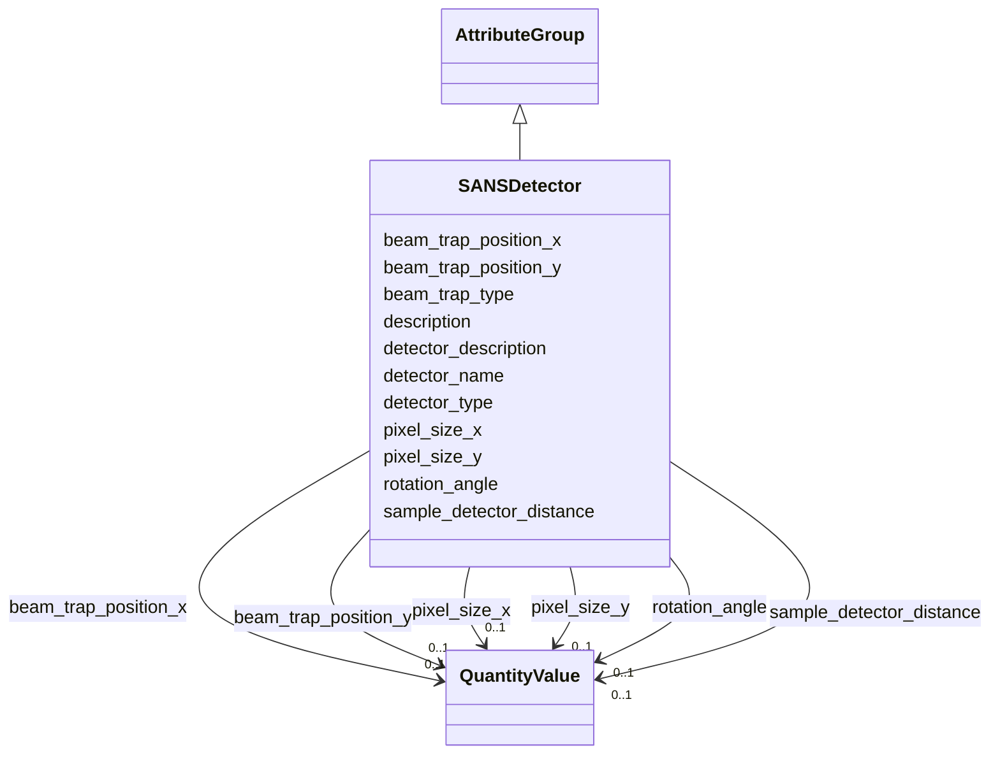

# Class: SANSDetector 


_Description of a detector used in a SANS instrument_


URI: [lambda:SANSDetector](http://w3id.org/lambda/SANSDetector)





## Inheritance
* [AttributeGroup](AttributeGroup.md)
    * **SANSDetector**


## Slots

| Name | Cardinality and Range | Description | Inheritance |
| ---  | --- | --- | --- |
| [detector_name](detector_name.md) | 0..1 <br/> [String](String.md) | User-assigned detector name | direct |
| [detector_type](detector_type.md) | 0..1 <br/> [String](String.md) | Type of detector | direct |
| [detector_description](detector_description.md) | 0..1 <br/> [String](String.md) | Free-text description of the detector | direct |
| [pixel_size_x](pixel_size_x.md) | 0..1 <br/> [QuantityValue](QuantityValue.md) | Pixel size in x-direction | direct |
| [pixel_size_y](pixel_size_y.md) | 0..1 <br/> [QuantityValue](QuantityValue.md) | Pixel size in y-direction | direct |
| [sample_detector_distance](sample_detector_distance.md) | 0..1 <br/> [QuantityValue](QuantityValue.md) | Distance from sample to detector | direct |
| [rotation_angle](rotation_angle.md) | 0..1 <br/> [QuantityValue](QuantityValue.md) | Rotation angle of the detector | direct |
| [beam_trap_type](beam_trap_type.md) | 0..1 <br/> [String](String.md) | Type of beam trap (if any) | direct |
| [beam_trap_position_x](beam_trap_position_x.md) | 0..1 <br/> [QuantityValue](QuantityValue.md) | X coordinate of beam trap | direct |
| [beam_trap_position_y](beam_trap_position_y.md) | 0..1 <br/> [QuantityValue](QuantityValue.md) | Y coordinate of beam trap | direct |
| [description](description.md) | 0..1 <br/> [String](String.md) |  | [AttributeGroup](AttributeGroup.md) |


## Usages

| used by | used in | type | used |
| ---  | --- | --- | --- |
| [SANSInstrument](SANSInstrument.md) | [detectors](detectors.md) | range | [SANSDetector](SANSDetector.md) |


## Identifier and Mapping Information


### Schema Source


* from schema: http://w3id.org/lambda/


## Mappings

| Mapping Type | Mapped Value |
| ---  | ---  |
| self | lambda:SANSDetector |
| native | lambda:SANSDetector |


## LinkML Source

<!-- TODO: investigate https://stackoverflow.com/questions/37606292/how-to-create-tabbed-code-blocks-in-mkdocs-or-sphinx -->

### Direct

<details>
```yaml
name: SANSDetector
description: Description of a detector used in a SANS instrument
from_schema: http://w3id.org/lambda/
is_a: AttributeGroup
attributes:
  detector_name:
    name: detector_name
    description: User-assigned detector name
    from_schema: http://w3id.org/lambda/
    rank: 1000
    domain_of:
    - SANSDetector
    range: string
  detector_type:
    name: detector_type
    description: Type of detector
    from_schema: http://w3id.org/lambda/
    rank: 1000
    domain_of:
    - SANSDetector
    range: string
  detector_description:
    name: detector_description
    description: Free-text description of the detector
    from_schema: http://w3id.org/lambda/
    rank: 1000
    domain_of:
    - SANSDetector
    range: string
  pixel_size_x:
    name: pixel_size_x
    description: Pixel size in x-direction
    from_schema: http://w3id.org/lambda/
    rank: 1000
    domain_of:
    - SANSDetector
    - ExperimentRun
    range: QuantityValue
    inlined: true
  pixel_size_y:
    name: pixel_size_y
    description: Pixel size in y-direction
    from_schema: http://w3id.org/lambda/
    rank: 1000
    domain_of:
    - SANSDetector
    - ExperimentRun
    range: QuantityValue
    inlined: true
  sample_detector_distance:
    name: sample_detector_distance
    description: Distance from sample to detector
    from_schema: http://w3id.org/lambda/
    rank: 1000
    domain_of:
    - SANSDetector
    range: QuantityValue
    inlined: true
  rotation_angle:
    name: rotation_angle
    description: Rotation angle of the detector
    from_schema: http://w3id.org/lambda/
    rank: 1000
    domain_of:
    - SANSDetector
    range: QuantityValue
    inlined: true
  beam_trap_type:
    name: beam_trap_type
    description: Type of beam trap (if any)
    from_schema: http://w3id.org/lambda/
    rank: 1000
    domain_of:
    - SANSDetector
    range: string
  beam_trap_position_x:
    name: beam_trap_position_x
    description: X coordinate of beam trap
    from_schema: http://w3id.org/lambda/
    rank: 1000
    domain_of:
    - SANSDetector
    range: QuantityValue
    inlined: true
  beam_trap_position_y:
    name: beam_trap_position_y
    description: Y coordinate of beam trap
    from_schema: http://w3id.org/lambda/
    rank: 1000
    domain_of:
    - SANSDetector
    range: QuantityValue
    inlined: true

```
</details>

### Induced

<details>
```yaml
name: SANSDetector
description: Description of a detector used in a SANS instrument
from_schema: http://w3id.org/lambda/
is_a: AttributeGroup
attributes:
  detector_name:
    name: detector_name
    description: User-assigned detector name
    from_schema: http://w3id.org/lambda/
    rank: 1000
    alias: detector_name
    owner: SANSDetector
    domain_of:
    - SANSDetector
    range: string
  detector_type:
    name: detector_type
    description: Type of detector
    from_schema: http://w3id.org/lambda/
    rank: 1000
    alias: detector_type
    owner: SANSDetector
    domain_of:
    - SANSDetector
    range: string
  detector_description:
    name: detector_description
    description: Free-text description of the detector
    from_schema: http://w3id.org/lambda/
    rank: 1000
    alias: detector_description
    owner: SANSDetector
    domain_of:
    - SANSDetector
    range: string
  pixel_size_x:
    name: pixel_size_x
    description: Pixel size in x-direction
    from_schema: http://w3id.org/lambda/
    rank: 1000
    alias: pixel_size_x
    owner: SANSDetector
    domain_of:
    - SANSDetector
    - ExperimentRun
    range: QuantityValue
    inlined: true
  pixel_size_y:
    name: pixel_size_y
    description: Pixel size in y-direction
    from_schema: http://w3id.org/lambda/
    rank: 1000
    alias: pixel_size_y
    owner: SANSDetector
    domain_of:
    - SANSDetector
    - ExperimentRun
    range: QuantityValue
    inlined: true
  sample_detector_distance:
    name: sample_detector_distance
    description: Distance from sample to detector
    from_schema: http://w3id.org/lambda/
    rank: 1000
    alias: sample_detector_distance
    owner: SANSDetector
    domain_of:
    - SANSDetector
    range: QuantityValue
    inlined: true
  rotation_angle:
    name: rotation_angle
    description: Rotation angle of the detector
    from_schema: http://w3id.org/lambda/
    rank: 1000
    alias: rotation_angle
    owner: SANSDetector
    domain_of:
    - SANSDetector
    range: QuantityValue
    inlined: true
  beam_trap_type:
    name: beam_trap_type
    description: Type of beam trap (if any)
    from_schema: http://w3id.org/lambda/
    rank: 1000
    alias: beam_trap_type
    owner: SANSDetector
    domain_of:
    - SANSDetector
    range: string
  beam_trap_position_x:
    name: beam_trap_position_x
    description: X coordinate of beam trap
    from_schema: http://w3id.org/lambda/
    rank: 1000
    alias: beam_trap_position_x
    owner: SANSDetector
    domain_of:
    - SANSDetector
    range: QuantityValue
    inlined: true
  beam_trap_position_y:
    name: beam_trap_position_y
    description: Y coordinate of beam trap
    from_schema: http://w3id.org/lambda/
    rank: 1000
    alias: beam_trap_position_y
    owner: SANSDetector
    domain_of:
    - SANSDetector
    range: QuantityValue
    inlined: true
  description:
    name: description
    from_schema: http://w3id.org/lambda/
    alias: description
    owner: SANSDetector
    domain_of:
    - NamedThing
    - AttributeGroup
    range: string

```
</details>