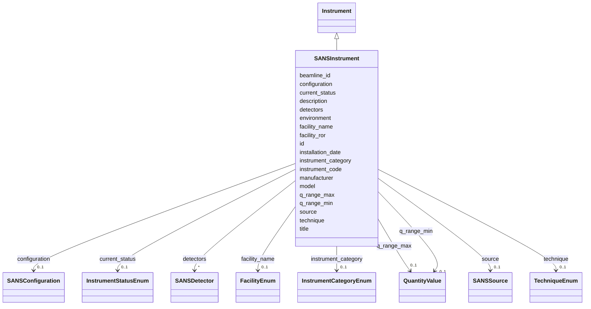

# Class: SANSInstrument 


_Small-angle neutron scattering (SANS) instrument specifications_


URI: [lambda:SANSInstrument](http://w3id.org/lambda/SANSInstrument)





## Inheritance
* [NamedThing](NamedThing.md)
    * [Instrument](Instrument.md)
        * **SANSInstrument**


## Slots

| Name | Cardinality and Range | Description | Inheritance |
| ---  | --- | --- | --- |
| [technique](technique.md) | 0..1 <br/> [TechniqueEnum](TechniqueEnum.md) | Primary technique (should always be sans for this class) | direct |
| [q_range_min](q_range_min.md) | 0..1 <br/> [QuantityValue](QuantityValue.md) | Minimum q value in inverse Angstroms | direct |
| [q_range_max](q_range_max.md) | 0..1 <br/> [QuantityValue](QuantityValue.md) | Maximum q value in inverse Angstroms | direct |
| [detectors](detectors.md) | * <br/> [SANSDetector](SANSDetector.md) | List of detectors associated with the instrument | direct |
| [source](source.md) | 0..1 <br/> [SANSSource](SANSSource.md) | Source parameters for the instrument | direct |
| [configuration](configuration.md) | 0..1 <br/> [SANSConfiguration](SANSConfiguration.md) | Optical/mechanical configuration details | direct |
| [environment](environment.md) | 0..1 <br/> [String](String.md) | Textual description of environmental conditions | direct |
| [instrument_code](instrument_code.md) | 1 <br/> [String](String.md) | Human-friendly facility or laboratory identifier for the instrument (e | [Instrument](Instrument.md) |
| [instrument_category](instrument_category.md) | 0..1 <br/> [InstrumentCategoryEnum](InstrumentCategoryEnum.md) | Category distinguishing beamlines from laboratory equipment | [Instrument](Instrument.md) |
| [facility_name](facility_name.md) | 0..1 <br/> [FacilityEnum](FacilityEnum.md) | Name of the research facility where the instrument is located | [Instrument](Instrument.md) |
| [facility_ror](facility_ror.md) | 0..1 <br/> [Uriorcurie](Uriorcurie.md) | Research Organization Registry (ROR) identifier for the facility | [Instrument](Instrument.md) |
| [beamline_id](beamline_id.md) | 0..1 <br/> [String](String.md) | Beamline identifier at synchrotron/neutron facility | [Instrument](Instrument.md) |
| [manufacturer](manufacturer.md) | 0..1 <br/> [String](String.md) | Instrument manufacturer | [Instrument](Instrument.md) |
| [model](model.md) | 0..1 <br/> [String](String.md) | Instrument model | [Instrument](Instrument.md) |
| [installation_date](installation_date.md) | 0..1 <br/> [String](String.md) | Date of instrument installation | [Instrument](Instrument.md) |
| [current_status](current_status.md) | 0..1 <br/> [InstrumentStatusEnum](InstrumentStatusEnum.md) | Current operational status | [Instrument](Instrument.md) |
| [id](id.md) | 1 <br/> [Uriorcurie](Uriorcurie.md) | Globally unique identifier as an IRI or CURIE for machine processing and exte... | [NamedThing](NamedThing.md) |
| [title](title.md) | 0..1 <br/> [String](String.md) | A human-readable name or title for this entity | [NamedThing](NamedThing.md) |
| [description](description.md) | 0..1 <br/> [String](String.md) | A detailed textual description of this entity | [NamedThing](NamedThing.md) |


## Identifier and Mapping Information


### Schema Source


* from schema: http://w3id.org/lambda/


## Mappings

| Mapping Type | Mapped Value |
| ---  | ---  |
| self | lambda:SANSInstrument |
| native | lambda:SANSInstrument |


## LinkML Source

<!-- TODO: investigate https://stackoverflow.com/questions/37606292/how-to-create-tabbed-code-blocks-in-mkdocs-or-sphinx -->

### Direct

<details>
```yaml
name: SANSInstrument
description: Small-angle neutron scattering (SANS) instrument specifications
from_schema: http://w3id.org/lambda/
is_a: Instrument
attributes:
  technique:
    name: technique
    description: Primary technique (should always be sans for this class)
    from_schema: http://w3id.org/lambda/
    rank: 1000
    ifabsent: string(sans)
    domain_of:
    - SANSInstrument
    - ExperimentRun
    range: TechniqueEnum
  q_range_min:
    name: q_range_min
    description: Minimum q value in inverse Angstroms
    from_schema: http://w3id.org/lambda/
    rank: 1000
    domain_of:
    - SANSInstrument
    - SAXSInstrument
    - BeamlineInstrument
    range: QuantityValue
    inlined: true
  q_range_max:
    name: q_range_max
    description: Maximum q value in inverse Angstroms
    from_schema: http://w3id.org/lambda/
    rank: 1000
    domain_of:
    - SANSInstrument
    - SAXSInstrument
    - BeamlineInstrument
    range: QuantityValue
    inlined: true
  detectors:
    name: detectors
    description: List of detectors associated with the instrument
    from_schema: http://w3id.org/lambda/
    rank: 1000
    domain_of:
    - SANSInstrument
    range: SANSDetector
    multivalued: true
    inlined: true
    inlined_as_list: true
  source:
    name: source
    description: Source parameters for the instrument
    from_schema: http://w3id.org/lambda/
    rank: 1000
    domain_of:
    - SANSInstrument
    range: SANSSource
  configuration:
    name: configuration
    description: Optical/mechanical configuration details
    from_schema: http://w3id.org/lambda/
    rank: 1000
    domain_of:
    - SANSInstrument
    range: SANSConfiguration
  environment:
    name: environment
    description: Textual description of environmental conditions
    from_schema: http://w3id.org/lambda/
    rank: 1000
    domain_of:
    - SANSInstrument
    range: string

```
</details>

### Induced

<details>
```yaml
name: SANSInstrument
description: Small-angle neutron scattering (SANS) instrument specifications
from_schema: http://w3id.org/lambda/
is_a: Instrument
attributes:
  technique:
    name: technique
    description: Primary technique (should always be sans for this class)
    from_schema: http://w3id.org/lambda/
    rank: 1000
    ifabsent: string(sans)
    alias: technique
    owner: SANSInstrument
    domain_of:
    - SANSInstrument
    - ExperimentRun
    range: TechniqueEnum
  q_range_min:
    name: q_range_min
    description: Minimum q value in inverse Angstroms
    from_schema: http://w3id.org/lambda/
    rank: 1000
    alias: q_range_min
    owner: SANSInstrument
    domain_of:
    - SANSInstrument
    - SAXSInstrument
    - BeamlineInstrument
    range: QuantityValue
    inlined: true
  q_range_max:
    name: q_range_max
    description: Maximum q value in inverse Angstroms
    from_schema: http://w3id.org/lambda/
    rank: 1000
    alias: q_range_max
    owner: SANSInstrument
    domain_of:
    - SANSInstrument
    - SAXSInstrument
    - BeamlineInstrument
    range: QuantityValue
    inlined: true
  detectors:
    name: detectors
    description: List of detectors associated with the instrument
    from_schema: http://w3id.org/lambda/
    rank: 1000
    alias: detectors
    owner: SANSInstrument
    domain_of:
    - SANSInstrument
    range: SANSDetector
    multivalued: true
    inlined: true
    inlined_as_list: true
  source:
    name: source
    description: Source parameters for the instrument
    from_schema: http://w3id.org/lambda/
    rank: 1000
    alias: source
    owner: SANSInstrument
    domain_of:
    - SANSInstrument
    range: SANSSource
  configuration:
    name: configuration
    description: Optical/mechanical configuration details
    from_schema: http://w3id.org/lambda/
    rank: 1000
    alias: configuration
    owner: SANSInstrument
    domain_of:
    - SANSInstrument
    range: SANSConfiguration
  environment:
    name: environment
    description: Textual description of environmental conditions
    from_schema: http://w3id.org/lambda/
    rank: 1000
    alias: environment
    owner: SANSInstrument
    domain_of:
    - SANSInstrument
    range: string
  instrument_code:
    name: instrument_code
    description: Human-friendly facility or laboratory identifier for the instrument
      (e.g., 'TITAN-KRIOS-1', 'ALS-12.3.1-SIBYLS', 'RIGAKU-FR-E'). Used for local
      reference and equipment tracking.
    from_schema: http://w3id.org/lambda/
    rank: 1000
    alias: instrument_code
    owner: SANSInstrument
    domain_of:
    - Instrument
    range: string
    required: true
  instrument_category:
    name: instrument_category
    description: Category distinguishing beamlines from laboratory equipment
    comments:
    - Use SYNCHROTRON_BEAMLINE for synchrotron beamlines
    - Use ELECTRON_MICROSCOPE for cryo-EM instruments
    from_schema: http://w3id.org/lambda/
    rank: 1000
    alias: instrument_category
    owner: SANSInstrument
    domain_of:
    - Instrument
    range: InstrumentCategoryEnum
  facility_name:
    name: facility_name
    description: Name of the research facility where the instrument is located
    comments:
    - Select from the standardized list of major synchrotron facilities
    - Leave empty for laboratory-based instruments
    from_schema: http://w3id.org/lambda/
    rank: 1000
    alias: facility_name
    owner: SANSInstrument
    domain_of:
    - Instrument
    range: FacilityEnum
  facility_ror:
    name: facility_ror
    description: Research Organization Registry (ROR) identifier for the facility
    comments:
    - Persistent identifier for the facility organization
    - 'Example: https://ror.org/02jbv0t02 (Lawrence Berkeley National Laboratory)'
    from_schema: http://w3id.org/lambda/
    rank: 1000
    alias: facility_ror
    owner: SANSInstrument
    domain_of:
    - Instrument
    range: uriorcurie
    pattern: ^https://ror\.org/\w+$
  beamline_id:
    name: beamline_id
    description: Beamline identifier at synchrotron/neutron facility
    comments:
    - Use facility-specific naming convention
    - 'Examples: ''12.3.1'' (ALS), ''17-ID-1'' (NSLS-II), ''I04'' (Diamond)'
    from_schema: http://w3id.org/lambda/
    exact_mappings:
    - mmCIF:_diffrn_source.pdbx_synchrotron_beamline
    rank: 1000
    alias: beamline_id
    owner: SANSInstrument
    domain_of:
    - Instrument
    range: string
  manufacturer:
    name: manufacturer
    description: Instrument manufacturer
    from_schema: http://w3id.org/lambda/
    rank: 1000
    alias: manufacturer
    owner: SANSInstrument
    domain_of:
    - Instrument
    range: string
  model:
    name: model
    description: Instrument model
    from_schema: http://w3id.org/lambda/
    rank: 1000
    alias: model
    owner: SANSInstrument
    domain_of:
    - Instrument
    range: string
  installation_date:
    name: installation_date
    description: Date of instrument installation
    from_schema: http://w3id.org/lambda/
    rank: 1000
    alias: installation_date
    owner: SANSInstrument
    domain_of:
    - Instrument
    range: string
  current_status:
    name: current_status
    description: Current operational status
    from_schema: http://w3id.org/lambda/
    rank: 1000
    alias: current_status
    owner: SANSInstrument
    domain_of:
    - Instrument
    range: InstrumentStatusEnum
  id:
    name: id
    description: Globally unique identifier as an IRI or CURIE for machine processing
      and external references. Used for linking data across systems and semantic web
      integration.
    from_schema: http://w3id.org/lambda/
    rank: 1000
    identifier: true
    alias: id
    owner: SANSInstrument
    domain_of:
    - NamedThing
    - Attribute
    range: uriorcurie
    required: true
  title:
    name: title
    description: A human-readable name or title for this entity
    from_schema: http://w3id.org/lambda/
    rank: 1000
    slot_uri: dcterms:title
    alias: title
    owner: SANSInstrument
    domain_of:
    - NamedThing
    range: string
  description:
    name: description
    description: A detailed textual description of this entity
    from_schema: http://w3id.org/lambda/
    rank: 1000
    alias: description
    owner: SANSInstrument
    domain_of:
    - NamedThing
    - AttributeGroup
    range: string

```
</details>