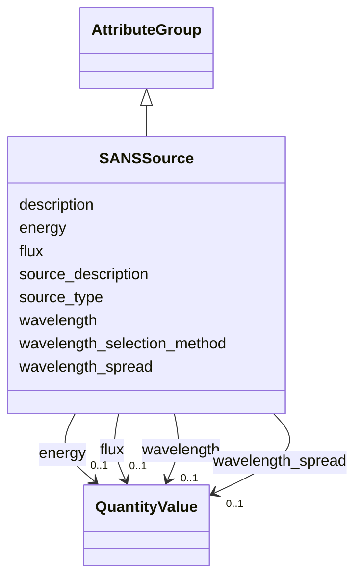

# Class: SANSSource 


_Beam source parameters for a SANS instrument_


URI: [lambda:SANSSource](http://w3id.org/lambda/SANSSource)





## Inheritance
* [AttributeGroup](AttributeGroup.md)
    * **SANSSource**


## Slots

| Name | Cardinality and Range | Description | Inheritance |
| ---  | --- | --- | --- |
| [source_type](source_type.md) | 0..1 <br/> [String](String.md) | Type of source | direct |
| [source_description](source_description.md) | 0..1 <br/> [String](String.md) | Free-text description of the source | direct |
| [wavelength](wavelength.md) | 0..1 <br/> [QuantityValue](QuantityValue.md) | Neutron wavelength | direct |
| [wavelength_spread](wavelength_spread.md) | 0..1 <br/> [QuantityValue](QuantityValue.md) | Wavelength spread | direct |
| [wavelength_selection_method](wavelength_selection_method.md) | 0..1 <br/> [String](String.md) | Method used to select wavelength | direct |
| [energy](energy.md) | 0..1 <br/> [QuantityValue](QuantityValue.md) | Beam energy | direct |
| [flux](flux.md) | 0..1 <br/> [QuantityValue](QuantityValue.md) | Beam flux | direct |
| [description](description.md) | 0..1 <br/> [String](String.md) |  | [AttributeGroup](AttributeGroup.md) |


## Usages

| used by | used in | type | used |
| ---  | --- | --- | --- |
| [SANSInstrument](SANSInstrument.md) | [source](source.md) | range | [SANSSource](SANSSource.md) |


## Identifier and Mapping Information


### Schema Source


* from schema: http://w3id.org/lambda/


## Mappings

| Mapping Type | Mapped Value |
| ---  | ---  |
| self | lambda:SANSSource |
| native | lambda:SANSSource |


## LinkML Source

<!-- TODO: investigate https://stackoverflow.com/questions/37606292/how-to-create-tabbed-code-blocks-in-mkdocs-or-sphinx -->

### Direct

<details>
```yaml
name: SANSSource
description: Beam source parameters for a SANS instrument
from_schema: http://w3id.org/lambda/
is_a: AttributeGroup
attributes:
  source_type:
    name: source_type
    description: Type of source
    from_schema: http://w3id.org/lambda/
    domain_of:
    - XRayInstrument
    - SANSSource
    - BeamlineInstrument
    - XRFImage
    range: string
  source_description:
    name: source_description
    description: Free-text description of the source
    from_schema: http://w3id.org/lambda/
    rank: 1000
    domain_of:
    - SANSSource
    range: string
  wavelength:
    name: wavelength
    description: Neutron wavelength
    from_schema: http://w3id.org/lambda/
    rank: 1000
    domain_of:
    - SANSSource
    - ExperimentRun
    range: QuantityValue
    inlined: true
  wavelength_spread:
    name: wavelength_spread
    description: Wavelength spread
    from_schema: http://w3id.org/lambda/
    rank: 1000
    domain_of:
    - SANSSource
    range: QuantityValue
    inlined: true
  wavelength_selection_method:
    name: wavelength_selection_method
    description: Method used to select wavelength
    from_schema: http://w3id.org/lambda/
    rank: 1000
    domain_of:
    - SANSSource
    range: string
  energy:
    name: energy
    description: Beam energy
    from_schema: http://w3id.org/lambda/
    rank: 1000
    domain_of:
    - SANSSource
    - ExperimentRun
    - DataCollectionStrategy
    range: QuantityValue
    inlined: true
  flux:
    name: flux
    description: Beam flux
    from_schema: http://w3id.org/lambda/
    rank: 1000
    domain_of:
    - SANSSource
    - ExperimentRun
    - XRFImage
    range: QuantityValue
    inlined: true

```
</details>

### Induced

<details>
```yaml
name: SANSSource
description: Beam source parameters for a SANS instrument
from_schema: http://w3id.org/lambda/
is_a: AttributeGroup
attributes:
  source_type:
    name: source_type
    description: Type of source
    from_schema: http://w3id.org/lambda/
    alias: source_type
    owner: SANSSource
    domain_of:
    - XRayInstrument
    - SANSSource
    - BeamlineInstrument
    - XRFImage
    range: string
  source_description:
    name: source_description
    description: Free-text description of the source
    from_schema: http://w3id.org/lambda/
    rank: 1000
    alias: source_description
    owner: SANSSource
    domain_of:
    - SANSSource
    range: string
  wavelength:
    name: wavelength
    description: Neutron wavelength
    from_schema: http://w3id.org/lambda/
    rank: 1000
    alias: wavelength
    owner: SANSSource
    domain_of:
    - SANSSource
    - ExperimentRun
    range: QuantityValue
    inlined: true
  wavelength_spread:
    name: wavelength_spread
    description: Wavelength spread
    from_schema: http://w3id.org/lambda/
    rank: 1000
    alias: wavelength_spread
    owner: SANSSource
    domain_of:
    - SANSSource
    range: QuantityValue
    inlined: true
  wavelength_selection_method:
    name: wavelength_selection_method
    description: Method used to select wavelength
    from_schema: http://w3id.org/lambda/
    rank: 1000
    alias: wavelength_selection_method
    owner: SANSSource
    domain_of:
    - SANSSource
    range: string
  energy:
    name: energy
    description: Beam energy
    from_schema: http://w3id.org/lambda/
    rank: 1000
    alias: energy
    owner: SANSSource
    domain_of:
    - SANSSource
    - ExperimentRun
    - DataCollectionStrategy
    range: QuantityValue
    inlined: true
  flux:
    name: flux
    description: Beam flux
    from_schema: http://w3id.org/lambda/
    rank: 1000
    alias: flux
    owner: SANSSource
    domain_of:
    - SANSSource
    - ExperimentRun
    - XRFImage
    range: QuantityValue
    inlined: true
  description:
    name: description
    from_schema: http://w3id.org/lambda/
    alias: description
    owner: SANSSource
    domain_of:
    - NamedThing
    - AttributeGroup
    range: string

```
</details>