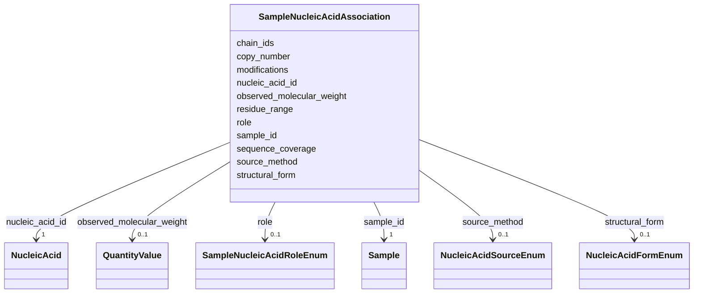

# Class: SampleNucleicAcidAssociation 


_M:N link between Sample and NucleicAcid. A sample may hold several strands - the two strands of a duplex, a guide RNA with its target DNA, a primer with its template - and one strand turns up in many samples. What changes from preparation to preparation lives here: the role, the copy number, the form the strand takes (single, duplex, hairpin, quadruplex), how it was made, the modifications it carries, and the mass actually measured._


URI: [lambda:SampleNucleicAcidAssociation](http://w3id.org/lambda/SampleNucleicAcidAssociation)





<!-- no inheritance hierarchy -->


## Slots

| Name | Cardinality and Range | Description | Inheritance |
| ---  | --- | --- | --- |
| [sample_id](sample_id.md) | 1 <br/> [Sample](Sample.md) | Reference to the sample | direct |
| [nucleic_acid_id](nucleic_acid_id.md) | 1 <br/> [NucleicAcid](NucleicAcid.md) | Reference to the nucleic acid | direct |
| [role](role.md) | 0..1 <br/> [SampleNucleicAcidRoleEnum](SampleNucleicAcidRoleEnum.md) | Part this nucleic acid plays in the sample | direct |
| [copy_number](copy_number.md) | 0..1 <br/> [Integer](Integer.md) | Copies of this strand per assembly in the sample: 2 for a self-complementary ... | direct |
| [residue_range](residue_range.md) | 0..1 <br/> [String](String.md) | Nucleotides of the reference sequence present in this sample (e | direct |
| [sequence_coverage](sequence_coverage.md) | 0..1 <br/> [Float](Float.md) | Fraction of the reference sequence present in this sample (range: 0-1) | direct |
| [chain_ids](chain_ids.md) | * <br/> [String](String.md) | Chain identifiers this strand occupies in the deposited structure, where the ... | direct |
| [structural_form](structural_form.md) | 0..1 <br/> [NucleicAcidFormEnum](NucleicAcidFormEnum.md) | Form the strand takes in this sample: single-stranded, paired in a duplex, fo... | direct |
| [source_method](source_method.md) | 0..1 <br/> [NucleicAcidSourceEnum](NucleicAcidSourceEnum.md) | How this strand was made for this preparation: chemical synthesis, in vitro t... | direct |
| [modifications](modifications.md) | * <br/> [String](String.md) | Modifications carried by this strand in this sample: fluorophore or biotin la... | direct |
| [observed_molecular_weight](observed_molecular_weight.md) | 0..1 <br/> [QuantityValue](QuantityValue.md) | Mass as measured for this preparation (mass spectrometry, SEC-MALS, SAXS), ty... | direct |


## Usages

| used by | used in | type | used |
| ---  | --- | --- | --- |
| [Dataset](Dataset.md) | [sample_nucleic_acid_associations](sample_nucleic_acid_associations.md) | range | [SampleNucleicAcidAssociation](SampleNucleicAcidAssociation.md) |


## Identifier and Mapping Information


### Schema Source


* from schema: http://w3id.org/lambda/


## Mappings

| Mapping Type | Mapped Value |
| ---  | ---  |
| self | lambda:SampleNucleicAcidAssociation |
| native | lambda:SampleNucleicAcidAssociation |
| related | IHMCIF:_ihm_struct_assembly_details, IHMCIF:_ihm_entity_poly_segment |


## LinkML Source

<!-- TODO: investigate https://stackoverflow.com/questions/37606292/how-to-create-tabbed-code-blocks-in-mkdocs-or-sphinx -->

### Direct

<details>
```yaml
name: SampleNucleicAcidAssociation
description: 'M:N link between Sample and NucleicAcid. A sample may hold several strands
  - the two strands of a duplex, a guide RNA with its target DNA, a primer with its
  template - and one strand turns up in many samples. What changes from preparation
  to preparation lives here: the role, the copy number, the form the strand takes
  (single, duplex, hairpin, quadruplex), how it was made, the modifications it carries,
  and the mass actually measured.'
from_schema: http://w3id.org/lambda/
related_mappings:
- IHMCIF:_ihm_struct_assembly_details
- IHMCIF:_ihm_entity_poly_segment
attributes:
  sample_id:
    name: sample_id
    description: Reference to the sample
    from_schema: http://w3id.org/lambda/
    domain_of:
    - SamplePreparation
    - StudySampleAssociation
    - ExperimentSampleAssociation
    - SampleProteinAssociation
    - SampleNucleicAcidAssociation
    range: Sample
    required: true
  nucleic_acid_id:
    name: nucleic_acid_id
    description: Reference to the nucleic acid
    from_schema: http://w3id.org/lambda/
    rank: 1000
    domain_of:
    - SampleNucleicAcidAssociation
    range: NucleicAcid
    required: true
  role:
    name: role
    description: Part this nucleic acid plays in the sample
    from_schema: http://w3id.org/lambda/
    domain_of:
    - StudySampleAssociation
    - ExperimentSampleAssociation
    - SampleProteinAssociation
    - SampleNucleicAcidAssociation
    - ExperimentInstrumentAssociation
    - StudyPersonAssociation
    - ExperimentPersonAssociation
    - WorkflowPersonAssociation
    - StudyOrganizationAssociation
    - PersonOrganizationAssociation
    range: SampleNucleicAcidRoleEnum
  copy_number:
    name: copy_number
    description: 'Copies of this strand per assembly in the sample: 2 for a self-complementary
      duplex, 1 for each strand of a duplex made of two different strands. Omit when
      unknown rather than assuming 1.'
    from_schema: http://w3id.org/lambda/
    exact_mappings:
    - mmCIF:_entity.pdbx_number_of_molecules
    domain_of:
    - SampleProteinAssociation
    - SampleNucleicAcidAssociation
    range: integer
  residue_range:
    name: residue_range
    description: 'Nucleotides of the reference sequence present in this sample (e.g.,
      ''1-76'', ''30-45''), for fragments of a longer RNA or DNA. Omit when the whole
      sequence is present. Positions or ranges, comma-separated: ''1-76'', ''30-45,60-72''.'
    from_schema: http://w3id.org/lambda/
    related_mappings:
    - IHMCIF:_ihm_entity_poly_segment
    domain_of:
    - SampleProteinAssociation
    - SampleNucleicAcidAssociation
    - ProteinAnnotation
    pattern: ^[0-9]+(-[0-9]+)?(,[0-9]+(-[0-9]+)?)*$
  sequence_coverage:
    name: sequence_coverage
    description: 'Fraction of the reference sequence present in this sample (range:
      0-1)'
    from_schema: http://w3id.org/lambda/
    domain_of:
    - SampleProteinAssociation
    - SampleNucleicAcidAssociation
    range: float
    minimum_value: 0
    maximum_value: 1
  chain_ids:
    name: chain_ids
    description: Chain identifiers this strand occupies in the deposited structure,
      where the sample is a PDB entity
    from_schema: http://w3id.org/lambda/
    exact_mappings:
    - mmCIF:_entity_poly.pdbx_strand_id
    domain_of:
    - SampleProteinAssociation
    - SampleNucleicAcidAssociation
    multivalued: true
  structural_form:
    name: structural_form
    description: 'Form the strand takes in this sample: single-stranded, paired in
      a duplex, folded as a hairpin, a quadruplex, and so on. Both strands of a heteroduplex
      say double_stranded.'
    from_schema: http://w3id.org/lambda/
    rank: 1000
    domain_of:
    - SampleNucleicAcidAssociation
    range: NucleicAcidFormEnum
  source_method:
    name: source_method
    description: 'How this strand was made for this preparation: chemical synthesis,
      in vitro transcription, PCR, ...'
    from_schema: http://w3id.org/lambda/
    rank: 1000
    domain_of:
    - SampleNucleicAcidAssociation
    range: NucleicAcidSourceEnum
  modifications:
    name: modifications
    description: 'Modifications carried by this strand in this sample: fluorophore
      or biotin labels, 2''-O-methyl groups, phosphorothioate linkages, a 5'' triphosphate
      left on, methylated bases. One modification per entry, its position or extent
      first where it has one, then the chemistry: "5'' 6-FAM", "3'' biotin", "2''-O-methyl
      at 1-3", "phosphorothioate at 1-2,21-22", "m6A at 15", "5'' triphosphate". A
      modification with no position is named alone: "phosphorothioate backbone".'
    from_schema: http://w3id.org/lambda/
    domain_of:
    - MolecularComposition
    - SampleProteinAssociation
    - SampleNucleicAcidAssociation
    multivalued: true
  observed_molecular_weight:
    name: observed_molecular_weight
    description: Mass as measured for this preparation (mass spectrometry, SEC-MALS,
      SAXS), typically in kDa. The sequence-derived mass lives on NucleicAcid.molecular_weight_theoretical.
    from_schema: http://w3id.org/lambda/
    domain_of:
    - SampleProteinAssociation
    - SampleNucleicAcidAssociation
    range: QuantityValue
    inlined: true

```
</details>

### Induced

<details>
```yaml
name: SampleNucleicAcidAssociation
description: 'M:N link between Sample and NucleicAcid. A sample may hold several strands
  - the two strands of a duplex, a guide RNA with its target DNA, a primer with its
  template - and one strand turns up in many samples. What changes from preparation
  to preparation lives here: the role, the copy number, the form the strand takes
  (single, duplex, hairpin, quadruplex), how it was made, the modifications it carries,
  and the mass actually measured.'
from_schema: http://w3id.org/lambda/
related_mappings:
- IHMCIF:_ihm_struct_assembly_details
- IHMCIF:_ihm_entity_poly_segment
attributes:
  sample_id:
    name: sample_id
    description: Reference to the sample
    from_schema: http://w3id.org/lambda/
    alias: sample_id
    owner: SampleNucleicAcidAssociation
    domain_of:
    - SamplePreparation
    - StudySampleAssociation
    - ExperimentSampleAssociation
    - SampleProteinAssociation
    - SampleNucleicAcidAssociation
    range: Sample
    required: true
  nucleic_acid_id:
    name: nucleic_acid_id
    description: Reference to the nucleic acid
    from_schema: http://w3id.org/lambda/
    rank: 1000
    alias: nucleic_acid_id
    owner: SampleNucleicAcidAssociation
    domain_of:
    - SampleNucleicAcidAssociation
    range: NucleicAcid
    required: true
  role:
    name: role
    description: Part this nucleic acid plays in the sample
    from_schema: http://w3id.org/lambda/
    alias: role
    owner: SampleNucleicAcidAssociation
    domain_of:
    - StudySampleAssociation
    - ExperimentSampleAssociation
    - SampleProteinAssociation
    - SampleNucleicAcidAssociation
    - ExperimentInstrumentAssociation
    - StudyPersonAssociation
    - ExperimentPersonAssociation
    - WorkflowPersonAssociation
    - StudyOrganizationAssociation
    - PersonOrganizationAssociation
    range: SampleNucleicAcidRoleEnum
  copy_number:
    name: copy_number
    description: 'Copies of this strand per assembly in the sample: 2 for a self-complementary
      duplex, 1 for each strand of a duplex made of two different strands. Omit when
      unknown rather than assuming 1.'
    from_schema: http://w3id.org/lambda/
    exact_mappings:
    - mmCIF:_entity.pdbx_number_of_molecules
    alias: copy_number
    owner: SampleNucleicAcidAssociation
    domain_of:
    - SampleProteinAssociation
    - SampleNucleicAcidAssociation
    range: integer
  residue_range:
    name: residue_range
    description: 'Nucleotides of the reference sequence present in this sample (e.g.,
      ''1-76'', ''30-45''), for fragments of a longer RNA or DNA. Omit when the whole
      sequence is present. Positions or ranges, comma-separated: ''1-76'', ''30-45,60-72''.'
    from_schema: http://w3id.org/lambda/
    related_mappings:
    - IHMCIF:_ihm_entity_poly_segment
    alias: residue_range
    owner: SampleNucleicAcidAssociation
    domain_of:
    - SampleProteinAssociation
    - SampleNucleicAcidAssociation
    - ProteinAnnotation
    range: string
    pattern: ^[0-9]+(-[0-9]+)?(,[0-9]+(-[0-9]+)?)*$
  sequence_coverage:
    name: sequence_coverage
    description: 'Fraction of the reference sequence present in this sample (range:
      0-1)'
    from_schema: http://w3id.org/lambda/
    alias: sequence_coverage
    owner: SampleNucleicAcidAssociation
    domain_of:
    - SampleProteinAssociation
    - SampleNucleicAcidAssociation
    range: float
    minimum_value: 0
    maximum_value: 1
  chain_ids:
    name: chain_ids
    description: Chain identifiers this strand occupies in the deposited structure,
      where the sample is a PDB entity
    from_schema: http://w3id.org/lambda/
    exact_mappings:
    - mmCIF:_entity_poly.pdbx_strand_id
    alias: chain_ids
    owner: SampleNucleicAcidAssociation
    domain_of:
    - SampleProteinAssociation
    - SampleNucleicAcidAssociation
    range: string
    multivalued: true
  structural_form:
    name: structural_form
    description: 'Form the strand takes in this sample: single-stranded, paired in
      a duplex, folded as a hairpin, a quadruplex, and so on. Both strands of a heteroduplex
      say double_stranded.'
    from_schema: http://w3id.org/lambda/
    rank: 1000
    alias: structural_form
    owner: SampleNucleicAcidAssociation
    domain_of:
    - SampleNucleicAcidAssociation
    range: NucleicAcidFormEnum
  source_method:
    name: source_method
    description: 'How this strand was made for this preparation: chemical synthesis,
      in vitro transcription, PCR, ...'
    from_schema: http://w3id.org/lambda/
    rank: 1000
    alias: source_method
    owner: SampleNucleicAcidAssociation
    domain_of:
    - SampleNucleicAcidAssociation
    range: NucleicAcidSourceEnum
  modifications:
    name: modifications
    description: 'Modifications carried by this strand in this sample: fluorophore
      or biotin labels, 2''-O-methyl groups, phosphorothioate linkages, a 5'' triphosphate
      left on, methylated bases. One modification per entry, its position or extent
      first where it has one, then the chemistry: "5'' 6-FAM", "3'' biotin", "2''-O-methyl
      at 1-3", "phosphorothioate at 1-2,21-22", "m6A at 15", "5'' triphosphate". A
      modification with no position is named alone: "phosphorothioate backbone".'
    from_schema: http://w3id.org/lambda/
    alias: modifications
    owner: SampleNucleicAcidAssociation
    domain_of:
    - MolecularComposition
    - SampleProteinAssociation
    - SampleNucleicAcidAssociation
    range: string
    multivalued: true
  observed_molecular_weight:
    name: observed_molecular_weight
    description: Mass as measured for this preparation (mass spectrometry, SEC-MALS,
      SAXS), typically in kDa. The sequence-derived mass lives on NucleicAcid.molecular_weight_theoretical.
    from_schema: http://w3id.org/lambda/
    alias: observed_molecular_weight
    owner: SampleNucleicAcidAssociation
    domain_of:
    - SampleProteinAssociation
    - SampleNucleicAcidAssociation
    range: QuantityValue
    inlined: true

```
</details>