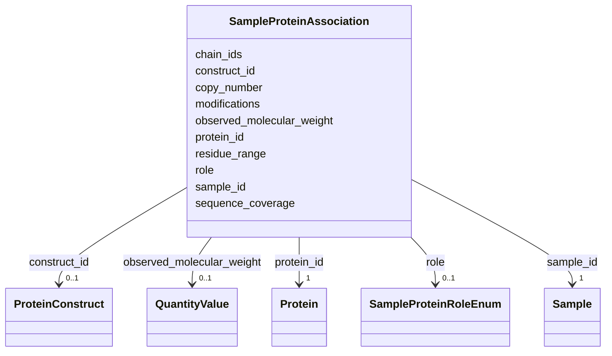

# Class: SampleProteinAssociation 


_M:N link between Sample and Protein. A sample may hold several proteins - the subunits of a complex, a target with its chaperone, a fusion partner - and one protein turns up in many samples. What changes from preparation to preparation lives here: the role, the copy number, the residue range actually present, the modifications carried, the mass actually measured, and the construct it was made from._


URI: [lambda:SampleProteinAssociation](http://w3id.org/lambda/SampleProteinAssociation)





<!-- no inheritance hierarchy -->


## Slots

| Name | Cardinality and Range | Description | Inheritance |
| ---  | --- | --- | --- |
| [sample_id](sample_id.md) | 1 <br/> [Sample](Sample.md) | Reference to the sample | direct |
| [protein_id](protein_id.md) | 1 <br/> [Protein](Protein.md) | Reference to the protein | direct |
| [role](role.md) | 0..1 <br/> [SampleProteinRoleEnum](SampleProteinRoleEnum.md) | Part this protein plays in the sample | direct |
| [construct_id](construct_id.md) | 0..1 <br/> [ProteinConstruct](ProteinConstruct.md) | The construct that produced this protein in this sample, where cloning detail... | direct |
| [copy_number](copy_number.md) | 0..1 <br/> [Integer](Integer.md) | Copies of this protein per assembly in the sample (e | direct |
| [residue_range](residue_range.md) | 0..1 <br/> [String](String.md) | Residues of the canonical sequence present in this sample (e | direct |
| [sequence_coverage](sequence_coverage.md) | 0..1 <br/> [Float](Float.md) | Fraction of the canonical sequence present in this sample (range: 0-1) | direct |
| [chain_ids](chain_ids.md) | * <br/> [String](String.md) | Chain identifiers this protein occupies in the deposited structure, where the... | direct |
| [modifications](modifications.md) | * <br/> [String](String.md) | Modifications carried by this protein in this sample: tags left on, mutations... | direct |
| [observed_molecular_weight](observed_molecular_weight.md) | 0..1 <br/> [QuantityValue](QuantityValue.md) | Mass as measured for this preparation (mass spectrometry, SEC-MALS, SAXS), ty... | direct |


## Usages

| used by | used in | type | used |
| ---  | --- | --- | --- |
| [Dataset](Dataset.md) | [sample_protein_associations](sample_protein_associations.md) | range | [SampleProteinAssociation](SampleProteinAssociation.md) |


## Identifier and Mapping Information


### Schema Source


* from schema: http://w3id.org/lambda/


## Mappings

| Mapping Type | Mapped Value |
| ---  | ---  |
| self | lambda:SampleProteinAssociation |
| native | lambda:SampleProteinAssociation |
| related | IHMCIF:_ihm_struct_assembly_details, IHMCIF:_ihm_entity_poly_segment |


## LinkML Source

<!-- TODO: investigate https://stackoverflow.com/questions/37606292/how-to-create-tabbed-code-blocks-in-mkdocs-or-sphinx -->

### Direct

<details>
```yaml
name: SampleProteinAssociation
description: 'M:N link between Sample and Protein. A sample may hold several proteins
  - the subunits of a complex, a target with its chaperone, a fusion partner - and
  one protein turns up in many samples. What changes from preparation to preparation
  lives here: the role, the copy number, the residue range actually present, the modifications
  carried, the mass actually measured, and the construct it was made from.'
from_schema: http://w3id.org/lambda/
related_mappings:
- IHMCIF:_ihm_struct_assembly_details
- IHMCIF:_ihm_entity_poly_segment
attributes:
  sample_id:
    name: sample_id
    description: Reference to the sample
    from_schema: http://w3id.org/lambda/
    domain_of:
    - SamplePreparation
    - StudySampleAssociation
    - ExperimentSampleAssociation
    - SampleProteinAssociation
    range: Sample
    required: true
  protein_id:
    name: protein_id
    description: Reference to the protein
    from_schema: http://w3id.org/lambda/
    domain_of:
    - ProteinConstruct
    - SampleProteinAssociation
    - ProteinAnnotation
    - ConformationalEnsemble
    range: Protein
    required: true
  role:
    name: role
    description: Part this protein plays in the sample
    from_schema: http://w3id.org/lambda/
    domain_of:
    - StudySampleAssociation
    - ExperimentSampleAssociation
    - SampleProteinAssociation
    - ExperimentInstrumentAssociation
    - StudyPersonAssociation
    - ExperimentPersonAssociation
    - WorkflowPersonAssociation
    - StudyOrganizationAssociation
    - PersonOrganizationAssociation
    range: SampleProteinRoleEnum
  construct_id:
    name: construct_id
    description: The construct that produced this protein in this sample, where cloning
      detail is recorded
    from_schema: http://w3id.org/lambda/
    domain_of:
    - ProteinConstruct
    - SampleProteinAssociation
    range: ProteinConstruct
  copy_number:
    name: copy_number
    description: Copies of this protein per assembly in the sample (e.g., 4 for a
      homotetramer, 2 for each chain of an alpha2-beta2 heterotetramer). Omit when
      unknown rather than assuming 1.
    from_schema: http://w3id.org/lambda/
    exact_mappings:
    - mmCIF:_entity.pdbx_number_of_molecules
    rank: 1000
    domain_of:
    - SampleProteinAssociation
    range: integer
  residue_range:
    name: residue_range
    description: Residues of the canonical sequence present in this sample (e.g.,
      '1-141', '25-300'), for fragments and truncations. Omit when the full-length
      protein is present.
    from_schema: http://w3id.org/lambda/
    related_mappings:
    - IHMCIF:_ihm_entity_poly_segment
    rank: 1000
    domain_of:
    - SampleProteinAssociation
    - ProteinAnnotation
    pattern: ^[0-9,\-]+$
  sequence_coverage:
    name: sequence_coverage
    description: 'Fraction of the canonical sequence present in this sample (range:
      0-1)'
    from_schema: http://w3id.org/lambda/
    rank: 1000
    domain_of:
    - SampleProteinAssociation
    range: float
    minimum_value: 0
    maximum_value: 1
  chain_ids:
    name: chain_ids
    description: Chain identifiers this protein occupies in the deposited structure,
      where the sample is a PDB entity
    from_schema: http://w3id.org/lambda/
    exact_mappings:
    - mmCIF:_entity_poly.pdbx_strand_id
    rank: 1000
    domain_of:
    - SampleProteinAssociation
    multivalued: true
  modifications:
    name: modifications
    description: 'Modifications carried by this protein in this sample: tags left
      on, mutations, labels, post-translational modifications'
    from_schema: http://w3id.org/lambda/
    domain_of:
    - MolecularComposition
    - SampleProteinAssociation
    multivalued: true
  observed_molecular_weight:
    name: observed_molecular_weight
    description: Mass as measured for this preparation (mass spectrometry, SEC-MALS,
      SAXS), typically in kDa. The sequence-derived mass lives on Protein.molecular_weight_theoretical.
    from_schema: http://w3id.org/lambda/
    rank: 1000
    domain_of:
    - SampleProteinAssociation
    range: QuantityValue
    inlined: true

```
</details>

### Induced

<details>
```yaml
name: SampleProteinAssociation
description: 'M:N link between Sample and Protein. A sample may hold several proteins
  - the subunits of a complex, a target with its chaperone, a fusion partner - and
  one protein turns up in many samples. What changes from preparation to preparation
  lives here: the role, the copy number, the residue range actually present, the modifications
  carried, the mass actually measured, and the construct it was made from.'
from_schema: http://w3id.org/lambda/
related_mappings:
- IHMCIF:_ihm_struct_assembly_details
- IHMCIF:_ihm_entity_poly_segment
attributes:
  sample_id:
    name: sample_id
    description: Reference to the sample
    from_schema: http://w3id.org/lambda/
    alias: sample_id
    owner: SampleProteinAssociation
    domain_of:
    - SamplePreparation
    - StudySampleAssociation
    - ExperimentSampleAssociation
    - SampleProteinAssociation
    range: Sample
    required: true
  protein_id:
    name: protein_id
    description: Reference to the protein
    from_schema: http://w3id.org/lambda/
    alias: protein_id
    owner: SampleProteinAssociation
    domain_of:
    - ProteinConstruct
    - SampleProteinAssociation
    - ProteinAnnotation
    - ConformationalEnsemble
    range: Protein
    required: true
  role:
    name: role
    description: Part this protein plays in the sample
    from_schema: http://w3id.org/lambda/
    alias: role
    owner: SampleProteinAssociation
    domain_of:
    - StudySampleAssociation
    - ExperimentSampleAssociation
    - SampleProteinAssociation
    - ExperimentInstrumentAssociation
    - StudyPersonAssociation
    - ExperimentPersonAssociation
    - WorkflowPersonAssociation
    - StudyOrganizationAssociation
    - PersonOrganizationAssociation
    range: SampleProteinRoleEnum
  construct_id:
    name: construct_id
    description: The construct that produced this protein in this sample, where cloning
      detail is recorded
    from_schema: http://w3id.org/lambda/
    alias: construct_id
    owner: SampleProteinAssociation
    domain_of:
    - ProteinConstruct
    - SampleProteinAssociation
    range: ProteinConstruct
  copy_number:
    name: copy_number
    description: Copies of this protein per assembly in the sample (e.g., 4 for a
      homotetramer, 2 for each chain of an alpha2-beta2 heterotetramer). Omit when
      unknown rather than assuming 1.
    from_schema: http://w3id.org/lambda/
    exact_mappings:
    - mmCIF:_entity.pdbx_number_of_molecules
    rank: 1000
    alias: copy_number
    owner: SampleProteinAssociation
    domain_of:
    - SampleProteinAssociation
    range: integer
  residue_range:
    name: residue_range
    description: Residues of the canonical sequence present in this sample (e.g.,
      '1-141', '25-300'), for fragments and truncations. Omit when the full-length
      protein is present.
    from_schema: http://w3id.org/lambda/
    related_mappings:
    - IHMCIF:_ihm_entity_poly_segment
    rank: 1000
    alias: residue_range
    owner: SampleProteinAssociation
    domain_of:
    - SampleProteinAssociation
    - ProteinAnnotation
    range: string
    pattern: ^[0-9,\-]+$
  sequence_coverage:
    name: sequence_coverage
    description: 'Fraction of the canonical sequence present in this sample (range:
      0-1)'
    from_schema: http://w3id.org/lambda/
    rank: 1000
    alias: sequence_coverage
    owner: SampleProteinAssociation
    domain_of:
    - SampleProteinAssociation
    range: float
    minimum_value: 0
    maximum_value: 1
  chain_ids:
    name: chain_ids
    description: Chain identifiers this protein occupies in the deposited structure,
      where the sample is a PDB entity
    from_schema: http://w3id.org/lambda/
    exact_mappings:
    - mmCIF:_entity_poly.pdbx_strand_id
    rank: 1000
    alias: chain_ids
    owner: SampleProteinAssociation
    domain_of:
    - SampleProteinAssociation
    range: string
    multivalued: true
  modifications:
    name: modifications
    description: 'Modifications carried by this protein in this sample: tags left
      on, mutations, labels, post-translational modifications'
    from_schema: http://w3id.org/lambda/
    alias: modifications
    owner: SampleProteinAssociation
    domain_of:
    - MolecularComposition
    - SampleProteinAssociation
    range: string
    multivalued: true
  observed_molecular_weight:
    name: observed_molecular_weight
    description: Mass as measured for this preparation (mass spectrometry, SEC-MALS,
      SAXS), typically in kDa. The sequence-derived mass lives on Protein.molecular_weight_theoretical.
    from_schema: http://w3id.org/lambda/
    rank: 1000
    alias: observed_molecular_weight
    owner: SampleProteinAssociation
    domain_of:
    - SampleProteinAssociation
    range: QuantityValue
    inlined: true

```
</details>