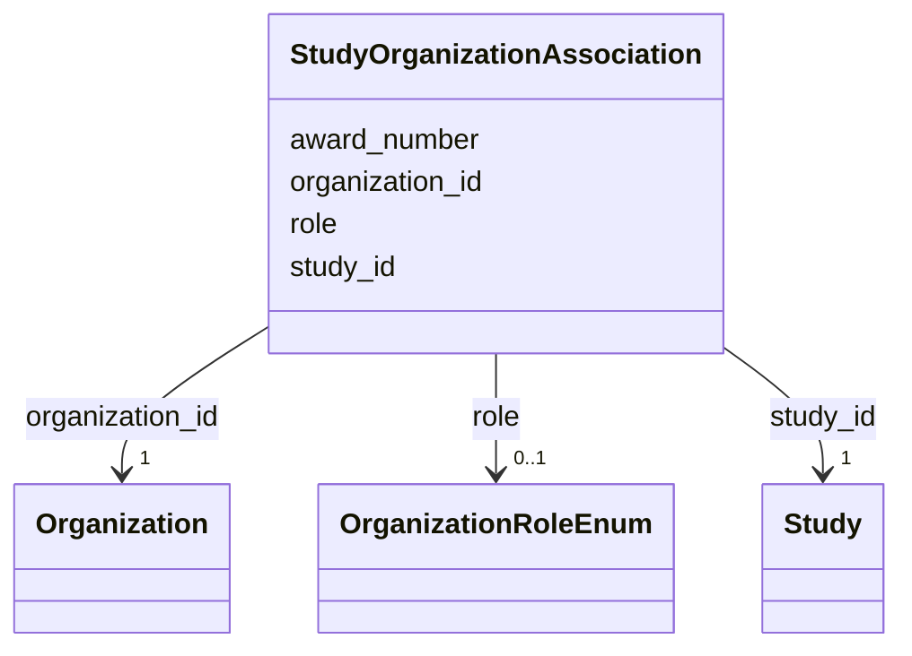

# Class: StudyOrganizationAssociation 


_M:N link between Study and Organization with role metadata - the host institution, the collaborating institutions, and who funded the work._


URI: [lambda:StudyOrganizationAssociation](http://w3id.org/lambda/StudyOrganizationAssociation)





<!-- no inheritance hierarchy -->


## Slots

| Name | Cardinality and Range | Description | Inheritance |
| ---  | --- | --- | --- |
| [study_id](study_id.md) | 1 <br/> [Study](Study.md) | Reference to the study | direct |
| [organization_id](organization_id.md) | 1 <br/> [Organization](Organization.md) | Reference to the organization | direct |
| [role](role.md) | 0..1 <br/> [OrganizationRoleEnum](OrganizationRoleEnum.md) | Capacity in which the organization is attached to the study | direct |
| [award_number](award_number.md) | 0..1 <br/> [String](String.md) | Grant or award number, where the organization is a funder | direct |


## Usages

| used by | used in | type | used |
| ---  | --- | --- | --- |
| [Dataset](Dataset.md) | [study_organization_associations](study_organization_associations.md) | range | [StudyOrganizationAssociation](StudyOrganizationAssociation.md) |


## Identifier and Mapping Information


### Schema Source


* from schema: http://w3id.org/lambda/


## Mappings

| Mapping Type | Mapped Value |
| ---  | ---  |
| self | lambda:StudyOrganizationAssociation |
| native | lambda:StudyOrganizationAssociation |


## LinkML Source

<!-- TODO: investigate https://stackoverflow.com/questions/37606292/how-to-create-tabbed-code-blocks-in-mkdocs-or-sphinx -->

### Direct

<details>
```yaml
name: StudyOrganizationAssociation
description: M:N link between Study and Organization with role metadata - the host
  institution, the collaborating institutions, and who funded the work.
from_schema: http://w3id.org/lambda/
attributes:
  study_id:
    name: study_id
    description: Reference to the study
    from_schema: http://w3id.org/lambda/
    domain_of:
    - StudySampleAssociation
    - StudyExperimentAssociation
    - StudyWorkflowAssociation
    - StudyPersonAssociation
    - StudyOrganizationAssociation
    range: Study
    required: true
  organization_id:
    name: organization_id
    description: Reference to the organization
    from_schema: http://w3id.org/lambda/
    rank: 1000
    domain_of:
    - StudyOrganizationAssociation
    - PersonOrganizationAssociation
    range: Organization
    required: true
  role:
    name: role
    description: Capacity in which the organization is attached to the study
    from_schema: http://w3id.org/lambda/
    domain_of:
    - StudySampleAssociation
    - ExperimentSampleAssociation
    - SampleProteinAssociation
    - ExperimentInstrumentAssociation
    - StudyPersonAssociation
    - ExperimentPersonAssociation
    - WorkflowPersonAssociation
    - StudyOrganizationAssociation
    - PersonOrganizationAssociation
    range: OrganizationRoleEnum
  award_number:
    name: award_number
    description: Grant or award number, where the organization is a funder. Distinct
      from Study.proposal_id, which is the facility's beamtime allocation rather than
      the funding that paid for the science.
    from_schema: http://w3id.org/lambda/
    rank: 1000
    domain_of:
    - StudyOrganizationAssociation
    range: string

```
</details>

### Induced

<details>
```yaml
name: StudyOrganizationAssociation
description: M:N link between Study and Organization with role metadata - the host
  institution, the collaborating institutions, and who funded the work.
from_schema: http://w3id.org/lambda/
attributes:
  study_id:
    name: study_id
    description: Reference to the study
    from_schema: http://w3id.org/lambda/
    alias: study_id
    owner: StudyOrganizationAssociation
    domain_of:
    - StudySampleAssociation
    - StudyExperimentAssociation
    - StudyWorkflowAssociation
    - StudyPersonAssociation
    - StudyOrganizationAssociation
    range: Study
    required: true
  organization_id:
    name: organization_id
    description: Reference to the organization
    from_schema: http://w3id.org/lambda/
    rank: 1000
    alias: organization_id
    owner: StudyOrganizationAssociation
    domain_of:
    - StudyOrganizationAssociation
    - PersonOrganizationAssociation
    range: Organization
    required: true
  role:
    name: role
    description: Capacity in which the organization is attached to the study
    from_schema: http://w3id.org/lambda/
    alias: role
    owner: StudyOrganizationAssociation
    domain_of:
    - StudySampleAssociation
    - ExperimentSampleAssociation
    - SampleProteinAssociation
    - ExperimentInstrumentAssociation
    - StudyPersonAssociation
    - ExperimentPersonAssociation
    - WorkflowPersonAssociation
    - StudyOrganizationAssociation
    - PersonOrganizationAssociation
    range: OrganizationRoleEnum
  award_number:
    name: award_number
    description: Grant or award number, where the organization is a funder. Distinct
      from Study.proposal_id, which is the facility's beamtime allocation rather than
      the funding that paid for the science.
    from_schema: http://w3id.org/lambda/
    rank: 1000
    alias: award_number
    owner: StudyOrganizationAssociation
    domain_of:
    - StudyOrganizationAssociation
    range: string

```
</details>