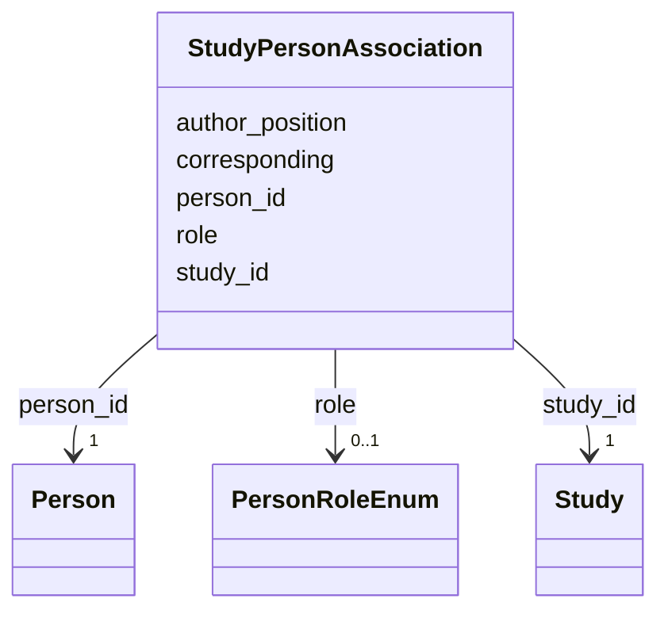

# Class: StudyPersonAssociation 


_M:N link between Study and Person with role metadata. This is where authorship and responsibility for a body of work live - principal investigator, author, curator._


URI: [lambda:StudyPersonAssociation](http://w3id.org/lambda/StudyPersonAssociation)





<!-- no inheritance hierarchy -->


## Slots

| Name | Cardinality and Range | Description | Inheritance |
| ---  | --- | --- | --- |
| [study_id](study_id.md) | 1 <br/> [Study](Study.md) | Reference to the study | direct |
| [person_id](person_id.md) | 1 <br/> [Person](Person.md) | Reference to the person | direct |
| [role](role.md) | 0..1 <br/> [PersonRoleEnum](PersonRoleEnum.md) | Capacity in which the person is attached to the study | direct |
| [author_position](author_position.md) | 0..1 <br/> [Integer](Integer.md) | Position in the author list, where authorship order is meaningful | direct |
| [corresponding](corresponding.md) | 0..1 <br/> [Boolean](Boolean.md) | Whether this person is a corresponding author for the study | direct |


## Usages

| used by | used in | type | used |
| ---  | --- | --- | --- |
| [Dataset](Dataset.md) | [study_person_associations](study_person_associations.md) | range | [StudyPersonAssociation](StudyPersonAssociation.md) |


## Identifier and Mapping Information


### Schema Source


* from schema: http://w3id.org/lambda/


## Mappings

| Mapping Type | Mapped Value |
| ---  | ---  |
| self | lambda:StudyPersonAssociation |
| native | lambda:StudyPersonAssociation |


## LinkML Source

<!-- TODO: investigate https://stackoverflow.com/questions/37606292/how-to-create-tabbed-code-blocks-in-mkdocs-or-sphinx -->

### Direct

<details>
```yaml
name: StudyPersonAssociation
description: M:N link between Study and Person with role metadata. This is where authorship
  and responsibility for a body of work live - principal investigator, author, curator.
from_schema: http://w3id.org/lambda/
attributes:
  study_id:
    name: study_id
    description: Reference to the study
    from_schema: http://w3id.org/lambda/
    domain_of:
    - StudySampleAssociation
    - StudyExperimentAssociation
    - StudyWorkflowAssociation
    - StudyPersonAssociation
    - StudyOrganizationAssociation
    range: Study
    required: true
  person_id:
    name: person_id
    description: Reference to the person
    from_schema: http://w3id.org/lambda/
    rank: 1000
    domain_of:
    - StudyPersonAssociation
    - ExperimentPersonAssociation
    - WorkflowPersonAssociation
    - PersonOrganizationAssociation
    range: Person
    required: true
  role:
    name: role
    description: Capacity in which the person is attached to the study
    from_schema: http://w3id.org/lambda/
    domain_of:
    - StudySampleAssociation
    - ExperimentSampleAssociation
    - SampleProteinAssociation
    - ExperimentInstrumentAssociation
    - StudyPersonAssociation
    - ExperimentPersonAssociation
    - WorkflowPersonAssociation
    - StudyOrganizationAssociation
    - PersonOrganizationAssociation
    range: PersonRoleEnum
  author_position:
    name: author_position
    description: Position in the author list, where authorship order is meaningful.
      1 is first author. Absent when the source does not state an order; do not invent
      one.
    from_schema: http://w3id.org/lambda/
    rank: 1000
    domain_of:
    - StudyPersonAssociation
    range: integer
  corresponding:
    name: corresponding
    description: Whether this person is a corresponding author for the study
    from_schema: http://w3id.org/lambda/
    rank: 1000
    domain_of:
    - StudyPersonAssociation
    range: boolean

```
</details>

### Induced

<details>
```yaml
name: StudyPersonAssociation
description: M:N link between Study and Person with role metadata. This is where authorship
  and responsibility for a body of work live - principal investigator, author, curator.
from_schema: http://w3id.org/lambda/
attributes:
  study_id:
    name: study_id
    description: Reference to the study
    from_schema: http://w3id.org/lambda/
    alias: study_id
    owner: StudyPersonAssociation
    domain_of:
    - StudySampleAssociation
    - StudyExperimentAssociation
    - StudyWorkflowAssociation
    - StudyPersonAssociation
    - StudyOrganizationAssociation
    range: Study
    required: true
  person_id:
    name: person_id
    description: Reference to the person
    from_schema: http://w3id.org/lambda/
    rank: 1000
    alias: person_id
    owner: StudyPersonAssociation
    domain_of:
    - StudyPersonAssociation
    - ExperimentPersonAssociation
    - WorkflowPersonAssociation
    - PersonOrganizationAssociation
    range: Person
    required: true
  role:
    name: role
    description: Capacity in which the person is attached to the study
    from_schema: http://w3id.org/lambda/
    alias: role
    owner: StudyPersonAssociation
    domain_of:
    - StudySampleAssociation
    - ExperimentSampleAssociation
    - SampleProteinAssociation
    - ExperimentInstrumentAssociation
    - StudyPersonAssociation
    - ExperimentPersonAssociation
    - WorkflowPersonAssociation
    - StudyOrganizationAssociation
    - PersonOrganizationAssociation
    range: PersonRoleEnum
  author_position:
    name: author_position
    description: Position in the author list, where authorship order is meaningful.
      1 is first author. Absent when the source does not state an order; do not invent
      one.
    from_schema: http://w3id.org/lambda/
    rank: 1000
    alias: author_position
    owner: StudyPersonAssociation
    domain_of:
    - StudyPersonAssociation
    range: integer
  corresponding:
    name: corresponding
    description: Whether this person is a corresponding author for the study
    from_schema: http://w3id.org/lambda/
    rank: 1000
    alias: corresponding
    owner: StudyPersonAssociation
    domain_of:
    - StudyPersonAssociation
    range: boolean

```
</details>