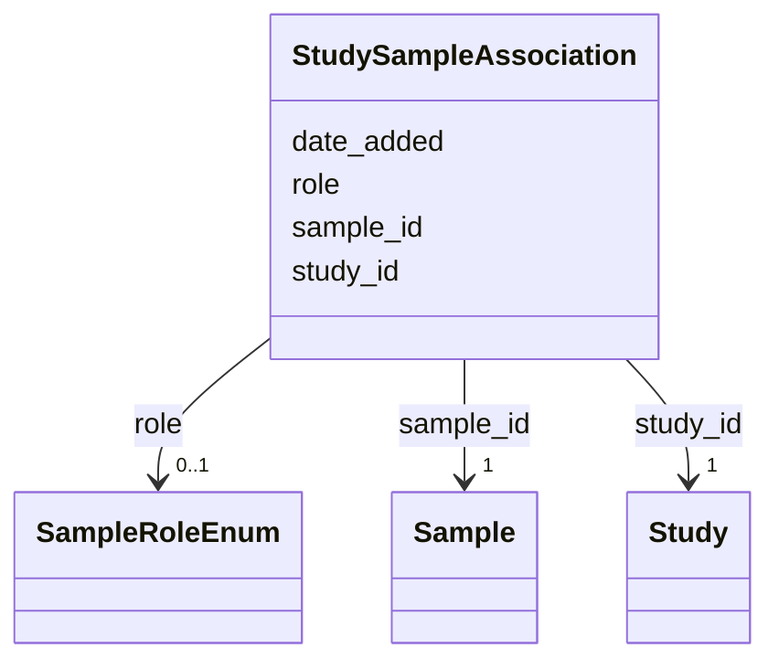

# Class: StudySampleAssociation 


_M:N link between Study and Sample with role metadata_


URI: [lambdaber:StudySampleAssociation](https://w3id.org/lambda-ber-schema/StudySampleAssociation)





<!-- no inheritance hierarchy -->


## Slots

| Name | Cardinality and Range | Description | Inheritance |
| ---  | --- | --- | --- |
| [study_id](study_id.md) | 1 <br/> [Study](Study.md) | Reference to the study | direct |
| [sample_id](sample_id.md) | 1 <br/> [Sample](Sample.md) | Reference to the sample | direct |
| [role](role.md) | 0..1 <br/> [SampleRoleEnum](SampleRoleEnum.md) | Role of sample in study (e | direct |
| [date_added](date_added.md) | 0..1 <br/> [Date](Date.md) | Date when sample was added to study | direct |


## Usages

| used by | used in | type | used |
| ---  | --- | --- | --- |
| [Dataset](Dataset.md) | [study_sample_associations](study_sample_associations.md) | range | [StudySampleAssociation](StudySampleAssociation.md) |


## Identifier and Mapping Information


### Schema Source


* from schema: https://w3id.org/lambda-ber-schema/


## Mappings

| Mapping Type | Mapped Value |
| ---  | ---  |
| self | lambdaber:StudySampleAssociation |
| native | lambdaber:StudySampleAssociation |


## LinkML Source

<!-- TODO: investigate https://stackoverflow.com/questions/37606292/how-to-create-tabbed-code-blocks-in-mkdocs-or-sphinx -->

### Direct

<details>
```yaml
name: StudySampleAssociation
description: M:N link between Study and Sample with role metadata
from_schema: https://w3id.org/lambda-ber-schema/
attributes:
  study_id:
    name: study_id
    description: Reference to the study
    from_schema: https://w3id.org/lambda-ber-schema/
    rank: 1000
    domain_of:
    - StudySampleAssociation
    - StudyExperimentAssociation
    - StudyWorkflowAssociation
    range: Study
    required: true
  sample_id:
    name: sample_id
    description: Reference to the sample
    from_schema: https://w3id.org/lambda-ber-schema/
    domain_of:
    - SamplePreparation
    - StudySampleAssociation
    - ExperimentSampleAssociation
    range: Sample
    required: true
  role:
    name: role
    description: Role of sample in study (e.g., target, control, reference)
    from_schema: https://w3id.org/lambda-ber-schema/
    rank: 1000
    domain_of:
    - StudySampleAssociation
    - ExperimentSampleAssociation
    - ExperimentInstrumentAssociation
    range: SampleRoleEnum
  date_added:
    name: date_added
    description: Date when sample was added to study
    from_schema: https://w3id.org/lambda-ber-schema/
    rank: 1000
    domain_of:
    - StudySampleAssociation
    range: date

```
</details>

### Induced

<details>
```yaml
name: StudySampleAssociation
description: M:N link between Study and Sample with role metadata
from_schema: https://w3id.org/lambda-ber-schema/
attributes:
  study_id:
    name: study_id
    description: Reference to the study
    from_schema: https://w3id.org/lambda-ber-schema/
    rank: 1000
    alias: study_id
    owner: StudySampleAssociation
    domain_of:
    - StudySampleAssociation
    - StudyExperimentAssociation
    - StudyWorkflowAssociation
    range: Study
    required: true
  sample_id:
    name: sample_id
    description: Reference to the sample
    from_schema: https://w3id.org/lambda-ber-schema/
    alias: sample_id
    owner: StudySampleAssociation
    domain_of:
    - SamplePreparation
    - StudySampleAssociation
    - ExperimentSampleAssociation
    range: Sample
    required: true
  role:
    name: role
    description: Role of sample in study (e.g., target, control, reference)
    from_schema: https://w3id.org/lambda-ber-schema/
    rank: 1000
    alias: role
    owner: StudySampleAssociation
    domain_of:
    - StudySampleAssociation
    - ExperimentSampleAssociation
    - ExperimentInstrumentAssociation
    range: SampleRoleEnum
  date_added:
    name: date_added
    description: Date when sample was added to study
    from_schema: https://w3id.org/lambda-ber-schema/
    rank: 1000
    alias: date_added
    owner: StudySampleAssociation
    domain_of:
    - StudySampleAssociation
    range: date

```
</details>