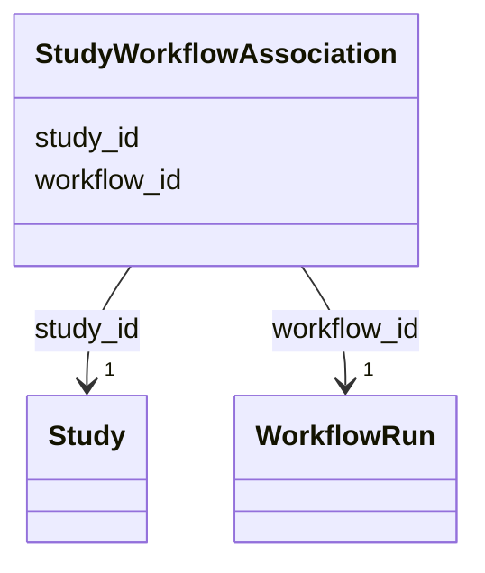

# Class: StudyWorkflowAssociation 


_M:N link between Study and WorkflowRun_


URI: [lambda:StudyWorkflowAssociation](http://w3id.org/lambda/StudyWorkflowAssociation)





<!-- no inheritance hierarchy -->


## Slots

| Name | Cardinality and Range | Description | Inheritance |
| ---  | --- | --- | --- |
| [study_id](study_id.md) | 1 <br/> [Study](Study.md) | Reference to the study | direct |
| [workflow_id](workflow_id.md) | 1 <br/> [WorkflowRun](WorkflowRun.md) | Reference to the workflow run | direct |


## Usages

| used by | used in | type | used |
| ---  | --- | --- | --- |
| [Dataset](Dataset.md) | [study_workflow_associations](study_workflow_associations.md) | range | [StudyWorkflowAssociation](StudyWorkflowAssociation.md) |


## Identifier and Mapping Information


### Schema Source


* from schema: http://w3id.org/lambda/


## Mappings

| Mapping Type | Mapped Value |
| ---  | ---  |
| self | lambda:StudyWorkflowAssociation |
| native | lambda:StudyWorkflowAssociation |


## LinkML Source

<!-- TODO: investigate https://stackoverflow.com/questions/37606292/how-to-create-tabbed-code-blocks-in-mkdocs-or-sphinx -->

### Direct

<details>
```yaml
name: StudyWorkflowAssociation
description: M:N link between Study and WorkflowRun
from_schema: http://w3id.org/lambda/
attributes:
  study_id:
    name: study_id
    description: Reference to the study
    from_schema: http://w3id.org/lambda/
    domain_of:
    - StudySampleAssociation
    - StudyExperimentAssociation
    - StudyWorkflowAssociation
    range: Study
    required: true
  workflow_id:
    name: workflow_id
    description: Reference to the workflow run
    from_schema: http://w3id.org/lambda/
    rank: 1000
    domain_of:
    - StudyWorkflowAssociation
    - WorkflowExperimentAssociation
    - WorkflowInputAssociation
    - WorkflowOutputAssociation
    range: WorkflowRun
    required: true

```
</details>

### Induced

<details>
```yaml
name: StudyWorkflowAssociation
description: M:N link between Study and WorkflowRun
from_schema: http://w3id.org/lambda/
attributes:
  study_id:
    name: study_id
    description: Reference to the study
    from_schema: http://w3id.org/lambda/
    alias: study_id
    owner: StudyWorkflowAssociation
    domain_of:
    - StudySampleAssociation
    - StudyExperimentAssociation
    - StudyWorkflowAssociation
    range: Study
    required: true
  workflow_id:
    name: workflow_id
    description: Reference to the workflow run
    from_schema: http://w3id.org/lambda/
    rank: 1000
    alias: workflow_id
    owner: StudyWorkflowAssociation
    domain_of:
    - StudyWorkflowAssociation
    - WorkflowExperimentAssociation
    - WorkflowInputAssociation
    - WorkflowOutputAssociation
    range: WorkflowRun
    required: true

```
</details>