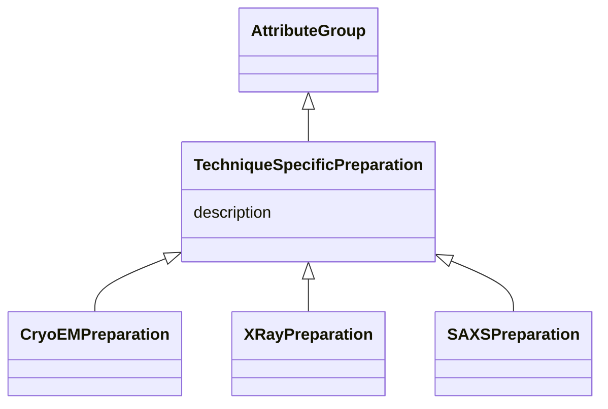

# Class: TechniqueSpecificPreparation 


_Base class for technique-specific preparation details_


* __NOTE__: this is an abstract class and should not be instantiated directly


URI: [lambda:TechniqueSpecificPreparation](http://w3id.org/lambda/TechniqueSpecificPreparation)



```mermaid
 classDiagram
    class TechniqueSpecificPreparation
    click TechniqueSpecificPreparation href "../TechniqueSpecificPreparation/"
      AttributeGroup <|-- TechniqueSpecificPreparation
        click AttributeGroup href "../AttributeGroup/"
      

      TechniqueSpecificPreparation <|-- CryoEMPreparation
        click CryoEMPreparation href "../CryoEMPreparation/"
      TechniqueSpecificPreparation <|-- XRayPreparation
        click XRayPreparation href "../XRayPreparation/"
      TechniqueSpecificPreparation <|-- SAXSPreparation
        click SAXSPreparation href "../SAXSPreparation/"
      

      TechniqueSpecificPreparation : description
        
      
```


## Inheritance
* [AttributeGroup](AttributeGroup.md)
    * **TechniqueSpecificPreparation**
        * [CryoEMPreparation](CryoEMPreparation.md)
        * [XRayPreparation](XRayPreparation.md)
        * [SAXSPreparation](SAXSPreparation.md)


## Slots

| Name | Cardinality and Range | Description | Inheritance |
| ---  | --- | --- | --- |
| [description](description.md) | 0..1 <br/> [String](String.md) |  | [AttributeGroup](AttributeGroup.md) |


## Identifier and Mapping Information


### Schema Source


* from schema: http://w3id.org/lambda/


## Mappings

| Mapping Type | Mapped Value |
| ---  | ---  |
| self | lambda:TechniqueSpecificPreparation |
| native | lambda:TechniqueSpecificPreparation |


## LinkML Source

<!-- TODO: investigate https://stackoverflow.com/questions/37606292/how-to-create-tabbed-code-blocks-in-mkdocs-or-sphinx -->

### Direct

<details>
```yaml
name: TechniqueSpecificPreparation
description: Base class for technique-specific preparation details
from_schema: http://w3id.org/lambda/
is_a: AttributeGroup
abstract: true

```
</details>

### Induced

<details>
```yaml
name: TechniqueSpecificPreparation
description: Base class for technique-specific preparation details
from_schema: http://w3id.org/lambda/
is_a: AttributeGroup
abstract: true
attributes:
  description:
    name: description
    from_schema: http://w3id.org/lambda/
    alias: description
    owner: TechniqueSpecificPreparation
    domain_of:
    - NamedThing
    - AttributeGroup
    range: string

```
</details>