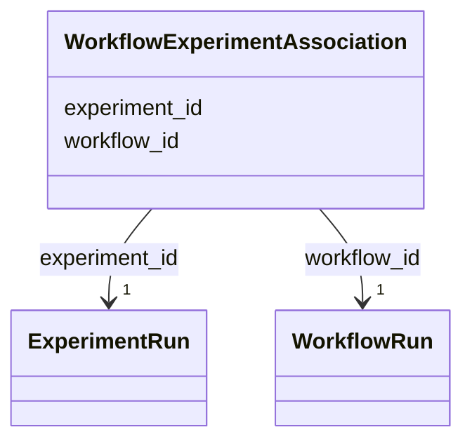

# Class: WorkflowExperimentAssociation 


_M:N link between WorkflowRun and source ExperimentRuns_


URI: [lambdaber:WorkflowExperimentAssociation](https://w3id.org/lambda-ber-schema/WorkflowExperimentAssociation)





<!-- no inheritance hierarchy -->


## Slots

| Name | Cardinality and Range | Description | Inheritance |
| ---  | --- | --- | --- |
| [workflow_id](workflow_id.md) | 1 <br/> [WorkflowRun](WorkflowRun.md) | Reference to the workflow run | direct |
| [experiment_id](experiment_id.md) | 1 <br/> [ExperimentRun](ExperimentRun.md) | Reference to the source experiment run | direct |


## Usages

| used by | used in | type | used |
| ---  | --- | --- | --- |
| [Dataset](Dataset.md) | [workflow_experiment_associations](workflow_experiment_associations.md) | range | [WorkflowExperimentAssociation](WorkflowExperimentAssociation.md) |


## Identifier and Mapping Information


### Schema Source


* from schema: https://w3id.org/lambda-ber-schema/


## Mappings

| Mapping Type | Mapped Value |
| ---  | ---  |
| self | lambdaber:WorkflowExperimentAssociation |
| native | lambdaber:WorkflowExperimentAssociation |


## LinkML Source

<!-- TODO: investigate https://stackoverflow.com/questions/37606292/how-to-create-tabbed-code-blocks-in-mkdocs-or-sphinx -->

### Direct

<details>
```yaml
name: WorkflowExperimentAssociation
description: M:N link between WorkflowRun and source ExperimentRuns
from_schema: https://w3id.org/lambda-ber-schema/
attributes:
  workflow_id:
    name: workflow_id
    description: Reference to the workflow run
    from_schema: https://w3id.org/lambda-ber-schema/
    domain_of:
    - StudyWorkflowAssociation
    - WorkflowExperimentAssociation
    - WorkflowInputAssociation
    - WorkflowOutputAssociation
    range: WorkflowRun
    required: true
  experiment_id:
    name: experiment_id
    description: Reference to the source experiment run
    from_schema: https://w3id.org/lambda-ber-schema/
    domain_of:
    - StudyExperimentAssociation
    - ExperimentSampleAssociation
    - ExperimentInstrumentAssociation
    - WorkflowExperimentAssociation
    range: ExperimentRun
    required: true

```
</details>

### Induced

<details>
```yaml
name: WorkflowExperimentAssociation
description: M:N link between WorkflowRun and source ExperimentRuns
from_schema: https://w3id.org/lambda-ber-schema/
attributes:
  workflow_id:
    name: workflow_id
    description: Reference to the workflow run
    from_schema: https://w3id.org/lambda-ber-schema/
    alias: workflow_id
    owner: WorkflowExperimentAssociation
    domain_of:
    - StudyWorkflowAssociation
    - WorkflowExperimentAssociation
    - WorkflowInputAssociation
    - WorkflowOutputAssociation
    range: WorkflowRun
    required: true
  experiment_id:
    name: experiment_id
    description: Reference to the source experiment run
    from_schema: https://w3id.org/lambda-ber-schema/
    alias: experiment_id
    owner: WorkflowExperimentAssociation
    domain_of:
    - StudyExperimentAssociation
    - ExperimentSampleAssociation
    - ExperimentInstrumentAssociation
    - WorkflowExperimentAssociation
    range: ExperimentRun
    required: true

```
</details>