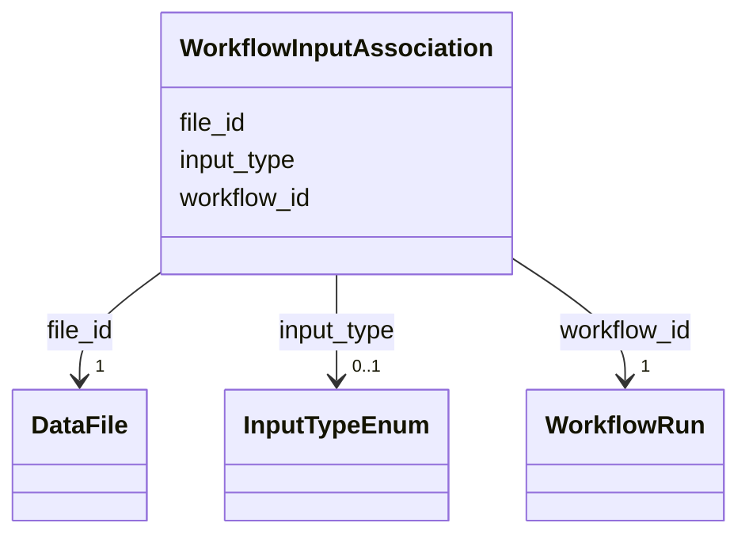

# Class: WorkflowInputAssociation 


_Links input DataFiles to WorkflowRun_


URI: [lambdaber:WorkflowInputAssociation](https://w3id.org/lambda-ber-schema/WorkflowInputAssociation)





<!-- no inheritance hierarchy -->


## Slots

| Name | Cardinality and Range | Description | Inheritance |
| ---  | --- | --- | --- |
| [workflow_id](workflow_id.md) | 1 <br/> [WorkflowRun](WorkflowRun.md) | Reference to the workflow run | direct |
| [file_id](file_id.md) | 1 <br/> [DataFile](DataFile.md) | Reference to the input data file | direct |
| [input_type](input_type.md) | 0..1 <br/> [InputTypeEnum](InputTypeEnum.md) | Type of input for the workflow | direct |


## Usages

| used by | used in | type | used |
| ---  | --- | --- | --- |
| [Dataset](Dataset.md) | [workflow_input_associations](workflow_input_associations.md) | range | [WorkflowInputAssociation](WorkflowInputAssociation.md) |


## Identifier and Mapping Information


### Schema Source


* from schema: https://w3id.org/lambda-ber-schema/


## Mappings

| Mapping Type | Mapped Value |
| ---  | ---  |
| self | lambdaber:WorkflowInputAssociation |
| native | lambdaber:WorkflowInputAssociation |


## LinkML Source

<!-- TODO: investigate https://stackoverflow.com/questions/37606292/how-to-create-tabbed-code-blocks-in-mkdocs-or-sphinx -->

### Direct

<details>
```yaml
name: WorkflowInputAssociation
description: Links input DataFiles to WorkflowRun
from_schema: https://w3id.org/lambda-ber-schema/
attributes:
  workflow_id:
    name: workflow_id
    description: Reference to the workflow run
    from_schema: https://w3id.org/lambda-ber-schema/
    domain_of:
    - StudyWorkflowAssociation
    - WorkflowExperimentAssociation
    - WorkflowInputAssociation
    - WorkflowOutputAssociation
    range: WorkflowRun
    required: true
  file_id:
    name: file_id
    description: Reference to the input data file
    from_schema: https://w3id.org/lambda-ber-schema/
    rank: 1000
    domain_of:
    - WorkflowInputAssociation
    - WorkflowOutputAssociation
    range: DataFile
    required: true
  input_type:
    name: input_type
    description: Type of input for the workflow
    from_schema: https://w3id.org/lambda-ber-schema/
    rank: 1000
    domain_of:
    - WorkflowInputAssociation
    range: InputTypeEnum

```
</details>

### Induced

<details>
```yaml
name: WorkflowInputAssociation
description: Links input DataFiles to WorkflowRun
from_schema: https://w3id.org/lambda-ber-schema/
attributes:
  workflow_id:
    name: workflow_id
    description: Reference to the workflow run
    from_schema: https://w3id.org/lambda-ber-schema/
    alias: workflow_id
    owner: WorkflowInputAssociation
    domain_of:
    - StudyWorkflowAssociation
    - WorkflowExperimentAssociation
    - WorkflowInputAssociation
    - WorkflowOutputAssociation
    range: WorkflowRun
    required: true
  file_id:
    name: file_id
    description: Reference to the input data file
    from_schema: https://w3id.org/lambda-ber-schema/
    rank: 1000
    alias: file_id
    owner: WorkflowInputAssociation
    domain_of:
    - WorkflowInputAssociation
    - WorkflowOutputAssociation
    range: DataFile
    required: true
  input_type:
    name: input_type
    description: Type of input for the workflow
    from_schema: https://w3id.org/lambda-ber-schema/
    rank: 1000
    alias: input_type
    owner: WorkflowInputAssociation
    domain_of:
    - WorkflowInputAssociation
    range: InputTypeEnum

```
</details>