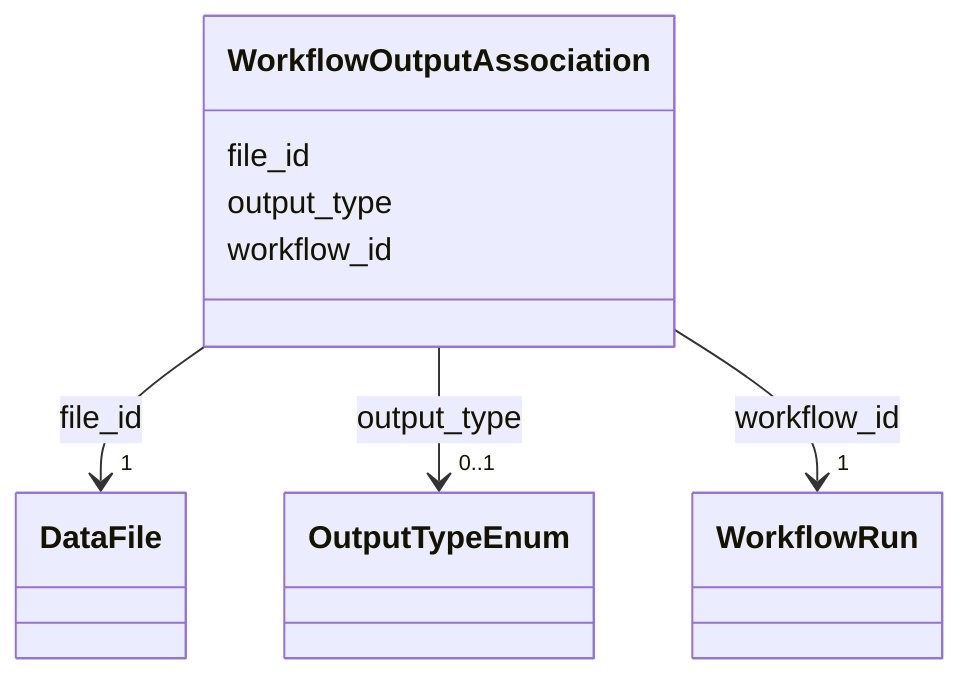

# Class: WorkflowOutputAssociation 


_Links output DataFiles to WorkflowRun_


URI: [lambdaber:WorkflowOutputAssociation](https://w3id.org/lambda-ber-schema/WorkflowOutputAssociation)





<!-- no inheritance hierarchy -->


## Slots

| Name | Cardinality and Range | Description | Inheritance |
| ---  | --- | --- | --- |
| [workflow_id](workflow_id.md) | 1 <br/> [WorkflowRun](WorkflowRun.md) | Reference to the workflow run | direct |
| [file_id](file_id.md) | 1 <br/> [DataFile](DataFile.md) | Reference to the output data file | direct |
| [output_type](output_type.md) | 0..1 <br/> [OutputTypeEnum](OutputTypeEnum.md) | Type of output from the workflow | direct |


## Usages

| used by | used in | type | used |
| ---  | --- | --- | --- |
| [Dataset](Dataset.md) | [workflow_output_associations](workflow_output_associations.md) | range | [WorkflowOutputAssociation](WorkflowOutputAssociation.md) |


## Identifier and Mapping Information


### Schema Source


* from schema: https://w3id.org/lambda-ber-schema/


## Mappings

| Mapping Type | Mapped Value |
| ---  | ---  |
| self | lambdaber:WorkflowOutputAssociation |
| native | lambdaber:WorkflowOutputAssociation |


## LinkML Source

<!-- TODO: investigate https://stackoverflow.com/questions/37606292/how-to-create-tabbed-code-blocks-in-mkdocs-or-sphinx -->

### Direct

<details>
```yaml
name: WorkflowOutputAssociation
description: Links output DataFiles to WorkflowRun
from_schema: https://w3id.org/lambda-ber-schema/
attributes:
  workflow_id:
    name: workflow_id
    description: Reference to the workflow run
    from_schema: https://w3id.org/lambda-ber-schema/
    domain_of:
    - StudyWorkflowAssociation
    - WorkflowExperimentAssociation
    - WorkflowInputAssociation
    - WorkflowOutputAssociation
    range: WorkflowRun
    required: true
  file_id:
    name: file_id
    description: Reference to the output data file
    from_schema: https://w3id.org/lambda-ber-schema/
    domain_of:
    - WorkflowInputAssociation
    - WorkflowOutputAssociation
    range: DataFile
    required: true
  output_type:
    name: output_type
    description: Type of output from the workflow
    from_schema: https://w3id.org/lambda-ber-schema/
    rank: 1000
    domain_of:
    - WorkflowOutputAssociation
    range: OutputTypeEnum

```
</details>

### Induced

<details>
```yaml
name: WorkflowOutputAssociation
description: Links output DataFiles to WorkflowRun
from_schema: https://w3id.org/lambda-ber-schema/
attributes:
  workflow_id:
    name: workflow_id
    description: Reference to the workflow run
    from_schema: https://w3id.org/lambda-ber-schema/
    alias: workflow_id
    owner: WorkflowOutputAssociation
    domain_of:
    - StudyWorkflowAssociation
    - WorkflowExperimentAssociation
    - WorkflowInputAssociation
    - WorkflowOutputAssociation
    range: WorkflowRun
    required: true
  file_id:
    name: file_id
    description: Reference to the output data file
    from_schema: https://w3id.org/lambda-ber-schema/
    alias: file_id
    owner: WorkflowOutputAssociation
    domain_of:
    - WorkflowInputAssociation
    - WorkflowOutputAssociation
    range: DataFile
    required: true
  output_type:
    name: output_type
    description: Type of output from the workflow
    from_schema: https://w3id.org/lambda-ber-schema/
    rank: 1000
    alias: output_type
    owner: WorkflowOutputAssociation
    domain_of:
    - WorkflowOutputAssociation
    range: OutputTypeEnum

```
</details>