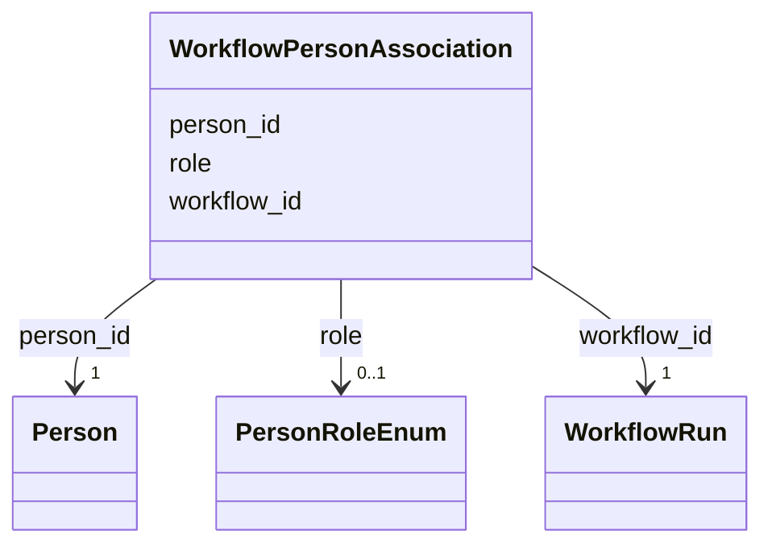

# Class: WorkflowPersonAssociation 


_M:N link between WorkflowRun and Person with role metadata - who ran the processing, and who made the judgement calls it required._


URI: [lambda:WorkflowPersonAssociation](http://w3id.org/lambda/WorkflowPersonAssociation)





<!-- no inheritance hierarchy -->


## Slots

| Name | Cardinality and Range | Description | Inheritance |
| ---  | --- | --- | --- |
| [workflow_id](workflow_id.md) | 1 <br/> [WorkflowRun](WorkflowRun.md) | Reference to the workflow run | direct |
| [person_id](person_id.md) | 1 <br/> [Person](Person.md) | Reference to the person | direct |
| [role](role.md) | 0..1 <br/> [PersonRoleEnum](PersonRoleEnum.md) | Capacity in which the person is attached to the workflow run | direct |


## Usages

| used by | used in | type | used |
| ---  | --- | --- | --- |
| [Dataset](Dataset.md) | [workflow_person_associations](workflow_person_associations.md) | range | [WorkflowPersonAssociation](WorkflowPersonAssociation.md) |


## Identifier and Mapping Information


### Schema Source


* from schema: http://w3id.org/lambda/


## Mappings

| Mapping Type | Mapped Value |
| ---  | ---  |
| self | lambda:WorkflowPersonAssociation |
| native | lambda:WorkflowPersonAssociation |


## LinkML Source

<!-- TODO: investigate https://stackoverflow.com/questions/37606292/how-to-create-tabbed-code-blocks-in-mkdocs-or-sphinx -->

### Direct

<details>
```yaml
name: WorkflowPersonAssociation
description: M:N link between WorkflowRun and Person with role metadata - who ran
  the processing, and who made the judgement calls it required.
from_schema: http://w3id.org/lambda/
attributes:
  workflow_id:
    name: workflow_id
    description: Reference to the workflow run
    from_schema: http://w3id.org/lambda/
    domain_of:
    - StudyWorkflowAssociation
    - WorkflowExperimentAssociation
    - WorkflowInputAssociation
    - WorkflowOutputAssociation
    - WorkflowPersonAssociation
    range: WorkflowRun
    required: true
  person_id:
    name: person_id
    description: Reference to the person
    from_schema: http://w3id.org/lambda/
    domain_of:
    - StudyPersonAssociation
    - ExperimentPersonAssociation
    - WorkflowPersonAssociation
    - PersonOrganizationAssociation
    range: Person
    required: true
  role:
    name: role
    description: Capacity in which the person is attached to the workflow run
    from_schema: http://w3id.org/lambda/
    domain_of:
    - StudySampleAssociation
    - ExperimentSampleAssociation
    - SampleProteinAssociation
    - ExperimentInstrumentAssociation
    - StudyPersonAssociation
    - ExperimentPersonAssociation
    - WorkflowPersonAssociation
    - StudyOrganizationAssociation
    - PersonOrganizationAssociation
    range: PersonRoleEnum

```
</details>

### Induced

<details>
```yaml
name: WorkflowPersonAssociation
description: M:N link between WorkflowRun and Person with role metadata - who ran
  the processing, and who made the judgement calls it required.
from_schema: http://w3id.org/lambda/
attributes:
  workflow_id:
    name: workflow_id
    description: Reference to the workflow run
    from_schema: http://w3id.org/lambda/
    alias: workflow_id
    owner: WorkflowPersonAssociation
    domain_of:
    - StudyWorkflowAssociation
    - WorkflowExperimentAssociation
    - WorkflowInputAssociation
    - WorkflowOutputAssociation
    - WorkflowPersonAssociation
    range: WorkflowRun
    required: true
  person_id:
    name: person_id
    description: Reference to the person
    from_schema: http://w3id.org/lambda/
    alias: person_id
    owner: WorkflowPersonAssociation
    domain_of:
    - StudyPersonAssociation
    - ExperimentPersonAssociation
    - WorkflowPersonAssociation
    - PersonOrganizationAssociation
    range: Person
    required: true
  role:
    name: role
    description: Capacity in which the person is attached to the workflow run
    from_schema: http://w3id.org/lambda/
    alias: role
    owner: WorkflowPersonAssociation
    domain_of:
    - StudySampleAssociation
    - ExperimentSampleAssociation
    - SampleProteinAssociation
    - ExperimentInstrumentAssociation
    - StudyPersonAssociation
    - ExperimentPersonAssociation
    - WorkflowPersonAssociation
    - StudyOrganizationAssociation
    - PersonOrganizationAssociation
    range: PersonRoleEnum

```
</details>