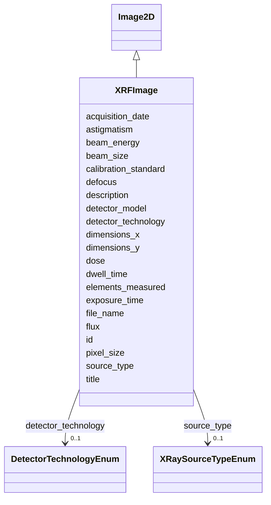

# Class: XRFImage 


_X-ray fluorescence (XRF) image showing elemental distribution_


URI: [lambdaber:XRFImage](https://w3id.org/lambda-ber-schema/XRFImage)





## Inheritance
* [NamedThing](NamedThing.md)
    * [Image](Image.md)
        * [Image2D](Image2D.md)
            * **XRFImage**


## Slots

| Name | Cardinality and Range | Description | Inheritance |
| ---  | --- | --- | --- |
| [beam_energy](beam_energy.md) | 0..1 <br/> [Float](Float.md) | X-ray beam energy in keV | direct |
| [beam_size](beam_size.md) | 0..1 <br/> [Float](Float.md) | X-ray beam size in micrometers | direct |
| [dwell_time](dwell_time.md) | 0..1 <br/> [Float](Float.md) | Dwell time per pixel in milliseconds | direct |
| [elements_measured](elements_measured.md) | * <br/> [String](String.md) | Elements detected and measured | direct |
| [source_type](source_type.md) | 0..1 <br/> [XRaySourceTypeEnum](XRaySourceTypeEnum.md) | X-ray source type (synchrotron or lab-source) | direct |
| [detector_technology](detector_technology.md) | 0..1 <br/> [DetectorTechnologyEnum](DetectorTechnologyEnum.md) | Type of X-ray detector technology used | direct |
| [detector_model](detector_model.md) | 0..1 <br/> [String](String.md) | Specific detector model used for XRF measurement | direct |
| [flux](flux.md) | 0..1 <br/> [Float](Float.md) | Photon flux in photons/second | direct |
| [calibration_standard](calibration_standard.md) | 0..1 <br/> [String](String.md) | Reference standard used for calibration | direct |
| [defocus](defocus.md) | 0..1 <br/> [Float](Float.md) | Defocus value in micrometers | [Image2D](Image2D.md) |
| [astigmatism](astigmatism.md) | 0..1 <br/> [Float](Float.md) | Astigmatism value in Angstroms | [Image2D](Image2D.md) |
| [file_name](file_name.md) | 1 <br/> [String](String.md) | Image file name | [Image](Image.md) |
| [acquisition_date](acquisition_date.md) | 0..1 <br/> [String](String.md) | Date image was acquired | [Image](Image.md) |
| [pixel_size](pixel_size.md) | 0..1 <br/> [Float](Float.md) | Pixel size in Angstroms | [Image](Image.md) |
| [dimensions_x](dimensions_x.md) | 0..1 <br/> [Integer](Integer.md) | Image width in pixels | [Image](Image.md) |
| [dimensions_y](dimensions_y.md) | 0..1 <br/> [Integer](Integer.md) | Image height in pixels | [Image](Image.md) |
| [exposure_time](exposure_time.md) | 0..1 <br/> [Float](Float.md) | Exposure time in seconds | [Image](Image.md) |
| [dose](dose.md) | 0..1 <br/> [Float](Float.md) | Electron dose in e-/Ų | [Image](Image.md) |
| [id](id.md) | 1 <br/> [Uriorcurie](Uriorcurie.md) | Globally unique identifier as an IRI or CURIE for machine processing and exte... | [NamedThing](NamedThing.md) |
| [title](title.md) | 0..1 <br/> [String](String.md) | A human-readable name or title for this entity | [NamedThing](NamedThing.md) |
| [description](description.md) | 0..1 <br/> [String](String.md) | A detailed textual description of this entity | [NamedThing](NamedThing.md) |


## Identifier and Mapping Information


### Schema Source


* from schema: https://w3id.org/lambda-ber-schema/


## Mappings

| Mapping Type | Mapped Value |
| ---  | ---  |
| self | lambdaber:XRFImage |
| native | lambdaber:XRFImage |


## LinkML Source

<!-- TODO: investigate https://stackoverflow.com/questions/37606292/how-to-create-tabbed-code-blocks-in-mkdocs-or-sphinx -->

### Direct

<details>
```yaml
name: XRFImage
description: X-ray fluorescence (XRF) image showing elemental distribution
from_schema: https://w3id.org/lambda-ber-schema/
is_a: Image2D
attributes:
  beam_energy:
    name: beam_energy
    description: X-ray beam energy in keV
    from_schema: https://w3id.org/lambda-ber-schema/
    rank: 1000
    domain_of:
    - XRFImage
    - ExperimentalConditions
    range: float
  beam_size:
    name: beam_size
    description: X-ray beam size in micrometers
    from_schema: https://w3id.org/lambda-ber-schema/
    rank: 1000
    domain_of:
    - XRFImage
    range: float
  dwell_time:
    name: dwell_time
    description: Dwell time per pixel in milliseconds
    from_schema: https://w3id.org/lambda-ber-schema/
    rank: 1000
    domain_of:
    - XRFImage
    range: float
  elements_measured:
    name: elements_measured
    description: Elements detected and measured
    from_schema: https://w3id.org/lambda-ber-schema/
    rank: 1000
    domain_of:
    - XRFImage
    range: string
    multivalued: true
  source_type:
    name: source_type
    description: X-ray source type (synchrotron or lab-source)
    from_schema: https://w3id.org/lambda-ber-schema/
    domain_of:
    - XRayInstrument
    - BeamlineInstrument
    - XRFImage
    range: XRaySourceTypeEnum
  detector_technology:
    name: detector_technology
    description: Type of X-ray detector technology used
    comments:
    - For XRF, typically energy-dispersive or wavelength-dispersive detectors
    from_schema: https://w3id.org/lambda-ber-schema/
    domain_of:
    - CryoEMInstrument
    - XRayInstrument
    - XRFImage
    range: DetectorTechnologyEnum
  detector_model:
    name: detector_model
    description: Specific detector model used for XRF measurement
    from_schema: https://w3id.org/lambda-ber-schema/
    domain_of:
    - CryoEMInstrument
    - XRayInstrument
    - XRFImage
    range: string
  flux:
    name: flux
    description: Photon flux in photons/second
    from_schema: https://w3id.org/lambda-ber-schema/
    domain_of:
    - ExperimentRun
    - XRFImage
    range: float
  calibration_standard:
    name: calibration_standard
    description: Reference standard used for calibration
    from_schema: https://w3id.org/lambda-ber-schema/
    rank: 1000
    domain_of:
    - XRFImage
    range: string

```
</details>

### Induced

<details>
```yaml
name: XRFImage
description: X-ray fluorescence (XRF) image showing elemental distribution
from_schema: https://w3id.org/lambda-ber-schema/
is_a: Image2D
attributes:
  beam_energy:
    name: beam_energy
    description: X-ray beam energy in keV
    from_schema: https://w3id.org/lambda-ber-schema/
    rank: 1000
    alias: beam_energy
    owner: XRFImage
    domain_of:
    - XRFImage
    - ExperimentalConditions
    range: float
  beam_size:
    name: beam_size
    description: X-ray beam size in micrometers
    from_schema: https://w3id.org/lambda-ber-schema/
    rank: 1000
    alias: beam_size
    owner: XRFImage
    domain_of:
    - XRFImage
    range: float
  dwell_time:
    name: dwell_time
    description: Dwell time per pixel in milliseconds
    from_schema: https://w3id.org/lambda-ber-schema/
    rank: 1000
    alias: dwell_time
    owner: XRFImage
    domain_of:
    - XRFImage
    range: float
  elements_measured:
    name: elements_measured
    description: Elements detected and measured
    from_schema: https://w3id.org/lambda-ber-schema/
    rank: 1000
    alias: elements_measured
    owner: XRFImage
    domain_of:
    - XRFImage
    range: string
    multivalued: true
  source_type:
    name: source_type
    description: X-ray source type (synchrotron or lab-source)
    from_schema: https://w3id.org/lambda-ber-schema/
    alias: source_type
    owner: XRFImage
    domain_of:
    - XRayInstrument
    - BeamlineInstrument
    - XRFImage
    range: XRaySourceTypeEnum
  detector_technology:
    name: detector_technology
    description: Type of X-ray detector technology used
    comments:
    - For XRF, typically energy-dispersive or wavelength-dispersive detectors
    from_schema: https://w3id.org/lambda-ber-schema/
    alias: detector_technology
    owner: XRFImage
    domain_of:
    - CryoEMInstrument
    - XRayInstrument
    - XRFImage
    range: DetectorTechnologyEnum
  detector_model:
    name: detector_model
    description: Specific detector model used for XRF measurement
    from_schema: https://w3id.org/lambda-ber-schema/
    alias: detector_model
    owner: XRFImage
    domain_of:
    - CryoEMInstrument
    - XRayInstrument
    - XRFImage
    range: string
  flux:
    name: flux
    description: Photon flux in photons/second
    from_schema: https://w3id.org/lambda-ber-schema/
    alias: flux
    owner: XRFImage
    domain_of:
    - ExperimentRun
    - XRFImage
    range: float
  calibration_standard:
    name: calibration_standard
    description: Reference standard used for calibration
    from_schema: https://w3id.org/lambda-ber-schema/
    rank: 1000
    alias: calibration_standard
    owner: XRFImage
    domain_of:
    - XRFImage
    range: string
  defocus:
    name: defocus
    description: Defocus value in micrometers
    from_schema: https://w3id.org/lambda-ber-schema/
    rank: 1000
    alias: defocus
    owner: XRFImage
    domain_of:
    - Image2D
    range: float
  astigmatism:
    name: astigmatism
    description: Astigmatism value in Angstroms
    from_schema: https://w3id.org/lambda-ber-schema/
    rank: 1000
    alias: astigmatism
    owner: XRFImage
    domain_of:
    - Image2D
    range: float
  file_name:
    name: file_name
    description: Image file name
    from_schema: https://w3id.org/lambda-ber-schema/
    alias: file_name
    owner: XRFImage
    domain_of:
    - DataFile
    - Image
    range: string
    required: true
  acquisition_date:
    name: acquisition_date
    description: Date image was acquired
    from_schema: https://w3id.org/lambda-ber-schema/
    rank: 1000
    alias: acquisition_date
    owner: XRFImage
    domain_of:
    - Image
    range: string
  pixel_size:
    name: pixel_size
    description: Pixel size in Angstroms
    from_schema: https://w3id.org/lambda-ber-schema/
    rank: 1000
    alias: pixel_size
    owner: XRFImage
    domain_of:
    - Image
    - RefinementParameters
    range: float
  dimensions_x:
    name: dimensions_x
    description: Image width in pixels
    from_schema: https://w3id.org/lambda-ber-schema/
    rank: 1000
    alias: dimensions_x
    owner: XRFImage
    domain_of:
    - Image
    range: integer
  dimensions_y:
    name: dimensions_y
    description: Image height in pixels
    from_schema: https://w3id.org/lambda-ber-schema/
    rank: 1000
    alias: dimensions_y
    owner: XRFImage
    domain_of:
    - Image
    range: integer
  exposure_time:
    name: exposure_time
    description: Exposure time in seconds
    from_schema: https://w3id.org/lambda-ber-schema/
    alias: exposure_time
    owner: XRFImage
    domain_of:
    - ExperimentRun
    - Image
    - ExperimentalConditions
    range: float
  dose:
    name: dose
    description: Electron dose in e-/Ų
    from_schema: https://w3id.org/lambda-ber-schema/
    rank: 1000
    alias: dose
    owner: XRFImage
    domain_of:
    - Image
    - Micrograph
    range: float
  id:
    name: id
    description: Globally unique identifier as an IRI or CURIE for machine processing
      and external references. Used for linking data across systems and semantic web
      integration.
    from_schema: https://w3id.org/lambda-ber-schema/
    rank: 1000
    identifier: true
    alias: id
    owner: XRFImage
    domain_of:
    - NamedThing
    range: uriorcurie
    required: true
  title:
    name: title
    description: A human-readable name or title for this entity
    from_schema: https://w3id.org/lambda-ber-schema/
    rank: 1000
    slot_uri: dcterms:title
    alias: title
    owner: XRFImage
    domain_of:
    - NamedThing
    range: string
  description:
    name: description
    description: A detailed textual description of this entity
    from_schema: https://w3id.org/lambda-ber-schema/
    rank: 1000
    alias: description
    owner: XRFImage
    domain_of:
    - NamedThing
    - AttributeGroup
    range: string

```
</details>